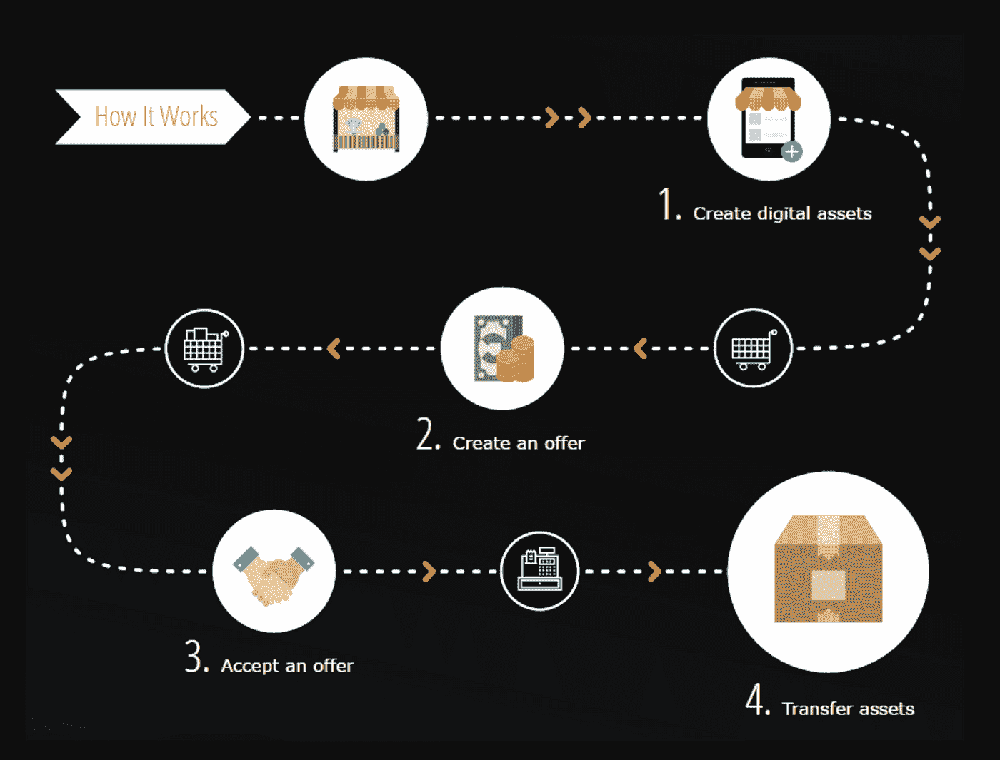
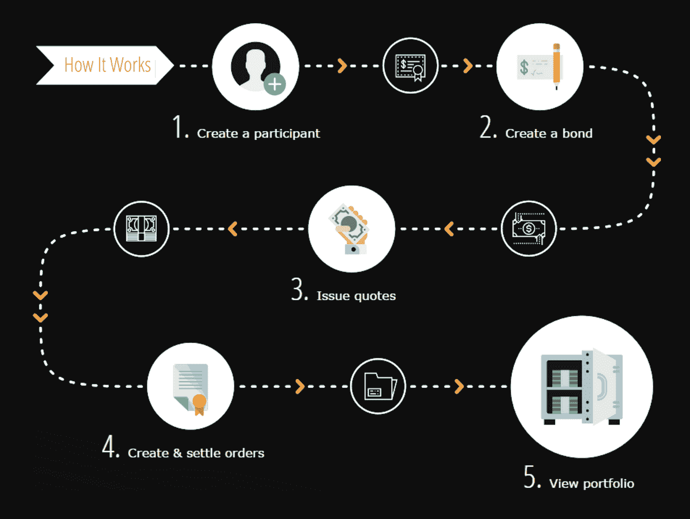

# 高效安全的数字资产交易基础设施——Hyperledger 锯齿

> 原文：<https://medium.com/coinmonks/efficient-and-secure-infrastructure-forthe-transaction-of-digital-assets-hyperledger-sawtooth-40ee50b2b94e?source=collection_archive---------5----------------------->

Hyperledger Sawtooth 是一个模块化平台，用于构建、部署和运行分布式分类帐。分布式分类账提供了一种数字记录(如资产所有权)，这种记录在没有中央授权或实施的情况下维护。

传统数字资产面临的挑战

*   分散的生态系统—数字资产发行者拥有管理、分发和跟踪资产的定制流程。
*   缺乏二级市场控制—很难验证资产是真是假
*   不一致的记录保存做法因卖方而异
*   集中式/专有解决方案可能会导致偏见和利益冲突。

区块链技术驱动的解决方案

区块链事务处理跟踪的优势

*   不同卖家记录的数据一致。
*   不可变的交易记录支持各方之间的安全和信任。
*   智能合约允许资产创建者设定二次交易发生的条款。

Hyperledger 锯齿平台使用户能够为其数字资产设计定制解决方案。有了锯齿，公司可以为特定资产的独特特征定制交易系列，这样他们就可以创建资产标识符、接受报价和跟踪所有权。

资产结算—借助 Hyperledger 锯齿区块链技术实现安全高效的债券结算。

传统债券记录保存面临的挑战

*   不同机构的记录保存做法不同，调节分类账通常困难、昂贵且耗时。
*   历史债券所有权数据可能是支离破碎和不完整的。
*   集中式数据管理解决方案垄断了他们的产品。
*   数据可能被篡改，从而导致金融欺诈。
*   集中式系统存在单一故障点的风险。

持有区块链债券的优势

*   跨不同机构创建数据一致性。
*   确保全面、有序、准确、不可变的历史所有权数据。
*   通过独特的硬件配置保护敏感信息。
*   分布式记录打击垄断，并产生透明度和信任。

Hyperledger 锯齿平台支持为各种金融用例设计定制解决方案。借助锯齿，开发人员可以针对特定金融投资(如债券或衍生品)的独特特征定制交易系列。交易系列逻辑使参与者能够添加用户和公司，发布资产和报价，并在金融服务公司之间的共享分类帐上交易和结算工具。

[文章](http://block9systems.com)最初发表于 [block9solutions](http://block9solutions.com) 网站