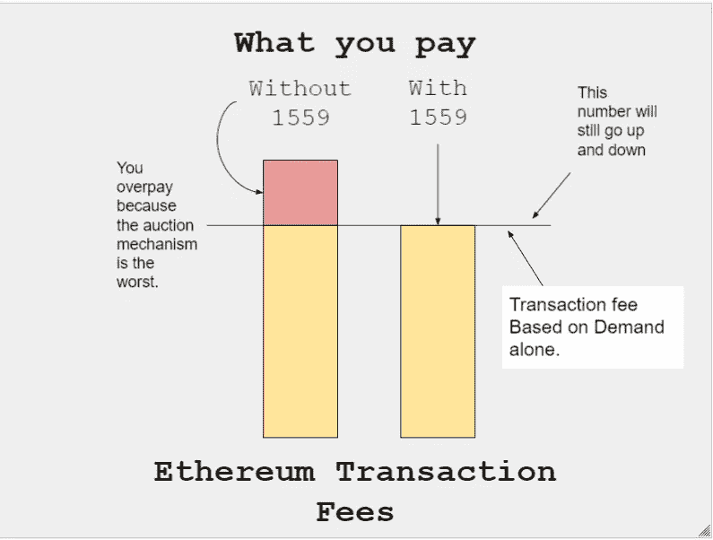
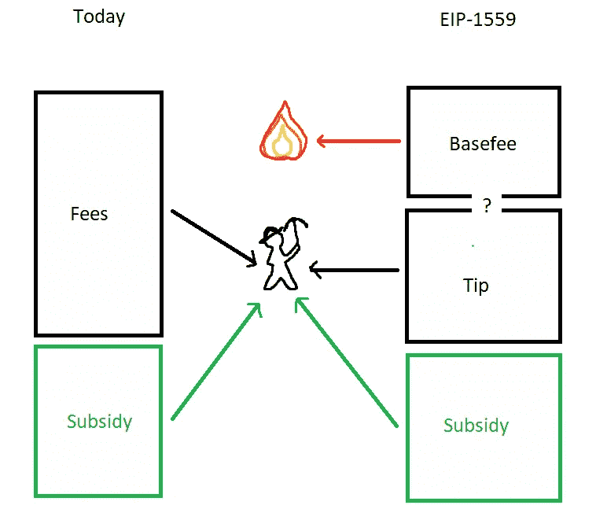

# EIP-1559 年

> 原文：<https://medium.com/coinmonks/eip-1559-d87465195a6c?source=collection_archive---------5----------------------->

以太坊改进提案 [(EIP) 1559](https://github.com/ethereum/EIPs/blob/master/EIPS/eip-1559.md) 试图解决以太坊 UX 的众多问题。然而，该提案的含义远远超出了更好的用户体验，因为它从根本上影响了以太坊网络中 ETH 的创建。

以太坊上的交易费用目前是通过一种简单的拍卖机制来确定的，在这种机制下，发送交易的网络用户将为他们的交易指定一个气体限制和气体价格，以试图让总是喜欢最高出价的矿工选择它。关于 Etherem 上的天然气费用的信息，请查看本博客上的另一篇文章[“智能合同”](https://sasugaserenity.medium.com/smart-contract-aed95ba2e1d4)。

# **当前收费问题**

当前系统提供了低效率的几个主要来源:

## **用户延迟**

由于每个区块的天然气限制、交易量的波动性以及矿工优先考虑较高天然气费用交易的偏好，用户将看到他们的交易在被添加之前在 mempool 中等待很长时间(假设他们没有为优先级支付过多的天然气)。用户可以看到他们的交易在被包括之前被延迟了几个块(每个新的块都填充了自上一个块以来支付最高的交易),这使得很难估计它何时会被包括。这对以太坊的生态系统来说是低效的。

## **低效拍卖**

除了延迟之外，由于交易的拍卖系统非常复杂和低效，用户经常发现自己要么支付过多的费用(以避免取消)，要么因为支付不足而被取消交易。

# **EIP 1559 的变化**

总的来说，EIP-1559 取消了交易的第一价格拍卖性质，代之以[固定价格销售](https://uncommoncore.co/eip-1559/)。该协议将报出一个价格，用户选择支付该价格或不在网络上交易。EIP 提议进行以下修改:

## **块大小**

根据 EIP-1559，区块可以达到“200%满”，这意味着如果气体限制设置为 15 米气体，则最多 30 米气体的区块将是有效的。区块还将包括交易所需的最低价格，即基本费用。

## **基本费用**

基本费用金额(必须在 ETH 中支付)由协议根据网络拥塞情况进行相应调整。当网络拥堵较高时，基本费用会增加(按每个区块的用气量衡量，为该区块最大用气量“100%”的 50%)，反之亦然。这类似于如何调整区块的天然气限制，除了基本费用是基于一个控制器，而不是矿工的共识。街区之间基本费用的最大差异是可预测的，允许钱包以可靠的方式自动调整用户的汽油费用，极大地消除了多付和少付的情况。

## **优先权费(小费)**

交易费用将包括基本费用和少量(自动设置的)优先费用(也是可选的)。优先级费用是为了使由于超出“100%”容量而未包括在块中的交易可以被添加到最大值(“200%”)。这是对矿商承担布洛克大叔风险的补偿。优先费用调整用户在队列中的位置，就像当前的系统一样，矿工们更喜欢接受更高的天然气交易。纯粹从自私的采矿角度来看，矿商应该还是更喜欢小费高的交易，而不是小费低的交易。

## **矿工运输奖励**

矿工只能保留优先权费。基费总是烧的。这种燃烧减少了以太膨胀，并可能导致以太币的通货紧缩。从矿商收入流中去除基本费用对于减少矿商操纵网络以从用户那里榨取更多费用的动机是重要的。

当区块“200%满”时，收费市场将恢复到基于最高小费交易的拍卖。因此，当前的拍卖系统成为后 EIP 时代(1559 年以太坊)最糟糕的情况。

# **经济效应**

## **在交易中巩固 ETH**

在当前的费用市场下，不能保证交易费用支付给 ETH 中的矿工或通过以太坊网络上的交易支付。用户可以简单地与矿工通信，以将他们的交易包括在区块中(成本为 0 气价),并在链外或用链上的另一资产(稳定硬币)支付矿工。EIP-1559 巩固了以太坊作为以太坊网络交易的唯一货币来源，并防止了以太坊不再是主要货币的可能性。

## **通货紧缩**

通过烧基础费，无法保证固定的代币供应。想用以太坊的人越多，基础费用越高(对块空间的需求越多)，ETH 烧的就越多。如果更多的 ETH 消耗在基本费用上，而不是产生采矿回报上，那么 ETH 将会是通货紧缩的，反之亦然。通缩因素也有助于 ETH 成为一种生产性资产(以及一种更具吸引力的财富储存)，因为燃烧基础费会将矿商的部分收入内部化。

## **更好的用户体验**

基本费用为所有用户提供了可预测的费用系统，减少了交易确认的意外等待时间，并使费用竞价系统自动化。这些改进可能会导致以太坊的更高采用率。

## **对气费的影响**

费用主要是供求关系的结果。EIP-1559 减少了超额支付的交易费用，但并没有降低费用。一个块中的总容量保持不变，事务的供应也不变。事实上，它可能表现得相反:由于更好的用户体验，用户愿意为交易支付比现在更多的钱。从长远来看，只有扩大以太坊(乐观主义和第二层)才能降低燃气费。

Credit: [https://twitter.com/JHancock/status/1397822384925646848](https://twitter.com/JHancock/status/1397822384925646848)

## **对 MEV 的影响**

由于块上交易的位置仍然可以通过 tip 来确定，因此 MEV 将在 EIP-1559 之后继续出现。然而，由于交易费用的燃烧，可以认为 EIP-1559 可能会激励那些没有提取 MEV 的矿工积极寻找之前被视为不道德的伤害用户的 MEV 策略。

# **安全效果**

## **增加块大小的复杂性**

增加的最大块大小可能会给不能足够快地处理块的矿工带来问题。矿工可能需要增加技术采矿资源，以避免(内存不足或类似问题)。

## **减少垃圾邮件交易**

目前，试图攻击以太坊网络的攻击者可以与矿工合作，以 0 气价发动攻击。使用 EIP-1559，如果攻击者想要使用大量的块空间向网络发送垃圾邮件，他们将被要求在每次交易中支付汽油费(无法绕过基本费用)。攻击还会导致基本费用增加，这意味着攻击的成本会随着时间的推移而增加。

## **安全预算**

以太坊有一个名为[最低可行发行](https://docs.ethhub.io/ethereum-basics/monetary-policy/)的社会契约，规定以太坊必须维持一个与网络规模相适应的安全预算。这大致意味着，如果 ETH 的价值上升，矿业收入也会上升。然而，在以太坊的情况下，由于有助于安全预算的资产的通货膨胀性质，以太坊的持有者被征税。该网络的用户认为以太坊在安全方面的花费过高(一旦考虑到兆电子伏的增加)，因此 EIP-1559 将致力于降低安全预算，既施加通货紧缩的压力，又可能降低整体的哈希功率。

## **矿工意见**

鉴于目前难以选择正确的交易费用，该提议已经获得了以太坊应用程序创建者和用户的最大支持。另一方面，随着该提议向 mainnet 推进，矿工和矿池一直在聚集反对。

矿工从工作中获得的收入可分为三个来源:

1.  他们开采一个区块所获得的 2 ETH 奖励(以及叔叔区块过程的较小奖励)。
2.  无论用户在区块中的最终位置如何，对区块中的某个位置进行投标的用户所收取的费用。(对于用户而言，这是您在 ETH 上交易的燃气费)
3.  挖掘器通过在块中的特定点插入(或不插入)事务来提取值(取决于所执行事务的性质)。

虽然 1 和 3 在 EIP-1559 年后仍然存在，但随着交易费用的减少，其收入的很大一部分损失了。对于不希望与后 EIP 时代(1559 年)以太坊环境合作的矿工来说，有什么选择？

Credit: [https://uncommoncore.co/eip-1559/](https://uncommoncore.co/eip-1559/)

## **矿工试图叉以太坊**

与 BTC 不同，以太坊拥有一个更为丰富的生态系统，包括去中心化的应用、智能合约和依赖于此的代币。状态可以被复制，但是复制对真实世界资产的权利主张要困难得多，即 WBTC 是 BTC 的权利主张。同样，依赖抵押品的资产管理公司也会功能失调。这种重复会使叉链变得毫无价值。此外，像神谕，清算机器人等链外基础设施都需要返工。

将缺失的基础设施放在一边，如果 fork 的目的不是保持以太坊的状态，而仅仅是令牌分发，那么这种“新鲜状态”的创建将导致新的 ETH 落入潜在的敌对用户(那些更喜欢 EIP-1559 链并希望消除 ETH 的竞争对手)手中，他们可以利用它来压低价格。

## **矿工加入新链，但阻止 EIP-1559**

在这种情况下，矿工将加入新以太坊区块链的用户，但随后通过将基本费用控制为零来抑制 EIP-1559 机制烧毁任何以太网。矿工可以通过控制每个区块的交易数量来尝试这一点，因此可以控制决定每个区块用气量的区块大小，从而控制基本费用。如果矿工只开采不到一半满的区块，基本费用永远不会增加到零以上。然而，基本的博弈理论表明，不同矿商之间的竞争使得这种策略在实践中不可能实现，因为自私的矿商希望包括尽可能多的交易(以利用 MEV ),增加基本费用，并迫使其他矿商也这样做，以最大化区块大小。

矿工避免 EIP-1559 的可能性非常低，矿工将不可避免地选择继续在以太坊采矿。也可以认为，由于 EIP-1559 的通货紧缩因素，矿商收入不一定低于 EIP-1559 之前，因为矿商收入严重依赖于 ETH 的价格。例如，如果 ETH 对美元的价格与 burn miner 损失的采矿收入成比例增加，则以美元计算的收入完全相同。

## **当前状态**

该提案正在通过伦敦 Hard Fork 推出，第一次测试已在 Ropsten 测试网络(工作环境的充分证明和最真实的测试网络)上进行。