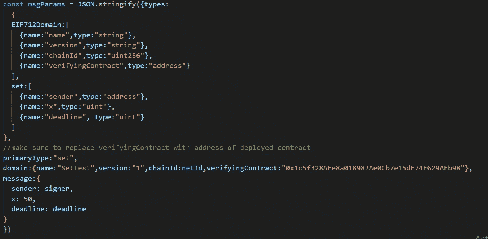
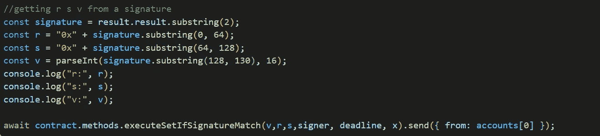
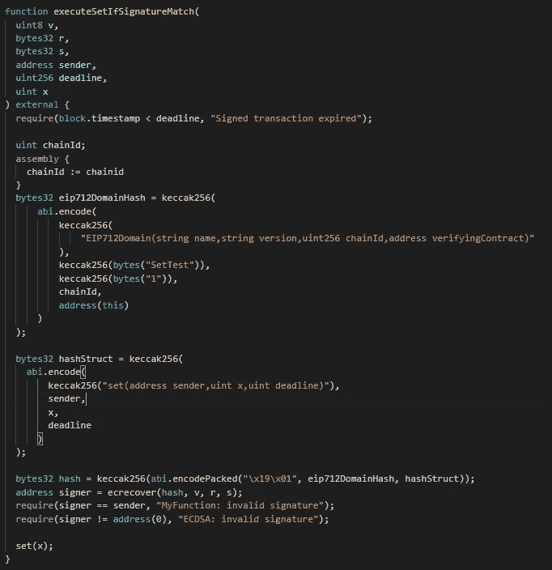
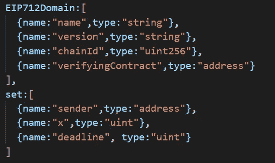
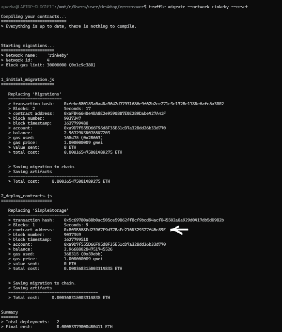

# EIP712，全栈示例

> 原文：<https://medium.com/coinmonks/eip712-a-full-stack-example-e12185b03d54?source=collection_archive---------0----------------------->

我当时正在做一个需要使用 EIP712 的项目。GitHub 中有许多文章和示例解释并展示了如何使用 EIP712，但我很难理解它作为一个整体是如何工作的，以及前端代码和智能合约是如何关联的。这是 EIP712 的一个例子(不是解释)。有关解释和其他代码示例，请参见下面的链接部分。

## 先决条件和我使用的版本

1.  扎实的基础知识
2.  国家预防机制 7.19.1
3.  节点 16.2.0
4.  元掩码 9.8.4
5.  块菌

## EIP-712

EIP-712 是一种更高级、更安全的交易签名方法。使用此标准，不仅可以对交易进行签名并验证签名，还可以将数据与签名一起传递到智能合约中，并对照该数据验证签名，以了解签名者是否是实际发送了交易中要调用的数据的人。

EIP-712 的实施可以在 Uniswap V2 [外围合同](https://github.com/Uniswap/uniswap-v2-periphery/blob/master/contracts/UniswapV2Router02.sol#L141)中看到，该合同通过一个许可来移除流动性，该许可最终调用 [Uniswap V2 核心](https://github.com/Uniswap/uniswap-v2-core/blob/master/contracts/UniswapV2ERC20.sol#L81)中的方法来完成此事。
来自前端的签名被传递给外围设备中的方法，该签名用于代表使用核心设备中的方法的用户批准路由器合同。

## 示例编码

我们的示例将使用 EIP-721 提案来签署带有数据(地址、存储数据的值和截止日期)的事务，这些数据用于更改合同中变量的值。

如果签名和散列给出了签名者的地址，并且没有超过最后期限，则 storedData 的值被改变。

一个无用的例子，但仍然理解这一点将确保您可以在其他地方使用这个标准。EIP-712 的正确用法是创建一个 ERC20 许可证，就像 uniswap 团队所做的那样。

## 第一步

继续克隆松露的[反应盒](https://www.trufflesuite.com/boxes/react)。

我们将简单地在这个回购中调整和添加所需的代码，以使 EIP 712 工作。

## 第二步

数据是 EIP 712 最关键的部分。这些要签名的数据必须符合预定义的格式。它必须有一个 EIP 712 域和要签名的数据(在我们的示例中设置)。这两者的组合将被签署并发送到智能合同进行验证。

在 EIP-712 下签名的每个数据必须有一个 EIP 712 域和另一个数据。这两者的结构可以是任意的，但是在 JS 代码和 SC 代码上必须是相同的。

EIP 712 域的结构是使用该提议时被广泛接受的标准。

EIP-721 Data standard

EIP 712 域具有指定哪个网络和哪个特定合同将用于验证签名的参数。具有相同代码的另一个合同将无法验证签名。

## 第三步

让我们添加一个按钮，单击该按钮将弹出元掩码弹出窗口，使用 eth_signTypedData_v3 方法对数据进行签名。

做这件事的代码可以在这里看到。

## 第四步

一旦使用 eth_signTypedData_v3 方法对上面定义的数据进行了签名，我们就可以获得签名，并将签名拆分为 r、s 和 v 部分，然后将其发送到智能合约，智能合约将对这些参数和数据哈希使用 ercrecover 来恢复签名者的公钥。

Splitting the signature

## 第五步

撰写智能合同。

就像 JS 代码一样，我们已经定义了包含 EIPdomain 的数据和要签名的数据，智能合约也需要两个变量来表示每个 EIPdomain 的散列数据和我们的数据(在这种情况下为 set data)。

Using ercrecover

在 UI 端，我们对数据进行签名，并将 r、s 和 v 发送到智能合约。

上面的代码做了两件事，首先是散列数据并生成它们的散列。接下来，它使用该数据的散列(在 SC 中称为 hash)和签名，通过 ercrecover 方法生成签名者的公钥。

上面显示的数据的两个 keccak 散列应该类似于在 out JS 代码中定义的数据结构。如果这些不同，则无法恢复签名人的地址。

Structure of our signed data

## 第六步

将 infura 中的助记符添加到 truffle-config.js 文件中(第 3 行)，并指定部署者的地址(第 18 行)。上面的例子使用了 rinkeby testnet，但是任何测试都可以使用，参见 truffle [文档](https://www.trufflesuite.com/docs/truffle/reference/configuration)部署到其他测试网。

然后部署合同。部署后，复制 simplestorage 的地址，并将其替换为 verifyingContract 下 app.js 中第 76 行的地址。默认情况下，它应该是 0x 803 b 558 FD 23967 f 9d 37 bafe 2764329327 f 45 e 89 e，这是我的 SimpleStorage.sol 契约所在的地址。

Deployment snippet

## 第七步

转到客户端目录并运行 npm run start 来启动 react 应用程序。

按下“按下以签名”按钮，然后在元掩码弹出窗口上签署签名请求。接下来，确认交易以设置智能合约的值。

交易完成后，刷新 webapp 以查看反映的更改。

1.  Github 链接到[回购](https://github.com/apurbapokharel/EIP712Example)。
2.  [https://medium . com/meta mask/EIP 712-is-coming-what-to-expect-and-how-to-use-it-bb 92 FD 1a 7a 26](/metamask/eip712-is-coming-what-to-expect-and-how-to-use-it-bb92fd1a7a26)
3.  [https://soliditydeveloper.com/ecrecover](https://soliditydeveloper.com/ecrecover)
4.  【https://docs.metamask.io/guide/signing-data.html 号
5.  【https://github.com/danfinlay/js-eth-personal-sign-examples 
6.  [https://github.com/ethereum/EIPs/tree/master/assets/eip-712](https://github.com/ethereum/EIPs/tree/master/assets/eip-712)