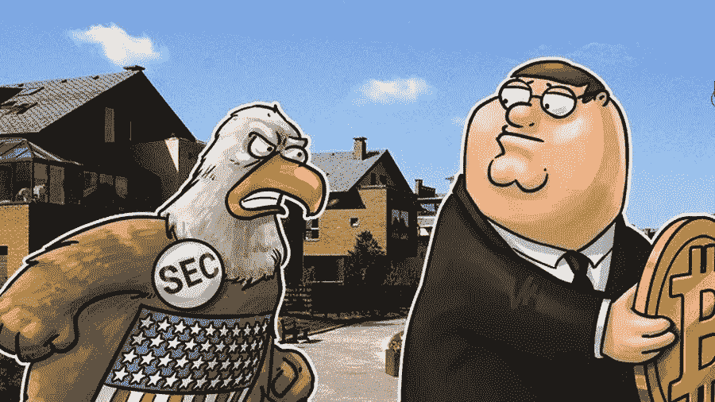

# 要么是安全，要么是公用事业——不要戏弄美国证券交易委员会！！！

> 原文：<https://medium.com/coinmonks/either-security-or-utility-do-not-tease-the-sec-51fdf1075c8d?source=collection_archive---------0----------------------->

最近，在一些 blockhain 项目中，大部分是由来自世界各地的全新团队诞生的，他们将制作一个 ICO，这已经成为一种非常时尚的表现，或者说是厚颜无耻地自豪，他们的项目令牌轻松自由地通过了这样一个可怕的，被所有人讨厌的豪威测试。此类项目的律师和顾问毫无羞耻之心，很可能操纵测试问题的本质，公开将项目本身、其构思和相信它们的团队置于危险之中，从而承诺为这些项目开放美国和世界的投资海岸。此外，甚至巧妙地激发项目创始人的信心，如果表明项目令牌是一种公用事业，它会增加对项目的兴趣及其商誉。从侧面看，这一切都显得滑稽可笑。毕竟，除了豪威测试之外，SEC(美国证券交易委员会)甚至对许多其他测试和立法行为提出上诉，这在原则上对你的令牌作为一种实用工具的传奇造成了致命的打击。但是许多顾问和律师更喜欢保持沉默，如果他们肯定在这些事情的过程中。所有这些测试，包括豪威测试，都源于判例法和对法律实践的丰富幻想，以及美国政府控制金融流动的垄断。到底是什么问题，大家来搞清楚。

区块链令牌是在区块链的帮助下创建的，是分布式软件协议的一部分。有许多不同类型的令牌，每种令牌都有不同的特征和应用方式。一些代币，如比特币和 monero，具有数字货币的功能。其他可以代表有形资产，如黄金或房地产，任何今天已经存在。令牌也可以在新的协议和网络中使用，以创建分布式应用程序。这些类型的令牌代表了区块链技术创新的下一阶段，以及去中心化的新型商业模式的潜力——例如，没有亚马逊的云计算，没有脸书的社交网络，或者没有易贝的在线市场。然而，有许多与代币相关的复杂法律问题。这一过程合法化的主要问题不是对 ICO 这种现象进行法律和实践评估，从法律上予以证实。ICO 是次要的。代币的法律性质是首要的。

今天，世界上没有任何地方对什么是代币有理论上和明确的法律定义。

监管机构有一定的指引和解释，意思只是一个推荐字，仅此而已。还没有法律。不可否认的问题是，还不可能根据法律为 token 定义基本资产。立法者仍在表明意图，而监管者——这并不奇怪——在解决这个问题上表现出被动。就连监管者的这种立场也有一个解释。这是他们追溯甚至倒退的政策，因为他们仍然从与过去的东西比较的角度来评价这些记号，但是他们不能从未来的角度来评价它。此外，即使您向任何监管机构(包括最权威的 SEC)提出评估您的项目令牌的请求，可能的答案也是根据他们的合规政策代码— **它不受审查，以避免政策造成先例。**迄今为止还没有一个监管机构给出代币的定义，不像例如比特币和其他加密货币。所有人都在等待谁将首先确定法律的本质，谁将为这个先例负责。正是从这样一个回顾性的立场出发，美国证券交易委员会使用那些它所熟悉的工具，来评估金融市场中的这种现象。

因此，一些代币，根据其特性，可能会受到美国联邦监管机构和证券市场法律的控制和监控。这将意味着，除其他外，在美国提供代币销售是非法的，没有他们的注册或注册豁免。类似的规则也适用于世界上许多其他国家。然而，全球加密社区关注的是美国联邦立法，因为这些法律是对代币众筹销售的最大威胁。在许多司法管辖区，反洗钱立法或一般消费者保护法可能存在问题，但是，对众筹和代币最真实的威胁是美国的综合法律，该法律赋予美国证券交易委员会无限的权力，并决定什么是证券。我认为有必要引用 1933 年证券法第 2(a)(1)节中的一条:术语“证券”是指任何票据、股票、库存股票、证券期货、基于证券的掉期、债券、信用债券、债务凭证、权益证书或**参与任何利润分享协议**、抵押信托证书、**筹备证书**或**认购、**可转让股份、投资合同、**投票信托证书**、以及 天然气或其他矿产权利，任何证券、存款单或证券组或指数的任何卖出、买入、跨售、期权或特权(包括其中的任何权益或基于其价值)，或在国家证券交易所订立的与外币相关的任何卖出、买入、跨售、期权或特权，或通常称为“证券”的任何权益或工具，**或任何**权益证书或**参与，** **的临时或中期证明、**的担保、**的收据或认购或购买前述任何**的权证或权利。 粗体字体表示那些位置可以平滑地符合你的令牌作为一个工具的定义，但最后，这个法律定义一切只是安全。《1934 年证券交易法》第 3(a)(10)节也给出了类似的全面定义。当然，基于判例法的这些定义，以及对事实的理解，我们可以得出这样的结论:如果你的 ICO 项目的令牌不符合安全性的定义，那么你的令牌就是实用工具。可以强调的是，这个结论取决于你的令牌的特性和性质。但根据上述定义，我根本看不到这样的机会。事实上，在大多数实际情况下，您的令牌没有机会成为美国管辖下的公用事业。这是我的主观看法。因此，我对 ICO 这类项目非常谨慎，它们像红布斗牛士一样挥舞着自己通过的测试，吸引着 SEC 和美国私人投资者的注意。我总是和参与这个项目的律师争论，他们是否开始让项目的创始人通过豪威测试，并展示他们非常想看到的东西。应当理解，令牌可以具有不同的功能，这取决于它们是如何开发的以及使用了哪些计算机系统。原则上，您可以非常有保留地假设，如果令牌具有一个或多个功能权限和技术能力，那么它可以不被视为安全性。换句话说，如果你的项目生态系统中的这些令牌扮演了一个手段和权利的角色，来为系统编程、开发或创建特性，或者“挖掘”嵌入在系统中的东西；进入系统或获得系统许可；对这种进入或许可收取费用；为系统贡献劳动或努力；使用系统及其输出；销售系统产品；就系统的特性和功能的添加或删除进行投票。**不多！！！******

**但与此同时，你可以更有信心地声明，如果你的代币有一项或多项投资权益，那么它完全可以被视为证券。也就是说，如果你的项目生态系统中的这种令牌在一个法律实体(包括一个普通合伙企业)中扮演了所有者权益的角色；股权；利润和/或损失，或资产和/或负债的份额；债权人或贷款人的身份；作为股权持有人或债权人的破产索赔；区块链令牌的系统或法律实体发行者的还款义务持有人；以及允许持有者将非安全区块链代币转换成具有一个或多个投资权益的区块链代币或工具，或者授予持有者购买一个或多个投资权益的选项的特征。最有可能的是，根据 SEC 处理代币的性质和本质问题的实践，甚至是代币的特征和属性的组合，安全性和实用性，最终这样的组合代币将最终被认为是安全性。此外，根据美国证券交易委员会的惯例，购买各种项目的非证券(公用事业)代币的基金或其他法律实体的所有权份额的存在，仍将考虑并构成证券代币中的所有权份额，即使这样的基金声明其仅投资于公用事业代币(非证券)。这种自相矛盾的解释可以用投资计划和代币持有者的投资兴趣来解释，即使这种兴趣是火柴盒和肥皂泡。此外，更令人困惑的是美国证券交易委员会的解释。事实上，代币本身是一种规划未来的结构，在区块链建立和实施其可操作存在的系统之前，无论是公用事业还是证券，都将被视为证券。对于这种情况没有明确的立法定义，但美国证券交易委员会支持这一立场。因此，您的项目和相关令牌的区块链的启动应尽可能接近彼此关联的帧时序。也就是说，最好同时运行系统和令牌，这样区块链系统的令牌被视为安全的可能性就会降低。美国证券交易委员会的这种解释是根据豪威测试的特点，在“损失的风险”一节的一部分。所有这一切只是一个例子，说明了对代币性质的解释的异质性，以及 ICO 项目创始人及其律师希望看到的、他们实际能够看到的以及 SEC 官员如何评估之间的深刻差异，SEC 官员关于 Howey 测试的工具在 2004 年 SEC 诉 Edwards，540 U.S. 398 (2004)一案中被美国最高法院深度扩展。豪威测试的结构特别关注术语“投资合同”,定义你的代币是否是证券。值得注意的是，这一测试被用来对“更具可变性”的工具进行分类，这些工具可被视为一种“合同、交易或计划，其中投资者以旨在从其投资中产生收入或利润的方式分配资金”。根据 SEC 应用豪威测试的实践，代币最有可能被分析为投资合同。上面列出的一些投资权益被更准确地描述为传统类型的证券，因此它与非安全(实用)特征令牌的组合更有可能被 SEC 评估为安全令牌。**

**美国最高法院以如下方式构建了豪威标准:如果合同项下的行为包含一系列下列活动和特征，则该安排是符合证券定义的投资合同。即:**

**投资/金钱投资；**

**投资于普通商业交易/企业；**

**共同业务/企业的参与者期望获得利润；**

**预期利润主要来自他人/第三方的努力和行动，无论企业的股份是否得到官方证书的确认，还是企业/为共同事业使用的实物资产的名义份额**

**从投资中获得的任何利润是否大部分或完全在投资者的控制之外？**

**不要太确信你能够绕过这个测试中所有隐藏的术语和情况分析的陷阱。上述每个特性都有许多额外的定义，使答案变得复杂:**

****金钱投资**——根据*豪伊*及其后的判例法，金钱投资可能不仅包括提供资本、资产和现金，还包括货物、服务或本票。*见*，如国际 Bhd。运输工人诉丹尼尔案,《美国最高法院判例汇编》第 439 卷，第 551，560 页，第 12 页(1979 年)；赫克托诉威恩斯,《联邦判例汇编》第二辑，第 533 卷，第 429 页，第 432-33 页(第九巡回法庭。1976);桑达斯基土地有限公司诉联合计划集团有限公司,《联邦判例补编》第 400 卷，第 440 页，第 445 页(俄亥俄州未指明日期，1975 年)**

****共同企业** —在横向方法下，多个投资者将资金集中到一项投资中，并且每个投资者的利润与其他投资者的利润相关联，则共同企业被视为存在。在纵向方法下，关注投资者的利润是否与发起人相关联，以及投资者的成功是否依赖于发起人的专业知识。如果存在这种依赖，那么共同企业将被视为存在。*见*，例如，柯伦诉美林，载于《联邦判例汇编》第二集第 622 卷第 216 页(第六巡回法庭)。1980);沃尔斯诉福克斯山开发公司。公司，24 F.3d 1016(第七巡回法庭。1994);证券交易委员会诉大陆商品公司，载于《联邦判例汇编》第二集第 497 卷第 516 页(第五巡回法庭)。1974)等案件。**

****利润预期—** 在此要素下，利润是指投资者寻求的投资回报或收入类型。因此，就代币而言，这可以指作为区块链代币持有者而获得的任何类型的回报或收入，这将被缩小到被动获得的程度，即来自他人的努力。更具体地说，利润可能包括各种形式的回报，如股息、其他定期付款或投资增值——无论是可变回报还是固定回报。*见*，例如，SEC 诉 Edwards，540 U.S. 390 (2004)以及其他案件。**

****完全来自其他人的努力** —通常，美国法院对“完全”一词的理解很灵活，因此，除了字面意思之外，它还包括投资成功所必需的重大或必要的管理或其他努力。*参见*，SEC 诉 Glenn W. Turner 进入。，474 F.2d 476，482–83(第九巡回法庭。1973);参见 SEC 诉 Koscot Interplanetary，Inc .，《联邦判例汇编》第二集第 497 卷第 473 页(第五巡回法庭，1974 年)，Hirsch 诉 Dupont，载于《联邦判例补编》第 396 卷第 1214、1218-20 页(纽约州立大学，1975 年)，*AFFF ' d*，载于《联邦判例汇编》第二集第 553 卷第 750 页(第二巡回法庭。1977)**

**我认为，即使是我简单的解释也足以理解，当你的律师在 ICO 项目中开始玩弄豪威测试的能力时，他们应该是多么严肃和专业。以及你会陷入多深的麻烦。永远记住 MUNCHEE 启动的案例，事实上，通过 SEC 官员的权力进行的 Howey 测试可能会成为 ICO 项目的断头台。美国认为它的立法是治外法权，所以除了豪威测试，你应该意识到其他测试的危险，这些测试在新闻和大众媒体中不太受欢迎，但这并没有减少它在 SEC 中的受欢迎程度。即:**

**Reves 家族相似性测试，1990 年，美国最高法院在 Reves v.Ernst & Young 案中的判决(事实上，投资预期测试——如果在谈判和讨论期间你操纵投资收入预期或承诺——那么你的代币是一种证券，对“操纵”性质的法律解释是无限的)**

**风险资本测试，加州最高法院银山乡村俱乐部诉 Sobieski 案(1961 年)(即使是俱乐部会员也属于风险资本投资——会员卡是一种证券)**

**给你——你所有的代币都是安全的。几乎任何令牌，当通过上述测试时，都会得到积分，并有被识别为证券的危险。但是我们必须记住，在开始 ICO 之前，您必须回答与您的项目令牌相关的问题:**

**令牌的发行者是谁？**

**令牌的所有者拥有哪些权利？**

**代币背后的经济是什么？**

**这是代币的经济问题，将帮助你理解和不做愚蠢的律师。但通常情况下，基于实践，经济问题是最站不住脚的，也是进退两难的令牌的风险因素— **安全还是实用！！！****

> **[直接在您的收件箱中获得最佳软件交易](https://coincodecap.com/?utm_source=coinmonks)**

****

**塞尔吉·戈卢别耶夫**

****欧盟结构基金、ICO 项目、非政府组织&投资项目、项目管理、商业综合支持、AgroChallenge 基金会专家****