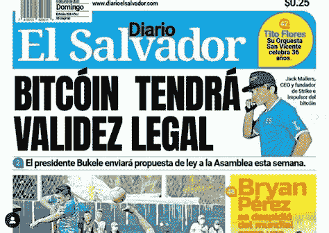
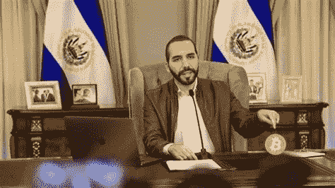
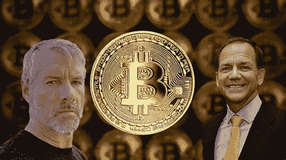

# 萨尔瓦多的比特币法定货币法可以做得更好

> 原文：<https://medium.com/coinmonks/el-salvador-can-do-better-with-its-bitcoin-legal-tender-law-134ab1f53b7f?source=collection_archive---------12----------------------->

## 萨尔瓦多应采取哪些步骤来进一步推动比特币化，并促进其加密部门的经济发展

# 塞勒和都铎·琼斯:是时候开始为比特币游说了

萨尔瓦多总统布克莱最近让比特币成为该国法定货币的举动被广泛报道为比特币普及的重要一步。虽然我同意这是主权国家和[更广泛采用比特币的历史性一步，我清楚地看到了这一天的到来](https://andreabianconi.medium.com/which-country-will-first-enter-the-multi-trillion-bitcoin-adoption-race-a1d071d95edb)，但我对萨尔瓦多如何做到这一点有些担忧。特别是，我反对任何“强制”采用比特币的做法，用 Nic Carter 的话说，比特币应该更好地继续“[凭借自身优势繁荣发展”。](https://www.coindesk.com/el-salvador-bitcoin-mandate-article-7)

但是在我开始推理之前，让我先澄清一下我们在这里谈论的是什么，什么是“法定货币”。

# “法定货币”是什么意思

每个国家都通过法律规定哪种支付方式在其境内被接受为“法定货币”。这意味着所选择的支付方式将依法消除债务或解决纳税、债务和法律罚款或损害赔偿。

“法定货币”的概念一般在合同义务的范围之外运作，在这种情况下，当事方可以相当自由地决定他们将接受何种具体的“支付手段”来结算其合同义务。因此，法定货币的概念适用于因执行该国法律而产生的义务。例如，如果某人起诉另一人要求损害赔偿，而法院在该特定国家以 X 金额解决损害赔偿，债务人可以通过以该国法定货币支付 X 金额来合法地解除其义务。纳税、行政费用、罚款或其他法律义务也是如此。

然而，这通常并不意味着私人/企业必须接受相同的法定货币来换取其商品和/或服务。该人很可能决定只接受该国法定货币中的特定纸币面额，或者完全接受另一种支付手段(不是法定货币)，如信用卡、银行电汇、代金券、贵金属或比特币。

例如在欧洲，欧盟条约第 128 条规定欧元纸币是欧盟内部唯一的法定货币。然而，交易各方可以自由使用在发行国具有法定货币地位的其他外币或私人发行的货币或比特币等加密货币。尽管这些货币不是“官方”货币，没有法定货币地位，也不能用于纳税或结算司法裁决，但各方可以同意将其作为私人货币使用，并可以用其结算合同义务，而不管法定货币是什么。虽然这与本文无关，但值得注意的是，欧盟最广泛使用的货币形式——即记入您银行账户的数字欧元、您所有的(非实物现金)储蓄和电子银行余额——根据法律不是法定货币，而是商业银行货币，即私人发行的货币，与比特币基本没有区别。

当欧洲央行在未来发行数字欧元/CBDC 时，这绝对是值得记住的事情。

情况基本上与美国的[相同，1965 年](https://www.treasury.gov/resource-center/faqs/Currency/Pages/legal-tender.aspx)的《铸币法》，特别是标题为“法定货币”的第 31 U.S.C. 5103 节规定:“美国硬币和货币(包括联邦储备券和联邦储备银行和国家银行的流通券)是所有债务、公共费用、税收和应付款的法定货币。”此外，在美国和世界上几乎所有地方，私人和企业可以自由使用法定货币或其他支付手段来结算他们的合同义务。

基本上，只有独裁政权或实行资本管制的国家才要求私人在契约关系中必须接受法定货币。

这是萨尔瓦多新法律的潜在问题。

# 法定货币 vs“强制”法定货币

布克勒总统在新的第 7 条(见第 14 页)上简直是走得太远了[，该条款规定，包括私营企业在内的所有人在支付时都必须接受比特币。](https://www.diariooficial.gob.sv/diarios/do-2021/06-junio/09-06-2021.pdf)

像尼克·卡特这样的早期批评家，尤其是乔治·塞尔金，已经正确地指出了为什么第七条真的不需要，为什么它应该被删除。一件事是给萨尔瓦多人机会和自由，让他们在美国美元化的奴役和“不属于任何人的钱”的比特币之间做出选择，另一件事是迫使萨尔瓦多人使用比特币购买咖啡。

正如乔治·塞尔金所指出的，法律在第 12 条中确实留有足够的余地来规避第 7 条的适用。此外，人们必须记住，比特币不是萨尔瓦多唯一的法定货币。美元是另一种货币，因此萨尔瓦多人仍然可以选择使用美元或比特币。但出于同样的原因，更明智的做法是只实施精心制定的法律，这些法律既有助于国家的发展，也有助于将比特币作为经济进步的工具。

像这样仓促的立法可能会在失败的情况下给比特币的批评者提供方便的弹药，并可能为[猜测此举背后的真实意图打开大门。这里有一些](https://foreignpolicy.com/2021/06/15/el-salvador-bitcoin-official-currency-printing-money/)[的新发展](https://www.coindesk.com/strike-usdt-tether-jack-mallers-el-salvador-bitcoin)。

由于这对年轻的布克勒总统来说太过冒险，太过引人注目，我宁愿相信他的诚意和良好的意图，尽管这不是一个经过深思熟虑和有计划的行动。

那么萨尔瓦多应该做些什么呢？

# 萨尔瓦多和所有新兴经济体的“比特币化”框架

除了分享 George Selgin 的意见(特别是关于第 7 条和第 14 条下的“比特币信托基金”的风险),我想重点谈谈更广泛的政策措施:萨尔瓦多应该如何采用比特币并促进其经济发展。

由于罗马不是一天建成的，让比特币成为合法货币(尽管避免了对私人交易的强制)只是采用过程中的一步，可能不是最重要的一步。

萨尔瓦多应该致力于发展一个有竞争力的框架，以启动该部门并启动良性循环。然后，我将在下面指出在发展中国家启动加密部门所需的步骤。可以从 www.bianconiandrea.com[的](https://www.bianconiandrea.com/)网站免费下载一份名为“[新兴经济体中促进加密货币/区块链相关创新和投资的监管政策](https://www.bianconiandrea.com/)的白皮书

**一般情况下**:

1.避免对创新技术和应用的限制:总的来说，当涉及到新兴技术时，国家应该采取“无许可创新”的姿态。国家不应该无意中用预防性法规扼杀新产业，而应该允许修补者在相关机构的监督下进行实验。创新很难创造，但扼杀却极其容易。

2.避免政府投资或支持任何特定的技术或应用:正如政府不应消极地针对特定的技术或应用，也不应反其道而行之。补贴或支持首选用例会扭曲市场信号。今天看来很有前途的技术可能不会成为市场的赢家。如果政府要给予技术失败者特权，我们就有陷入次等标准的风险。此外，国家应该非常谨慎地对待政府采用区块链技术的问题。立法者应该记住，这些都是新的和仍在发展中的技术。出于宪法原因和保护公众利益，私营企业可以用州政府不能用的方式进行试验。立法机构应该首先关注改革，释放加密货币在国内的全部潜力。一旦这些技术经过更多的测试和审查，政府将会更好地了解哪些技术足够安全，可供政府使用。

**具体来说**，以下是世界范围内成功国家已经采取的或应该采取的促进密码行业发展的主要法规发展列表:

(I)关于数字令牌化资产(如稳定债券和令牌化证券)的承认和法律地位的条例。

列支敦士登、瑞士和美国怀俄明州实施的监管框架就是很好的例子。

(ii)实施灵活的加密银行章程，主要管理加密资产的发行和保管，就像在怀俄明州为 SPDIs(特殊目的 Dep)实施的那样。机构)。鼓励银行接入比特币区块链，建立新的银行基础设施。这一点很重要，因为与不受监管的实体相比，受监管的银行为零售和机构投资者托管加密资产提供了更高的安全性。一个可靠的比特币银行网络是吸引加密资本的基础。

㈢通过灵活的许可程序，鼓励建立密码交易所。

㈣审查并在必要时改革汇款法，以免除非拘禁服务和申请。明确区分加密货币的托管和非托管应用，并豁免后者不仅符合模拟机构的要求，还能更好地将该国定位为加密货币活动的中心。

㈤采用比特币作为法定货币，或鼓励使用比特币支付行政费用和税收，并确保加密货币和当地法定货币之间的自由和完全可兑换性。业务采用也很重要，特别是对于昂贵的项目，如支付房地产。所有这些都将为政府现代化的数字金库带来充足的资金储备。支持(而不是强迫)比特币化，以缓慢逆转经济的美元化。

㈥给予奖励，以吸引秘密资本/投资者和人才资本。税收优惠非常重要。钱流向待遇更好的地方。而且人力资本也会转移到商业机会和生活水平更好的地方，或者至少是前景更好的地方。像投资居住权和公民权这样的项目非常重要。一个新的比特币电子居留计划，类似于爱沙尼亚的电子居留计划，可能是一个明智的选择。

(vii)可能将投资于该国的比特币资本引入央行持有的比特币基金，为该国的基础设施和发展项目提供融资(想想利用残余和可再生能源进行比特币开采)。这可能会鼓励当地央行将部分外汇储备配置给比特币。

这些步骤不仅可以使萨尔瓦多，而且可以使任何新兴经济体成为密码行业的领导者。如果该国有增长和技术发展的欲望，剩下要做的就是确保其政策将允许投资者/企业家尽可能顺利地实现他们的目标。

比特币化(做得好)可以给所有新兴经济体带来巨大的潜力。

# 比特币社区应该伸出援手，像塞勒和都铎·琼斯这样的人应该尽自己的一份力量

尽管比特币有很多对手，但它可能会找到潜在的盟友。银行和新兴经济体可能是两个强大的盟友。银行可能还没有意识到比特币能给这个行业带来的所有机会。但在负利率和病入膏肓的法定制度的扭曲下，商业银行业已经死亡。更不确定的是，在 CBDC 政权下，商业银行的作用将被大大削弱，尽管央行在撒谎，并做出相反的保证。因此，比特币银行是银行唯一的未来和最佳选择。他们越早明白这一点就越好。我在《比特币》和《商业银行失传的艺术》中描述了他们的机会。新兴经济体对于比特币的真正采用也至关重要，这与比特币银行服务的扩大和比特币银行的出现密切相关。但是发展中经济体无法独自完成这一切。正如 Bukele 总统的案例所示，他们需要有能力的加密人员、社区以及 Saylor 和 Tudor Jones 等著名加密投资者的支持。投资者也应该尽自己的一份力量。他们有巨大的经济动机这样做，并且会有很大的收益或损失。

他们应该“尽自己的一份力量”是什么意思？

# “游说比特币”

即使我讨厌这个词，对比特币的“游说”很好地总结了我的意思和这里需要什么。[比特币采矿委员会](https://www.coindesk.com/michael-saylor-bitcoin-mining-consensus)甚至没有接近什么是必要的。需要更广泛和全面的努力来挑战强大的利益集团传播的多种说法，这些利益集团要花费数亿美元。许多有能力的加密作者独立发表好的文章、论文、播客和采访来对抗虚假信息机器，但只有像 Saylor 和 Tudor Jones 这样拥有大量比特币既得利益的投资者才有财力创建一个更强大的结构来协调和促进所需的大规模响应工作。更重要的是，新兴经济体必须有一个精确的“比特币化发展计划”(正如我在上面粗略描述的那样)作为目标，并在整个转型阶段得到支持。此外，加密业务领导人必须将他们的业务带入这些国家，以帮助他们发展基于比特币的经济和服务。

毕竟比特币制造者需要一个可靠的“安全天堂”。一个主权国家，在那里，加密资本可以安全地停泊、投资，并免受全球主义精英世界政府的全球影响。他们将越来越多地使用“法律和法规”作为最有效的工具来阻止加密的采用和损害加密持有者。没有必要禁止加密。对其过度监管和过度征税要容易得多，也有效得多。但是，一旦第一个主权国家加入，其他国家将会跟进，而“监管”——作为一种“劝阻工具”——将变得无效。此后，聪明的国家将开始竞相吸引加密资本。不过，在那之前，像塞勒和都铎·琼斯这样的人将不得不加大力度支持这种“游说比特币”的努力。请想一想，如果全球主义精英实施全球大规模的加密税，会对比特币的价格产生什么影响，他们会损失多少。像比特币这样真正去中心化、不可审查的加密货币，在他们眼里就是烟。他们想摆脱它的原因和他们想摆脱现金的原因一样。权力和控制。他们渴望一种数字货币，这种货币可以成为一种强大的全球监控工具。数字法定货币(CBDCs)是他们的宝贝。

# **结论**

有人可能会说，“谁在乎萨尔瓦多？”可怜的小萨尔瓦多在世界事务中有多大分量？

很多，至少在比特币采用的早期阶段。

因为所有新兴经济体的情况都与萨尔瓦多完全相同。他们被夹在本国疲软的法定货币和经济“美元化”或“欧元化”的困境之间，这将产生我们都知道的破坏性长期影响。因此他们现在必须做出选择。要么用比特币，要么永远被通常的嫌疑人奴役。萨尔瓦多之后可能是巴拉圭、乌拉圭、阿根廷、哥斯达黎加等。实际上，整个新兴世界都在卢比孔河，他们的领导人必须掷骰子，创造历史，否则就继续做通常嫌疑人的腐败傀儡。

也许年轻的总统布克莱有机会成为萨尔瓦多的“凯撒”，他已经掷出了正确的骰子，但他现在必须仔细选择他的下一步。我们是来帮助他的。

*********************************************************

关于此主题，另请参见:

- [免费白皮书下载:“促进新兴经济体加密货币/区块链相关创新和投资的监管政策](https://www.bianconiandrea.com/)”

- [哪个国家将首先进入数万亿比特币的采用竞赛？](https://andreabianconi.medium.com/which-country-will-first-enter-the-multi-trillion-bitcoin-adoption-race-a1d071d95edb)

- [比特币和商业银行失传的艺术](https://andreabianconi.medium.com/bitcoin-and-the-lost-art-of-commercial-banking-6057442da435)

- [金元将成为密码法定之王](https://andreabianconi.medium.com/king-dollar-will-be-king-of-crypto-fiat-66588ee64d01)

【www.bianconiandrea.com/[**支持我独立自由的写作**](https://www.bianconiandrea.com/)

****************************************************************

# crypto #区块链#比特币#加密货币# El Salvador # buke le # cbdc # stable coins

www.bianconiandrea.com—2021 年

******************************************************************

***如果你喜欢这篇文章，请在左下角“鼓掌”x 次，这样它就会被更多的人分享。非常感谢***

******************************************************************

**法律免责声明**:本网站及其中包含的信息仅供一般指导，不构成法律意见。因此，它不应被用来替代就具体问题与律师的磋商。本文中的所有信息均按“原样”提供，不保证完整性、准确性、及时性或任何形式的明示或暗示的担保。

**投资免责声明**:本网站及其中包含的信息无意成为与所提交材料相关的建议或信用分析的来源，本网站中包含的信息和/或文件不构成投资建议。

www.bianconiandrea.com—2021

> 加入 [Coinmonks 电报频道](https://t.me/coincodecap)，了解加密交易和投资

## 另外，阅读

*   什么是融资融券交易
*   [3 商业评论](/coinmonks/3commas-review-an-excellent-crypto-trading-bot-2020-1313a58bec92) | [Pionex 评论](/coinmonks/pionex-review-exchange-with-crypto-trading-bot-1e459d0191ea) | [Coinrule 评论](/coinmonks/coinrule-review-2021-a-beginner-friendly-crypto-trading-bot-daf0504848ba)
*   [莱杰 vs Ngrave](/coinmonks/ledger-vs-ngrave-zero-7e40f0c1d694) | [莱杰 nano s vs x](/coinmonks/ledger-nano-s-vs-x-battery-hardware-price-storage-59a6663fe3b0) | [币安评论](/coinmonks/binance-review-ee10d3bf3b6e)
*   [Bybit Exchange 审查](/coinmonks/bybit-exchange-review-dbd570019b71) | [Bityard 审查](/coinmonks/bityard-review-7d104239be35) | [CoinSpot 审查](https://blog.coincodecap.com/coinspot-review)
*   [3 commas vs crypto hopper](/coinmonks/3commas-vs-pionex-vs-cryptohopper-best-crypto-bot-6a98d2baa203)|[赚取加密利息](/coinmonks/earn-crypto-interest-b10b810fdda3) | [网格交易机器人](https://blog.coincodecap.com/grid-trading)
*   最好的比特币[硬件钱包](/coinmonks/the-best-cryptocurrency-hardware-wallets-of-2020-e28b1c124069?source=friends_link&sk=324dd9ff8556ab578d71e7ad7658ad7c) | [BitBox02 回顾](/coinmonks/bitbox02-review-your-swiss-bitcoin-hardware-wallet-c36c88fff29)
*   [block fi vs Celsius](/coinmonks/blockfi-vs-celsius-vs-hodlnaut-8a1cc8c26630)|[Hodlnaut 评审](/coinmonks/hodlnaut-review-best-way-to-hodl-is-to-earn-interest-on-your-bitcoin-6658a8c19edf) | [KuCoin 评审](https://blog.coincodecap.com/kucoin-review)
*   [Bitsgap 审查](/coinmonks/bitsgap-review-a-crypto-trading-bot-that-makes-easy-money-a5d88a336df2) | [Quadency 审查](/coinmonks/quadency-review-a-crypto-trading-automation-platform-3068eaa374e1) | [Bitbns 审查](/coinmonks/bitbns-review-38256a07e161)
*   [密码本交易平台](/coinmonks/top-10-crypto-copy-trading-platforms-for-beginners-d0c37c7d698c) | [Coinmama 审核](/coinmonks/coinmama-review-ace5641bde6e)
*   最佳[加密制图工具](/coinmonks/what-are-the-best-charting-platforms-for-cryptocurrency-trading-85aade584d80) | [最佳加密交易所](/coinmonks/crypto-exchange-dd2f9d6f3769)
*   [如何在印度购买比特币？](/coinmonks/buy-bitcoin-in-india-feb50ddfef94) | [瓦济克斯评论](/coinmonks/wazirx-review-5c811b074f5b) | [HitBTC 评论](/coinmonks/hitbtc-review-c5143c5d53c2)
*   [WazirX vs coin dcx vs bit bns](/coinmonks/wazirx-vs-coindcx-vs-bitbns-149f4f19a2f1)|[block fi vs coin loan vs Nexo](/coinmonks/blockfi-vs-coinloan-vs-nexo-cb624635230d)
*   [本地比特币评论](/coinmonks/localbitcoins-review-6cc001c6ed56) | [加密货币储蓄账户](https://blog.coincodecap.com/cryptocurrency-savings-accounts)
*   [比特币基地评论](/coinmonks/coinbase-review-6ef4e0f56064) | [德里比特评论](/coinmonks/deribit-review-options-fees-apis-and-testnet-2ca16c4bbdb2) | [FTX 评论](/coinmonks/ftx-crypto-exchange-review-53664ac1198f)
*   [n 零审核](/coinmonks/ngrave-zero-review-c465cf8307fc) | [Phemex 审核](/coinmonks/phemex-review-4cfba0b49e28) | [PrimeXBT 审核](/coinmonks/primexbt-review-88e0815be858)
*   最佳[区块链分析](https://bitquery.io/blog/best-blockchain-analysis-tools-and-software)工具| [赚比特币](/coinmonks/earn-bitcoin-6e8bd3c592d9)
*   [加密套利](/coinmonks/crypto-arbitrage-guide-how-to-make-money-as-a-beginner-62bfe5c868f6)指南| [如何做空比特币](/coinmonks/how-to-short-bitcoin-568a2d0b4ae5) | [Prokey 回顾](/coinmonks/prokey-review-26611173c13c)
*   [币安交易机器人](/coinmonks/binance-trading-bots-d0d57bb62c4c) | [OKEx 审查](/coinmonks/okex-review-6b369304110f) | [Atani 审查](https://blog.coincodecap.com/atani-review)
*   [最佳加密交易信号电报](/coinmonks/best-crypto-signals-telegram-5785cdbc4b2b) | [MoonXBT 评论](/coinmonks/moonxbt-review-6e4ab26d037)
*   [Godex.io 审核](/coinmonks/godex-io-review-7366086519fb) | [邀请审核](/coinmonks/invity-review-70f3030c0502) | [BitForex 审核](/coinmonks/bitforex-review-c4bb28d9e271)

*原载于 2021 年 6 月 23 日*[*【https://andreabianconi.medium.com】*](https://andreabianconi.medium.com/el-salvador-can-do-better-with-its-bitcoin-legal-tender-law-bf174601379c)*。*