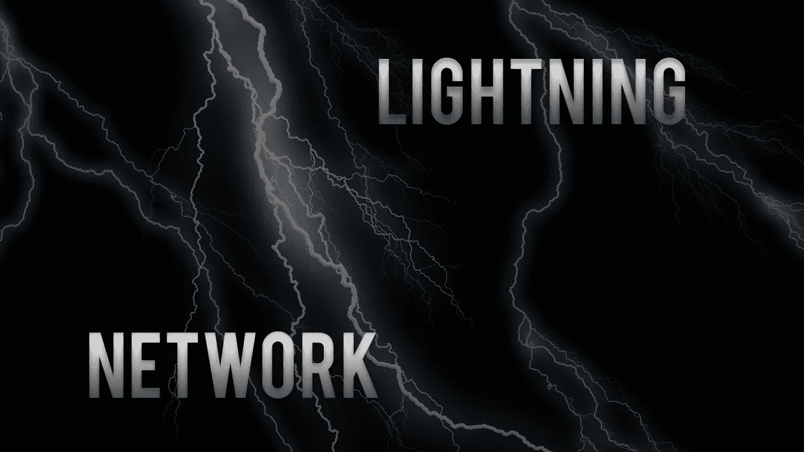

# 给我通电:闪电网络

> 原文：<https://medium.com/coinmonks/electrify-me-the-lightning-network-f2aad299e9b3?source=collection_archive---------0----------------------->

闪电网络似乎是所有比特币和区块链相关问题的答案:它是我们目前面临的堵塞、拥挤、过度拥挤的支付处理生态系统的理想替代物，该生态系统速度慢、交易费用高、效率低下。当然，随着比特币成为货币的自然演变(进而成为人类本身)，可用性水平的提高应该会紧随其后——然而，正如新技术推出时经常出现的情况，最终的基础设施往往会落后几个步骤(或几英里)。Visa 每秒能够处理 24，000 笔交易，比特币现金每秒能够处理 61 笔交易，而比特币每秒只能处理 7 笔交易，其不足之处对加密社区的所有成员来说都是显而易见的。

闪电网络在 2017 年更为新生的建筑时期变得突出，然后在 2018 年 3 月正式全面化身。自那以来，尤其是近几个月，它迅速壮大。Bitfury 是闪电网络领域的主要参与者之一，也是早期采用者。Bitfury 是“世界上最大的全方位服务区块链技术公司之一”，为企业、政府、组织和个人提供软件和硬件解决方案，以通过区块链网络安全地转移资产。有趣的是，Bitfury 率先完全实现了基于闪电网络的咖啡购买系统。他们名为 LightningPeach 的闪电网络工程团队与支付初创公司 Paytomat 合作，通过他们的平台推出了闪电网络——这是一次全面的成功整合，进一步增强了对闪电网络的信心，并将 Paytomat 推上了革命性回报平台的排名。

## 2018 年的成就…

闪电实验室是闪电网络的臭名昭著的支持者，在过去一年里取得了巨大的成就:尽管比特币价格下跌，它能够横向移动，上下颠倒，并向其他任何方向倾斜，闪电网络本身却越来越强大，不受市场波动的影响。11 月，该网络达到了 4000 个节点，在迅速发展到支持价值超过 200 万美元的比特币之前，其容量在 BTC 螺旋上升后继续上升，增长了近 300%。是的，在一个严酷、阴冷的隆冬，仍然有可能保持盈利。例如，全球加密自动取款机的数量持续稳定增长，去年 12 月全球共有 209 台自动取款机投入使用。

加拿大 BTC 矿业公司 Hut 8 声称 2018 年第三季度创下 1350 万美元的历史新高，日本 IT 巨头 GMO 报告称，其加密业务，包括采矿设备生产和加密交换，在同一时期获得了 26 亿日元(2280 万美元)(尽管可能涉及一些欺诈性涉足)。

根据蒂姆·德雷珀(Tim Draper)上个月激动的推文，闪电网络集团(lightning network)经验丰富、充满活力的成员 Open Node 已经开始煞费苦心地推动理想的比特币支付处理系统的推出，与尽可能多的商家谈判其广泛接受，包括星巴克和特斯拉。OpenNode 收取 1%的交易费:就创收而言，这并不奇怪，尤其是当它与一个成功的、无所不包的支付网络放在一起时。

**2018 年第四季度闪电网络用户排行榜:**

*   [**Bitrefill:**](https://www.bitrefill.com/) 一家专门提供手机话费充值和各种礼品卡的网站。
*   [**Blockstream:**](https://blockstream.com/) 一家区块链公司，致力于开发比特币的应用，尤其是侧链。它最著名的创新是流动性
*   [**HodlMonkey:**](https://hodlmonkey.com/) 一家专门销售带有加密设计的服装的公司
*   [**TorGuard VPN:**](https://torguard.net/) 专门从事网络安全和 VPN 服务提供的公司
*   [**Satoshi 的客厅:**](https://www.livingroomofsatoshi.com/) 一家澳大利亚公司专注于提供使用加密货币支付各种发票的选项。

## 因此...它是如何工作的？

闪电网络的机制利用了相对年轻的分布式股权证明(DPoS)协议，该协议允许投票权和区块生产分离，没有硬分叉的风险。BTC 闪电网络是在 BTC 区块链之上运行的第二层支付协议，旨在通过使用额外的独立支付通道来解决可扩展性问题，这是一种在多个用户之间进行交易的安全快捷的方式，无需在区块链上记录交易，直到通道关闭。(你当然不可能完全避免。)这些离线支付通道促进了即时小额支付，并为公共区块链提供了更好的增强性能。(我们不久将扩展到二等兵区块链。)

张海晨认为，“监狱和公共行政机构很容易集中，而残疾人组织代表着真正的去中心化。此外，DPoS 还具有效率高、资源消耗少的优势。如果我们要就战俘、参与组织和残疾人组织展开辩论，首先我们需要确定事实。

## DDoS 与功率和位置的关系

分发股权证明，以及工作证明和股权证明。后两个是更老、更令人厌倦和过时的帽子，在比特币和比特币现金的演变过程中争论不休。这三者都属于共识机制的范畴，区块链/加密货币领域依赖于共识机制——可以说是行业的氧气。当然，加密货币使用分布式分类账或区块链来记录信息，而不是像政府或中央银行这样的中央机构。令人欣慰的是，没有这一实体，就有必要依靠另一种选择:协商一致机制，所有这些机制都自由地相互借用某些组成部分。所有的共识机制都致力于实现一个一致的目标:让攻击这个网络变得困难，保护它变得有利可图。可以实现——是的。简单？号码

## **功率**

每个人的最爱——为比特币和比特币现金提供动力的神圣系统。矿工努力解决一个由数学函数(哈希)组成的密码难题。形成具有特定属性的散列的第一个矿池以几个比特币作为报酬，估计 10 分钟分期付款。这可以作为证据:他们已经完成了验证一个区块中所有交易有效所需的工作——他们的劳动产品随后被添加到区块链中。

缺点:不节能，缺乏环境友好性和足够的可持续性。有了 PoW，能够负担更快和更强大处理能力的组织通常比其他组织更有机会获得奖励——导致财富分配更加不公平，这正是比特币本身旨在解决的问题。

## 刷卡机

以太坊正在考虑适时转向这个。为什么？因为它不需要计算机来执行重复的计算，从而使自己成为一个更加环保、可持续的替代者。PoS 用验证者代替矿工，在某种情况下，他们会锁定一些硬币作为赌注——或存款。一组验证者轮流提议并投票表决下一个区块；每个验证者的投票权重取决于其股份的大小。当验证者发现一个他们认为可以添加到区块链的块时，他们将通过在它上面下注来验证它。我们希望验证者将获得与其赌注成比例的奖励。任何持有区块链基础加密货币的人都可以通过发送特定类型的交易来成为验证者，从而将他们的资金锁定在公司的安全漏洞内。

此外，创造一个新区块的奖励是不同的:有了工作证明，矿工可能不拥有他/她正在开采的数字货币。在 PoS 中，伪造者总是那些拥有铸造硬币的人——因此大大降低了欺诈的风险。

## **DDoS**

委托利益证明(dpo)是一种更有效的 PoS 形式。DPoS 使用声誉系统和实时投票来达成共识。社区成员投票选举“超级代表”来保护他们的网络——这些超级代表(名字非常贴切)将通过验证下一个街区的交易来获得奖励。好些了吗？是的。由于 DPoS 投票一直在进行，如果超级代表不遵守法规或表现不佳，社区中的人可以取消他们的投票，实质上是解雇坏代表-他们变得无用。超级代表必须遵守所有规则，尽可能保持网络正常运行时间，否则将面临断头台:来自其社区成员的迅速、激烈的反驳。

最棒的是。这是一个民主制度。在网络成员的要求下，不良行为者将失去他们在网络中的地位和权力，而不是依赖于中央权威的处理能力。这些成员将保持网络的分散架构，并受益于其速度和灵活性。

## 微支付的力量

众所周知，微支付的威力无可争议。效率是金融生态系统中最重要的组成部分——而小额支付可以充当缺失的火焰，闪电网络可以充当急需的石蜡。“CryptoGraffitti”是一位虚幻的、尚未确定身份的加密和金融科技艺术家，在成功拍卖了一幅描绘黑天鹅的微画后，发表了一份声明，称赞未来“微支付无处不在”的许多优点。艺术家的报酬来自风景……作家的报酬来自诗歌……音乐家的报酬来自聆听。”对于任何独立的内容创作者来说，这都是一个几乎令人陶醉的诱人提议，也是一个可以实现的目标。

## 在最近的新闻中…

罗杰·韦尔(Roger Ver)再次以可以说是一连串的麻木不仁发起攻击，无情地宣扬比特币现金的优点，与它卑微的兄弟比特币相比，比特币现金远比闪电网络的威力更有价值。Open Node 是一家多产的闪电网络公司，它断然拒绝了 Roger Ver 的 250 万美元，以建立比特币现金协议。Open Node 表示:“我们对一个更好、更开放的金融体系的愿景，只有通过比特币才有可能实现。”从我们秘密社团的古老宗教——钉着十字架、痛饮圣水——或者被称为“霍德勒”或“马克西姆主义者”——那里，可以得到宽慰的叹息。比特币继续在我们的心中占据至高无上的地位。
⠀
过去几个月的比特币/比特币现金大战是否会卷土重来？还是投资者对投资者之战的另一部分？罗杰·弗似乎不愿意聘用 Open Node 的主要投资者蒂姆·德雷珀(Tim Draper)，尽管他对自己不愿意将 BCH 与闪电网络(lightning network)合并仍持怀疑态度。根据 Ver 的说法:“闪电网络在一个没有块大小限制的系统上(如比特币现金)将比在 BTC 上工作得好得多。”明白了——这四个“非常”确实增加了一些急需的活力。

更多轻微的负面更新:闪电网络代码库的另一个不明确的贡献者，用户名 ZmnSCPxj，指出了这个有前途的网络的一个明显的局限性。它进行多资产转换的能力显然受到其当前技术设计的限制:随着交易资产的价值在特定交易窗口期间发生巨大变化，闪电网络上的跨资产交换节点将被用来创建无风险的美式看涨期权。根据 ZmnSCPxj 的说法:“大量流动性将被束缚在这种美国看涨期权中，他们(这些渠道)发现他们将失去资金——特别是在波动时期。 *"* 在我们的下一期节目中，我们将更多地讨论闪电网络和 XRP 之间的关系。

