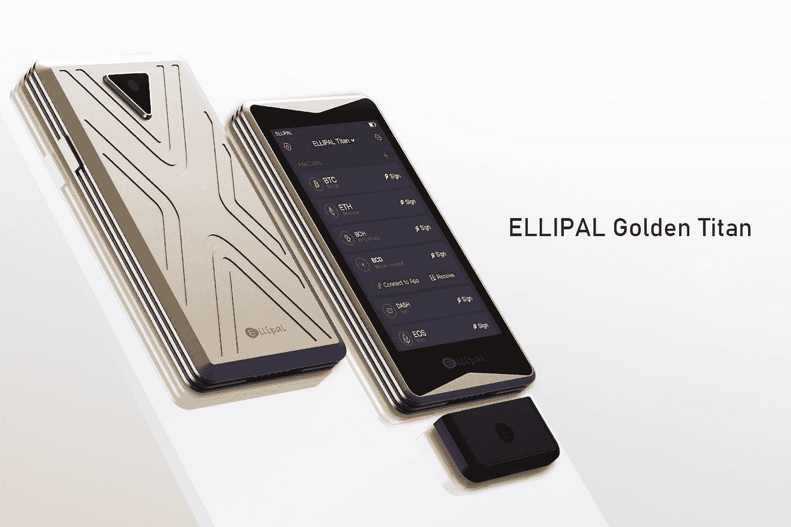
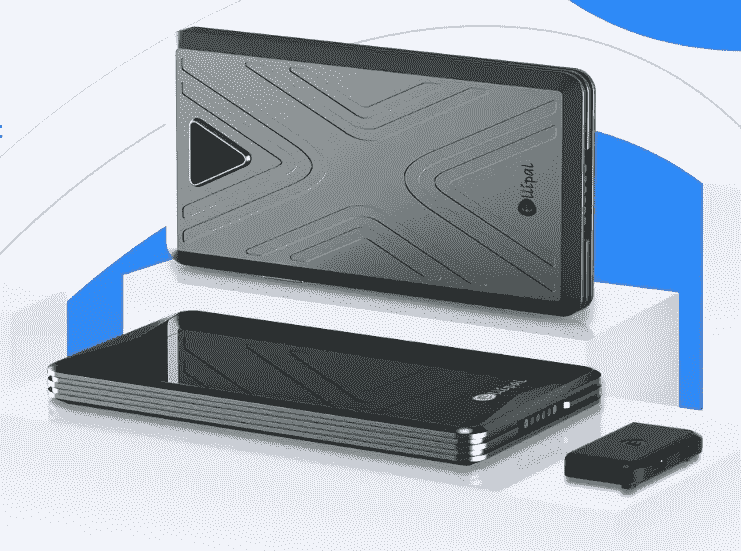
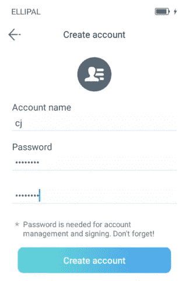
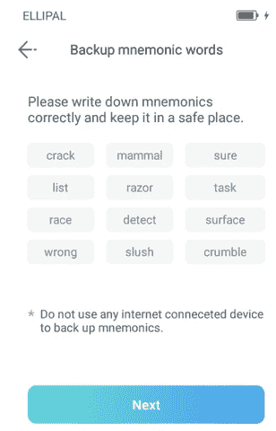
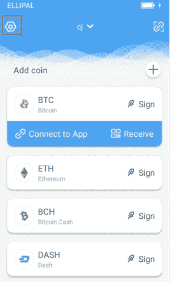
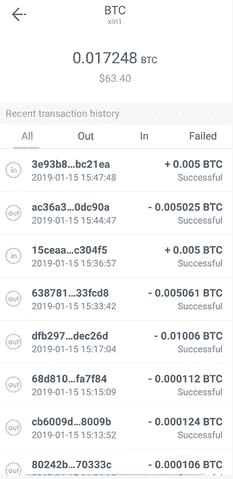
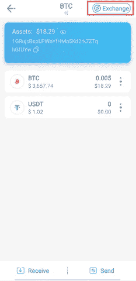
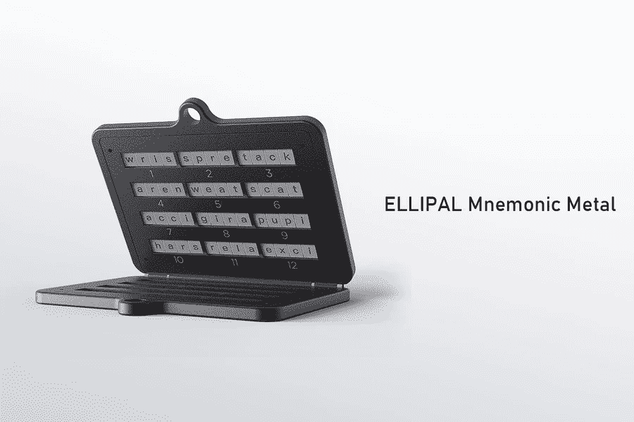
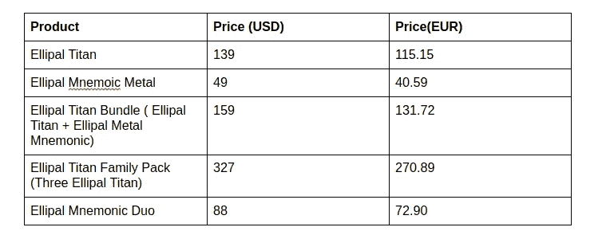
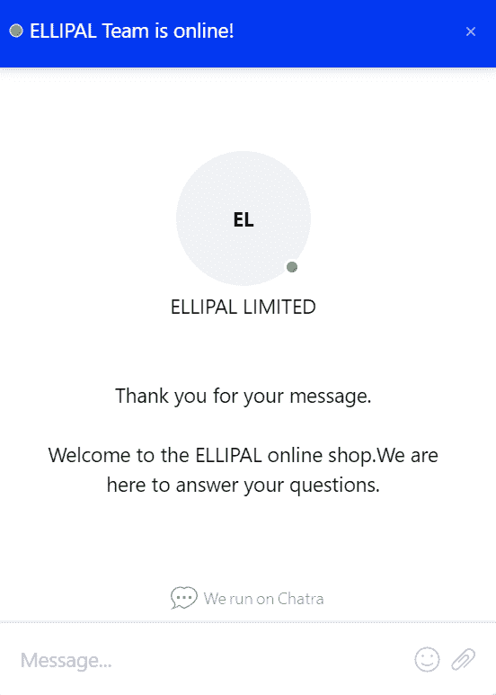

# Ellipal Titan Review 2022 |最佳冷硬件钱包

> 原文：<https://medium.com/coinmonks/ellipal-titan-review-85e9071dd029?source=collection_archive---------0----------------------->

Ellipal Titan Review

[硬件钱包](/coinmonks/the-best-cryptocurrency-hardware-wallets-of-2020-e28b1c124069)是存储加密货币的物理设备。它们是保存私钥的离线设备。此外，他们无法连接到互联网，因此可以免受一系列攻击。

[Ellipal](https://blog.coincodecap.com/go/ellipal) 是一家总部位于香港的公司，成立于 2018 年。该公司提供了一款[加密货币硬件钱包](/coinmonks/the-best-cryptocurrency-hardware-wallets-of-2020-e28b1c124069)，提供了一种安全便捷的冷钱包解决方案。此外，钱包允许兑换硬币，发送交易，检查市场利率，并查看最新的加密新闻。

# **Ellipal 泰坦概述**

Ellipal Titan 是一个气隙冷钱包，因此可以防止远程和在线攻击。如果发现任何违规行为，钱包中的私人数据将被自动删除。

此外， [Ellipal](https://www.ellipal.com/) Titan 采用 IP65 防尘和防水硬件制成，因此完全可以抵御物理攻击。其密封牢固的金属外壳使得攻击钱包时不可能不留下永久性损伤。

所有的交易都使用离线二维码签名，这是安全和可验证的。您可以从其他钱包导入您的私钥和帐户。 [Ellipal](https://blog.coincodecap.com/go/ellipal) 使用开放格式的二维码和开源的 JS 库。如需更多信息，您可以查看他们的 [Github](https://github.com/ELLIPAL?tab=repositories) 。

# **身体特征**

**显示屏:** Ellipal 拥有 3.97 英寸彩色触摸屏、高灵敏度和出色的图形。

**按钮**:这个钱包有一个侧边按钮，用来给设备加电。

**材质:**采用铝合金打造，防尘防水。

**尺寸:**这个钱包的尺寸是 118 x 66 x 9.7 mm。

**摄像头:**自带一个 5mpx 的内置摄像头。

**电池:** Ellipal 有一块 1400 毫安的电池，待机时间为 259 小时。你可以用 USB 线给电池充电。

# **连通性**

钱包完全是空的。应用程序和 [Ellipal 钱包](https://blog.coincodecap.com/go/ellipal)之间的所有通信都通过二维码进行认证。这两种设备，即装有该应用程序的手机和 Ellipal 钱包，都可以生成和扫描二维码。要连接到应用程序，您必须点击“连接应用程序”。

# 如何设置一个 Ellipal 钱包？

设置钱包需要以下步骤-

*   将电池插入设备，然后按侧面按钮启动设备。
*   选择您喜欢的语言。
*   您可以创建新帐户或导入现有帐户。如果您正在创建一个新帐户，您必须输入名称和密码。密码应该是 12 个字符。您可以使用私钥、密钥库或秘密密钥来导入帐户。

Ellipal Titan Review: Account creation

*   它将在屏幕上显示一个 12 个单词的助记符或种子短语。你可以使用 Ellipal 金属助记符来安全地存储它。

Ellipal Titan Review: Recovery seed phrase

你必须输入助记符来验证它。如果您输入了错误的种子短语，您可以使用“清空”按钮重新输入。

# **Ellipal App**

该应用程序充当去中心化的金融热门钱包。你可以把它和一个 [Ellipal](https://blog.coincodecap.com/go/ellipal) 钱包搭配使用，以获得最大的安全性。此外，您可以在一个钱包中存储和管理多个硬币。它支持根据大小在一个 Ellipal 钱包中开设五到十个账户。该应用程序在 Android 和 iOS 平台上都可以使用。

您可以在应用程序中查看加密新闻和价格图表。该应用程序允许您查看您的余额和实时利率。要连接到应用程序，你必须扫描二维码。

Cryptocurrency exchange using Ellipal

# **如何使用 Ellipal 完成交易？**

要完成交易，你必须遵循以下简单的四个步骤-

1.  在 Ellipal 应用程序上创建一个交易。你必须选择账户，点击签名按钮，然后输入你的密码。
2.  使用 Ellipal，扫描二维码。
3.  它验证交易并生成第二个 QR 码。
4.  应用程序扫描来自 [Ellipal](https://www.ellipal.com/) 的二维码，您的交易就完成了。

您还可以在应用程序中查看您的交易历史。

Ellipal Titan Review: Transaction History

## **Ellipal 支持的硬币**

[Ellipal](https://www.ellipal.com/) 支持超过 35 个区块链和 7000+代币。您可以查看[详细列表](https://www.ellipal.com/pages/coin-list)。

> 同时阅读:[莱杰 vs 特雷索](/coinmonks/ledger-vs-trezor-best-hardware-wallet-to-secure-cryptocurrency-22c7a3fd391e)

# **附加功能**

## **1。与埃利帕尔打赌**

把资金锁在钱包里，可以获得被动收益。锁定的硬币有助于网络的运作，作为回报，你将获得利息。你赚取的利息取决于你选择的代表你的硬币赌注。

它还提供冷赌注，你可以在那里赚取利息，你的硬币安全地储存在 [Ellipal 冷钱包](https://blog.coincodecap.com/go/ellipal)中。他们目前正在提供两种加密货币的赌注[宇宙(原子)](https://cosmos.network/)和 [Tezos (XZT)](https://tezos.com/) 。

## **2。赚取利息**

这个应用程序可以让你赚取利息。目前，有两种选择

*   投资 15 天年收益 7%。
*   90 天投资 10%年收益。

> 另请阅读:如何[赚取加密货币](/coinmonks/top-5-crypto-lending-platforms-in-2020-that-you-need-to-know-a1b675cec3fa?source=post_page-----7577032faa6e--------------------------------)的利息？

## **3。加密货币交易所**

也可以用硬币兑换任何支持的加密货币。 [Ellipal](https://blog.coincodecap.com/go/ellipal) 与 [SWFT](https://www.swft.pro/) 和[changely](https://changelly.com/)合作，为您提供最优惠的价格和安全的转换。你必须遵循三个简单的步骤-

*   选择要兑换的加密货币，然后单击提交。
*   确认交易地址。
*   使用 QR 码验证交易。

Ellipal Titan review: Cryptocurrency Exchange

## **4。购买密码**

[Ellipal](https://blog.coincodecap.com/go/ellipal) 已经与 [Simplex](https://www.simplex.com/) 和 [MoonPay](https://www.moonpay.io/) 合作，允许你直接通过应用程序购买密码。购买加密货币，需要验证身份。您可以通过 Visa、Mastercards 或 Apple pay 支付。

# **埃利帕尔泰坦评论:安全**

Ellipal 与互联网完全隔离。它带有防篡改封条，因此您可以知道在交付之前是否有人篡改过该设备。如果封条破损，您应该联系支持团队。

数据通过 microSD 卡插槽传输。你可以核实所有的交易。为了提高安全性，您可以设置多个密码和通行短语。

# 椭圆形金属 M

你的[硬件钱包](/coinmonks/the-best-cryptocurrency-hardware-wallets-of-2020-e28b1c124069)可以被任何能够获得你钱包助记符的人访问。因此，安全存放至关重要。为了避免这种情况， [Ellipal](https://blog.coincodecap.com/go/ellipal) 提供了 Ellipal 金属助记符，允许您存储您的助记符。它防水、防火、防虫、防霉。这个钱包的尺寸是 86x60x8mm。

Ellipal Metal mnemonics

Ellipal 硬件钱包严格遵循 [**BIP39**](https://en.bitcoin.it/wiki/BIP_0039) 标准助记符，并允许存储 12 和 24 字助记符。你只需要存储每个单词的前四个字母。没有两个单词有相同的前四个字母。您可以从 BIP39 列表中了解该单词的剩余字符。你只需要滑动字母来存放你的钥匙。

> *亦读:* [*莱杰纳米 S vs X*](https://blog.coincodecap.com/ledger-nano-s-vs-x)

# **不可用国家**

Ellipal 不向这些国家运送产品——刚果民主共和国、巴西、黎巴嫩、巴拉圭、乌拉圭、乌克兰、阿根廷、朝鲜、沙特阿拉伯、中非共和国、厄立特里亚、伊拉克、利比亚、伊朗、苏丹、叙利亚、也门和索马里。

# **Ellipal 钱包价格**

建议您直接从制造商或官方经销商处购买硬件钱包。大约需要三到七天才能送到。

Ellipla wallet Price

动词 （verb 的缩写）可能会根据帐单地址征收增值税。

当您订购 [Ellipal 钱夹](https://blog.coincodecap.com/go/ellipal)时，您将收到以下包装和密封良好的产品。

*   Ellipal 硬件钱包
*   usb 电缆
*   保修卡
*   用户手册
*   两张贴纸
*   记下助记符或种子短语的注意事项。

当你购买金属记忆法时，你会收到以下物品。它有灰色、金色和粉色可供选择。

*   埃利帕尔金属记忆法
*   螺丝刀
*   四个额外的螺钉
*   七块金属字母板
*   用户手册

# **付款方式**

[Ellipal](https://www.ellipal.com/) 接受三种付款方式-

1.  信用卡——维萨、万事达。
2.  贝宝
3.  硬币——BTC、瑞士联邦理工学院、LTC、USDT、DGB、XMR、ETN

# **Ellipal 固件更新**

固件更新是任何硬件钱包不可或缺的一部分。它们还用于增加加密货币支持。更新的固件必须从制造商的网页上下载并复制到 SD 卡上。您必须将 SD 卡插入硬件钱包中才能更新硬件。点击查看升级[的详细程序。](https://www.ellipal.com/pages/ellipal-update)

> *也念:* [*莱杰纳诺 S vs 特雷佐 one vs 特雷佐 T vs 莱杰纳诺 X*](https://blog.coincodecap.com/ledger-nano-s-vs-trezor-one-ledger-nano-x-trezor-t)

# **Ellipal 客户服务**

你可以在 info@ellipal.com 给他们写信。此外，你可以在[推特](https://twitter.com/ellipalwallet)和[电报](https://t.me/ellipalglobal)上与他们联系。Ellipal 还经营着一个 Youtube 频道，在那里你可以找到很多关于钱包的视频。他们还提供实时聊天功能。

Ellipal Titan Review: Live Chat

# Ellipal 利弊

## **优点**

1.  该应用程序提供了用户友好的用户体验。
2.  空隙交易。
3.  保护硬件和软件。
4.  通过二维码安全地进行通信。
5.  支持多种加密货币。
6.  这是一个分散的钱包，不需要[了解你的客户(KYC)](https://en.wikipedia.org/wiki/Know_your_customer) 。

## **缺点**

1.  与市场领导者 Ledger 和 Trezor 相比，这是一款相对较新的硬件钱包。

# 结论

总之， [Ellipal](https://blog.coincodecap.com/go/ellipal) 在硬件和软件两方面都提供了优秀的加密货币存储解决方案。钱包是完全空气间隙，设计良好，并有一个用户友好的界面。为了增加安全性，你可以从 Ellipal 网站购买金属助记符。Ellipal 还允许你通过其应用程序下注硬币、赚取利息、兑换或购买加密货币。因此，Ellipal 是功能最丰富的硬件钱包之一。

# **常见问题解答**

**1。如何使用 Ellipal 钱包？**

您必须使用侧面的按钮来启动设备。您可以创建新帐户或导入现有帐户。它将显示一个 12 个单词的助记符，您需要安全地存储它。您必须再次输入恢复种子短语进行验证。

**2。如果我丢失了我的 Ellipal 钱包会怎么样？**

钱包有密码保护。如果任何人试图用错误的密码反复解锁设备，它将删除所有钱包数据。您可以使用恢复种子短语完全恢复您的帐户。

## 另外，阅读

*   [n 零审核](/coinmonks/ngrave-zero-review-c465cf8307fc)
*   [SecuX STONE 五金钱包评论](https://coincodecap.com/secux-stone-hardware-wallet-review)
*   [莱杰纳米 S vs 莱杰纳米 X](https://coincodecap.com/ledger-nano-s-vs-x)
*   最好的比特币[硬件钱包](/coinmonks/the-best-cryptocurrency-hardware-wallets-of-2020-e28b1c124069?source=friends_link&sk=324dd9ff8556ab578d71e7ad7658ad7c)
*   最好的[加密交易机器人](/coinmonks/crypto-trading-bot-c2ffce8acb2a)
*   [Deribit 审查](/coinmonks/deribit-review-options-fees-apis-and-testnet-2ca16c4bbdb2) |选项、费用、API 和 Testnet
*   [FTX 密码交易所评论](/coinmonks/ftx-crypto-exchange-review-53664ac1198f)
*   [Bybit 交换审查](/coinmonks/bybit-exchange-review-dbd570019b71)
*   [密码本交易平台](/coinmonks/top-10-crypto-copy-trading-platforms-for-beginners-d0c37c7d698c)
*   最好的[加密税务软件](/coinmonks/best-crypto-tax-tool-for-my-money-72d4b430816b)
*   [最佳加密交易平台](/coinmonks/the-best-crypto-trading-platforms-in-2020-the-definitive-guide-updated-c72f8b874555)
*   最佳[加密贷款平台](/coinmonks/top-5-crypto-lending-platforms-in-2020-that-you-need-to-know-a1b675cec3fa)
*   [莱杰纳米 S vs 特雷佐 one vs 特雷佐 T vs 莱杰纳米 X](https://coincodecap.com/ledger-nano-s-vs-trezor-one-vs-trezor-t-vs-ledger-nano-xledger-nano-s-vs-trezor-one-vs-trezor-t-vs-ledger-nano-x)
*   [block fi vs Celsius](/coinmonks/blockfi-vs-celsius-vs-hodlnaut-8a1cc8c26630)vs Hodlnaut
*   Bitsgap 评论——一个轻松赚钱的加密交易机器人
*   为专业人士设计的加密交易机器人
*   [PrimeXBT 审查](/coinmonks/primexbt-review-88e0815be858) |杠杆交易、费用和交易
*   [享受九折优惠](/coinmonks/haasonline-review-d8d1a3400419)
*   Bitmex 的[保证金交易指南](/coinmonks/the-idiots-guide-to-margin-trading-on-bitmex-dbbd7742c6fc?source=friends_link&sk=7bfa99d2a181142510c8442c8ddb0786)
*   [eToro 评论](/coinmonks/etoro-review-78807ddeb33c) |交易股票、密码、交易所交易基金、差价合约和商品
*   [BlockFi 评论](/coinmonks/blockfi-review-53096053c097) |从您的密码中赚取高达 8.6%的利息
*   [面向开发人员的最佳加密 API](/coinmonks/best-crypto-apis-for-developers-5efe3a597a9f)
*   [最佳区块链分析工具](https://bitquery.io/blog/best-blockchain-analysis-tools-and-software)
*   [加密套利](/coinmonks/crypto-arbitrage-guide-how-to-make-money-as-a-beginner-62bfe5c868f6)指南:新手如何赚钱
*   最佳[加密制图工具](/coinmonks/what-are-the-best-charting-platforms-for-cryptocurrency-trading-85aade584d80)
*   了解比特币的[最佳书籍有哪些？](/coinmonks/what-are-the-best-books-to-learn-bitcoin-409aeb9aff4b)