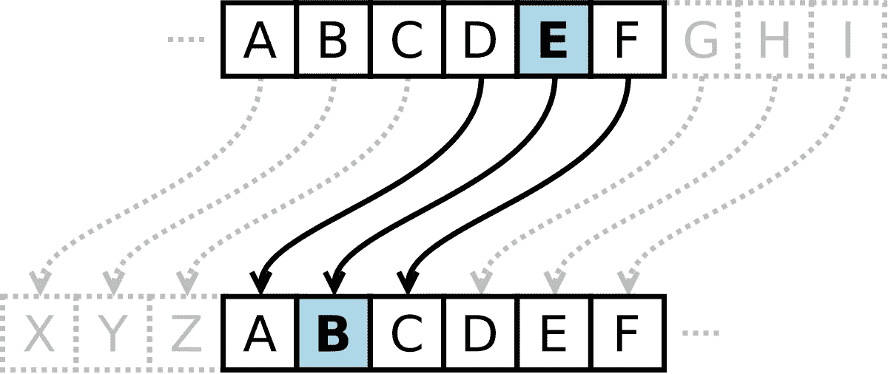
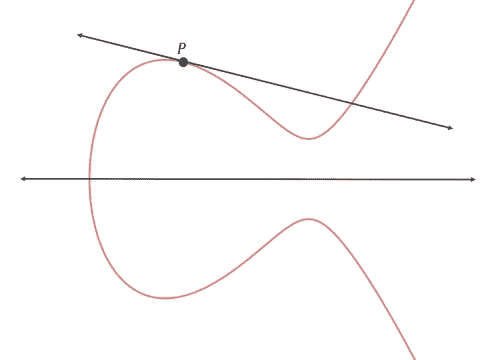
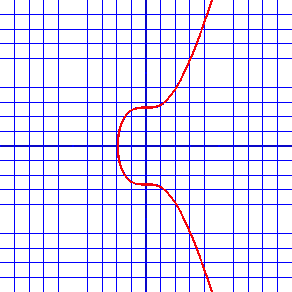
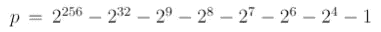
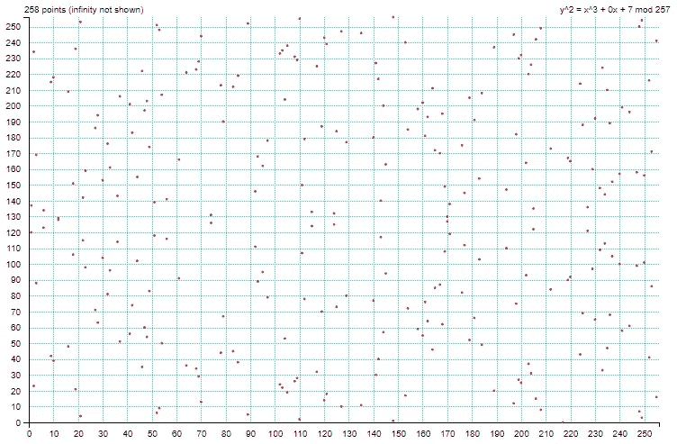
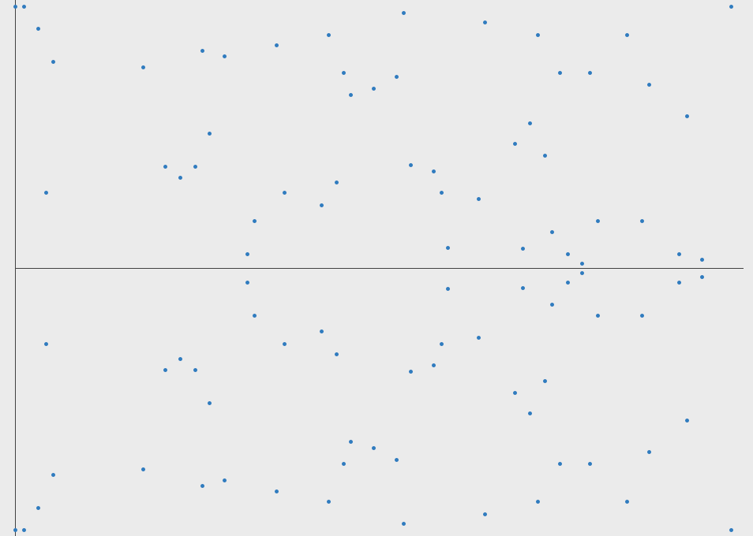
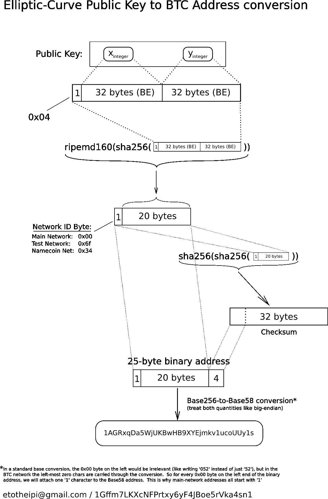

# 椭圆曲线密码术

> 原文：<https://medium.com/coinmonks/elliptic-curve-cryptography-6de8fc748b8b?source=collection_archive---------5----------------------->

## 保持比特币安全的曲线

这不是一个简单的主题，但它有广泛的应用，因此值得努力理解。与第一代公钥系统(如质因数分解加密)相比，它能够减少密钥生成时间和密钥重量，并将安全性提高 10 倍，并且是当今加密货币生态系统中大多数公钥加密的基础。所以让我们把它分解开来，这样我们才能相信它。

## 嘿爱丽丝，把钥匙递给我。

首先，让我们倒回去。假设你想给某人发送一条消息，除了那个人之外，你不希望任何人看到这条消息。所以你用某种方式“加密”它，除非有人知道如何“解密”它，否则他无法阅读它。这可以通过以已知的方式简单地混淆或移动字母来完成。已知的最古老的加密方法之一是塞萨尔密码，就是这么做的。通过移动字母的位置 *X* ，你的信息中的单词变得不可读[图 1]。一旦传送了 X，这一堆杂乱的字母就可以被解密。

Fig. 1 A Cesar Cipher where the shift is 3\. “E” will then take the place of “B”, “F” for “C” and so on.

这种方法有两个重要的问题。首先，你必须以某种方式告诉你想与之交流的人，破解密码的秘密钥匙，并相信他们会保护它的安全。第二，在这个计算机时代，这不是很难打破的。

我们可以想出另一种加密数据的方案，比如使用书中的特定一页作为密码，但在我能想到的每一种情况下，我们都需要某种安全的方式来与另一个人交流密钥。如果我们离得很远，这将如何实现？通过数字格式交流还是信任第三方来分享秘密？我们必须找到另一种方法。

## 公钥密码学

随之而来的是公钥(或非对称)加密技术。由 Whit Diffie 和 Martin Hellman 在 20 世纪 70 年代末首创的公钥加密使用成对密钥；一个公的，可以让所有人都知道，一个私的，保密。这个系统允许任何人使用接收者的公钥加密消息，然后该消息只能用接收者的私钥解密。

> 公钥是能锁门但不能开锁的钥匙。

这一革命性的步骤解决了为解密消息而必须共享秘密的问题，并且还实现了由公钥所有者加密的消息的认证。

这些密钥对依赖于“陷门函数”,这种函数在一个方向上很容易计算，但要逆转却困难得多。根据数学，这些密钥对的强度依赖于从公钥导出私钥所需的计算量。

## 南非共和国(Republic of South Africa)

在第一个广泛使用的公钥密码系统 RSA(Rivest–sha mir–ad leman)中，你依赖于这样一个事实:将大数相乘很容易，而分解它们很难。

要创建一个 RSA 密钥对(不涉及太多细节)，你选择两个大素数，将它们相乘得到一个最大值( *max 或 MOD，意思是时钟重置为 0* 的数字)，选择其中一个素数作为公钥， *pub，*，用另一个素数导出你的私钥， *priv。*有了这三个数字，某人可以将他们的消息乘以 *pub* ，将超过 *max、*的任何数字换行，并且相应的混乱数字可以乘以 *priv* 以产生原始数据。我知道这听起来很简单，但这是真的(如果你想简单地看一看这篇文章底部的链接)。这有点像我把时针藏在钟上，然后把分针绕着它转几圈，然后给你看。它可能显示 45 分钟，但你不知道它在到达那里之前绕了多少圈。只有我知道。

利用这种数学方法，你可以找到两个数字，这样当你把一个数字乘以它自己的次数，得到一个看起来随机的数字，你可以再乘以它自己的秘密次数，得到原来的数字。

唯一的问题是，因式分解是一个非常普遍的问题，一点一点地做起来并不困难。随着计算速度的提高和因子分解算法效率的提高，RSA 密钥对生成过程中的质数必须不断增长，才能超越技术并保持安全性。因此，该系统变得不可持续，并且不适用于移动或低功率情况。必须找到另一个更强大的陷门函数。

## 椭圆曲线

这个真实世界的数学用例激发了对更多边缘数学的研究，试图找到进一步革新密码学的东西。

1985 年，基于椭圆曲线的密码学由 Neal Koblitz 和 Victor Miller 独立提出。

椭圆曲线有一些奇特的特性，这使它们很有用。它们被定义为一条完全光滑的曲线(*非奇异*)，并且这条曲线上两点之间的一条线将始终与第三点相交(*投影*)【图 2】。这使你可以很容易地(通过计算)快速跳过这条曲线，并按程序得出一个看似与起点无关的终点，并且很难逆转引导你到达那里的路径。

Fig. 2 Elliptical curve with points defined as y² = x³ + ax + b

在加密使用中，寻找两个相关的唯一数字(二维曲线中的点)和最大上限的相同思想也适用。

我们如何得到两个相关的数字，但是没有人知道它们之间的关系？我们利用曲线的投影性质，画一条与起点 *P、*相切的线，找出它在第二点 *P、* ʹ.与曲线相交的地方然后翻转轴，从新的点(*2p*)通过起点画一条线，找到新的交点 *P* ʹʹ.然后翻转轴，从新的点(3*p*)通过起点画一条线，找到新的交点 *P* ʹʹʹ等。(这个数学运算叫做点乘)[图 3]。

Fig. 3 Point multiplication starting with the tangent to point P and ending with point 3*•P*

我们这样做 *n* 次，最后得到曲线上的一个点， *Q* ，它与起点没有明显的关系，可以定义为*Q = NP*其中 *n* 是点乘的迭代次数。从数学上来说，这等于 Q = P + P + P … n 次。

所以如果你知道我们用的曲线，起点 *P* 和终点 *Q，*你能确定 *n 吗？事实证明没有已知的算法可以做到这一点。为了到达 *Q* ，没有捷径可以确定你“点开 *P* 多少次。你基本上只需要不断地将 *P* 加到自身，并计算你要做多少次才能到达 *Q* (或者反过来)。这对于小的 *n* 来说相当容易，但是当 *n* 变大时会发生什么呢？我的意思是真的很大…*

## 应用中的椭圆曲线

比特币、以太坊等很多使用的椭圆曲线是 secp256k1 曲线，方程为 y = x +7，看起来是这样的:

Fig. 4 Elliptic curve secp256k1 over real numbers. Note that the real implementation of the curve is over a defined prime field of positive integers and therefore looks nothing like the above.

并且具有由所有密钥生成使用的定义的起点， *P(x，y)* ，具有 *x* 和 *y* 坐标:

*x 坐标:5506626302227734366957871889516853432625060345377594175500187360389116729240*

*y 坐标:
32670510020758816978083085130507043184471273380659243275938904335757337482424*

正如您所看到的，起点这么大，终点很可能大于允许的 512 位密钥大小。因此，我们必须设置一个最大值，我们环绕这个最大值来建立一个适合我们的密钥大小的允许点的域。

对于该特定曲线，最大(mod)值由以下素数定义(以产生一个素数域):

运筹学

*1157920892373161954235709850086879078532698466564056403945758400790834671663*

运筹学

***115 quattuorvigintillion……***

运筹学

***.已知宇宙中所有原子的 12%。***

# 又名真正的大。

由于负值或非整数值很难在计算中使用，我们只想使用曲线中负值反转的整数点，并使用定义的最大值将值包装回 0，以防止值变得太大。我们最终得到的东西看起来不太像曲线，而更像是随机分布的点，尽管可以看到一些对称性[图 5]。

Fig. 5 secp256k1 over the field ²⁸+1

现在有了这个新定义的“曲线”，我们从新的起点做点乘，我们像分针绕着时钟一样绕着我们的模，在 *n* 次后，我们在点 *Q* 【或*ab = C*结束，如图 6 所示】。

Fig. 6 Point multiplication demonstrated in a finite field

由于可用点数与字段大小成线性关系(*点数=****fᵖ****+1)*，并且由于没有简单的方法找到给定的 *P* 和 *Q* 的 *n* ，所以您只需遍历整个列表，尝试 1157920892373161954235709855 因此，使 *Q* 成为公钥和 *n* 成为私钥是有意义的，每个人都使用相同的曲线和起始点 *P* 。

> 所以最后，你的私钥只是一个大整数，你的公钥是曲线上的一个点，对应于你的私钥点乘以起点。

## 有多“安全”才算安全？

让我们试着想象一下这有多安全。 ***如果 n 的选择确实是随机的，*** 你要花多长时间才能找到一个特定的 *n* ，或者只是一般情况下，与另一个正在使用的私钥的任何“冲突”？假设你可以每秒尝试 2500 亿种可能性，这是目前比特币网络哈希速率的 5 倍，仍然需要 1⁰ ⁰乘以宇宙的年龄才能找到匹配。基本上，其他任何事情都比找到匹配更有可能发生。

已经有[一些研究](https://eprint.iacr.org/2013/635.pdf)建立了测量这些加密类型安全性的方法。在这些尺度中，上面定义的曲线和字段中的 ECC 被认为是“全局安全的”，这意味着一台计算机或一组计算机为了找到特定的 *n* 而必须使用的能量足以煮沸 14 亿千米的水，这几乎是地球表面上所有的水。那就是*大概*足够安全了。

## 这如何适用于我们今天看到的地址？

显然，我们习惯于看到地址的方式，是由数字和字母组成的大字符串，不同于曲线上的数字和点。这是因为它们以这样一种方式被散列，以减少字符串的大小，从而实现轻量级的易用性。在比特币中， *Q* 的坐标被组合起来，并通过一系列哈希算法，这些算法旨在压缩密钥并添加有效性校验和以进行地址检查[图 7]。

Fig. 7 Bitcoin address creation hash flow

因此，希望您现在能更好地理解椭圆曲线加密背后的思想，并能相信您的加密货币和私人通信的安全性是基于大规模数字的统计数据。

如果您希望通过一些加密示例更详细地了解这个解释，请查看下面的链接，这些链接是本文的灵感来源。

 [## 一本(相对容易理解的)关于椭圆曲线加密的入门书

### 椭圆曲线加密(ECC)是广泛使用的最强大但最不为人所知的加密类型之一…

blog.cloudflare.com](https://blog.cloudflare.com/a-relatively-easy-to-understand-primer-on-elliptic-curve-cryptography/)  [## 椭圆曲线加密背后的数学原理是什么？

### 介绍

hackernoon.com](https://hackernoon.com/what-is-the-math-behind-elliptic-curve-cryptography-f61b25253da3) 

【https://eprint.iacr.org/2013/635.pdf 号

> 加入 Coinmonks [电报频道](https://t.me/coincodecap)和 [Youtube 频道](https://www.youtube.com/c/coinmonks/videos)获取每日[加密新闻](http://coincodecap.com/)

## 另外，阅读

*   [复制交易](/coinmonks/top-10-crypto-copy-trading-platforms-for-beginners-d0c37c7d698c) | [加密税务软件](/coinmonks/crypto-tax-software-ed4b4810e338)
*   [网格交易](https://coincodecap.com/grid-trading) | [加密硬件钱包](/coinmonks/the-best-cryptocurrency-hardware-wallets-of-2020-e28b1c124069)
*   [密码电报信号](http://Top 4 Telegram Channels for Crypto Traders) | [密码交易机器人](/coinmonks/crypto-trading-bot-c2ffce8acb2a)
*   [最佳加密交易所](/coinmonks/crypto-exchange-dd2f9d6f3769) | [印度最佳加密交易所](/coinmonks/bitcoin-exchange-in-india-7f1fe79715c9)
*   [币安 vs 比特邮票](https://coincodecap.com/binance-vs-bitstamp) | [比特熊猫 vs 比特币基地 vs Coinsbit](https://coincodecap.com/bitpanda-coinbase-coinsbit)
*   [如何购买 Ripple (XRP)](https://coincodecap.com/buy-ripple-india) | [非洲最好的加密交易所](https://coincodecap.com/crypto-exchange-africa)
*   [非洲最佳密码交易所](https://coincodecap.com/crypto-exchange-africa) | [胡交易所评论](https://coincodecap.com/hoo-exchange-review)
*   [eToro vs robin hood](https://coincodecap.com/etoro-robinhood)|[MoonXBT vs Bybit vs Bityard](https://coincodecap.com/bybit-bityard-moonxbt)
*   [面向开发人员的最佳加密 API](/coinmonks/best-crypto-apis-for-developers-5efe3a597a9f)
*   最佳[密码借贷平台](/coinmonks/top-5-crypto-lending-platforms-in-2020-that-you-need-to-know-a1b675cec3fa)
*   [免费加密信号](/coinmonks/free-crypto-signals-48b25e61a8da) | [加密交易机器人](/coinmonks/crypto-trading-bot-c2ffce8acb2a)
*   杠杆代币的终极指南