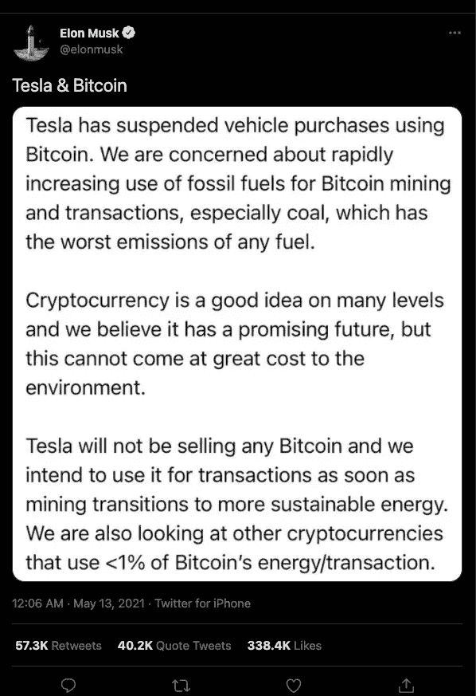
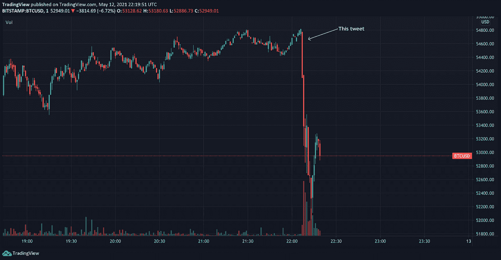
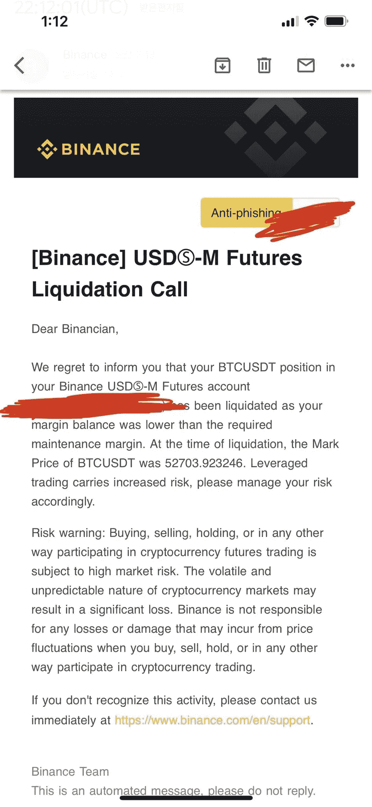

# 埃隆·马斯克和比特币——游戏

> 原文：<https://medium.com/coinmonks/elon-musk-bitcoin-the-game-61d28813c9db?source=collection_archive---------4----------------------->

在一条推文中，Elon Musk 在几分钟内使价格下降了 10%以上，相当于几十亿美元。根据他的说法，比特币是不可持续的，即使密码是一项伟大的发明。比特币会消耗太多的能量，他会寻找一种消耗能量不到比特币 1%的硬币。

他说他不想卖他的 BTC，但故事并没有说他不会买它们:有一天他会让警察在他家…

所以，他应该已经找到了这个密码，它就是总督！即使他没有直接说出来，我们也知道他在想什么，总的来说，我认为在这条推文中提到它是一种犯罪！他不清楚关于这个密码的消息。因为在现实中它没有什么超级性感，没有最大供应，没有 ASIC 保护。它有大量其他稳定的加密认证为 Altcoin，也减少能源消耗。基本上有很多东西比 DOGE 好

我认为提出一些问题是很重要的，即使主要演员没有机会回答这些问题。

# 你为什么不在上周 1 亿美元清算你的 BTC 头寸之前或期间宣布这一点？

这是法官和当事人的问题。同时，他可以自由决定做什么。在这一宣布之后，清算头寸是没有意义的。我们不能说存在法律意义上的犯罪，但我们可以看到一个人可以影响市场。

我不认为埃隆·马斯克真的相信他的推文的依据。他非常清楚他家的污染情况。比特币对环境来说不是坏事([我在这里说](/coinmonks/energybitcoin-the-story-of-a-mea-culpa-85fff8255d2f))，但是制造特斯拉汽车或者 SpaceX 火箭是一个深层的环境问题。

# 我以为是为了证明比特币的流动性？

所以是的，它是流动的，而且还不错。不确定这是否和例如 DOGE 一样。有一个小方面，你真的会觉得他把人们当傻瓜，因为没有迹象表明他没有回购比特币，如果他能让比特币下跌，那么他就能以更低的价格回购比特币，并再次获利。只不过特斯拉是卖车的，不是贸易公司。在我看来，用交易来完善其资产负债表似乎被高估了。他在对他的特斯拉股东撒谎吗？他是在玩弄某些人批判性思维的缺失吗？

现在发生的事情让我说了下面的话。比特币目前被低估。它应该大写超过 10 倍或 20 倍(或更多)，只是为了避免我们在这里看到的效果(以及许多其他原因)。更有价值的是，他的推文几乎不会被注意到。事实上，比特币的价值需要上升，以防止仅仅一个人影响价格，我们都知道超级富豪的财富水平，你把所有的钱加起来，乘以 20。

# 大输家

我们知道贪婪是一个令人讨厌的缺点，顺便说一句，这是一种罪恶，当然这条推文对所有那些受 gain 诱惑开始使用超越他们的金融工具的硬币持有者产生了灾难性的影响。我说的是杠杆或收益率，它包括赚得更多(理论上)，但大多数情况下亏损更多。

昨晚有些人损失了很多钱。我在这里链接到这条推文，因为我不在任何提供杠杆和/或授权通过衍生品购买资产的平台上交易(NBB、CHSB……)。

杠杆必然与昨晚埃隆马斯克(Elon Musk)的推文引发的“亏损限额”相关。因此，头寸被释放，但投资组合没有返回(你被清算)，这是另一方面看到其利润在顶部退出时倍增的代价。这完全类似于一个随机游戏，没有策略，没有精神，迟早要吃大亏。

# 结论

难以挖掘的密码是我们感兴趣的，我们不能有太多的密码(最多 10 到 15 个)。埃隆·马斯克想让我们把木材换成黄金，反之亦然……他应该发送额外的大气层采矿卫星，并推动传统采矿(黄金)白白耗费太多能源并腐蚀我们的土地的想法。比特币至少是可浮动的，不需要挖洞去相信什么。好的一面是，它解除了杠杆头寸的锁定，人们可能会认为这是一派胡言…扯淡吧…