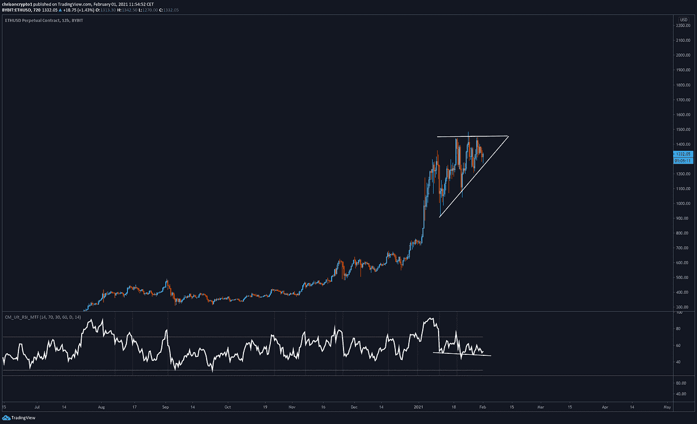

# 埃隆·马斯克在机构股票欺诈中拥抱 BTC

> 原文：<https://medium.com/coinmonks/elon-musk-embraces-btc-amid-institutional-stock-fraud-f3a293b51ba4?source=collection_archive---------7----------------------->

埃隆·马斯克通过全力支持比特币创造了历史。在与 Robinhood 首席执行官弗拉德·特涅夫(Vlad Tenev)的一次流畅讨论中，他说:“我来晚了，但我是比特币的支持者”。这是在马斯克将他的 Twitter 个人资料描述改为“比特币”几天后发生的。

有趣的是，[Elon](https://chrisoncrypto.com/blog/f/elon-musk-endorses-bitcoin-amid-open-gme-stock-fraud)公开支持比特币的时候，传统金融市场正被公开发现欺诈自己的用户。

让我们开始吃吧。

# 传统金融被打破:去中心化金融准备就绪

上周，我们报道了[的连锁数据](https://mailchi.mp/4789c500d2a1/the-great-bitcoin-long-is-not-over)，该数据强调比特币的价格还有上涨空间。

今天，这位在世的首富告诉全世界，他认为比特币即将被大规模采用。在明目张胆的股市欺诈被披露之际，马斯克言论的影响为全球市场动态的前所未有的转变奠定了基础，这将重塑金融的基础，而比特币将是其中的核心。

对于那些不熟悉最新事件的人来说， [GameStop saga](https://chrisoncrypto.com/blog/f/a-broken-system-gsm-saga-reveals-corporate-contempt-for-retail) 是一个“大卫和歌利亚”的故事，在这个故事中，reddit r/wallstreetbets 上的一个在线交易者社区搞垮了对冲基金——从机构空头订单中攫取了数十亿美元。卖空指令是一种允许投资者从公司倒闭中获利的指令。

在散户投资者意识到对冲基金做空了$GME 全部公开发行股票的 150%后(即比现有股票更多)，一个由 250 万(现在是 700 万)redditors 组成的小组计算出，通过买入股票而非卖出，做空 GME 的对冲基金将损失数十亿美元。事实就是这样:仅在周五，损失就高达 126 亿美元。

然而，一旦散户投资者开始获胜，中央集权企业的触角就能够完全停止游戏，冻结关键交易所和交易基础设施的交易，以便对冲基金能够在不亏损的情况下重新定位。

无论如何，这都是系统性的机构欺诈，它表明这些事件只是即将到来的事情——去中心化的货币互联网——的前奏。

事实上，我们这个时代最大的虚构之一就是自由市场的故事。这个概念体现了“美国梦”，即任何选择追随自己抱负的人都可以这样做(冒着巨大的个人风险)。这包括因为在金融游戏中拥有股份而获得回报的能力。

对散户投资者来说，不幸的是，现实是，股市不是自由的，它已经被操纵了几十年——无论是高频交易、合成衍生品还是无限印钞，股市都奖励了一小撮玩这个系统的内部人士，他们遵循的规则与其他人不同。

重要的是要认识到问题不在于游戏本身——如果操作正确，自由市场是恰当的价值转移的最有效方式。问题在于，规则只有在机构投资者获胜的情况下才适用，否则它们可以被打破、暂停和修改，而对那些有高层朋友的人来说，后果微乎其微。

这使得一些 redditors 在知道市场被操纵的情况下，不在乎损失金钱，只要对冲基金损失数十亿美元。这是对 2008 年金融危机以及许多人因此不得不忍受的痛苦负有责任者的惩罚。

这篇 reddit 帖子很好地描述了驱使数百万人联合起来反对不正当金融集团的动机。

虽然传统的金融媒体试图将叙述引向一个方向，但事情已经超出了他们的控制，这个系统已经暴露了它的本来面目。

然而，旅程并没有就此结束——因为有一个不受华尔街或银行家控制的平行系统，而且就在我们说话的时候，它还在增长。

请记住，这是一个没有什么可失去的人站出来反对那些将失去一切的人并取得胜利的故事(直到系统反击)。

虽然一些对冲基金可能会活着讲述这个故事，但大众现在知道，他们可以玩这个游戏，并产生真正的影响。现在剩下的就是退出可能在一夜之间改变规则的不公平市场，进入自由密码市场。

比特币开启了这场革命，它并不止于此。以太坊是金融市场的彻底重建，其结果是分散化金融。在这个市场中，是个人在控制，而不是经纪人、中介或一些有政治影响力的对冲基金。

金融的未来就在我们面前。

***获得本新闻稿-*** [***订阅邮件列表***](http://www.chrisoncrypto.com) ***！***

# 技术上来说

## 以太坊延续到 2000 美金？

几个月来，我们一直在讨论摆在投资者面前的以太坊机会。事实上，这好得令人难以置信，而且大多数人似乎还没有意识到这一点。

在一月份，以太坊和比特币在历史最高区域形成了一个上升的三角形结构——1440 美元是一个巨大的生死关口。

随着每一个连续的较高低点，相对强弱指数(RSI)——表明价格行动的势头——有小幅下降的趋势。以太币价格行为和相对强弱指数之间的对比在 12 小时图上更加明显，这给出了每日时间框架行为的更接近的解析。

一个月来，以太坊一直处于看涨结构，在高时间框架内形成看涨背离，因为它拥抱了历史高点。

碰巧的是，GameStopGate 放大了对新金融系统的需求——以太坊提供了这种系统。

上周末，我在推特上发了一条关于比特币和以太坊在交易所的供应减少的消息，也就是说投资者正在将他们的资产从交易所转移到冷库。在以太坊的情况下，冷存储也可以用于分散式金融协议。

这就形成了一场完美的风暴，技术图表、历史上重要的连锁数据和全面的叙述都暗示着同样的事情。

如果以太坊收盘日线蜡烛在 1440 美元以上，那么接下来就是 2000 美元。另一方面，如果损失了 1，200 美元，那么级联效应可能会使密码回到 1，000 美元。

实际上，这些举措对衍生品交易员的重要性超过了以太坊持有者，以太坊今年可能轻松达到 5000 美元(总市值超过 5700 亿美元)。

在这种情况下，比特币的市值将远远超过 1 万亿美元(目前为 6300 亿美元)。

如果你在加密领域，这些估计是给定的。价格的上限是未知的。

公牛领路。

下次再见。

**在你的社交网站上分享这些内容。非常感谢你的支持。
加入** [电报](https://t.me/chrisoncryptochannel) **频道进行实时交易更新！
关注我的** [多嘴多舌](https://gab.com/chrisoncrypto) **和下面的社交门户了解更多信息。
引荐、商机、反馈也很棒。**

# 阅读更多:埃隆·马斯克在公开的 GME 股票欺诈中支持比特币

[https://chrisoncrypto.com/blog/f/elon-musk-endorses-bitcoin-amid-open-gme-stock-fraud](https://chrisoncrypto.com/blog/f/elon-musk-endorses-bitcoin-amid-open-gme-stock-fraud)

[http://www.chrisoncrypto.com/](http://www.chrisoncrypto.com/)

你经常阅读吗？给我小费！
发送 **BTC** 到这个地址:
**3 eydseypjhn 68 axkncuqbb 7 ebqcxrejamr**

最诚挚的问候，
**克里斯·阿塔尔德**
克里斯的创始人关于密码
贡献者关于[www.cityam.com](https://www.cityam.com/)
直接连接:[电报](https://t.me/chrisoncrypto) *原文发表于*[*https://mailchi . MP*](https://mailchi.mp/2a2c757e22ed/elon-musk-embraces-btc-amid-institutional-financial-fraud?e=[UNIQID])*。*

> 加入 coin monks[Telegram group](https://t.me/joinchat/EPmjKpNYwRMsBI4p)学习加密交易和投资

## 另外，阅读

*   什么是[闪贷](https://blog.coincodecap.com/what-are-flash-loans-on-ethereum)？
*   最好的[密码交易机器人](/coinmonks/crypto-trading-bot-c2ffce8acb2a) | [网格交易](https://blog.coincodecap.com/grid-trading)
*   [3 商业评论](/coinmonks/3commas-review-an-excellent-crypto-trading-bot-2020-1313a58bec92) | [Pionex 评论](/coinmonks/pionex-review-exchange-with-crypto-trading-bot-1e459d0191ea) | [Coinrule 评论](https://blog.coincodecap.com/coinrule-review-a-perfect-trading-bot)
*   [AAX 交易所评论](/coinmonks/aax-exchange-review-2021-67c5ea09330c) | [德里比特评论](/coinmonks/deribit-review-options-fees-apis-and-testnet-2ca16c4bbdb2) | [FTX 密码交易所评论](/coinmonks/ftx-crypto-exchange-review-53664ac1198f)
*   [n 零审核](/coinmonks/ngrave-zero-review-c465cf8307fc)
*   [Bybit Exchange 审查](/coinmonks/bybit-exchange-review-dbd570019b71) | [Bityard 审查](https://blog.coincodecap.com/bityard-reivew)|[inter tax 审查](https://blog.coincodecap.com/interdax-review)
*   [3Commas vs Cryptohopper](/coinmonks/3commas-vs-pionex-vs-cryptohopper-best-crypto-bot-6a98d2baa203)
*   最好的比特币[硬件钱包](/coinmonks/the-best-cryptocurrency-hardware-wallets-of-2020-e28b1c124069?source=friends_link&sk=324dd9ff8556ab578d71e7ad7658ad7c) | [BitBox02 回顾](/coinmonks/bitbox02-review-your-swiss-bitcoin-hardware-wallet-c36c88fff29)
*   [莱杰 vs n ave](https://blog.coincodecap.com/ngrave-vs-ledger)|[莱杰 nano s vs x](https://blog.coincodecap.com/ledger-nano-s-vs-x)
*   [密码拷贝交易平台](/coinmonks/top-10-crypto-copy-trading-platforms-for-beginners-d0c37c7d698c) | [比特码拷贝交易](https://blog.coincodecap.com/bityard-copy-trading)
*   [Vauld Review](https://blog.coincodecap.com/vauld-review)|[you hodler Review](/coinmonks/youhodler-4-easy-ways-to-make-money-98969b9689f2)|[BlockFi Review](/coinmonks/blockfi-review-53096053c097)
*   最好的[加密税务软件](/coinmonks/best-crypto-tax-tool-for-my-money-72d4b430816b) | [CoinTracking 评论](/coinmonks/cointracking-review-a-reliable-cryptocurrency-tax-software-5114e3eb5737)
*   最佳[加密贷款平台](/coinmonks/top-5-crypto-lending-platforms-in-2020-that-you-need-to-know-a1b675cec3fa)
*   [莱杰纳米 S vs 特雷佐 one vs 特雷佐 T vs 莱杰纳米 X](https://blog.coincodecap.com/ledger-nano-s-vs-trezor-one-ledger-nano-x-trezor-t)
*   [block fi vs Celsius](/coinmonks/blockfi-vs-celsius-vs-hodlnaut-8a1cc8c26630)|[Hodlnaut 审核](https://blog.coincodecap.com/hodlnaut-review)
*   [Bitsgap 审查](/coinmonks/bitsgap-review-a-crypto-trading-bot-that-makes-easy-money-a5d88a336df2) | [Quadency 审查](/coinmonks/quadency-review-a-crypto-trading-automation-platform-3068eaa374e1)
*   [埃利帕尔泰坦评论](/coinmonks/ellipal-titan-review-85e9071dd029) | [赛克斯斯通评论](https://blog.coincodecap.com/secux-stone-hardware-wallet-review)
*   [DEX Explorer](https://explorer.bitquery.io/ethereum/dex) 和[区块链 API](https://explorer.bitquery.io/graphql)
*   [最佳区块链分析工具](https://bitquery.io/blog/best-blockchain-analysis-tools-and-software)
*   [加密套利](/coinmonks/crypto-arbitrage-guide-how-to-make-money-as-a-beginner-62bfe5c868f6)指南:新手如何赚钱
*   最佳[加密制图工具](/coinmonks/what-are-the-best-charting-platforms-for-cryptocurrency-trading-85aade584d80) | [最佳加密交易所](https://blog.coincodecap.com/crypto-exchange)
*   了解比特币的[最佳书籍有哪些？](/coinmonks/what-are-the-best-books-to-learn-bitcoin-409aeb9aff4b)

> [直接在您的收件箱中获得最佳软件交易](/coinmonks/newsletters/coinmonks)

