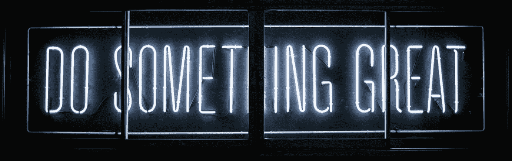

# 情绪，交易者的克星

> 原文：<https://medium.com/coinmonks/emotions-a-traders-nemesis-fdecdf23bec6?source=collection_archive---------0----------------------->

Source: [https://unsplash.com/photos/oqStl2L5oxI](https://unsplash.com/photos/oqStl2L5oxI)

## 你看到市场下跌…你的胃里一阵翻腾…你在赔钱，你需要止损…或者你变得贪婪，想逢低买入？到底是哪个？很难从逻辑上反驳恐惧或贪婪的直觉。用臭名昭著的话说…