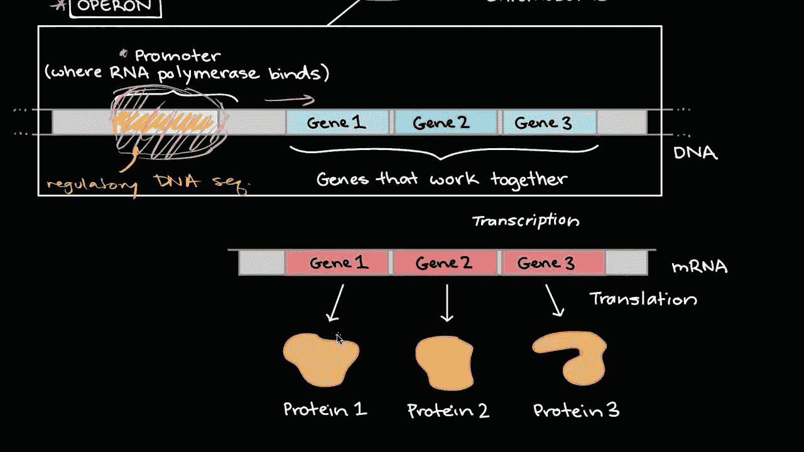
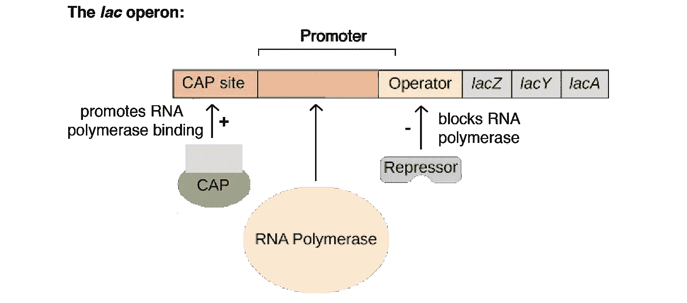
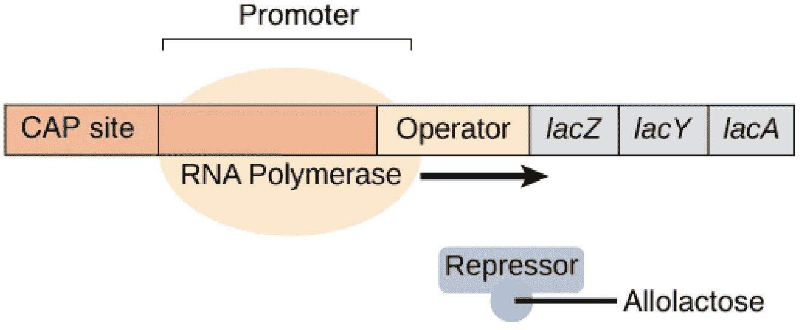
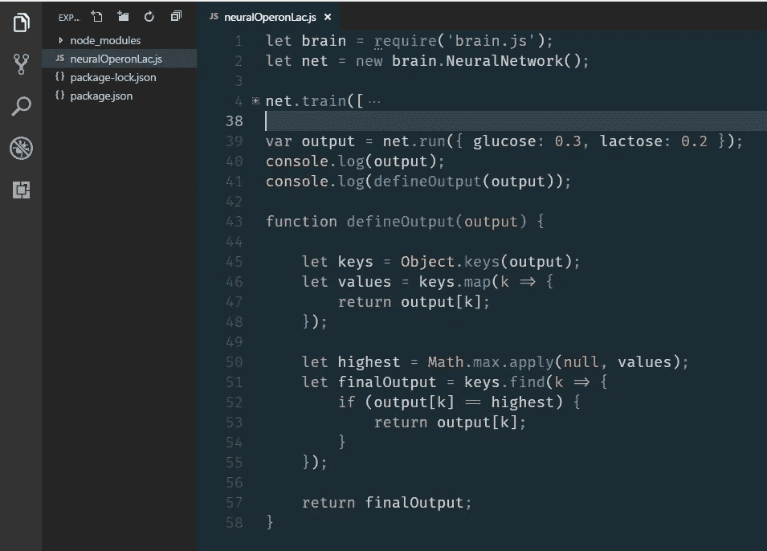
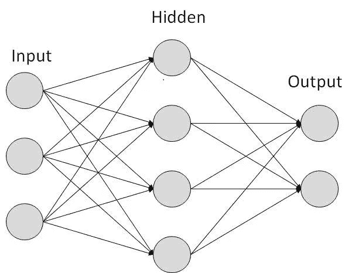
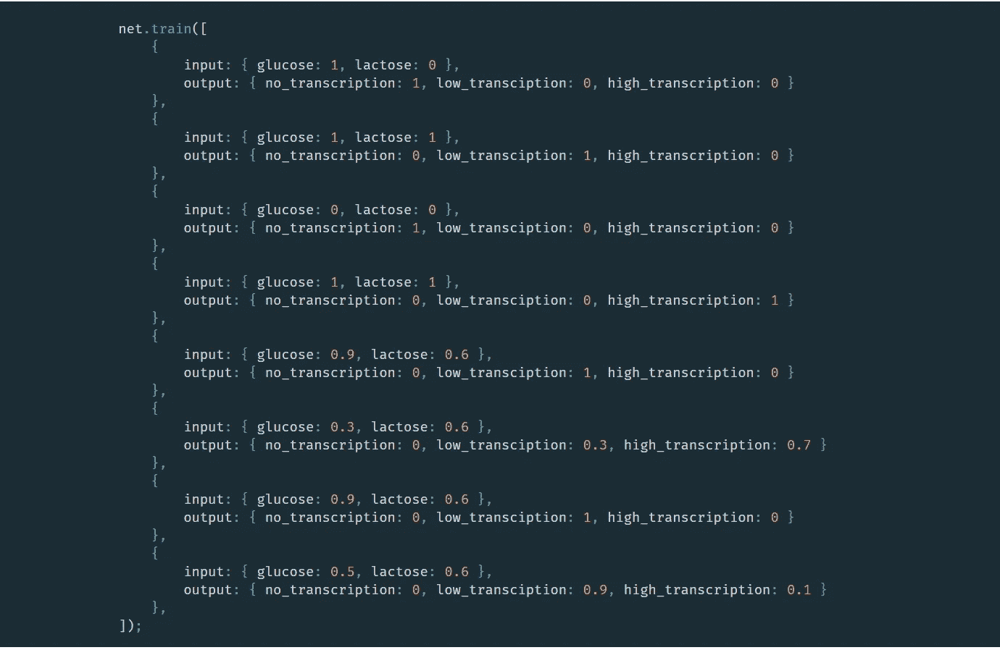
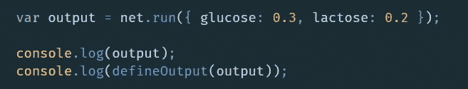
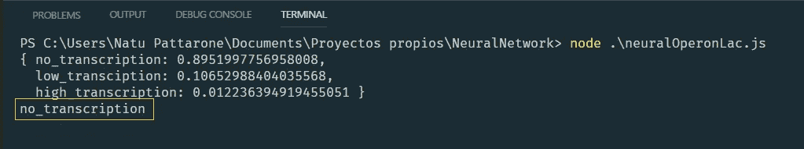

# 使用 JavaScript 神经网络模拟原核生物中的基因表达

> 原文：<https://medium.com/coinmonks/emulating-gene-expression-in-prokaryotes-using-a-javascript-neural-network-fa61ceaa3ab6?source=collection_archive---------6----------------------->

Operons and gene regulation in bacteria - Khan Academy ©

> 这是我的第一篇文章，我真的很高兴:)所以，如果你有任何建设性的建议/意见，欢迎留下。

开始吧！

没有生物学背景的，不要慌！我将尝试通过一些关键概念来指导你，这将使本教程更容易理解(也许还会开始热爱生物学)。

# 首先，我们在这里试图实现什么？

*基因表达*在这种情况下，指的是允许细菌(原核生物)通过使用其 DNA 上的特定基因来合成需要用于更大目的的东西，主要是蛋白质。

在我们的例子中，我们将模拟细菌在有大量*葡萄糖*(它们最喜欢的糖的形式)的情况下，在*基因表达*方面的表现。)相反，当它的量不足时，用*乳糖*代替(另一种形式的糖，从能量角度来说，效率较低)。

为此，原核生物使用所谓的 ***lac 操纵子*** : 一组基因，其中包含一个*启动子*(对于其他基因可以有多个，但对于这种特殊情况，只使用一个)。一个*启动子*是任何*操纵子*中的一个“特殊位置”，控制基因表达。所以在这种情况下，这个特殊操纵子中的基因编码蛋白质，使细菌能够利用*乳糖*作为能源。

为了尽可能高效，细菌应该仅在满足两个条件时表达 lac 操纵子:

*   乳糖可用，**和**
*   葡萄糖**不**可用

你可能想知道，细菌是如何做到这一点的？使用两种调节蛋白:

1.  *lac 阻遏物，*负责“感知”乳糖水平

2.而*分解代谢物激活蛋白* (CAP)，充当葡萄糖传感器

换句话说，这两个基因与 *lac 操纵子*的 DNA 结合，并调节其转录(如果你还记得*启动子*，你就在正确的道路上:)，因为它与此有很大关系。

我不想在这里赘述细节，因为它们与我们试图在本教程上建立的东西无关，但是如果你有兴趣了解更多，你可以去[可汗学院部分](https://www.khanacademy.org/science/biology/gene-regulation/modal/a/the-lac-operon)。

继续调节部分， *lac 操纵子*包含许多特定调节蛋白可与之结合并控制其转录的 DNA 区域:

1.  *启动子*(我们已经提到过了)是负责转录的特定蛋白质( [RNA 聚合酶](https://en.wikipedia.org/wiki/RNA_polymerase))结合的地方。也就是说，如果这种蛋白质结合在这里，细菌将能够吃*乳糖*，因为最终会产生“叉子”来这样做*。*就这么简单。
2.  *操纵子*也是特定蛋白质结合的地方，在这种情况下是 *lac 阻遏物*。想象一下，后者是一块巨大的岩石，占据了一个可用停车场的一部分；在这种情况下，car 充当负责转录的蛋白质(RNA 聚合酶)。在这种情况下汽车会怎么样？它不能停车。所以作为 RNA 聚合酶，它不能“停留”在*启动子*上，因为 *lac 阻遏物*(巨大的岩石)挡住了它的去路。

Khan Academy ©

3. *CAP 结合*位点是一个正调控位点，它与我们已经提到的称为 CAP 的蛋白质结合。与 *lac 阻遏蛋白*发生的情况相反，这使得 RNA 聚合酶能够主动结合*启动子。*

在这个介绍之后，我们可以把我们的目标总结为**根据环境中乳糖和葡萄糖的多少来模拟细菌的行为**。

# 下一步是什么？

让我们更深入地了解一下在每种情况下会发生什么，以及这个过程中涉及的每个元素，以便通过定义一些二元规则开始以“编码”的方式思考:)

## 第一个元素，紫胶阻遏物

*   第一法则:当*乳糖*不可用时， *lac 阻遏物*与*操纵子*结合，阻碍 RNA 聚合酶转录基因。如果你仔细想想，这完全说得通。如果没有“特殊餐”,你还需要什么“特殊餐叉”来吃“特殊餐”?
*   第二条规则:另一方面，我相信你们都已经明白了:)如果有乳糖，我们将需要“特殊的叉子”，这些叉子是怎么做的？通过表达基因，你得到了！……你可能会问，这怎么可能？嗯，基本上，当周围有乳糖时，也有*别乳糖，*是乳糖的重排形式。该元件与*阻遏物*结合，使其“放开”阻碍转录的结合位点。

Khan Academy ©

## 第二个元素，分解代谢激活蛋白(CAP)

lac 阻遏物本身不足以让细菌以应有的效率表达基因。通过只与它一起工作，除非它从 *CAP* 那里得到额外的帮助，否则只能进行一些转录。但是请记住，CAP 与葡萄糖的可用性有关，而不是乳糖。引导我们去……

*   第一法则:葡萄糖水平低时，产生 *cAMP* 。把它想象成一个信使。所以这个家伙似乎让我们知道我们没有美味的糖(葡萄糖)了。 *cAMP* 附着在*帽*上，允许它与 DNA 部分结合，更强烈地激活转录。由于我们的葡萄糖快用完了，我们需要充分利用乳糖。
*   第二条规则:正如你所想象的，当血糖高时，没有 cAMP 存在。因此，CAP 不能与允许高速转录的 DNA 部分结合，导致低水平的转录。

## 最后，lac 操纵子何时真正开启(高水平)？

这是我们将要定义的最重要的前提，因为这将导致我们最终的结论，允许我们最终编码一些东西(耶！).

*   葡萄糖肯定是不可用的
*   乳糖必须是可用的

介于两者之间的一切都可能导致转录，但速率较低，这也是我们可以通过用代表这些情况的值训练我们的神经网络来模仿的。所以，我们有:

*   **葡萄糖存在，乳糖不存在**:无转录
*   **葡萄糖存在，乳糖存在**:低水平转录
*   **葡萄糖缺失，乳糖缺失:**无转录
*   **葡萄糖缺失，乳糖存在:**强转录

## 请让我编码…

All you need :)

我使用了 [brain.js](https://github.com/BrainJS/brain.js) 库来处理这个项目，但是有很多选项(你也可以编写自己的神经网络逻辑，这是一个很好的实践:)。如果你想更深入地了解这个特定的神经网络及其学习过程，你可以查看这个[网站](https://deeplearning4j.org/neuralnet-overview#define)。

让我们仔细检查每一段代码，好吗？

对于最基本类型的神经网络，你会发现这样的东西:一定数量的输入神经元，“隐藏”层(训练发生的地方)和输出神经元，旨在显示最终结果。

Basic neural network

…为了模拟细菌的行为，我们需要 **2 个输入** (2 个神经元)来控制**葡萄糖**和**乳糖**的水平。以及对应于无转录、低转录和强转录结果的 3 个输出(3 个神经元)。在这一点上，它们之间没有任何联系，但我们的库 *brain.js* 将负责这一点，我们不必做任何事情。此外，知道它为网络的某些方面设置缺省值是很有用的，这些缺省值可以根据需要进行更改(例如训练网络的迭代次数、训练数据的可接受误差百分比等)。

然而，这里最重要的方面是我们如何训练我们的神经网络。这必须通过提供输入和输出的几种组合来实现，最终导致我们所期望的正确的最终结果。看看我使用的数据(你也可以写自己的，事实上我鼓励你这么做):

您可能已经注意到，它包含了在 *0 和 1* 之间的输入和输出值范围。换句话说，对于一个给定的输入，我们期望一个确定的输出(或者在某些情况下，每一个输出出现的概率)。例如:我们有{ ***乳糖:0.3，葡萄糖:0.6*** }，考虑到我们对它们中的每一种的所有了解以及它们如何影响细菌行为，我们可以描绘出一种情形，其中输出可能有概率以低速率方式转录 ***30% (0.3)*** 和强概率为 ***70% (0.7***

> ***注意:*** *请注意，这个特定建模的输出需要求和 100%才有意义。*

仅此而已！你运行代码，在训练过程之后，你将能够使用你训练过的神经网络。很酷，对吧？你只需要使用一些输入数据，就可以知道预测有多准确。

For the given input, our trained neural network predicted with an almost 90% of accuracy that no transcription will occur.

如果你想让你的网络变得更加精确，你只需要添加更多的训练数据，并使用一些与训练相关的默认值(比如迭代)。

非常感谢您花时间阅读这篇文章。如果你喜欢，请随意👏👏👏几次，这样其他人也可以欣赏:)