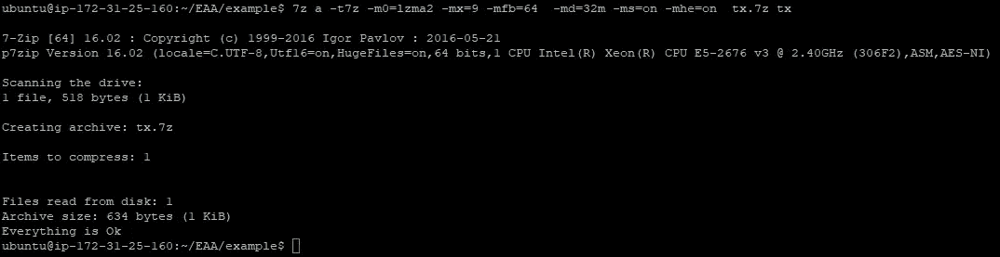
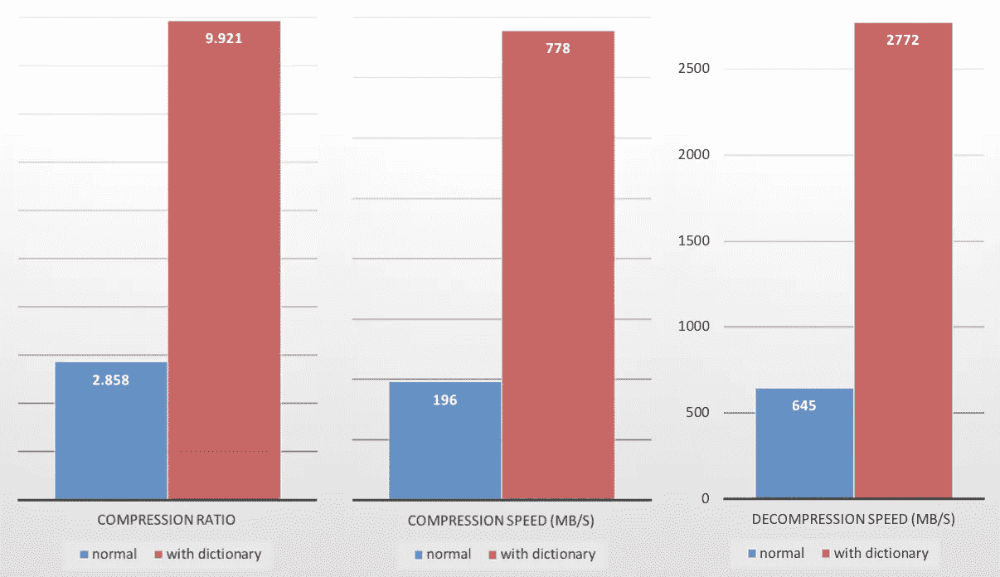

# 编码调整算法

> 原文：<https://medium.com/coinmonks/encoding-adjustment-algorithm-a-market-driven-script-scaling-solution-54960fe24f2c?source=collection_archive---------4----------------------->

## 市场驱动的脚本扩展解决方案

比特币现金即将实现强大的操作码 OP_CHECKDATASIG，为广泛的新的优秀应用程序打开大门，以促进采用。

一些反对操作码实现的论点不攻自破，而另一些则暗示了关于操作码实现的基本原理的有效问题:

*   操作码应该是小的计算原子块还是应该包括大的复杂操作？
*   一个特定的函数在实现为操作码之前应该满足什么标准？
*   无限期地硬分支添加更多的操作码可行吗？

# RISC vs CISC

在完美的世界中，操作码将像处理器指令集一样工作，高级语言将在这个指令集的基础上开发，以创建应用程序。唉，现实世界并不那么美好——操作码有一种持久性，处理器指令没有负担；操作码不仅要执行，还要远距离传播，并无限期地存储在硬盘上。它们受制于带宽和存储的开销。

如果我们同意像签名验证这样的应用程序应该是廉价和可访问的，那么我们就不可能让它们负担一个兆字节大小的脚本来展开一个复杂的程序。考虑到当前的网络瓶颈，这不仅会给这类应用带来巨大的开销，还会在相当长的一段时间内阻止它们发生。

复杂的指令精神在这里获得了彻底的胜利——我们应该实现一个操作码来消除这种荒谬的开销，因为它是签名验证的障碍。

然而，同样的恶魔潜伏在下一个角落:当下一个应用程序，例如 SNARK 验证，开始受到追捧时会发生什么？当用户喜欢新的 SNARK 操作码，但渴望下一个 10，000 操作码脚本时，会发生什么？正如许多人正确指出的那样——随着网络规模的增长，它将变得越来越难以硬分叉。不断引入新的操作码是不可行的。一个人必须在某处划清界限，或者逐渐减少他们介绍的频率。

# 编码和压缩

编码是重写数据的一种方式，压缩是减少数据大小的一种编码。解码和解压缩是它们的逆过程。

在许多压缩方案中，有两个可分离的操作:

1.  创建代码[字典](https://en.wikipedia.org/wiki/Dictionary_coder)。
2.  将字典应用于数据进行编码。

通常，第一步的计算量很大，而第二步很快。

许多压缩方案在算法遍历数据时动态创建字典，这是一个“动态”字典。或者，压缩方案可以利用预先计算的字典。许多人将两者结合使用。

如果没有一个预先计算的字典，对小项目的压缩至少可以说是无力的。

7zip on highest settings “compressing” a 518 byte transaction to 634 bytes

在它们适用的情况下，预计算字典的引入比完全动态字典具有优势。

1.  较小数据(如事务)的压缩有所改进。
2.  压缩/解压缩期间运行时间的减少。

Example from [Zstandard](https://github.com/facebook/zstd#the-case-for-small-data-compression)

对于那些有技术倾向并且对强大的字典构造技术感兴趣的人，我推荐廖的[有效构造相关的伦佩尔-齐夫字典](http://gdac.uqam.ca/WWW2016-Proceedings/proceedings/p807.pdf)。以及其他人

# 编码调整算法

在 BTC，难度调整算法(DAA)获取开采最后 2016 个区块所用的时间，并使用它来计算接下来 2016 个区块的难度(和目标)。由于节点对块有共识，它们也对难度有共识。更一般地，从块中确定性地生成的任何值还可以跨节点一致。

一个*编码调整算法* (EAA)将以这种方式工作。节点将在每 N 个块的最后 N 个块的某个确定性样本上训练压缩字典，并因此同意所述字典。

Alice 使用她的字典来压缩事务/块，然后通过网络将数据发送给 Bob。鲍勃用他的同样的字典解码它。

通过利用 Alice 和 Bob 有一个共同的预计算字典这一事实，我们确保了更快的压缩和解压缩以及更高的压缩比。

## 第二层共识

这样的系统不需要(也不应该)在基础协议上实现。压缩和解压缩可以发生在节点软件的边缘。它可以完全选择加入，并且压缩的事务可以被如此标记。

## 供应、需求和代理代码

目前，几乎每个事务在每个输出中都包含一个 P2PKH。任何压缩字典肯定会标记这种模式，因此压缩会用单个*代理代码*替换操作码的 5 个字节。在未来，同样的原则将适用于更复杂的操作码模式，大量的脚本将被简化为少数编码频繁出现的模式的代理代码。

这些代理代码不需要集中管理，它们是通过训练算法根据需求完全自主实现的。也就是说，如果发明了需要特定操作码模式的新应用程序，字典将提供代理代码来满足这一需求。类似地，如果对操作码的特定模式的需求下降，那么字典将停止提供相关的代理代码。

如果一种高级语言是为创建脚本而开发的，并且变得流行，那么它将由字典来补充。

## 简短密码学

不只是操作码的模式会享受缩短的表示。当孤立地考虑时，加密字符串是非常高熵的(散列通过构造最大化地如此)，跨块，加密字符串将重复。例如，在特定的 oracle 用 pubkey 重复签署脚本或者大公司用特定的标识符标记它们的 OP_RETURNS 的情况下，这些字符串将保证字典中的“快速拨号”。

## 辅之以治理

如果一个人的路线图坚持的话，这个模型仍然与开发团队引入操作码兼容。假设对特定功能的即时需求出现，EAA 将允许市场在共识级操作码的发布日期之前开始实现该功能，而没有大量开销。

## 定价启发法的补充

随着脚本大小的增长，satoshi/byte 脚本定价方法将越来越难以估计执行的真实价格。可以针对代理代码字典来设计定价试探法。对编码字典的调整可以与定价的可预测的重新计算相匹配(由函数式编程/范畴理论爱好者的某种仿函数实例化)。这将使定价试探法自然发展，同时最小化开销并最大化适用性。

## 孤儿和重组

如果两个节点不能在 N 块采样窗口内就块达成一致，那么它们将不能在字典上达成一致，并因此向彼此发送乱码事务。

这很容易通过防止从 N 块窗口中的最近块中采样训练集来纠正。这个填充应该选择得足够大，以允许字典上一致性失败的概率可以忽略不计。

## 仅压缩一次

只有发起者需要压缩事务/块，其他人只需要解压缩它。这就需要考虑数据压缩的对称性。作为参考点，Zstandard 的解压速度是压缩速度的 3 倍左右。

## SPV 兼容性

该方案与 SPV 兼容——当钱包的字典过期时，钱包会发送请求以获取最新的字典。不像块头，整个字典链不需要被转移。

交易的编码应该足够快，即使是移动钱包也能在几毫秒内完成。字典应该足够大，以确保良好的压缩，但也要足够小，以每 N 个块传输到钱包，而不会有很大的开销。字典可以做得很小(字节/千字节)，同时仍然保证很大的压缩率。

可以使用不同的词典来满足特定的需要。可以想象一个节点根据钱包活动向 SPV 用户提供特定的字典。同样，必须考虑数据压缩的对称性。

## 块是过滤器和一些事务

借助紧凑块、Xthin 和 Graphene 等集合协调技术，节点不再需要中继整个块，而是中继接收者 mempool 中丢失的少量事务以及订单信息。

假设爱丽丝正试图通过石墨烯给鲍勃发送一个块。在“打开”IBLT 时，发现 Bob 从他的 mempool 中丢失了很少的事务(可能的情况)。这几个事务需要从 Alice 转发给 Bob，并且很可能在所有转发的数据中占相当大的百分比。鉴于这些事务的高熵，没有预先计算的字典的压缩将是蹩脚的，因此 EAA 也可以对块传播有相当大的帮助。

# 结束语

我们已经为降低网络/存储开销的方案奠定了基础，该方案以交易和块内特定模式的市场需求为导向。

下一步是建立这样一个系统的模型，以测量压缩比以及压缩和解压速度。我们的目标是在各种区块链上进行这些测试，以评估其性能。任何愿意从他们的完整节点捐赠数据的人都会受到感谢。

> [在您的收件箱中直接获得最佳软件交易](https://coincodecap.com/?utm_source=coinmonks)

