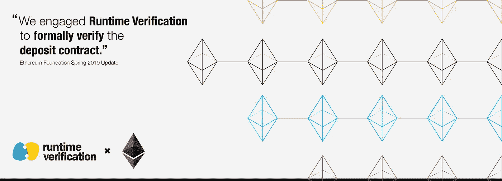

# 以太坊 2.0 存款智能合约的端到端形式化验证

> 原文：<https://medium.com/coinmonks/end-to-end-formal-verification-of-ethereum-2-0-deposit-smart-contract-7ebf13fa46ad?source=collection_archive---------1----------------------->

## 在 Daejun 公园旁边



我们在[运行时验证](https://runtimeverification.com/)，很高兴[向](https://github.com/runtimeverification/verified-smart-contracts/blob/master/deposit/deposit-formal-verification.pdf)报告我们成功完成了[以太坊 2.0 存款合同](https://github.com/ethereum/eth2.0-specs/blob/v0.10.0/deposit_contract/contracts/validator_registration.vy)的正式验证，这可以说是以太坊社区今年部署的最重要的智能合同之一。

> [发现并评估最佳智能合约安全软件](https://coincodecap.com/category/smart-contract)

# 存款合同

押金合同是加入[以太坊 2.0](https://github.com/ethereum/eth2.0-specs) 的入口。要成为驱动以太坊 2.0 的整个利益证明(PoS)链(称为[信标链](https://github.com/ethereum/eth2.0-specs/blob/dev/specs/phase0/beacon-chain.md))的验证者，您需要通过向存款合同发送交易(通过以太坊 1.x 网络)来存款一定量的以太作为“利益”。押金契约记录了押金的历史，锁定了以太坊 1.x 链的所有押金，以后可以在以太坊 2.0 的信标链认领。注意，在以太坊 2.0 的一个早期阶段，押金契约是单向函数；你可以把你的资金从以太坊 1.x 转移到以太坊 2.0，但不能反过来。

用 [Vyper](https://vyper.readthedocs.io) 编写的存款合同采用 [Merkle 树](https://en.wikipedia.org/wiki/Merkle_tree)数据结构来有效地存储存款历史，其中每当接收到新的存款时，该树就被动态地*更新(即，从左到右递增地填充叶节点)。这里，契约中使用的 Merkle 树非常大——契约中实现了一个高度为 32 的 Merkle 树，它可以存储多达`2^32`个存款。由于 Merkle 树的大小是巨大的，所以每次接收到新的存放时重建整个树是不实际的。*

为了降低时间和空间的复杂性，从而显著节省天然气成本，合同实施了[增量 Merkle 树算法](https://github.com/ethereum/research/blob/master/beacon_chain_impl/progressive_merkle_tree.py)。增量算法享受`O(h)`时间和空间复杂性来重建(更准确地说，计算根)高度`h`的 Merkle 树，而简单算法将需要`O(2^h)`时间或空间复杂性。

然而，有效的增量算法导致存款合同实现不直观，并使得确保其正确性变得不容易。然而，存款合同的正确性对于以太坊 2.0 的安全性至关重要。考虑到存款合同的极端重要性，需要进行正式验证，这是最终保证其正确性的唯一已知方法。

# 范围和方法

我们正式验证约定的范围是确保单个事务中存款合同*字节码*的正确性，而不考虑事务级或链外行为。我们将编译后的字节码作为验证目标，以避免信任编译器。(的确，我们在形式验证的过程中发现了 Vyper 编译器的几个关键性 bug。我们将在本帖后面解释更多关于我们发现的细节。)

在方法上，我们采用了著名的基于精化的验证方法。我们的验证工作包括以下两项任务:

直观地说，第一个任务相当于确保契约源代码的正确性，而第二个任务相当于确保编译后的字节码是源代码的合理细化(即编译器的[翻译验证](https://link.springer.com/chapter/10.1007/BFb0054170))。这种基于精化的方法允许我们避免对复杂的算法细节进行推理，尤其是直接在字节码级别指定和验证循环不变量。这种关注点的分离帮助我们节省了大量的验证工作。

在[之前的博文](https://runtimeverification.com/blog/formal-verification-of-ethereum-2-0-deposit-contract-part-1/)中，我们介绍了任务 1，简单介绍了存款合同和增量 Merkle 树算法。在本帖中，我们将关注任务 2。

*查看我们的* [*最终报告*](https://github.com/runtimeverification/verified-smart-contracts/blob/master/deposit/deposit-formal-verification.pdf) *了解存款合同正式验证的全部细节。*

# 存款合同的字节码验证

我们验证了存款合同的已编译字节码的功能正确性。对于每个公共函数，我们验证了它的返回值和存储状态更新(如果有的话)是正确的。

此外，我们仔细指定并验证了它的字节操作行为。它包括:

*   根据[协定 ABI 规范](https://solidity.readthedocs.io/en/v0.6.1/abi-spec.html)，返回值被正确序列化为字节序列，
*   为 32 字节对齐更正零填充，
*   从大端到小端的正确转换，
*   根据[合同事件 ABI 规范](https://solidity.readthedocs.io/en/v0.6.1/abi-spec.html#events)对事件日志数据进行正确编码，
*   正确构造 SHA2–256 哈希函数的输入字节，以及
*   根据 [SimpleSerialize (SSZ)规范](https://github.com/ethereum/eth2.0-specs/tree/dev/ssz)正确计算存款数据哈希(称为 Merkleization)。

我们还验证了活性性质，即只要提供足够量的气体，契约总是能够接受新的(有效的)存款。这种活跃度不是微不足道的，因为它需要保持，即使在任何未来的硬分叉，其中天然气费用计划被改变。事实上，我们发现了 Vyper 编译器的一个错误，它可能会使存款合同在未来的某个硬分叉中不起作用，在这种情况下，无论供应了多少气体，合同都会由于气体耗尽异常而失败。(我们将在这篇文章的后面回到这个问题。)

我们验证了积极和消极的行为。积极行为描述了合法输入状态下契约的期望行为。另一方面，负面行为描述了契约如何处理异常情况(例如，当良性用户错误地提供无效输入，或者恶意用户提供精心制作的输入以利用契约时)。负面行为大多与安全属性有关。

存款合同的已验证字节码行为的完整规范可以在[这里](https://github.com/runtimeverification/verified-smart-contracts/blob/master/deposit/bytecode-verification/deposit-spec.ini.md)找到。

# 调查的结果

在我们正式验证工作的过程中，我们发现了存款合同的细微 bug(问题 [26](https://github.com/ethereum/deposit_contract/issues/26) 、 [1341](https://github.com/ethereum/eth2.0-specs/issues/1341) 和 [1357](https://github.com/ethereum/eth2.0-specs/issues/1357) ),这些 bug 已经在[最新版本](https://github.com/ethereum/eth2.0-specs/blob/v0.10.0/deposit_contract/contracts/validator_registration.vy)中修复，以及一些重构建议(问题 [27](https://github.com/ethereum/deposit_contract/issues/27) 、 [28](https://github.com/ethereum/deposit_contract/issues/28) 和 [38](https://github.com/ethereum/deposit_contract/issues/38) )可以提高代码可读性并降低 gas 成本。定金合同的细微漏洞部分是由于我们在验证过程中发现的 Vyper 编译器的另一个隐藏漏洞(Vyper Issues [1563](https://github.com/vyperlang/vyper/issues/1563) 、 [1599](https://github.com/vyperlang/vyper/issues/1599) 、 [1610](https://github.com/vyperlang/vyper/issues/1610) 和 [1761](https://github.com/vyperlang/vyper/issues/1761) )。

下面我们详细阐述一下我们发现的 bug。我们注意到，在最新版本( [v0.10.0](https://github.com/ethereum/eth2.0-specs/blob/v0.10.0/deposit_contract/contracts/validator_registration.vy) )中，定金合同的所有 bug 都已被报告、确认并得到妥善修复。

## `get_deposit_count()`功能的 ABI 标准符合性

在之前版本的存款合同中，`get_deposit_count()`函数不符合 [ABI 标准](https://solidity.readthedocs.io/en/v0.6.1/abi-spec.html)，由于 Vyper 编译器[错误](https://github.com/vyperlang/vyper/issues/1563)，其返回值包含不正确的零填充。

具体来说，在错误版本的编译字节码中，`get_deposit_count()`函数(其返回类型为`bytes[8]`)返回以下 96 个字节(以十六进制表示法):

```
0x0000000000000000000000000000000000000000000000000000000000000020 0000000000000000000000000000000000000000000000000000000000000008 deadbeefdeadbeef000000000000000000000000000000000000000000000020 ^^
```

其中:

*   前 32 个字节(第一行)表示字节数组的偏移量(32 = `0x20`),
*   第二个 32 字节(在第二行)表示字节数组的大小(8 = `0x8`)，以及
*   接下来的 8 个字节“`deadbeefdeadbeef`”(在第三行的开头)表示返回字节数组(类型`bytes[8]`)的实际内容，即存放计数的(little-endian)字节表示。

这里的问题是最后一个字节(用`^^`标记)是`0x20`，而它应该是`0x00`。根据 [ABI 规范](https://solidity.readthedocs.io/en/v0.6.1/abi-spec.html)，最后 24 个字节必须全为零，作为 32 字节对齐的零填充。因此，上面的返回值不符合 ABI 标准，这是有问题的，因为任何调用存款契约(的错误版本)并期望`get_deposit_count()`函数符合 ABI 标准的契约(用 Solidity 或 Vyper 编写)都可能行为不检。

这种错误行为主要是由于一个微妙的 Vyper 编译器[错误](https://github.com/vyperlang/vyper/issues/1563)未能正确编译其返回类型为`bytes[n]`的函数，其中`n`小于 16，这导致编译后的函数返回不符合 ABI 标准的错误字节序列，如上图所示补零不足。

我们注意到，如果我们不把字节码作为验证目标，这个 bug 就不会被发现。这再次证实了字节码级验证对于确保最终的正确性是至关重要的(除非我们正式验证底层编译器)，因为我们不能(也不应该)信任编译器。

## 检查呼叫数据的格式是否正确

先前版本的已编译字节码中的 calldata 解码过程没有对 calldata 的格式良好性进行足够的运行时检查。因此，它无法检测某些格式不正确的调用数据，导致无效的存款数据被放入 Merkle 树中。这是有问题的，尤其是当客户犯了错误，并且用不正确编码的呼叫数据发送存款交易时，这可能导致损失他们的存款资金。

例如，考虑以下用于`deposit()`函数的格式错误的 calldata(十六进制表示法):

```
0xc47e300d 0000000000000000000000000000000000000000000000000000000000000060 0000000000000000000000000000000000000000000000000000000000000080 00000000000000000000000000000000000000000000000000000000000000a0 0000000000000000000000000000000000000000000000000000000000000030 0000000000000000000000000000000000000000000000000000000000000020 0000000000000000000000000000000000000000000000000000000000000060
```

前四个字节(在第一行)表示`deposit()`函数的签名散列，剩余的字节对应于三个参数的元组，`pubkey`、`withdrawal_credentials`和`signature`。然而，这个呼叫数据显然是病态的，因此是无效的，原因很简单，因为其大小(196 字节)比有效呼叫数据的大小(356 字节)小得多。

但问题是，`deposit()`函数并没有*而不是*拒绝上面的病态 calldata，只是简单地在 Merkle 树中插入了某些无效(垃圾)存放数据。由于后来无效的存款数据无法通过签名验证，因此没有人可以主张与此相关联的存款资金，存款所有者失去了该资金。

注意，即使`deposit()`函数在函数的开头包含以下长度检查断言，这种情况也会发生，这很不直观:

```
assert len(pubkey) == PUBKEY_LENGTH assert len(withdrawal_credentials) == WITHDRAWAL_CREDENTIALS_LENGTH assert len(signature) == SIGNATURE_LENGTH
```

如果 Vyper 编译器彻底生成运行时检查以确保 calldata 的格式良好，就不会存在这个问题。然而，由于修复编译器以生成这样的运行时检查并不容易，我们建议了几种方法来改进存放契约，以防止这种行为，而无需修复编译器。在与存款合同开发团队仔细讨论后，我们一起决定采用基于校验和的方法，其中`deposit()`函数将存款数据的校验和作为附加输入，并使用校验和拒绝任何格式不正确的调用数据。在所有建议的修复方法中，基于校验和的方法是非侵入性最强的，也是最节能的。(其他建议修复的更多细节可以在[这里](https://github.com/ethereum/eth2.0-specs/issues/1357)找到。)

我们注意到这个问题是在我们核实存款合同的负面行为时发现的。这表明了正式规范不仅包括积极行为，还包括消极行为的重要性。

## 活性

先前版本的存款合约未能满足 liveness 属性，因为其可能无法在更新汽油费时间表的某个未来硬叉中接受新存款(即使其有效)。这主要是由于另一个微妙的 Vyper 编译器 [bug](https://github.com/vyperlang/vyper/issues/1761) 生成字节码，当调用某些预编译合约时，会提供一定量的硬编码气体。尽管这种硬编码的天然气量在当前的硬分叉(代号为[伊斯坦堡](https://github.com/ethereum/EIPs/blob/master/EIPS/eip-1679.md))中是足够的，但在将来的某个硬分叉中，增加预编译合约的天然气费用计划可能是不够的。在这样一个未来的硬叉，漏洞版本的存款合同将始终失败，由于用完天然气的例外，无论有多少天然气是最初供应。此问题已在最新版本中修复。

我们承认，直到存款合同开发团队仔细审阅并与我们讨论了字节码的[正式规范](https://github.com/runtimeverification/verified-smart-contracts/blob/master/deposit/bytecode-verification/deposit-spec.ini.md)之后，我们才发现此问题。最初，我们只考虑了当前硬分叉中字节码的行为，而没有确定契约字节码应该在任何未来的硬分叉中工作的要求。我们确定了缺失的需求，并在正式验证过程的非常晚的阶段发现了这个活跃度问题。正因为如此，我们没有足够的时间来遵循修复编译器引入的错误的标准过程，也就是说，等待下一个修复错误的编译器版本，使用新的编译器版本重新生成字节码，以及重新验证新生成的字节码。为了加快这个过程，我们要求 Vyper 编译器团队发布一个自定义修复程序版本(名称为[1761-fix-v 0 . 1 . 0-beta . 13](https://github.com/vyperlang/vyper/commits/1761-HOTFIX-v0.1.0-beta.13)，以最大限度地缩短等待 bugfix 发布的时间。使用自定义修复程序版本还可以最大限度地减少重新验证新生成的字节码的时间，因为以前的字节码和新生成的字节码之间的差异变得很小，只涉及用于修复错误的更改。

这个轶事般的经验本质上说明了开发人员的预期行为(通常只是非正式地存在)和验证工程师编写的正式规范之间的差距所导致的众所周知的问题。为了缩小这种差距，这两个组应该紧密合作，或者理想情况下，他们应该在同一个团队中。对于前者，正式的验证过程应该更频繁地涉及开发人员。对于后者，形式验证工具应该变得更容易使用，而不需要形式方法的高级知识。

# 结论

在完成以太坊 2.0 存款合同的端到端正式验证后，我们得出结论，最新的存款合同字节码是正确的，更准确地说，它将按照[正式规范](https://github.com/runtimeverification/verified-smart-contracts/blob/master/deposit/bytecode-verification/deposit-spec.ini.md)中指定的方式运行。

我们采用基于精化的验证方法来确保契约的端到端正确性，同时最小化验证工作。具体来说，我们首先证明增量 Merkle 树算法在契约中是正确实现的，然后验证编译后的字节码是从源代码正确生成的。

虽然我们在正式验证过程中发现了存款合同的几个关键问题，其中一些是由于 Vyper 编译器隐藏的细微错误，但存款合同的所有问题都已在由 Vyper 编译器版本[1761-hot fix-v 0 . 1 . 0-beta . 13](https://github.com/vyperlang/vyper/commits/1761-HOTFIX-v0.1.0-beta.13)编译的存款合同最新版本( [v0.10.0](https://github.com/ethereum/eth2.0-specs/blob/v0.10.0/deposit_contract/contracts/validator_registration.vy) )中得到妥善修复。

我们注意到，这个正式验证结果是在不信任 Vyper 编译器的情况下建立的，这意味着即使 Vyper 编译器有[错误](https://diligence.consensys.net/audits/2019/10/vyper/)，正式验证的字节码也是正确的。事实上，Vyper 编译器已经得到了足够的改进，可以从存款合同中生成正确的字节码。换句话说，当生成我们正式验证的特定字节码时，剩余的 Vyper 编译器错误(如果有的话)还没有被*触发。所以，你不需要担心[所有的](https://blog.ethereum.org/2020/01/08/update-on-the-vyper-compiler/)[关于 Vyper 编译器的担忧](https://twitter.com/MartinLundfall/status/1215344893616381953)，关于存款合同的安全性。*

# 感谢

我们要衷心感谢以太坊基金会[资助](https://blog.ethereum.org/2019/05/21/ethereum-foundation-spring-2019-update/)这一努力，以及[丹尼·瑞安](https://github.com/djrtwo)、[卡尔·比肯](https://github.com/CarlBeek)、[贾斯汀·德雷克](https://github.com/JustinDrake)、[马丁·伦德福](https://github.com/MrChico)、[林暐](https://github.com/NIC619)、[肖-王巍](https://github.com/hwwhww)、[布莱恩特·艾森巴赫](https://github.com/fubuloubu)、[雅克·瓦格纳](https://github.com/jacqueswww)、[查尔斯·库珀](https://github.com/charles-cooper)

> [直接在您的收件箱中获得最佳软件交易](https://coincodecap.com/?utm_source=coinmonks)

[](https://coincodecap.com/?utm_source=coinmonks)[](https://coincodecap.com)

Coinmonks