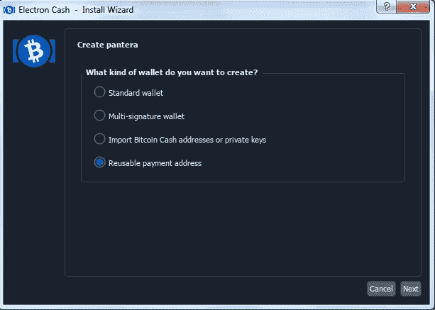

# 使用 RPA Paycodes 享受更高的比特币现金隐私(教程)

> 原文：<https://medium.com/coinmonks/enjoy-improved-bitcoin-cash-privacy-with-rpa-paycodes-tutorial-d5474754275e?source=collection_archive---------3----------------------->

比特币现金通过新的电子现金功能实现了 Monero 级别的隐私:“RPA 支付代码”(可重复使用的支付地址)。

Monero 隐私是基于对每笔交易使用“环签名”和一次性密钥(秘密地址)来隐藏交易方的身份。随着“环形保密交易”(或环形 CT)的发展，它实现了更好的隐私，此外还模糊了每笔交易的金额。

虽然比特币现金作为一种区块链并不面向隐私，但我们已经有了一些解决方案，最近电子现金钱包实现了“可重复使用的支付地址”的开源开发，这是增加比特币现金用户隐私的又一步。

电子钱包已经集成了 Cashfusion，它使用 Tor 客户端对 BCH 进行洗牌，并通过混淆和混合交易来增加匿名性。

这两个特征结合起来为比特币现金提供了终极的匿名级别！

# 可重复使用的付款地址(RPA)

可重复使用的支付地址生成一个“支付代码”，它是一个新的接收公共地址，不与用户以前的地址相链接。它为每笔付款提供了一个新的接收地址，创造了更好的匿名条件。

与 Cashfusion 一起，它创建了一个令人困惑的组合，使外部研究人员几乎不可能跟踪资金的路线。

升级仍处于“阿尔法”阶段，需要电子现金诉 4.2.4.2 RPA 发布的钱包。这个版本可以从 Github ( [链接](https://github.com/Electron-Cash/Electron-Cash/releases/tag/4.2.4.2-RPA))下载。

RPA 支付码的另一个重要特征是它可以与电子现金钱包的“现金账户”特征相结合。

可重用支付地址的提议是由 [Imaginary_Username](https://read.cash/@Pantera/enjoy-improved-bitcoin-cash-privacy-with-rpa-paycodes-tutorial-0076ecfb#bad-link) 在他的 GitHub 知识库中提出的。

RPA 对于多签名地址仍然不起作用，Imaginary_Username 解释了原因:

*Source:* [*Reddit*](https://www.reddit.com/r/btc/comments/o1z8a1/help_me_test_the_prototype_of_electron_cash_rpa/)

# 电子现金— RPA 教程

开发人员建议 RPA 仅用于少量测试，直到它在未来的电子现金版本中完全实现。

*请不要向这些地址发送任何资金(小费),即使是出于测试目的也不要发送，因为我将仅在测试时使用这些密钥(出于本演示的原因),并且我会在测试后丢弃它们。

教程-使用 Electrum Cash 4.2.4.2 RPA 创建可重复使用的付款地址钱包的步骤。

对于这个例子，我在 4.2.4.2 电子现金公司创建了一个新的比特币现金钱包。

首先，我们从 [GitHub](https://read.cash/@Pantera/enjoy-improved-bitcoin-cash-privacy-with-rpa-paycodes-tutorial-0076ecfb#bad-link) 下载 Electrum Cash。

我下载了可安装文件，并在我目前用于本教程的一台旧笔记本电脑上设置了电子现金。

在本教程中，我们将创建一个新的具有 RPA 功能的 Electrum BCH 钱包。我将我的新钱包命名为“pantera ”,并选择创建一个可重复使用的支付地址钱包。

之后，像往常一样，我们被给予种子短语，我们输入它来验证我们写得是否正确。

我们验证之前选择的密码，以执行 RPA 后台同步。

在接收部分，我们有 RPA 支付代码。

需要注意的是，目前我们应该连接的服务器是[fulcrum . fountainhead . cash .](https://read.cash/@Pantera/enjoy-improved-bitcoin-cash-privacy-with-rpa-paycodes-tutorial-0076ecfb#bad-link)

网络规格应该如上图所示。最有可能的是，我们将连接到另一个服务器和端口。如果我们不在与上图相同的服务器上，步骤如下:

*   从工具菜单中打开网络选项
*   在第二个选项卡“服务器”上，取消选择“自动选择服务器”
*   从服务器的菜单中选择:fulcrum.fountainhead.cash 并使用端口“50102”

支付代码将采用如下形式:

***支付代码:qygqyw 3 xd 59 r 05220 aahha 802 rcr lagr 98 u 9 vnxe 6 f 7 sm 9 cgs 2 yrshwtqgg 0 u 740 lcv 385 jmext 9 ctwgzqcduj 0 sn 7 yt6 LNS 70 xdq 8 a 44 cjxuqqqqqq 862 elfpg。***

我打开了第二个测试钱包(default_wallet ),用来发送少量 BCH 进行测试。第二个钱包是默认的(不是 RPA ),但是我测试了与上面显示的相同服务器的连接。

我不认为发送方钱包可以发送 RPA 交易，而连接在不同的服务器上。所以最好把两个钱包都连接到[fulcrum . fountainhead . cash .](https://read.cash/@Pantera/enjoy-improved-bitcoin-cash-privacy-with-rpa-paycodes-tutorial-0076ecfb#bad-link)

等待时，进度条会变满:

几秒钟后，事务被传输和发送。

如果我们的交易仍未显示在接收者钱包中，一个有帮助的选项是通过工具菜单刷新 RPA 交易。

在我的例子中，该事务需要刷新 RPA。我是在这个地址收到的:**bitcoincash:qpwduppzlhaaya 4 zlgagq 9 jj 655 hrgc 39 vrjfnsns**

不过，这是我做的第二个。

第一个显示钱包的时间要长一点。这个地址收到第一个:**bitcoincash:qrz 80 flav8 x 6 ety 3m 73 pfrlkypmnjeckc 760 uvm 26**

我做了第三笔交易，花了一点时间才完成。

前两个相对来说很快，(不到一分钟)，但第三个需要几分钟来“研磨签名”。

测试已成功结束，隐私功能可能需要更多时间，尤其是当软件仍处于“alpha”阶段时。

一旦测试期结束，这将是一个非常受欢迎的功能。

# 结论

*Image from Unsplash, by* [*Becca Tapert*](https://unsplash.com/@beccatapert)*, (modified)*

财务隐私和其他基本人权一样重要。我们的敏感私人信息被收集和出售，我们甚至没有注意到它。我们使用的网站、逛的商店以及我们进行的每一种金融交易都会留下我们消费习惯的痕迹。

金融和其他私人信息被数据挖掘，并最终出售给各种可疑的买家。如果我们不注意自己的隐私，我们的财务信息往往会在黑市上泄露。

像这样的隐私功能对于增加商业和企业部门对比特币现金的采用非常重要，但对零售用户同样重要。

总的来说，RPA 是一项为每个事务提供新公共地址的功能。这就是我们应该如何使用比特币，不重复使用相同的地址。

这项功能可以自动完成，我认为特别是那些经常使用比特币现金的企业会接受它。每个用户都会发现 RPA 是他们可以使用的一个很好的工具。

祝贺 Imaginary_Username、Electron Cash 和其他参与讨论、编码和测试这一重要功能的开发人员。

**参考文献:**

*   *Github:* [*假想用户名*](https://github.com/imaginaryusername/Reusable_specs/blob/master/reusable_addresses.md)
*   *Github:下载* [*电子现金*](https://github.com/Electron-Cash/Electron-Cash/releases/tag/4.2.4.2-RPA) *五、4.2.4.2-RPA*
*   *海登奥托:*[*BitcoinBCH.com*](https://bitcoinbch.com/blog/reusable-payment-addresses)
*   *Bitcoin.com:* [*可重复使用的支付地址*](https://news.bitcoin.com/reusable-payment-addresses-new-tool-to-provide-more-privacy-in-bitcoin-cash/) *【新闻】*
*   *阅读。现金:BitcoinBCH —* [*比特币现金上的隐私(BCH)现在更好的使用可重复使用的支付地址(RPA)*](https://read.cash/@BitcoinBCH/privacy-on-bitcoin-cash-bch-now-even-better-with-reusable-payment-addresses-rpa-07831b81)
*   *Reddit:*[*jonald _ fyouokball*](https://www.reddit.com/r/btc/comments/o1z8a1/help_me_test_the_prototype_of_electron_cash_rpa/)

***相关:***

*   *YouTube:*[*Roger Ver cash fusion 教程*](https://www.youtube.com/watch?v=zG6A5C90Rsc)

***引象*** *从:*[*Pexels*](https://www.pexels.com/photo/man-in-gray-hoodie-using-black-laptop-computer-5475786/)*，由* [*安东尼·什克拉巴*](https://www.pexels.com/@shkrabaanthony) *，【修改】*

**关注我:**

*●*[***read cash***](https://read.cash/@Pantera)*●*[***noise cash***](https://noise.cash/u/Pantera99)*●*[***Medium***](/@panterabch)*●*[***蜂巢***](https://hive.blog/@pantera1)

*●* [***推特***](https://twitter.com/Panterabch)*●*[***LinkedIn***](https://www.linkedin.com/in/panterabch/)**●*[***Reddit***](https://www.reddit.com/user/PanteraBCH)*

**原发布于*[*https://read . cash*](https://read.cash/@Pantera/enjoy-improved-bitcoin-cash-privacy-with-rpa-paycodes-tutorial-0076ecfb)*。**

> *加入 [Coinmonks 电报频道](https://t.me/coincodecap)，了解加密交易和投资*

## *另外，阅读*

*   *[尤霍德勒 vs 科恩洛 vs 霍德诺特](/coinmonks/youhodler-vs-coinloan-vs-hodlnaut-b1050acde55a) | [Cryptohopper vs 哈斯博特](https://blog.coincodecap.com/cryptohopper-vs-haasbot)*
*   *[币安 vs 北海巨妖](https://blog.coincodecap.com/binance-vs-kraken) | [美元成本平均交易机器人](https://blog.coincodecap.com/pionex-dca-bot)*
*   *[如何在印度购买比特币？](/coinmonks/buy-bitcoin-in-india-feb50ddfef94) | [WazirX 评论](/coinmonks/wazirx-review-5c811b074f5b) | [BitMEX 评论](https://blog.coincodecap.com/bitmex-review)*
*   *[比特币主根](https://blog.coincodecap.com/bitcoin-taproot) | [Bitso 点评](https://blog.coincodecap.com/bitso-review) | [前 6 名比特币信用卡](/coinmonks/bitcoin-credit-card-bc8ab6f377c6)*
*   *[双子座 vs 比特币基地](https://blog.coincodecap.com/gemini-vs-coinbase) | [比特币基地 vs 北海巨妖](https://blog.coincodecap.com/kraken-vs-coinbase)|[coin jar vs coin spot](https://blog.coincodecap.com/coinspot-vs-coinjar)*
*   *[印度密码交易所](/coinmonks/bitcoin-exchange-in-india-7f1fe79715c9) | [比特币储蓄账户](/coinmonks/bitcoin-savings-account-e65b13f92451) | [Paxful 审核](/coinmonks/paxful-review-4daf2354ab70)*
*   *[杠杆令牌](/coinmonks/leveraged-token-3f5257808b22) | [最佳加密交易所](/coinmonks/crypto-exchange-dd2f9d6f3769) | [AscendEX 评论](/coinmonks/ascendex-review-53e829cf75fa)*
*   *[Godex.io 审核](/coinmonks/godex-io-review-7366086519fb) | [邀请审核](/coinmonks/invity-review-70f3030c0502) | [BitForex 审核](https://blog.coincodecap.com/bitforex-review) | [HitBTC 审核](/coinmonks/hitbtc-review-c5143c5d53c2)*
*   *[Crypto.com 费用](/coinmonks/binance-fees-8588ec17965) | [僵尸密码审查](/coinmonks/botcrypto-review-2021-build-your-own-trading-bot-coincodecap-6b8332d736c7) | [替代品](https://blog.coincodecap.com/crypto-com-alternatives)*
*   *[MXC 交易所评论](/coinmonks/mxc-exchange-review-3af0ec1cba8c) | [Pionex vs 币安](https://blog.coincodecap.com/pionex-vs-binance) | [Pionex 套利机器人](https://blog.coincodecap.com/pionex-arbitrage-bot)*
*   *[我的密码交易经验](/coinmonks/my-experience-with-crypto-copy-trading-d6feb2ce3ac5) | [比特币基地评论](/coinmonks/coinbase-review-6ef4e0f56064)*
*   *[CoinFLEX 评论](https://blog.coincodecap.com/coinflex-review) | [AEX 交易所评论](https://blog.coincodecap.com/aex-exchange-review) | [UPbit 评论](https://blog.coincodecap.com/upbit-review)*
*   *[AscendEx 保证金交易](https://blog.coincodecap.com/ascendex-margin-trading) | [Bitfinex 赌注](https://blog.coincodecap.com/bitfinex-staking) | [bitFlyer 点评](https://blog.coincodecap.com/bitflyer-review)*
*   *[麻雀交易所评论](https://blog.coincodecap.com/sparrow-exchange-review) | [纳什交易所评论](https://blog.coincodecap.com/nash-exchange-review) | [普罗比特评论](https://blog.coincodecap.com/probit-review)*
*   *[加密货币储蓄账户](/coinmonks/cryptocurrency-savings-accounts-be3bc0feffbf) | [赌注加密](https://blog.coincodecap.com/staking-crypto) | [StealthEX Review](/coinmonks/stealthex-review-396c67309988)*
*   *[BigONE 交易所评论](/coinmonks/bigone-exchange-review-64705d85a1d4) | [CEX。IO 审查](https://blog.coincodecap.com/cex-io-review) | [交换区审查](/coinmonks/swapzone-review-crypto-exchange-data-aggregator-e0ad78e55ed7)*
*   *[最佳比特币保证金交易](/coinmonks/bitcoin-margin-trading-exchange-bcbfcbf7b8e3) | [Bityard 保证金交易](https://blog.coincodecap.com/bityard-margin-trading) | [Prokey 点评](/coinmonks/prokey-review-26611173c13c)*
*   *[加密保证金交易交易所](/coinmonks/crypto-margin-trading-exchanges-428b1f7ad108) | [赚取比特币](/coinmonks/earn-bitcoin-6e8bd3c592d9) | [Mudrex 投资](https://blog.coincodecap.com/mudrex-invest-review-the-best-way-to-invest-in-crypto)*
*   *[WazirX vs coin dcx vs bit bns](/coinmonks/wazirx-vs-coindcx-vs-bitbns-149f4f19a2f1)|[block fi vs coin loan vs Nexo](/coinmonks/blockfi-vs-coinloan-vs-nexo-cb624635230d)*