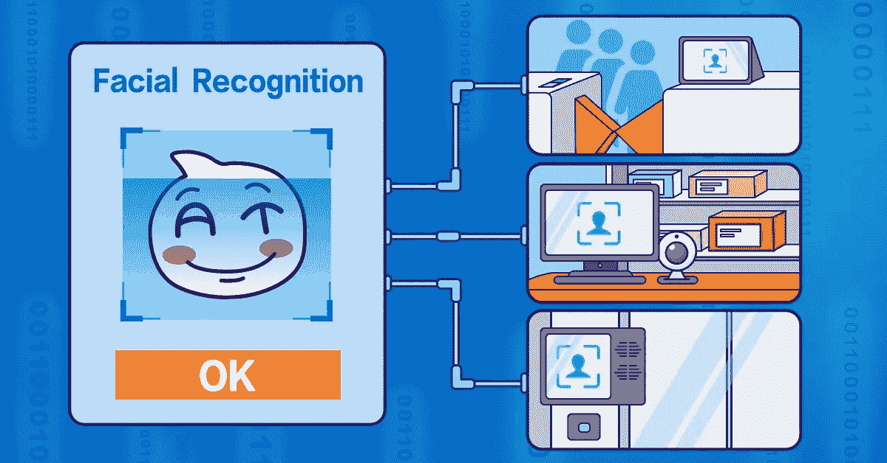
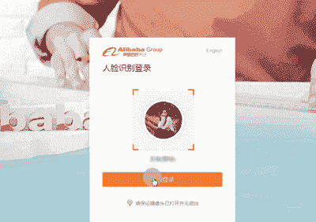
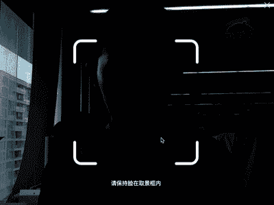
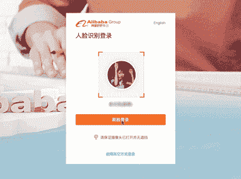
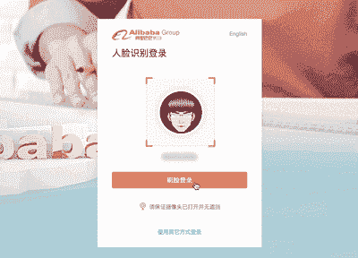
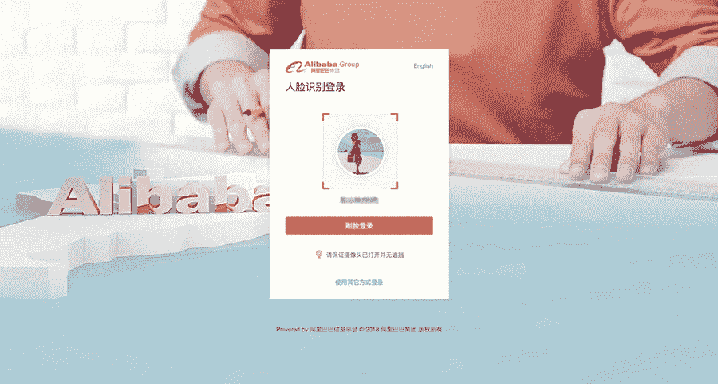
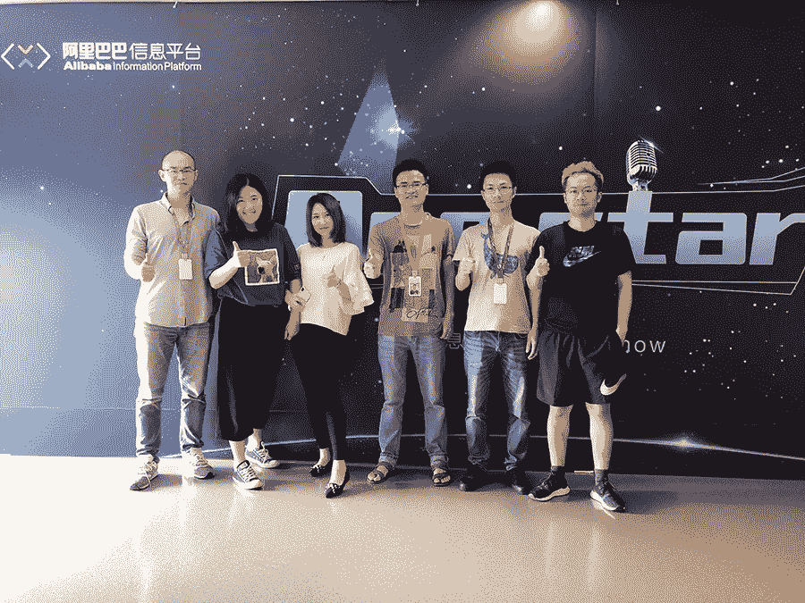
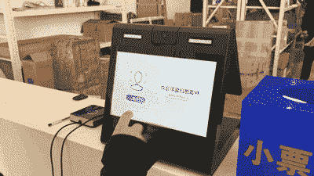
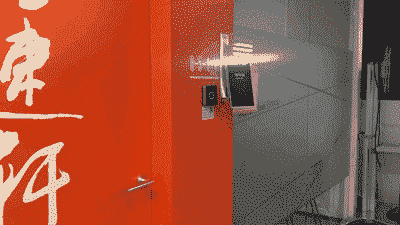

# 输入你的用户名，说“茄子:面部识别在阿里巴巴的实践”

> 原文：<https://medium.com/coinmonks/enter-your-username-and-say-cheese-facial-recognition-in-practice-at-alibaba-18820b0d758c?source=collection_archive---------6----------------------->

*阿里巴巴如何将面部识别带到办公室的前沿*

过去几周，阿里巴巴的员工开始注意到他们周围发生了一些奇怪的事情。每个工作日开始时，人们登录阿里巴巴内部网不是通过输入密码，而是通过:

*看起来很精神……*

*…微笑了几秒钟…*

盯着照相机的镜头。

在一个短暂的瞬间，即使是那些更严肃的同事也变得活跃起来，当摄像机扫描他们的脸并让他们登录时，他们害羞地笑着，眨着睫毛。

***注:以上 gif 是被扫描人脸的人拍摄的截图。***

这种新颖的方式加入到我们早晨的日常生活中的原因是什么？阿里巴巴正式推出了登录公司内部网的面部识别平台。

这项由阿里巴巴信息平台下的客户团队开发的新技术，使阿里巴巴的员工能够在不输入密码或使用二维码或短信等第三方认证手段的情况下登录内部网。我们现在所要做的就是让相机扫描我们的脸，然后我们就进去了，这是一种从根本上改善了用户体验的便利。

# 安全第一

客户团队负责保证所有阿里巴巴员工在访问网络时的安全并维护最佳用户体验。许多员工每天都在使用大量不同的账户——从常规的域名账户到旺旺账户、阿里云账户、开发和测试账户等等。使用旧的登录方法，我们过去必须为每个用户输入密码，这个过程不仅麻烦，还会有员工忘记密码的风险，更不用说无数的安全问题了。

因此，该团队开始思考:难道没有一种更方便、更可靠的方式来登录内部网，既能确保安全性，又能保持体验的一致性吗？

然后他们想到了——面部识别！

*Using facial recognition to log in is now commonplace within Alibaba Group*

为了开始建立面部扫描平台，客户团队联系了面部识别技术领域的专家 ZOLOZ。

# 新面孔，新想法

阿里巴巴客户团队的项目经理陈表示:“我们一开始考虑了多种登录方式，但最终决定采用语音识别和面部识别。”。“但是声音可以很容易地再现，而且，为了使声音识别工作良好，你的工作环境需要相对安静。经过一番深思熟虑后，我们决定，面部识别将是在阿里巴巴办公室使用的最方便的方法。”

根据林琴的说法，在扫描时，准确性是最重要的，帐户和设备信息必须始终与面部数据一致。为了确保安全，该团队坚持同时进行设备认证和人脸验证。“设备身份认证可确保环境的安全性，面部识别过程中还会使用严格的实时验证，以防止人们登录错误的帐户。”

*The account team*

然而，正如您可以想象的那样，在任何繁忙的办公室中，摄像机经常会无意中捕捉到多人的面部，这意味着系统必须能够同时监控距离、范围和精度等。这意味着，如果五个人同时盯着摄像头，你可能无法轻松登录，但如果有人在你的面部被扫描时从背景中走过，登录不会成为问题。

# 安全、可靠、方便

阿里巴巴依赖于 ZOLOZ 团队世界领先的活体验证算法，如果你眨眼、用手遮住部分面部、微微低头、做鬼脸或浓妆艳抹，系统仍然可以快速识别你。

“用我们的面部登录比我们以前的登录方式更安全、更可靠。操作体验也大不相同，”客户团队的工程师王文慧说。他继续解释说，新的登录从收集和压缩照片到使用即时通讯技术将照片上传到服务器进行比较，平均只需要 1.081 秒。

除了安全和快速之外，面部识别技术还可以帮助那些记性不好的人，他们可以摆脱周期性改变密码并被迫记住密码的噩梦。事实上，该团队目前正试图通过实施生物识别登录解决方案来规避这个问题。

# 未来是光明的

除了用于登录内部网，面部识别技术还长期用于阿里巴巴集团，让员工的生活变得稍微轻松一些。

例如，当你早上到达工作地点时，你可以通过扫描你的脸来通过安检:

如果你想领取一个包裹，就和收件代码说再见吧——只需扫描你的脸:

你猜对了，要进入某些会议室和贵宾室，你只需要一张脸:

员工可以只用他们的脸在食堂支付食物。

面部识别的时代显然已经到来！你认为接下来会发生什么？

(阿里巴巴信息平台原创文章)

# 阿里巴巴科技

关于阿里巴巴最新技术的第一手深度资料→脸书: [**“阿里巴巴科技”**](http://www.facebook.com/AlibabaTechnology) 。推特: [**【阿里巴巴技术】**](https://twitter.com/AliTech2017) 。

> [直接在您的收件箱中获得最佳软件交易](https://coincodecap.com/?utm_source=coinmonks)

