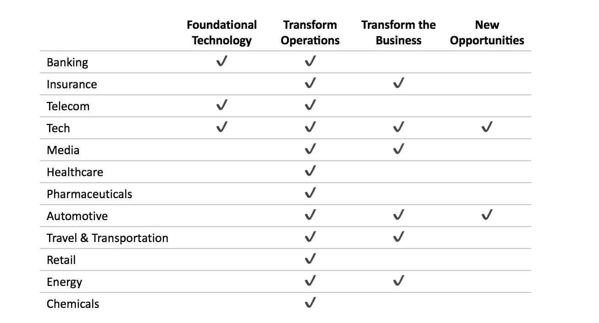

# 企业区块链:我们到了吗？

> 原文：<https://medium.com/coinmonks/enterprise-blockchain-are-we-there-yet-7090b3841b11?source=collection_archive---------1----------------------->

## 分布式账本技术主管指南(第二部分)

**TLDR:** 近 300 家公司已经在试图通过加入自己的联盟或试点来建设、监管、定义或整合 DLT。不过，关于用例类型的目标各不相同，大多数都坚持简单的成本策略。企业尚未将区块链投入大规模生产，至少在金融服务和制造业领域是如此。不过，这种情况预计将在 2018 年发生变化。

在这个迷你系列的[第一部分中，我一直在写关于大型企业使用区块链/分布式账本技术(DLT)的价值潜力。我从技术本身的内在利益以及它创造的新经济系统中获得了价值潜力。虽然使用技术可以降低成本(特别是在协作场景中)，但代币经济可以创造全新的方式与客户互动，创新商业模式，以及其他机会。](/@sebastianhrw/enterprise-blockchain-where-is-the-business-value-ead60bbd2cb2)

根据 IDG 的调查， [13%的高级 IT 主管](https://enterprisersproject.com/article/2018/2/5-blockchain-statistics-cio-reality-check)目前计划实施区块链，根据 IDC 的分析，企业在区块链解决方案上的支出[将在 2018 年达到 21 亿美元](https://enterprisersproject.com/article/2018/2/5-blockchain-statistics-cio-reality-check)。同样，2017 年，区块链相关的职位发布数量增长了 3 倍，目前每一个区块链开发商有 [14 个职位空缺。这主要是由金融服务和制造业推动的，2018 年可能是区块链从试点项目转向生产的一年。](https://techcrunch.com/2018/02/14/blockchain-engineers-are-in-demand/)

在本系列的第二部分中，我将看看企业世界中 DLT 的采用现状。

[**第一部分**](/@sebastianhrw/enterprise-blockchain-where-is-the-business-value-ead60bbd2cb2) **:** 商业价值在哪里？
**第二部分:**行业采用的状态是怎样的？(本帖)
[**第三部分**](/@sebastianhrw/enterprise-blockchain-which-are-enterprise-ready-46bd4b49dd02) **:** 哪些解决方案是企业现成的？

## 协作:财团、联盟和倡议

由于在各方之间实现更高效的新型协作是 DLT 的关键主题之一，**各机构正联合起来，试图建立、监管、定义或整合分布式总账**。 [Outlier Ventures](https://outlierventures.io/corporate-tracker/#ecosystem) 运营着一个公司追踪系统，目前显示大约 300 家公司至少参与了一个这样的财团。

联盟可以区分为专注于某些行业或专注于某些平台或用例类型。最著名的行业联盟包括:

*   [**R3**](https://www.r3.com/) 于 2015 年作为金融服务行业的一个财团开始构建开源的 DLT 解决方案 Corda。它已经发展成为一家软件初创公司，为目前 100 多家财团成员提供 DLT 相关服务，如美国银行、德意志银行、加拿大皇家银行或联合信贷银行，但其商业模式仍在发展中。
*   [**区块链保险行业倡议(B3i)**](https://b3i.tech/home.html) 是一个由保险公司和再保险公司组成的财团，旨在探索 DLT 的潜力。它成立于 2016 年，目前由 15 个成员组成，如安联保险公司、忠利保险公司、慕尼黑再保险公司或苏黎世保险集团。
*   [**哈希健康联盟**](https://hashedhealth.com/) 由 DLT 咨询和发展公司哈希健康于 2016 年发起，旨在推进区块链协议在医疗保健中的使用。然而，人们对高知名度的成员知之甚少，并且有来自行业内部的不同的[厂商无关的财团](/@pgmbouquet/banding-together-for-a-healthcare-blockchain-consortium-9d676374244e)的努力。
*   [**移动开放区块链倡议**](https://www.dlt.mobi/)**【Mobi】**于 2018 年[发起，是由宝马、雷诺、通用或博世等制造商和供应商组成的汽车行业联盟，旨在探索 DLT 围绕移动服务的用例。](https://techcrunch.com/2018/05/02/the-mobility-open-blockchain-initiative-bmw-gm-ford-renault/)

专注于平台或特定类型用例的联盟包括:

*   [**Hyperledger**](https://hyperledger.org) 项目由 Linux 基金会于 2015 年启动，旨在构建开源区块链平台和相关工具，如其旗舰解决方案许可的区块链 Fabric。其成员包括埃森哲、美国运通、IBM 和 SAP 等。
*   [**以太坊企业联盟**](https://entethalliance.org) **(EEA)** 是一个在以太坊平台上构建应用的企业社区，成立于 2017 年，并迅速发展到 150 多个成员，如埃森哲、微软、JPM 或瑞银。
*   [**可信物联网联盟**](https://trusted-iot.org) 成立于 2017 年，是一个跨行业的联盟，开发利用区块链基础设施保护和扩展物联网生态系统的用例。其企业成员包括例如博世、思科和瑞银。
*   [**分散身份基金会**](https://identity.foundation) 是一个致力于基于 DLT 的身份管理解决方案的公司社区，[在 2017 年组成了一个联盟](/decentralized-identity/the-rising-tide-of-decentralized-identity-2e163e4ec663)来提高互操作性。例如，它包括 Hyperledger、微软、IBM 和埃森哲。

还有几个更进一步的团体从不同的角度看待 DLT，比如[数字商会](https://digitalchamber.org)、 [PTDL](http://www.ptdlgroup.org/) 、[区块链合作财团](https://bccc.global/en)、[全球区块链商业理事会](https://www.gbbcouncil.org/about-us)、[法律财团](https://legalconsortium.org)、[更多](https://www.coindesk.com/state-global-blockchain-consortia/)。

## 探索:试验、试点和产品

银行、电信和科技行业从其他行业中脱颖而出，因为它们不仅在探索用例，还在创造基础技术并申请专利。就用例而言，不同行业之间的目标有很大的不同。虽然所有行业都在探索以效率为中心的用例来转变其内部运营，但只有大约一半的行业会超越这一点，其中科技和汽车行业目前正在追求最雄心勃勃的目标(见下文)。然而，几乎没有公司将区块链投入大规模生产，或者将其用于主要的商业用途。根据 EY 的说法，至少在 2018 年期间，金融服务和制造业预计会发生变化。

Focus areas by industry (for use cases see [part 1](/@sebastianhrw/enterprise-blockchain-where-is-the-business-value-ead60bbd2cb2))

**银行业**可能是最接近生产就绪的行业，从[小型利基解决方案](https://www.coindesk.com/thinking-big-bank-blockchains-will-advance-everything/)和试点逐步走向更大规模的采用。尽管似乎还没有任何东西投入生产，但有许多试点的例子，特别是在支付和交易方面。大约有 100 家机构注册了[国际支付试点 RippleNet](https://www.influencive.com/amex-ripple-partner/) 。几家欧洲银行成立了合资企业 We-Trade，为商业客户开发贸易平台。[摩根大通](https://www.coindesk.com/jpmorgan-launches-interbank-payments-platform-quorum-blockchain)有一个区块链内部团队开发了基于以太坊的内部区块链解决方案 Quorum，其中[整合了 ZCash](https://www.coindesk.com/jpmorgan-integrates-zcash-privacy-tech-enterprise-blockchain/) 的隐私技术。ING 为私人区块链交易开发了类似的解决方案。[美洲银行](https://www.coindesk.com/bank-of-america-sees-blockchain-as-way-to-replace-internal-ledgers/)正在探索数据共享的机会，[加拿大皇家银行](https://www.reuters.com/article/us-rbc-blockchain/exclusive-royal-bank-of-canada-using-blockchain-for-u-s-canada-payments-executive-idUSKCN1C237N)正在尝试国际支付， [BBVA](https://www.coindesk.com/bbva-advances-blockchain-fx-matching-pilot-built-r3-ledger-tech/) 在外汇撮合上，[法国巴黎银行](https://www.coindesk.com/bnp-tata-tap-blockchain-for-event-announcements-platform/)在股息支付和股票分割上。在信用卡公司中， [Visa](https://www.coindesk.com/visa-launches-first-phase-of-blockchain-b2b-payments-system/) 正在试验 B2B 支付服务，而 [MasterCard](https://www.coindesk.com/mastercard-hints-plans-blockchain-settlement-system/) 正在试验一种用于[即时支付处理的系统](https://www.coindesk.com/mastercard-patent-filings-detail-blockchains-use-speeding-payments/)。

在**保险**行业**、**法国保险公司[安盛](https://www.coindesk.com/axa-using-ethereums-blockchain-new-flight-insurance-product/)可能是第一个活产品走在最前面的；它推出了一种新的航班延误保险产品，使用公共以太坊区块链来存储和处理赔付。整个行业正在进行几项试点测试，主要围绕支付和工作流程的改进。ANZ 正在与 IBM 一起建立一个基于区块链的平台，以简化经纪人和保险公司之间的数据传输和保费支付。[安联保险公司](https://www.coindesk.com/insurance-giant-allianz-testing-token-move-money-internally/)一直在测试一种用于其全球分支机构之间转账的内部令牌，以避免必须处理货币兑换，并宣布了一种用于[汽车贷款再融资](https://cointelegraph.com/news/deutsche-bank-allianz-auto1-partner-to-create-car-financing-blockchain-platform)的解决方案。他们为自保或自保政策开发了一个更加精简的方法原型。保险经纪人达信正在与 IBM 合作开发一个位于区块链的保险验证平台。9 家中国保险公司完成了一个保险资产交易平台的试验。

**电信**行业正从多个角度接近 DLT。他们正在开发核心技术元素并申请专利，例如 [AT & T](https://www.coindesk.com/att-explores-cryptocurrency-car-payments-new-patent-filing/) 用于联网汽车的数字货币支付、 [Comcast](https://www.coindesk.com/comcast-files-for-blockchain-based-database-patent/) 用于用户数据的分布式存储，以及[英国电信](https://www.coindesk.com/british-telecommunications-receives-patent-for-blockchain-protection/)用于保护区块链网络的网络安全措施。康卡斯特[、](https://www.coindesk.com/meet-blockdaemon-comcasts-first-big-bet-multi-blockchain-future/)[奥兰治](https://www.coindesk.com/bitcoin-payroll-startup-bitwage-orange-telecom/)和[威瑞森](https://www.coindesk.com/verizon-ventures-blockchain-future/)正在对 DLT 的初创公司进行风险投资。他们正在追求从一般到更远大的目标。[英国电信、Telefonica 和 Telstra](https://www.coindesk.com/telecoms-blockchain-group-touts-demo-success-new-members/) 正在尝试国际批发服务的结算。瑞士电信以区块链为中心创建了一个新的商业实体。韩国电信计划在区块链重建韩国的网络基础设施。

**科技**公司主要专注于获得与区块链相关的专利，开始推出区块链即服务产品(例如[微软](https://www.coindesk.com/microsoft-unveils-new-blockchain-developer-tools-azure/)、[亚马逊](https://techcrunch.com/2018/04/22/amazons-new-blockchain-service-competes-with-similar-products-from-oracle-and-ibm/)、 [IBM](https://www.ibm.com/blockchain/) 、[甲骨文](https://www.coindesk.com/oracle-to-launch-its-blockchain-platform-this-month/))，并探索企业解决方案，尤其是围绕供应链跟踪和 IOT。微软也有一个面向政府使用的安全服务，并致力于[供应链跟踪](https://www.coindesk.com/microsofts-blockchain-supply-chain-project-grows-to-13-partners/)和[身份管理解决方案](https://www.coindesk.com/power-to-the-user-accenture-and-microsoft-are-changing-identity-with-ethereum/)。亚马逊收集了一些专利，例如云计算和流媒体数据市场，并提供 R3 Corda(T21)托管服务。IBM 与客户合作开发用例，如[供应链跟踪](https://www.coindesk.com/ibm-reveals-blockchain-supply-chain-trial-singapore-port-operator/)、[支付](https://www.coindesk.com/ibm-evolution-big-blue-finally-getting-serious-cryptocurrency/)、[医疗数据交换](https://www.coindesk.com/cdc-trial-blockchain-ibm-bid-manage-medical-data/)。甲骨文获得了一些专利，例如[工作流改进](https://www.coindesk.com/oracle-plans-blockchain-pipelines-to-boost-employee-efficiency/)和[治理](https://www.coindesk.com/database-giant-oracle-wants-better-governance-blockchains/)。埃森哲也获得了一些专利，例如围绕他们的[区块链 R & D 单元](https://www.coindesk.com/accenture-announces-new-head-of-blockchain-innovation/)的[安全](https://www.coindesk.com/hardware-hard-forks-accenture-plans-end-blockchain-security-concerns/)和[编辑](https://www.coindesk.com/accenture-awarded-patent-editable-blockchain-tech/)，并且做了一个[数字旅行者身份解决方案](https://www.coindesk.com/wef-trials-blockchain-bid-boost-air-travel-security/)的试验。除了围绕[审计数据安全](https://www.coindesk.com/immutable-google-search-giant-eyes-blockchain-for-audits/)的专利申请，谷歌还没有做太多公开的事情。思科正在围绕[采矿](https://www.coindesk.com/cisco-suggests-distributed-cloud-mining-application-in-new-patent/)、[协作](https://www.coindesk.com/cisco-imagines-group-chats-blockchain-patent-filing/)、 [IOT 设备追踪](https://www.ethnews.com/cisco-files-patent-application-around-blockchain-iot-integration)等收集专利。[博世](https://www.ccn.com/bosch-bets-big-on-iota/)与 IOTA 合作开发与 IOT 相关的用例，[三星](https://www.bloomberg.com/news/articles/2018-04-15/samsung-jumps-on-blockchain-bandwagon-to-manage-its-supply-chain?utm_source=MIT+Technology+Review&utm_campaign=7a5d991428-EMAIL_CAMPAIGN_2018_02_27&utm_medium=email&utm_term=0_997ed6f472-7a5d991428-156896837)和 [SAP](https://www.coindesk.com/sap-launches-new-blockchain-supply-chain-initiative/) 探索管理供应链的解决方案，[英特尔](https://www.coindesk.com/intel-thinks-blockchain-power-next-generation-media-manager/)探索数字版权管理。

**媒体**公司还没有做太多，围绕广告和内容管理的使用案例开展了一些有限的活动。康卡斯特推出了一个与迪士尼、NBC 环球和第四频道合作的[广告平台](https://www.coindesk.com/media-producer-launches-blockchain-initiative-government-backing/)。加拿大 TFO 媒体集团试用追踪版权的解决方案。 [Spotify](https://www.coindesk.com/spotify-acquires-blockchain-startup-mediachain/) 收购了一家致力于内容元数据解决方案的初创公司。脸书刚刚成立了一个团队来探索区块链的使用案例。

到目前为止，在医疗保健的支付者和提供者中，只有少数试点试图改善管理流程。 [Humana、MultiPlan、Quest Diagnostics、Optum 和 UnitedHealthcare](https://hitconsultant.net/2018/04/02/healthcare-blockchain-pilot-program-launch/) 正在运行一个试点项目以改进行政数据管理，而 [Capital One](http://fortune.com/2016/10/25/capital-one-blockchain-healthcare/?utm_content=buffere0db5&utm_medium=social&utm_source=twitter.com&utm_campaign=buffer) 正在测试一个医疗保健索赔管理解决方案。

在**制药**行业内，各公司正在其价值链的核心部分尝试区块链解决方案，尤其是在临床研究和供应链跟踪方面。默克公司正在探索其在临床试验和电子健康记录中的应用。[辉瑞、安进和赛诺菲](https://www.coindesk.com/blockchain-day-big-pharma-seeks-dlt-solution-drug-costs/?utm_content=buffer21ac1&utm_medium=social&utm_source=twitter.com&utm_campaign=buffer)也在调查临床研究中的使用案例。一个由罗氏、辉瑞、AmerisourceBergen 和 McKesson 组成的工作组正在探索如何提高供应链的安全性。

**汽车**公司在探索 DLT 方面雄心勃勃，既测试了能效用例，也探索了创新商业模式的途径。[大众](https://blog.bigchaindb.com/digitizing-vehicles-the-first-blockchain-backed-car-passport-b55ead6dbc71)、[宝马](https://www.coindesk.com/blockchain-startup-tracks-vehicle-mileage-with-bmw/)和[雷诺](https://www.coindesk.com/automaker-renault-trials-blockchain-bid-secure-car-repair-data/)都进行了跟踪车辆数据远程信息处理跟踪的试验，以防止汽车转售时被篡改。[戴姆勒](https://www.coindesk.com/daimler-ag-issues-e100-million-corporate-bond-blockchain-trial/)进行了一次公司债券发行测试。丰田在[数据市场](https://blog.bigchaindb.com/bigchaindb-and-tri-announce-decentralized-data-exchange-for-sharing-autonomous-vehicle-data-61982d2b90de)上对自动驾驶汽车驾驶数据和[汽车共享平台](https://www.oakeninnovations.com/)进行了测试。[福特](https://www.coindesk.com/ford-patent-envisions-car-car-crypto-transactions/)获得了车对车交易管理交通的专利。此外，大众似乎有雄心勃勃但不具体的计划，在向自动驾驶汽车的转变中使用 DLT。

在**旅游&运输**行业，人们明显关注使用 DLT 来改善跟踪和协作，尽管[汉莎航空](https://www.coindesk.com/ready-takeoff-lufthansa-strikes-deal-blockchain-ico-startup/)也在测试一个面向客户的解决方案的旅游应用平台。[空客](http://fortune.com/2017/08/22/bitcoin-ethereum-blockchain-cryptocurrency/)进行了飞机零件追踪的概念验证。[法航](https://www.coindesk.com/air-france-tests-blockchain-supply-chain-tracking/)正在探索飞机维修的供应链和工作流程跟踪解决方案。TUI 正在使用 DLT 跟踪内部合同，并致力于酒店库存的共享记录。[马士基](https://www.coindesk.com/shipping-giant-maersk-to-deploy-blockchain-maritime-insurance-solution/)和 [SK 集团](https://www.coindesk.com/blockchain-service-south-korea-sk-group/)都做过跟踪海运货物动向的试验。联邦快递正在测试一个追踪递送的解决方案。鹿特丹港使用 DLT 共享物流和合同数据。

到目前为止，零售公司在他们的试验中非常关注供应链跟踪。沃尔玛想要追踪食物的来源和流向。[阿里巴巴](https://www.techinasia.com/alibaba-jd-ecommerce-giants-fight-fake-goods-blockchain)测试产品追踪以打击假冒。德比尔斯公司正在研究一个钻石追踪平台，以避免冲突钻石。JD.com 也探索供应链跟踪。

**能源**部门已经看到了一些用例的探索，但影响有限。[英国石油公司、壳牌石油公司、挪威国家石油公司和 Vattenfall](https://www.coindesk.com/european-energy-firms-trial-blockchain-trading-marketplace/) 等公司开始探索围绕能源交易平台的用例，至少[英国石油公司](https://www.coindesk.com/energy-giant-bp-says-tested-internal-tokens/)似乎正在探索除此之外的用例。Wien Energie 正在探索电动汽车充电站、土地注册和电力供应等不同的使用案例。以及[智利国家能源委员会](https://www.coindesk.com/chile-to-use-ethereums-blockchain-to-track-energy-data/)在以太坊区块链进行的能源数据跟踪实验。

在**化学品**行业，似乎只有巴斯夫开始了一些活动；他们对[供应链跟踪](https://www.coindesk.com/german-chemical-company-pilots-supply-chain-blockchain/)进行了试验。

尽管我们看到所有行业都在进行探索和实验，但要让 DLT 的采用顺利进行，仍然存在一些重大挑战。

首先是技术的成熟度。只有少数项目接近于在企业环境中投入生产，特别是以太坊，以太坊企业联盟的努力取得了良好的进展，但所有项目都还没有经过大规模商业实施的测试。

领养本身也存在挑战。监管风险仍然很大，可能会危及投资成果。由于大多数采用场景需要说服所有相关方参与进来以获得全部利益，因此人们实际上依赖于价值网络中的最后采用者。

价格波动是支付用例中的一大挑战。减轻这种风险的选择越来越多，例如，使用期货进行套期保值，或者使用所谓的稳定货币，这种货币具有与法定货币挂钩的兑换率。尽管如此，它要么限制了用例，要么产生了额外的工作，可能会恶化业务案例。

最后，有一个许多行业主导的倡议的自我制造的问题，因为过于依赖私人(许可的)区块链解决方案。考虑到业务数据的隐私需求，这种方法初看起来似乎是显而易见的，而公共分类账上的数据对每个人都是可见的。然而，另一面是，你会期望每个商业伙伴加入每个商业伙伴的每个私人区块链。即使这是可行的，这些专用网络甚至更容易滥用信任，因为它们通常不具备拜占庭式的容错能力。也许基于隐私的解决方案(例如零知识证明)将提供一种摆脱困境的方法。

请让我知道你对这篇文章的看法，如果你知道我可能错过的任何主要的企业努力，也请让我知道！