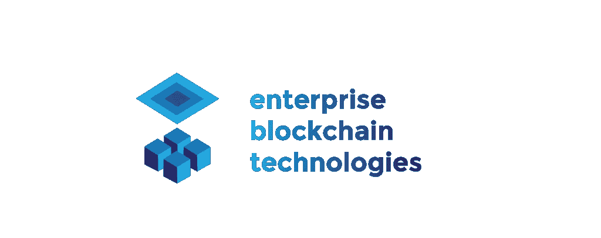

# 从头开始学习 Fabric v2.2

> 原文：<https://medium.com/coinmonks/enterprise-blockchain-technologies-a-university-level-open-source-course-e3d77d38915a?source=collection_archive---------10----------------------->

```
A university course was recently launched, focusing on Fabric v2.2Enterprise Blockchain Technologies is a **flexible, extensible, open-source university course, part of Hyperledger Labs**🎓

This course aims at providing a reliable basis for university students to get started in enterprise blockchain.

This course contains the practical part of a university course on enterprise blockchain technologies.
```

