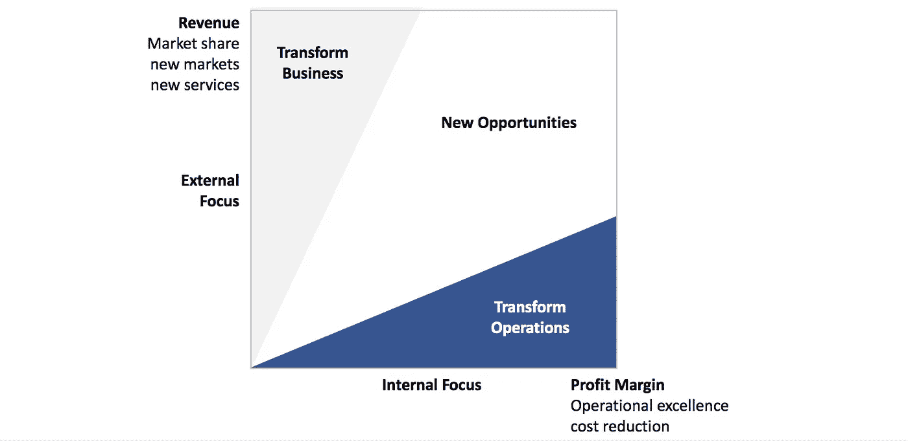

# 企业区块链:商业价值在哪里？

> 原文：<https://medium.com/coinmonks/enterprise-blockchain-where-is-the-business-value-ead60bbd2cb2?source=collection_archive---------2----------------------->

## 分布式账本技术主管指南(第 1 部分)

**TLDR:** 在寻找使用分布式账本技术的商业案例时，你需要考虑该技术的优点以及它创造的新经济系统。虽然使用技术可以降低成本，特别是在与其他方的互动中，但代币经济可以创造全新的方式与客户互动，创新商业模式，以及除此之外的机会。

在最近关于 Unchained 播客的一次讨论中，区块链或分布式账本技术(DLT)项目的当前数量估计约为 5000 个，目前全球约有 50000 至 100000 人参与该生态系统。与仅在美国的[670 万技术工人相比，这仍然很少。然而，随着生态系统的成长和成熟，以及项目推出他们的平台和解决方案，更广泛的](https://www.comptia.org/about-us/newsroom/press-releases/2016/03/01/u.s.-tech-industry-employment-surpasses-6.7-million-workers)[行业采用](https://enterprisersproject.com/article/2018/2/5-blockchain-statistics-cio-reality-check)预计将在未来 12-24 个月内发生。

随着新的创新解决方案不断涌现，以及媒体对大约 1000 亿[加密货币市值](https://coinmarketcap.com/)的关注，许多高管想知道该技术对他们业务的影响。在这篇由多个部分组成的博文中，我将尝试回答他们的一些问题:

**第一部分:**商业价值在哪里？(本帖)
[**第二部分**](/@sebastianhrw/enterprise-blockchain-are-we-there-yet-7090b3841b11) **:** 行业采用的是什么状态？
[**第三部分**](/@sebastianhrw/enterprise-blockchain-which-are-enterprise-ready-46bd4b49dd02) **:** 哪些解决方案是企业级的？

要了解 DLT 解决方案的价值潜力，有两件事很重要:1)DLT 的关键特征，以及 2)加密货币如何融入其中。

**[**DLT 创建了一个永久的、分散的、全球的、不可信任的记录分类帐**](https://www.coindesk.com/information/applications-use-cases-blockchains/) ，即一旦存储了某样东西，就不能更改或删除，没有单点故障，可以从互联网上的任何地方访问，并且不需要可信任的第三方来安全地进行交易。因为这些特性是开箱即用的，无论何时需要它们，使用 DLT 都会产生一个节约案例。**

**当区块链项目创造一种新的加密货币时，加密货币不是他们的产品，而是他们的市场。他们正在创建一个新的经济系统，其中加密货币令牌是交换单位，DLT 技术允许将规则和激励措施嵌入到这个经济系统中。在某种程度上，他们正在开发一种新的游戏规则，任何人都可以参与其中。这是真正的游戏规则改变者；它不仅支持和促进新型的合作，还允许将以前未参与的各方纳入进来。**

> **你可以通过奖励代币来让人们做事。区块链是激励机器。——[特伦特·麦康纳](https://blog.oceanprotocol.com/can-blockchains-go-rogue-5134300ce790)**

**为了深入挖掘 DLT 的商业价值潜力，我正在使用埃森哲数字战略框架[的调整版](https://www.accenture.com/de-de/insight-digital-acceleration-program)将用例分为三个类别:转变运营、转变业务和新机遇。**

****

****转型运营**:这一类别着眼于企业价值网络内部流程和互动的潜在收益。这里的主要价值驱动因素是降低成本。**

*   ****支付**:分散式支付可以省去中间商和收取的费用(尤其是在国际交易中)，并减少管理工作，例如清算、结算或通过使用智能合同对收到的货物进行支付。**
*   ****资产跟踪**:将 DLT 解决方案集成到记录保存系统中，可以利用其永久特性来降低维护数据审计跟踪的成本，尤其是跨组织的数据审计跟踪。例如，这可用于跟踪资产或受控物品的所有权来源、供应链上的货物、研究环境中的数据或用于审计的财务数据。**
*   ****数据共享**:DLT 可用作组织间交换数据的记录系统，无需运行维护当前数据及其完整性的第三方的额外成本。这有助于防止假冒/欺诈、供应商网络内的需求同步或保存公共记录。**
*   ****身份管理**:分散式解决方案可用于避免组织中必须管理用户控制的身份(用户帐户)或身份验证(政府颁发的身份)的冗余。例如，这可以用于 KYC、信用历史检查、人力资源背景检查或学术证书验证。**
*   **[**云 2.0**](https://cointelegraph.com/news/why-blockchain-is-cloud-20-expert-take) :基于 DLT 的在线资源提供将云的按需和可伸缩性前提带到了一个分散的设置中，在那里可以通过利用未使用的资源以更低的价格提供服务。这可以应用于例如文件存储、数据库、网络管理或高性能计算。**

****转变业务**:除了技术之外，包括技术带来的代币经济，新型客户互动和创新业务模式的方式也有潜在价值。**

*   ****客户参与度**:创造一种经济，为其参与者提供综合激励，让他们以特定方式行事，这可能是吸引客户的有力工具。例如，这可以是忠诚度计划、对客户洞察的奖励或对平台贡献的激励的形式。**
*   ****微交易**:代币经济可以使基于消费的实时支付模式变得可行，与固定费用或订阅模式相比，客户只需支付实际消费的费用。这可以是一种将内容货币化、收取版税、收取许可费或收取广告费的方式。**
*   ****创造新的市场**:让建立市场业务变得更加便宜和容易，可以为任何类型的资产创造市场。这可能是以前的非流动性资产，如未使用的生产能力，或作为原材料、零件、商品和服务的二级市场。**

****新机遇**:结合技术和令牌生态系统的潜在价值来看，新机遇正在出现，它们既不属于核心价值链，也不属于核心商业模式。**

*   ****融资**:类似于 2017 年的 ICO rush 如何使加密货币发行成为早期创业公司的一种公认的融资方式，类似的发展可以预期用于使用(安全)令牌发行作为资本收购手段的大型公司(例如 Telegram，tZero)。**
*   ****访问数据**:随着数据成为推动当今企业发展的新动力，访问大量相关数据变得越来越重要。代币经济可以创造市场，在那里，正确的激励允许创造和交换(受隐私保护的)个人数据、众包数据和来自私有设备的数据。**
*   ****群体协作**:使用代币经济的机制来激励某些行动和行为可以成为超越组织边界的协作平台。例如，它可以用作流动劳动力的任务管理和支付平台，或者用作人群预测市场的基础。**
*   ****自治组织**:使用 DLT，可以创建没有任何雇员的虚拟组织，这些虚拟组织只通过智能合同中编码的规则运行(所谓的分散自治组织或 Dao)。可以建立这些类型的组织，例如管理合资企业、行业协会或中央主管机构的某些方面。**

****这些价值机会的另一面当然也是对当今企业的威胁。**根据 WEF 的分析，自 2000 年以来，数字颠覆已经导致超过一半的财富 500 强企业破产，而采用 DLT 很可能会加剧这一趋势。**

**与其他数字技术类似，竞争对手将面临盈利压力，他们能够更好或更快地利用 DLT 带来的成本优势。**

**此外，某些企业将面临被淘汰的风险，因为他们看到自己的产品所提供的附加值正受到一丝不苟的挑战。**

**类似地，商业模式的某些部分甚至整个商业模式都面临着被分散化的风险，代币经济即使不能取代整个市场，也至少会占据市场份额。**

**当然还有创新者的困境。DLT 和代币经济可能是一个行业内新的最初劣质产品的推动者，这些产品在市场变化时慢慢接管市场。**

**这项技术将会改变游戏规则；它会影响你的竞争力、你的竞争对手和你的市场！**

**请让我知道你对这篇文章的想法，如果你能想到任何进一步的企业用例或威胁，也请让我知道！**

****