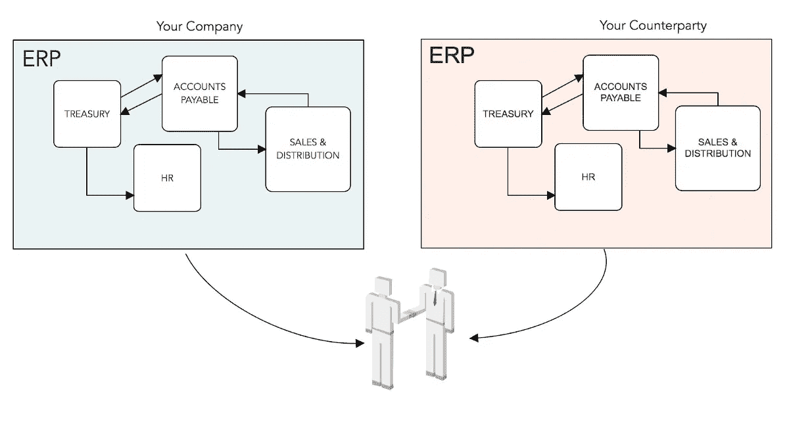
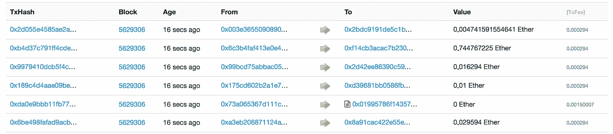

# 企业区块链 Now:金融专业人士快速入门指南。

> 原文：<https://medium.com/coinmonks/enterprise-blockchains-now-a-quickstart-guide-for-finance-professionals-d3013cb2ca16?source=collection_archive---------4----------------------->

## 我知道你已经受够了。

## 哦，不，不要又是“区块链介绍”！

让我解释一下。我有金融技术咨询的背景，我通常花更多的时间在业务上，而不是工程师身上。

在我向金融界人士解释区块链的旅途中，我得出的结论是，人们必须把技术帽子放在会议室外面。作为金融技术顾问，我们有时很难做到这一点，可能是因为我们担心过于简化的术语会导致误解。这有时是正确的，但我认为区块链还不是这种情况(原因将需要一个单独的职位)。简而言之，在等待预算报告和现金预测的时候，商务人士不会总是有时间或能力去听关于前导零的事情。

因此，在这篇文章中，我将试着做到以下几点:

1.  **用最简单的方式给出基本的解释**
2.  **简要总结当前 DLT 金融解决方案的前景**
3.  **为金融专业人士量身定制文章，并给出我对该主题的个人观点**

*在本文中，术语区块链、分布式账本技术和 DLT 将互换使用。*

## 好吧，我们开始吧。你能用一个例子解释主要想法吗？我看到了一些针对不同事物的解释。

好的。想想你在工作中使用的 ERP 模块。可能是一个财务管理系统，一个应付账款系统或一个销售和分销系统，任何有分类账的系统。IT 人员把它做得无懈可击。只有你和你的同事可以输入和检索信息，没有外部各方。这是公司的机密数据。

但实际上，这些数据中的一些代表了与外部实体交换的交易和价值。这些对外界还是保密的，但你和你的交易对手之间不是。例如，当您向供应商付款时，付款金额会记录在您密闭的 ERP 内的分类账中，但这也是您与供应商共享的信息。怎么分享？嗯，有发票，电子邮件，电话，硬拷贝等等。你肯定**没有**给供应商任何访问你的 ERP 总账的权限。所以，对账还是要做的，但是要在每个人的账本之外。

如果有一种方法可以将 ***公共数据*** 记录在 ***共享分类账*** 上，这样我们就不会在对账和争议中浪费时间，会怎么样？你在这里…

## 好，我举个例子。有什么我需要知道的专业术语吗？

这是你最起码需要知道的:

❒ **分布式账本技术(DLT):** 一种技术架构/概念，在这种架构/概念下，多个交易方(*认为是公司、供应商、客户*)共享一个他们拥有**共同控制权**的公共数字账本。该分类帐通过一致同意的机制用新的交易和数据来更新，而不需要可信的中央机构。

❒ **区块链:**一种**类型**的分布式分类账，在这种分类账中，交易被捆绑成块，并通过一致同意的机制添加到分类账中，形成一个序列(链)。支撑最著名的加密货币(比特币、以太坊)的分布式账本是区块链。

❒ **智能合同:**作为计算机程序编写的合同，在分布式分类账上运行，并在满足预定条件时执行。例如，用计算机代码编写并在分布式分类账上运行的外汇期权合约就是智能合约。

## 什么时候使用这些才有意义？

请记住这一点:*业务网络与* ***多个潜在的不信任交易对手*** *，都是区块链用例*。客户-供应商、银行-发行者-投资者-监管者网络等。

## 主要优势是什么？

*   运营效率、时间节约
*   成本节约
*   降低风险(诉讼风险、结算风险、外汇风险、运营风险，取决于业务和解决方案)

## 这个“加密”的东西在这里起什么作用呢？

Crypto 代表*密码术*。背景:区块链的想法是为比特币制定的*。从这个想法，企业区块链诞生了。作为一种数字资产，比特币通过计算机科学、金融、数学和密码学的巧妙结合，从概念变成了现实。*

密码学在分布式账本技术架构中是至关重要的。它保证了分类账的完整性和交易的有效性。因此，无论是比特币公共区块链还是你的私人企业分布式账本网络，加密技术都是它的安全所在。密码术是如何做到这一切的，这是一个令人兴奋的话题，但不是这篇总结文章的主题。

## 密码学使得区块链交易匿名了吗？匿名是重点吗？

不完全是。围绕这一点(仍然)有许多误解。

让我们后退一步。比特币、以太坊等区块链*公开*。不，这并不意味着“[在区块链，人人都知道你是一只狗](https://en.wikipedia.org/wiki/On_the_Internet,_nobody_knows_you%27re_a_dog)”。这些公开区块链上的交易都是**化名**和**不匿名**。每个人都可以看到你的交易和账户余额。但这些账号只是字母数字串(见下图截图)。所以，没人知道是你…直到他们发现。

Ethereum transactions on plain sight (etherscan.io)

## 但是，如果隐私可以以这种方式受到损害，银行和其他公司将如何使用这些区块链呢？

他们不会使用它们。或者至少不是以这种方式。

*隐私问题*生了什么叫做 ***被许可*** 区块链。这个想法也很简单:许可区块链是一个*私人分布式分类账网络*，在这里你需要被授予许可才能成为会员。相反的是 ***无权限*** 。作为一个个人，你可以下载任何公开的、无许可的账本(例如比特币区块链)，并查看每一笔交易。除非你是会员，否则你不能在许可的区块链这样做。想象一下，一家银行和它的交易对手共享一个公共的分布式账本。他们不希望任何人能够查看机密交易，所以他们设置了一个许可区块链。

## 好的，但是我发现又有一个隐私问题，尽管规模较小:所有成员之间的交易不会被同一个许可网络中的每个人看到吗？

不会。区块链提供商已经开发出解决方案，可以在交易时在专用网络中保密。您只分享您必须分享的内容，并且您分享的内容只对拥有合法权益的成员(客户、投资者、监管者等)可见。).

## 他们是怎么做到的？

以各种方式，取决于提供商的方法。一些依靠先进的加密概念，另一些依靠可信的硬件(如英特尔 SGX)。这可能变得非常技术性，这不是这篇文章的目的，但知道有不同的途径来实现交易保密是很重要的。

## 那么这些区块链供应商是谁呢？

主要参与者概述如下:

## [**R3**](https://www.r3.com)

R3 是由 200 多家公司组成的财团。他们的 DLT 解决方案是 Corda。R3 的明确重点是金融服务行业，Corda 提供了一个平台，用于在分布式分类帐上编写和托管该行业的合同和交易。

## [总账](https://www.hyperledger.org)

Hyperledger 是 Linux foundation 下的一个 hub。Hyperledger 最成熟的区块链框架是 **Fabric** 。越来越多的软件公司开发基于 Hyperledger Fabric 的解决方案，解决不同的供应链问题，如食品安全和冲突钻石跟踪。Hyperledger Fabric 已在金融服务试点项目中使用。

## [摩根大通](https://www.jpmorgan.com/global/Quorum)

作为一家公司，JP 摩根无需介绍。 **Quorum** 是银行为金融服务业提供的 DLT 解决方案。JPM 的团队遵循了一种不同的方法:Quorum 是作为公共以太坊协议的一个版本建立的，专注于金融交易的隐私和保密。

## [数字资产](https://www.digitalasset.com)

[Digital Asset](https://medium.com/u/c8ff06a8061d?source=post_page-----d3013cb2ca16--------------------------------) 是一家构建分布式账本技术解决方案的公司，专注于受监管的金融机构。Digital Asset 的有趣方法与其竞争对手不同，因为它开发了一种建模语言 **DAML** ，该公司的应用程序就是用这种语言构建的。

## [**波纹**](https://www.ripple.com)

Ripple 主要针对对当前 SWIFT 业务模式构成直接威胁的汇款业务。Ripple 的解决方案之一 xRapid 使用本地令牌 XRP 来结算支付。几个月前，你不能错过 XRP 的新闻，因为它的价格在 2017 年飙升。

## 就这些吗？

不会。以上是最知名的供应商，业务遍及全球。在 DLT 金融服务市场上，还有其他规模较小但令人印象深刻的参与者。一些著名的公司是 Axoni 和 SETL T21，这两家公司专注于 DLT 的资本市场技术公司。另一方面，在 FCA 的批准下，Nivaura 正在成功地测试区块链的金融交易，这表明许可网络可能不是该行业的唯一途径。

## 哪个是最好的？

这个问题没有答案。每个公司都采取了自己的方法。有些非常相似，有些则完全不同。时间会证明的。金融机构通常会测试一个以上的框架，以便找到最合适的框架

## 那么，存在一个激烈的竞争和网络之间的战斗，直到赢家获胜？

不尽然。目前看来，不会出现“赢家通吃”的局面。首先，不同的 DLT 供应商，不仅他们有不同的方法，他们如何建立企业区块链，但一些不同的重点。例如，瑞波币(Ripple)尚未尝试为债券发行提供解决方案。他们专注于支付业务，而且凭借非常成熟的解决方案套件在这方面非常强大。

第二，区块链供应商的主要潜在客户分散了风险。花旗投资于 Digital Asset 的同时，也是 Hyperledger 和 R3 的成员。摩根大通还投资了数字资产，同时开发了自己的解决方案 Quorum。大公司，从银行到咨询公司和软件公司，都选择成为两个或多个不同区块链倡议的利益攸关方。

市场竞争健康，跨协议协作和标准化正在努力。

## 最近有什么值得一提的使用案例吗？

很多。下面是最近的几个例子:

*   4 月 26 日， [**BBVA** 宣布](https://www.bbva.com/en/bbva-indra-deliver-worlds-first-blockchain-supported-corporate-loan/)成为首家使用分布式总账技术发放贷款的全球银行。
*   **加拿大国家银行** [宣布](https://www.newswire.ca/news-releases/national-bank-of-canada-nbc-and-jp-morgan-test-blockchain-technology-with-nbc-debt-issuance-in-the-us-financial-markets-680356913.html)发行 1.5 亿美元的扬基债券，该债券与**摩根大通**在法定人数区块链进行了模拟。
*   **R3** 已与其成员银行参与一系列项目。[其中一个项目](https://www.r3.com/news/r3-and-four-banks-test-euro-commercial-paper-issuance-on-corda-dlt-platform/)涉及与 ABN Amro、德国商业银行、荷兰国际集团和 KBC 发行欧元商业票据。
*   澳大利亚证券交易所 [ASX 将使用 Digital Asset 开发的 DLT 解决方案取代](https://www.bloomberg.com/news/articles/2017-12-06/blockchain-scores-major-win-as-australian-exchange-plans-shift)他们的清算和结算系统。
*   **Santander** [推出了](https://ripple.com/insights/santander-launches-first-mobile-app-for-global-payments-using-ripples-xcurrent/)跨境支付移动应用，使用 **Ripple** 的分布式总账技术。

## 印象深刻。另一面是什么？

*   批评家认为这都是炒作。翻开《金融时报》,你会发现大多数评论文章都在加倍攻击区块链。主要论点是，基于可信的中央权力机构的现有架构很好地服务于资本主义，没有令人信服的理由取代它们。
*   需要更多的**测试**。当前的 DLT 产品越来越成熟，但它们仍在基于从概念验证项目中吸取的经验教训进行**开发**。一些业务和监管复杂性较低的解决方案已经可以投入生产。资本市场的解决方案正朝着被采纳的方向迈出小步。
*   随着 DLT 解决方案的丰富，另一个问题出现了:**互操作性**。如果不同的解决方案获得市场份额，它们将需要能够在它们之间进行通信。否则，效率收益将会消失。对于 DLT 的案例来说，创建孤立的信息毫无意义。想象一下，不得不使用两到三个不同的资本市场平台和另外两个支付平台，却无法相互传递价值和信息。没有。
*   即使所有的技术问题都解决了，监管的障碍还是会到来。事实上，他们已经开始敲门了。幸运的是，一些监管机构，如英国的 FCA 和瑞士的 FINMA，已经非常开明，并通过制定指导方针和设置沙盒欢迎区块链的创新。然而，这些举措仍处于早期阶段，更多的国家将不得不效仿。

## 你有什么看法？

尽管有些批评是合理的，但我不认为这都是炒作。

但对我来说，区块链最有趣的地方不在直接效率收益的常见列表中。我认为最令人兴奋的是，Marco Iansiti 和 Karim R. Lakhani 在他们的《哈佛商业评论》文章“[区块链的真相](https://hbr.org/2017/01/the-truth-about-blockchain)”中将其描述为一项基础技术:

区块链作为一项基础技术，需要很长时间才能站稳脚跟，因为它从根本上改变了我们做事的方式。令人兴奋的是，可能有我们还没有想到的方法来做事情。例如，众所周知，区块链的跨境支付将在几秒钟内完成，而不是几天，这将节省我们的时间和金钱，但长期效果会如何呢？在那之后，代理银行业务看起来还会一样吗？闪电般的支付会产生新的商业模式吗？

前方是一条激动人心的路！

感谢阅读😊对于这个主题的任何问题**或愤怒的评论**，请随时联系:

【www.linkedin.com/in/ikarosmatsoukas 