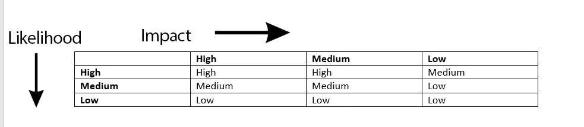
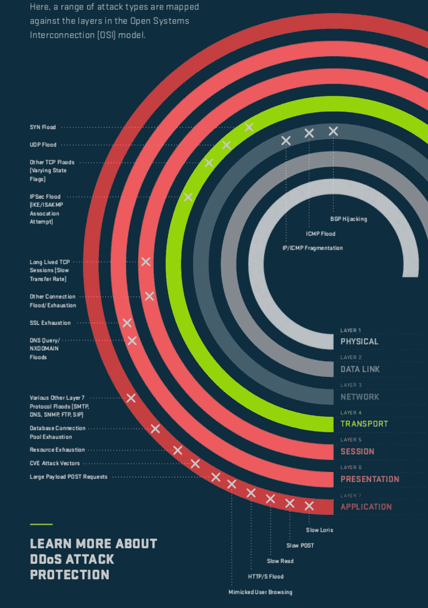

# EOS 块生产商的企业安全框架

> 原文：<https://medium.com/coinmonks/enterprise-security-frameworks-for-eos-block-producers-59bc9d1773e4?source=collection_archive---------6----------------------->

*由 Blockgenic 安全团队*

— — — — — — — — — — — — —

*我们的团队成员已经制定了七项关于认证、身份和加密的互联网(IETF RFCs)标准，拥有七项专注于安全的授权专利，管理并在 Windows 等广泛使用的产品中构建了关键的消费者和企业安全功能，并管理了包括 Bing 和 Azure 在内的关键云基础设施的安全。*

— — — — — — — — — — — — — -

尽管加密货币社区一直是许多高调黑客攻击的目标，但目前没有一个加密平台拥有全面的安全框架。

虽然我们已经在 EOS 社区中讨论了安全问题，但一般都集中在一两个特定的问题上。一个设计良好的安全框架使我们能够识别 EOS 基础设施的主要威胁，并关注这些威胁。

在这篇文章中，Blockgenic 详细介绍了我们计划实施的流程和框架。相应的安全计划作为一个单独的文件附在这篇文章的底部。我们鼓励所有拥有安全计划的 BP 分享他们的计划，这样整个社区都可以从我们的最佳实践中受益。

**安全框架**

有多种安全框架可用于保护信息资产，尽管它们在细节上可能各不相同，但总体方法非常相似。第一步是对信息资产以及这些资产面临的相关威胁进行识别、分类和优先排序。第二是实现一组安全控制来保护这些资产免受相关威胁。第三是检测旨在规避这些控制的攻击。第四是对这些攻击做出响应以最大限度地减少损失，最后第五是有效地计划从这些攻击中恢复。

NIST 800–53、ISO 27000 系列、COBIT 5、RFC 2196 等。都是这种安全框架的例子。虽然没有完美的安全框架，但是实施一个安全框架可以大大降低攻击的可能性和风险。

在 Blockgenic，我们选择使用 NIST 网络安全框架，因为它简单直观，是 Blockgenic 所在的美国使用最广泛的企业安全框架。如果企业遵守 NIST 网络安全框架[【1】](#_ftn1)[【2】](#_ftn2)，有一项待决立法将为企业提供一个免受责任的避风港。NIST 网络安全框架规定了组织网络安全活动的五大功能:识别、保护、检测、响应和恢复。

我们鼓励您阅读本文的其余部分，详细介绍该流程，但如果您想直接进入详细的框架具体建议[此处](https://www.dropbox.com/s/8qkeb4l3ppc9a4a/BlockgenicCyberSecurityFramework.docx?dl=0)。

**识别**

有效的安全框架的第一步是识别有价值的资产，对它们进行分类，并确定它们的优先级。识别功能的一部分还包括对与这些资产相关的威胁进行识别、分类和优先级排序。如果我们不指出我们看到一个组织甚至对其管理的所有资产都没有全面了解的情况，那将是我们的失职。显然，如果一个人甚至不知道一项资产，那么就很难保护它。

通常，安全实施是诸如防火墙、HSM、DDoS 保护等技术术语的拼凑，而没有对受保护的资产和所有相关威胁进行任何清晰的思考。资产的安全性仅取决于保护链中最薄弱的环节，因此，例如，对由于用户凭证薄弱而容易受到损害的密钥进行强离线加密，并不会给系统的整体安全性增加太多。对于数据块生成，我们根据安全风险确定安全投资的优先级，其中

安全风险=安全事件的可能性 x 对 EOS 平台的影响

对于这个简化的示例，我们将可能性、影响和风险分为高、中或低。我们选择了 2 项特定资产 1)block genic 团队成员用于节点管理的帐户 Blockgenic BP 节点为用户提交交易而公开的 EOS 终端用户 API 3)block genic 网站。我们还看了针对这些资产的一个具体威胁:1)帐户的凭证泄露，以及 API 的分布式拒绝服务攻击

我们将使用这些例子来完成框架的其余部分。

**国书妥协**

出于本讨论的目的，我们确定凭据泄露攻击发生的可能性为高，影响为高，导致总体风险级别为高。

***可能性:高***

凭证泄露攻击之所以频繁，是因为它们相对简单，并且极易受到社会工程的影响。虽然黑客的经典形象是采用复杂的技术，但现实是超过 50%的攻击是社会工程攻击[【3】](#_ftn3)。

最近窃取了 7800 万美元的 Nicehash 攻击始于他们的一名工程师的 VPN 证书的泄露[【4】](#_ftn4)。

***影响:高***

泄露的凭据允许攻击者做合法用户可以做的任何事情，并且被检测到的机会很低，除非攻击者采取显著的措施。

***总体风险:高***

下面的矩阵代表我们的风险映射矩阵，其中列代表影响，行代表可能性

**DDoS**

***可能性:高***

大多数攻击(不是全部)的主要动机是赚钱的能力。传统上，通过关闭一项服务来赚钱比获得对它的无限制访问要难得多。一个人要么必须做空标的资产，这意味着采取高风险的敌对立场。当然，现在的黑客很有创意，他们会在 DDoS 流量中嵌入勒索信。

***影响:中等***

即使攻击者成功地关闭了一个 BP，他们也无法注入任意的事务，例如使用被破坏的凭证和几个备用生产者，对网络本身的影响不会很大。

还有 EOS。IO 软件本身具有内置保护功能，可以抵御其他加密网络常见的高级资源消耗攻击[【7】](#_ftn7)。

***总体风险:中等***

注意:这是一个非常小的威胁样本集，我们鼓励业务伙伴制定一个全面的资产和威胁列表，作为其风险确定的一部分。此外，这些测定必须不断评估，并可能随着条件的变化而变化。

在确定了这些风险之后，我们接下来检查可以用来防范这些风险的步骤。

**保护**

理想情况下，我们将按照威胁的优先级列表进行工作，适当地花费资源来防范这些威胁。

**凭证妥协:**

智能卡:通过诸如在线密码破解、离线密码破解、网络钓鱼、键盘嗅探等攻击，凭证可能会被意外或故意泄露。一个好的保护解决方案应该能够有效抵御大多数(如果不是全部)攻击。我们的首选解决方案是 USB 智能卡解决方案，如 Yubikey，其中私钥在智能卡上生成，并且永远不会与保护智能卡的强 PIN 一起离开智能卡[【9】](#_ftn9)。这确保了智能卡被解锁并且仅用于授权的签名和解密操作。

在应用中缺少智能卡支持的情况下，私钥可以存储在加密的 USB 驱动器上，但是这在操作期间会暴露密钥。

密码:如果上述情况不可行，则可以使用适当的密码管理策略来管理密码的复杂性、防止重复使用、轮换等。我们建议使用至少 16 个字符的真正随机密码。不幸的是，即使有最好的管理，密码也可能通过网络钓鱼、键盘嗅探恶意软件等方式泄露。真正随机的密码很难记住。

关于密码恢复管理的注意事项:正如我们上面提到的，系统的安全性取决于最薄弱的环节。除了可能被网络钓鱼、意外运行恶意软件等的操作人员之外。另一个经常被利用但不太为人所知的薄弱环节是密码恢复系统。如果恢复是通过弱保护的电子邮件帐户进行的，那么使用强随机密码是没有用的。即使恢复电子邮件帐户本身有一个强密码，恢复电子邮件可能是通过短信或另一个系统，可以妥协的社会工程。我们强烈建议在所有账户上使用像 google authenticator 这样的认证应用程序设置双因素认证，因为基于 SMS 的双因素认证最近受到了很多社会工程黑客的攻击。[【10】](#_ftn10)

**分布式拒绝服务攻击:**

DDoS 攻击是由攻击者控制大规模僵尸网络(通常是数以万计的受损机器)并使用它们来产生攻击流量。流量可以是任何东西，也可以像合法流量一样简单，但大多数 DDoS 攻击通常利用应用程序或协议栈中的弱点来增强其有效性。防止针对需要公开的服务的 DDoS 攻击尤其困难。

Source: Arbor networks

DDoS 攻击可能发生在从 L3 到 L7 的任何网络层，一个好的解决方案必须防范所有层的所有攻击，而不仅仅是一两层。

ping 泛洪等第 3 层 DDoS 攻击通常试图利用 ICMP 协议的弱点。另一种常见的方法是利用路由协议中的弱点，但随着时间的推移，这些弱点变得更有弹性。

最常见的第 4 层攻击是 SYN 泛洪和 UDP 数据包泛洪，但其他攻击可能使用 ack、fin 和 rst 的组合来攻击目标。

第 7 层攻击利用 HTTP 弱点或应用程序有效负载中的弱点，如 SQL 查询。

保护措施应该能够有效抵御针对不同层的各种攻击。

有两种高级别的保护方式

*卸载到外部 DDoS 保护服务:*这可以在应用层或更低层完成，并通过使用任播将流量路由通过保护提供商的边缘网络和清理中心来工作。一些最常见的 DDoS 预防服务(如 Cloudflare、Akamai Kona/Prolexic、Arbor networks、Incapsula 等。)在应用层使用这种方法。服务提供商负责在清理中心过滤流量，自动算法通常由人员进行增强。这种组合通常是有效的，因为流量在靠近其来源的多个点被拦截，而不是等待它集中在目的地网络，在那里它可能淹没任何过滤服务。

这确实需要客户/BP 将 DNS 名称服务器外包给保护提供商。此外，这要求终端服务器限制与服务提供商的通信和/或隐藏其实际地址，因为否则服务器可能绕过保护服务而被直接攻击。即使有流量白名单(在第 3 层实施)，如果真正的服务器端点被攻击者[【11】](#_ftn11)所知，第 3 层的攻击也可能被发起。此外，DDoS 保护提供商[【12】](#_ftn12)[【13】](#_ftn13)的中断将导致 BP 或多个 BP 的中断，从而导致整个 EOS 生态系统对其中一两家提供商的不健康依赖。

*签约云/数据中心厂商 DDoS 保护:*AWS、Azure、Google Cloud 等主流云厂商都提供 DDoS 保护服务。如果您的服务托管在云上，优势之一是您的云供应商已经控制了网络堆栈的所有层，并且有足够的能力来处理激增。缺点通常是等到流量集中在目的地时，这意味着算法不擅长清除 DDoS 流量，尤其是在尚未建立合法流量的长期配置文件的情况下。

*自动横向扩展:*这种方法的好处之一是，在 DDoS 攻击期间，您的云供应商可以提供自动横向扩展的成本积分。但是这要求您的服务可以自动扩展到多台机器。因此，虽然这对于非生产节点可能是有用的，但是生产节点受到块生产代码的单线程性质的限制。

*测试 DDoS 防护:*通常很少或根本不测试 DDoS 防护措施，或者使用一种特定的工具或攻击类型进行测试。因此，它的第一次测试将是在一次真正的攻击中，让每个人都惊讶的是，对一种类型的流量如此有效的措施在真正的攻击中却变得无效。我们建议使用全面的 DDoS 测试服务，如 Breaking Point Cloud 或 Nimbus DDoS 攻击平台，它们可以跨网络堆栈的所有层执行一系列攻击，而不是通过测试一两个工具来获得虚假的安全感。

上述 DDoS 保护服务通常每月花费 5000 美元以上。Blockgenic 计划使用上述提供商之一，并且仍在评估多个服务以最终确定一个。我们鼓励目前可能无法负担这些服务的小型业务伙伴不仅从保护功能的角度考虑安全性(正如大多数人所做的那样)，还考虑检测、响应和恢复功能，这些功能有助于减轻保护功能中的弱点。由于时间不够，我们将在以后的帖子中详细介绍这些功能，但已发布的框架包含了所有功能的过程。这意味着要有一个有效的策略来启动一个备用的生产者节点，并在受到攻击时与其他 BP 进行通信。对于等待列表中较低位置的 BP 来说，这可能已经足够好了。但是请注意，自动故障转移或流量重定向只会将 DDoS 流量重定向到新节点，因此需要手动方法。稍后，我们将发布一篇详细的帖子，阐述我们对 BP 社区如何在这方面合作以提高整个区块链网络的弹性的想法。

# [**下载区块链网络安全框架**](https://www.dropbox.com/s/8qkeb4l3ppc9a4a/BlockgenicCyberSecurityFramework.docx?dl=0)

(您可以从上述链接以可编辑的格式下载详细的框架特定建议)

[【1】](#_ftnref1)NIST 网络安全框架的崛起:[https://www . csoonline . com/article/3271139/data-protection/The-rise-of-The-NIST-cyber security-framework . html](https://www.csoonline.com/article/3271139/data-protection/the-rise-of-the-nist-cybersecurity-framework.html)

[【2】](#_ftnref2)[https://www . dark reading . com/attacks-breakes/NIST-cyber security-framework-adoption-hamilted-by-costs-survey-finds/d/d-id/1324901](https://www.darkreading.com/attacks-breaches/nist-cybersecurity-framework-adoption-hampered-by-costs-survey-finds/d/d-id/1324901)

[【3】](#_ftnref3)[https://www . Forbes . com/sites/laurashin/2016/12/20/hackers-hackers-hackers-hackers-hackers-hackers-hacked-hackers-hackers-hackeds-hackers-hackers-hacked-million-does-only-use-phone-numbers/# 6 DBE 7 f 0d 38 ba](https://www.forbes.com/sites/laurashin/2016/12/20/hackers-have-stolen-millions-of-dollars-in-bitcoin-using-only-phone-numbers/#6dbe7f0d38ba)

[【4】](#_ftnref4)[https://www . Yahoo . com/news/bit coin-stocked-nice hash-robed-78-211500888 . html](https://www.yahoo.com/news/bitcoin-stolen-nicehash-robbed-78-211500888.html)

[【5】](#_ftnref5)[https://www . fire eye . com/blog/threat-research/2017/09/north-Korea-interest-in-bit coin . html](https://www.fireeye.com/blog/threat-research/2017/09/north-korea-interested-in-bitcoin.html)

[【6】](#_ftnref6)[http://fortune . com/2018/03/02/crypto-hackers-monero-DDOS-attack-ransom/](http://fortune.com/2018/03/02/crypto-hackers-monero-ddos-attack-ransom/)

[【7】](#_ftnref7)[https://steemit . com/EOS/@ dantheman/EOS-io-software-will-not-expose-from-denial-of-service-dos-attacks-like-ether eum](https://steemit.com/eos/@dantheman/eos-io-software-will-not-suffer-from-denial-of-service-dos-attacks-like-ethereum)

[【8】【http://www.engineerbetter.com/blog/yubikey-ssh/】](#_ftnref8)

[【9】](#_ftnref9)[https://suva.sh/posts/gpg-ssh-smartcard-yubikey-keybase/](https://suva.sh/posts/gpg-ssh-smartcard-yubikey-keybase/)

[【10】](#_ftnref10)[https://www . Forbes . com/sites/laurashin/2016/12/20/hackers-hackers-hackers-hackers-hackers-hackets-hackers-hackers-hackeds-hackers-hackers-hacked-been-million-does-only-use-phone-numbers/# 241155 ad 38 ba](https://www.forbes.com/sites/laurashin/2016/12/20/hackers-have-stolen-millions-of-dollars-in-bitcoin-using-only-phone-numbers/#241155ad38ba)

[【11】](#_ftnref11)[https://blog . Christophe TD . fr/bypassing-cloud flare-using-internet-wide-scan-data/](https://blog.christophetd.fr/bypassing-cloudflare-using-internet-wide-scan-data/)

[【12】](#_ftnref12)[https://www . Bauer-power . net/2016/03/in capsula-had-major-world wide-outage . html # . wvesl 4 gvyuk](https://www.bauer-power.net/2016/03/incapsula-had-major-worldwide-outage.html#.Wvesl4gvyUk)

[【13】](#_ftnref13)[https://Mashable . com/2017/11/21/cloud flare-is-down/# 6 BMG poa 59 PQS](https://mashable.com/2017/11/21/cloudflare-is-down/#6bmGpOa59PqS)