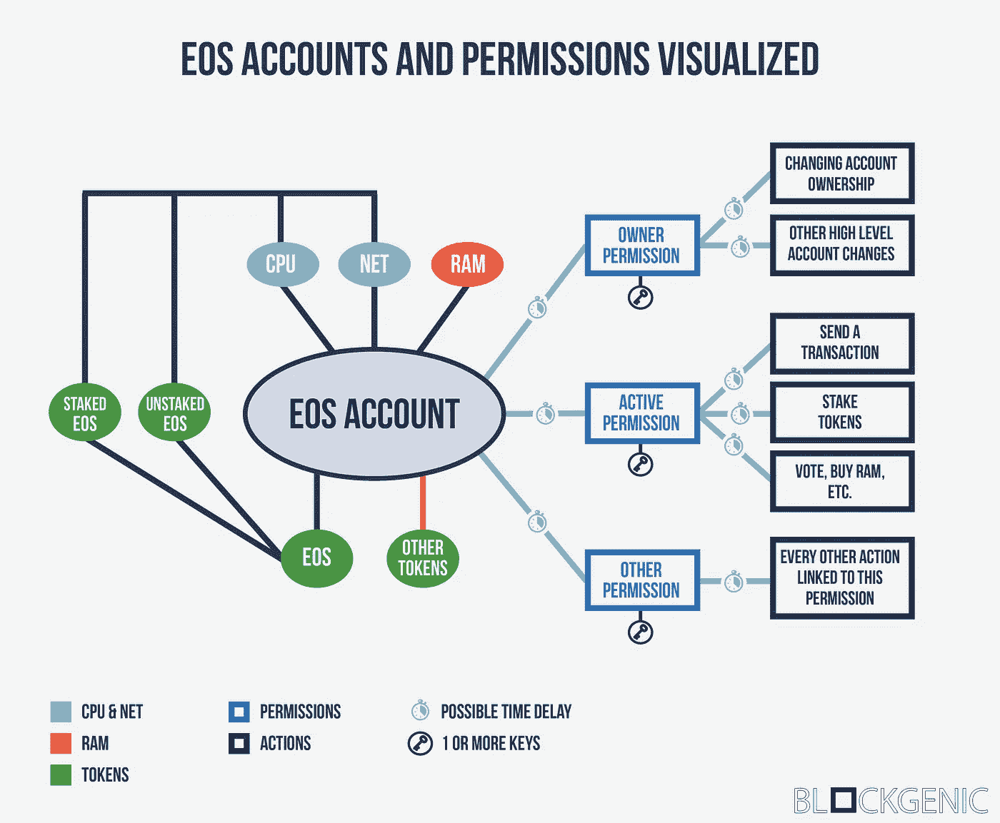

# EOS 帐户和权限可视化

> 原文：<https://medium.com/coinmonks/eos-accounts-and-permissions-visualized-677fc9c144e4?source=collection_archive---------4----------------------->

我们花了很多时间让 EOS 对每个人来说都是可以理解的，你可能已经看到并阅读了我们之前关于 EOS 账户和 EOS 权限的文章。我们现在已经创建了一个新的信息图，它向您展示了 [EOS 帐户](/blockgenic/eos-accounts-how-they-work-and-how-to-get-one-87019c0f7bc7)和 [EOS 权限](/blockgenic/eos-permission-management-2c0c1634fe39)是如何相互关联的，以及它们是如何工作的。

# 一点解释

没有一点解释，有些事情可能还是有点不清楚。“EOS 帐户”和权限之间的浅蓝色线表示 CPU 和 net 都需要使用任何权限。“EOS 帐户”和“其他令牌”之间的红线表示其他令牌占用了您帐户中的 RAM(除非令牌的创建者已经为 RAM 付费)。最后，小时间图标表示您可以设置时间延迟来执行任何操作或使用任何权限。

尽管如此，如果您还有任何问题，请随时向我们提问！

## 我们的社交

[网站](https://blockgenic.website/)
[推特](https://twitter.com/blockgenic)
[Youtube](https://www.youtube.com/channel/UCXTaehuAs3UWKnMVnT71MMQ)
[Meetup](https://www.meetup.com/nl-NL/Seattle-EOS/)
[Steem](https://steemit.com/@block21)

*作者为* [*作者为*](https://www.linkedin.com/in/yannick-slenter/) *作者为* [*作者为*](https://blockgenic.website/)

> [直接在您的收件箱中获得最佳软件交易](https://coincodecap.com/?utm_source=coinmonks)

