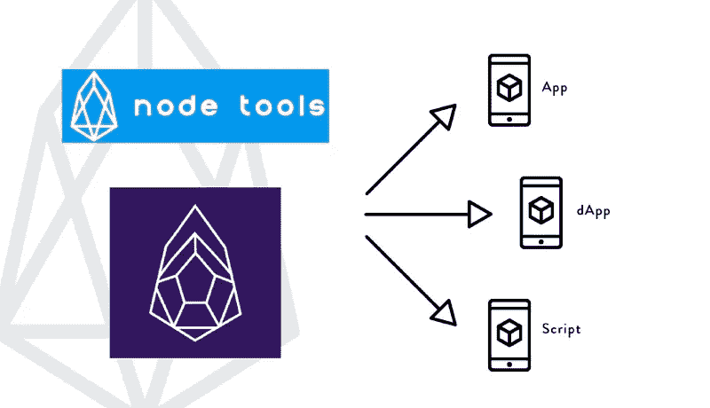

# 面向 dApps 和应用的 EOS API 最佳实践

> 原文：<https://medium.com/coinmonks/eos-api-best-practices-for-dapps-and-apps-2c5d295b06d5?source=collection_archive---------2----------------------->

对于钱包、脚本、应用和 dApps 的开发者来说，了解如何正确设置他们的 API 函数以从 EOS 链获取信息是很重要的。我有以下关于如何设置故障转移/回退服务器的信息。

## EOS API 的背景

EOS 有一个内置的 API 插件，用于主节点软件 nodeos。有多种过滤器可应用于通过此流程过滤的交易历史记录。运行具有完整事务历史的 API 节点的成本非常高。目前，11 月 2 日，nodeos 插件上完整历史的 RAM 使用量为 800GB，11 月 13 日超过了 1.2 TB。具有这种 RAM 容量的服务器每台成本超过 3 万美元，但是随着内存使用量的增长，运行 nodeos 是不可持续的。所以插件正在被分块重构。一个人的开发团队能够更好地与更具可伸缩性的数据库平台(如 postgresql)集成。

## 不良做法

目前有太多人们硬编码一个 API 的例子(最常见的是 Greymass)。这不是一个好的做法。不存在 100%正常运行的 API 节点。我见过很多依赖于 Greymass 的应用程序和脚本，它们的节点会不时出现故障。(实际上，当我写这篇文章的时候，它已经在今天早上下线了。)

## EOS API 代理

[Blockmatrix](http://blockmatrix.network) 团队为 EOS API 节点创建了一个优秀的 [geo-DNS 冗余代理。代理会自动将请求路由到能够处理这些请求的最佳服务器，在过去的两周内，他已经处理了超过 12 亿个请求。](https://eosnode.tools/proxy)



## 配置示例:用于 EOS API 故障转移的 Javascript 函数

下面是一个例子，说明我们如何建议在 js 函数中为 API 调用设置故障转移/回退。我推荐使用的主要 API 是[https://proxy . eosnode . tools](https://proxy.eosnode.tools)——其次应该至少有一个后备 API 节点(最好是另一个代理)。

在本例中，我将后备代理引用到了 [shEOS](https://sheos.org) 高可用性裸机服务器，但是您可以使用 EOS Nation report 中列出的[任何节点。](https://validate.eosnation.io/reports/endpoints.html)

```
EosRequest("/v1/chain/get_info", "[https://proxy.eosnode.tools](https://proxy.eosnode.tools)", "[https://api.proxy1a.sheos.org/](https://api.proxy1a.sheos.org/)");function EosRequest(path, url, fallback, retry = false) {
    let query = retry === false ? url : fallback;
    fetch(query + path)
        .then(function(response) {
            if (!response.ok) {
                if (retry === true) {
                    throw Error(response.statusText);
                } else {
                    return EosRequest(path, url, fallback, true);
                }
            }
            return response;
        }).then(function(response) {
            response.json().then(function(data) {
                console.log(data)
            });
        }).catch(function(error) {
            if (retry === true) {
                console.log(error);
            } else {
                return EosRequest(path, url, fallback, true);
            }
        });
}
```

有任何问题或意见吗？你可以在推特上找到我。

> [直接在您的收件箱中获得最佳软件交易](https://coincodecap.com/?utm_source=coinmonks)

[](https://coincodecap.com/?utm_source=coinmonks)