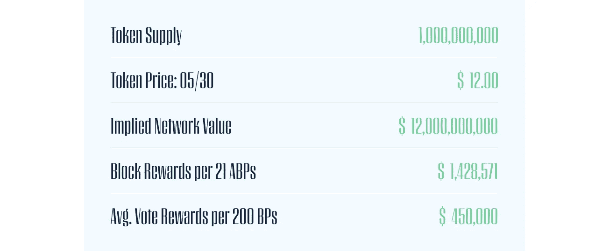

# EOS 块生产者投票指南

> 原文：<https://medium.com/coinmonks/eos-block-producer-voting-guide-fba3a5a6efe0?source=collection_archive---------1----------------------->

帮助 EOS 令牌持有者浏览注册和阻止制作者投票流程的指南

## ERC-20 代币注册

EOS Token (ERC-20)持有者必须在 2018 年 6 月 2 日 21:59:59 UTC 之前注册其以太坊地址。注册允许在发布 [EOSIO v1.0](https://block.one/news/eosio-1-0-release/) 后识别地址和相关余额。在美国和中国，如果不使用 [VPN](https://www.ivpn.net/) ，就无法通过 EOSIO 网站注册。

要使用 Block.one 的 web 界面注册，请前往 EOSIO [网站](https://eos.io)底部的“EOS 令牌分发”部分。

接下来，单击“获取 EOS”链接并选中相应的复选框，以同意协议条款并访问下图中的说明页面，其中包含地址注册的详细信息。

要使用 eosIO 软件通过命令行创建 EOS 公钥/私钥对，请安装“cleos”，这是作为 EOS 安装包的一部分提供的命令行工具，可从 [Github](https://github.com/EOSIO/eos/wiki) 下载。

打开 cleos，键入“cleos create key”。这将生成一个密钥对。生成 EOS 公钥/私钥对后，按照下图的 Block.one 说明页面中详细说明的地址注册过程进行操作。

Block.one ERC-20 Registration Instructions

## **区块制作人奖励**

将有 21 个活动区块生产商和大约 150-175 个备用区块生产商。前 21 名活跃砌块生产商将根据各自生产的砌块数量获得每块 0.25%的奖励。所有分组制作人(活动+备用)也将根据他们收到的投票总数按比例获得每票 0.75%的奖励。

Token Metrics and Estimated Block Rewards. Data as of 05/30/18.

Planned EOS Annual Inflation Allocation. Data and calculations as of 05/30/18.

## **初始选举期**

EOSIO v1.0 mainnet 上线后，将开始批量生产选举。ERC20 令牌余额将于 6 月 2 日 21:59:59 UTC 冻结，令牌余额的快照将用于在 EOSIO v1.0 mainnet 上分发 EOS 令牌。

快照之后，mainnet 将经历引导过程，选举将开始。当 10 亿 EOS 代币(150 MM)中的 15%已经投票时，最初的选举期将结束，法定人数将被视为已经达到。

在最初的区块生产者选举期间，将从区块生产者候选人中随机选出 21 名指定的区块生产者。一旦最初的选举期结束，任命的区块生产者将由正式选出的区块生产者取代。

EOS ERC-20 代币必须在 EOS 网络上注册才能投票。在初始选举期间，所有注册的令牌将自动以 50/50 的比例分配给网络带宽和 CPU。

## **投票机制**

每个赌注 EOS 代币可用于为多达 **30 个不同区块生产商候选人**投票，每个代币代表每个 BP 1 票，或每个代币多达 30 个不同 BP 投票。投票根据赌注标记的总数按比例加权，获得最多赌注加权投票的 21 个区块生产者将被选为“活跃”区块生产者。

投票是一个持续的过程，大约每两分钟重新计算一次票数。代币持有者也可以将他们的投票权委托或代理给任何其他 EOS 帐户。对改变投票没有限制，但是代币在被取消后将被锁定 3 天。

## **投票过程**

Block.one 将只通过命令行界面支持 EOS 块生产者投票。有少数社区开发的投票网站，如[https://eoswalletpro.com](https://eoswalletpro.com)和[http://vote . liberty block . io](http://vote.libertyblock.io)，但没有一个是 Block.one 官方认可或支持的

**投票注意:**要通过网络界面投票支持 Staked，请将“stakedstaked”指定为块生产者帐户名。对于投票和所有 EOS 交易，请使用您的有效密钥，而不是您的所有者密钥。这将确保您的资金可以在发生黑客攻击时收回。

可以通过命令行使用以下方向进行投票:

**设置:**

1.  安装作为 eos 安装包一部分提供的命令行工具“cleos”。
2.  创建一个钱包，解锁，并导入您的密钥。

**命令:**

1.  为“myaccountname”帐户投入 1000 个 EOS 令牌:cleos 系统代理 bw my account name my account name " 1000.000 EOS " " 1000.0000 EOS "
2.  为一个或多个块生产者投票:cleos system voteproducer prods my account name bproducerone bproducertwo

**或者:**

1.  **代理您的投票:** cleos system voteproducer 代理 myaccountname bproducerone

**投票注意:**要通过命令行投票支持 Staked，请将上面列出的命令中的“bproducerone”替换为“stakedstaked”。

## **街区奖励政策**

EOS 是目前唯一一个明确禁止大宗商品生产商与代币持有者建立金融关系，以获取大宗商品奖励和交易费的 PoS 网络，而这些奖励和交易费是为换取网络安全而产生的。

根据 [EOS 章程](https://github.com/EOS-Mainnet/governance/blob/master/eosio.system/eosio.system-clause-constitution-rc.md)第四条，“任何成员不得提供或接受任何有价物品以换取任何类型的投票，任何成员也不得不当影响另一成员的投票。”EOS 网络正计划实施一个举报人流程，以执行块奖励政策。

## **关于押后**

[Staked](http://staked.us) 代表机构投资者运营最安全、性能最佳、最具成本效益的分布式 PoS 协议批量生产节点。我们的多层监听和签名节点架构为利益相关者提供了安全性、可伸缩性和分散性的理想组合。

## 服务器基础设施

堆叠节点部署在多层配置中的高性能计算资源上，该配置结合了安全性和可扩展性，同时最大限度地减少了对硬件提供商的集中。该基础架构使用 Kubernetes 编排来确保高可用性和极低的网络延迟，并且可以随着网络增长按需扩展。

## DDoS 保护

AWS Shield、弹性负载平衡和高级 IP 地址混淆技术用于防御恶意的网络、传输和应用层拒绝服务攻击。

## 监听云

监听云由可公开访问的节点组成，这些节点动态分配来自多个云服务提供商的资源，包括 AWS、数字海洋和谷歌云。在 Kubernetes 的精心策划下，监听云实现了近乎无限的规模、自我修复和去中心化的硬件基础设施。

## 签名服务器

签名服务器是负责生成和签名块的裸机服务器。它们在美国的军事级数据中心受到保护，具有用于关键安全的硬件签名模块，并且是防火墙，因此它们只能与监听服务器通信。

