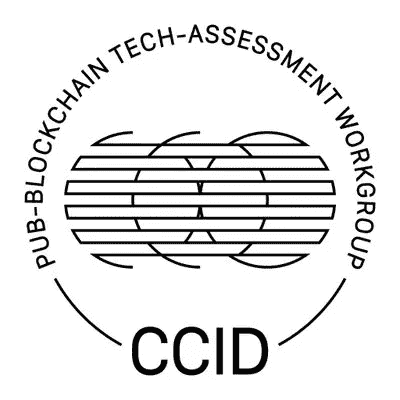
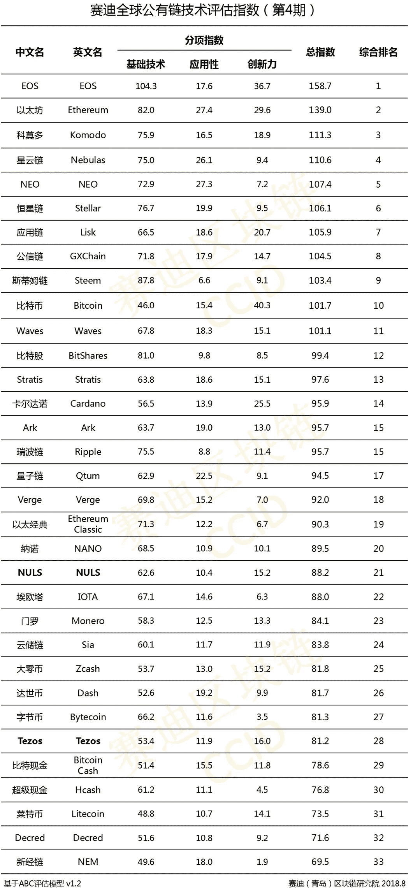
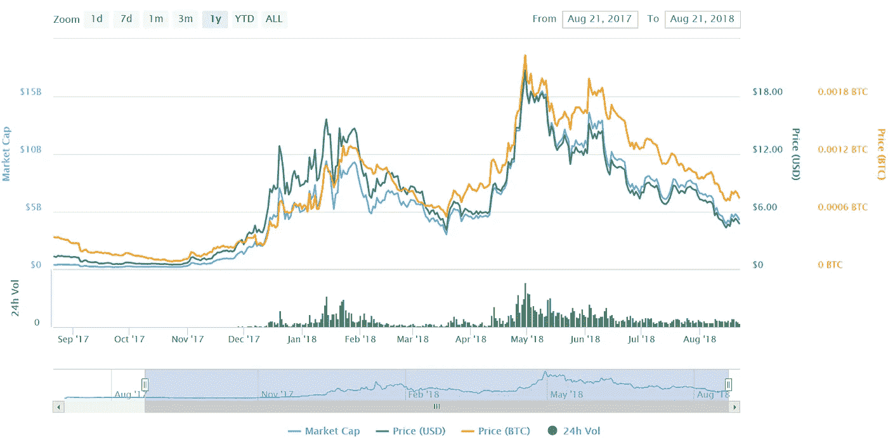
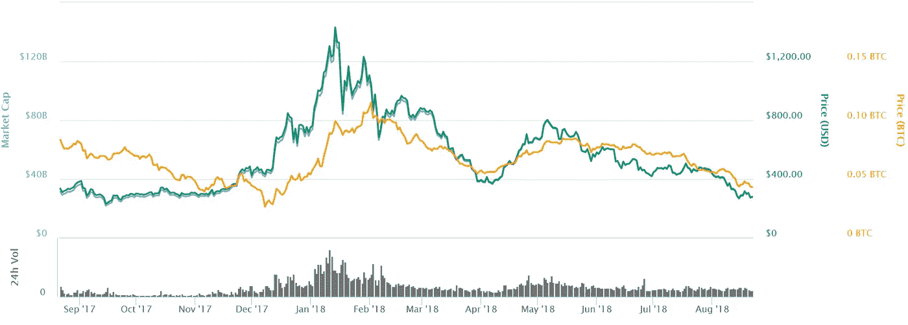
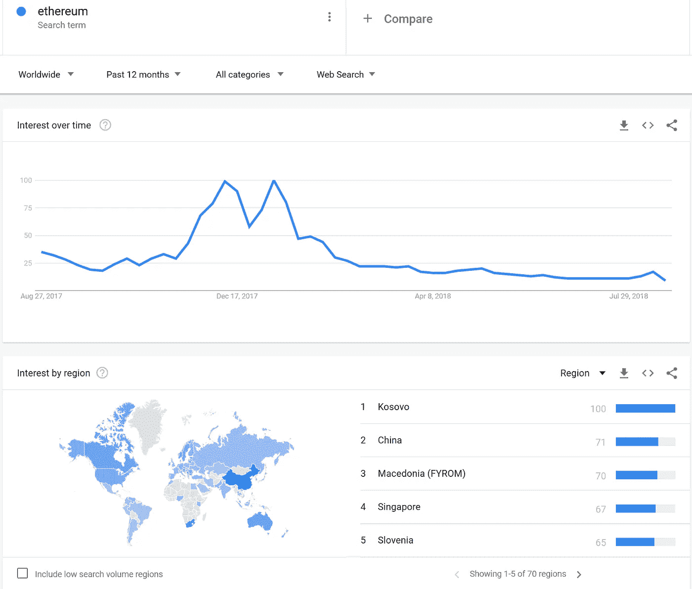
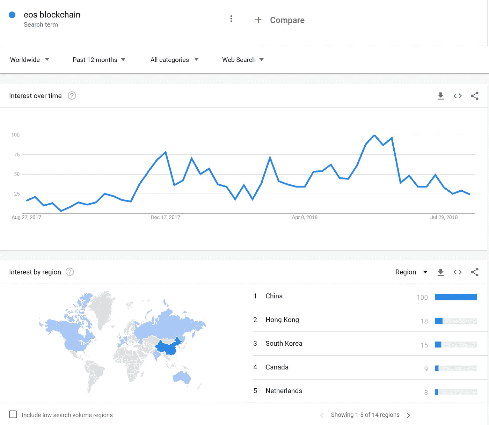
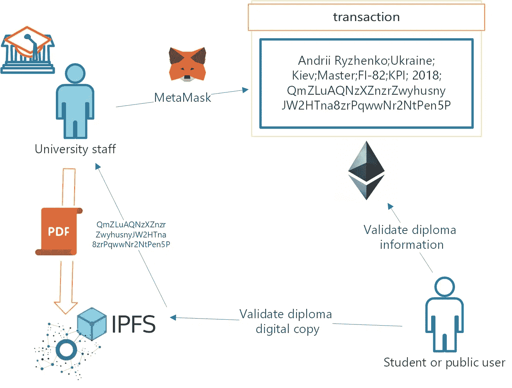

# EOS 在中国排名第一:CCID 区块链指数第四——文本翻译。前五大 EOS 失败案例

> 原文：<https://medium.com/coinmonks/eos-is-top1-in-china-ccid-blockchain-index-4th-text-translation-top-5-eos-fail-cases-97ab81ec5279?source=collection_archive---------8----------------------->

为什么我决定开始令人兴奋的 EOS top1 更新？

```
The **CCID (China Electronic Information Industry Development)** is the Chinese body that deals with the study of developments in IT.
```

他们评估和比较了两个新的项目，这两个项目将被加入他们著名的区块链排名。像往常一样将 EOS 标记为第一种加密货币。

> [在您的收件箱中直接获得最佳软件交易](https://coincodecap.com/?utm_source=coinmonks)

[](https://coincodecap.com/?utm_source=coinmonks)

好吧！去官方链接找任何细节:【http://special.ccidnet.com/pub-bc-eval/index.shtml】
我不懂中文，为此，我从推特上点击改编版的报道。但是我失败了。所有的文件都是这样的，有很多象形文字，没有任何可用的文本。
所以我决定给你翻译一下:

> 原始文件



CCID 全球公共区块链技术评估指数第四版

但是为什么 EOS 被宣布为 top1 领导者呢？

为什么不是以太？

我知道 EOS 技术含量更高，但是没有基于它的广泛稳定的工作产品组合。

由于这是一份没有细节的封闭报告，我们将询问神谕。

## 1.问问市场

我已经检查了去年 EOS 与以太坊的价格。



```
 based on coinmarketcap
```

但市场表示，这两种加密货币的趋势没有太大差异。

事实上，我可以说以太坊从 2018 年 5 月起更加稳定，损失更少，
但这是对趋势的主观看法。

## 2.谷歌搜索统计

接下来，问问谷歌

[https://trends.google.com/trends/](https://trends.google.ru/trends/?geo=RU)



对于 EOS



我们可以看到，与全球相比，中国的 EOS 趋势偏高。

由于八月是淡季，我想在九月我必须回顾一下趋势。就目前而言，我看不到任何 EOS 或以太坊趋势主导。

## 3.问百度新闻

我已经在百度上注册，并开始使用谷歌翻译从百度首页阅读实际新闻:

*   超过 70%的加密货币投资者悲痛欲绝，惨遭灭门
*   比特币和以太坊肆虐，全球投资者“崩溃”。
*   为什么区块链“不需要信任”？
*   EOS 没什么特别的。找到一篇格式像维基
    [https://baike.baidu.com/item/EOS/20441174](https://baike.baidu.com/item/EOS/20441174)的文章

谷歌自动翻译(无编辑):

```
EOS can be understood as the Enterprise Operation System, a blockchain operating system designed for commercial distributed applications. EOS is a new blockchain architecture introduced to extend the performance of distributed applications. Note that it is not a currency like Bitcoin and Ethereum, but a token based on the EOS software project, called Blockchain 3.0.Through a deeper understanding of EOS, EOS is quite valuable for investment. First of all, ETH is the first to launch a smart contract. Running a smart contract on ETH is not free, and depends on your gas. The contract has stopped. According to people who have used it, the ETH trading platform runs slowly and is very expensive, but EOS does not have this problem. The EOS runs the contract, depending on the number of your EOS, you have The more EOS you have, the more you can rent. As you continue to develop, the price will be more expensive. Secondly, developing DAPP on EOS is very simple. You don’t need to write a lot of modules yourself, because EOS is built for developers.
```

最后，我找不到任何 EOS 在中国格外受欢迎的信息。

也许，这份报告仅仅是基于产品的技术创新。

## 生活黑客

没有中国手机号码如何在百度上注册？

使用适用于全球移动电话的外部隐藏链接:

```
 [https://passport.baidu.com/v2/?reg&overseas=1](https://passport.baidu.com/v2/?reg&overseas=1)
```

## 4.百度大战谷歌

如何比较以太坊和 EOS？但是我们不能输入“EOS”。

只需查看 EOS 图片搜索结果


好，问百度:以太坊区块链

```
 百度为您找到相关结果约 9,980,000 个
```

好，问百度:EOS 区块链

```
百度为您找到相关结果约 1,190,000 个
```

但是如果我们从谷歌上查同样的东西:

```
Ethereum Blockchain : 32,300,000 resultsEOS Blockchain: 68,400,000 results
```

所以，我们不能说 EOS 在中国比以太坊更受欢迎。

最后，来自 Coindesc 的关于中国和 Crypto 的新闻:

[](https://www.coindesk.com/crypto-media-banned-from-wechat-in-sudden-online-sweep/) [## 微信突然被封杀加密媒体

### 中国的区块链和加密货币媒体账户在腾讯旗下的微信上被禁止…

www.coindesk.com](https://www.coindesk.com/crypto-media-banned-from-wechat-in-sudden-online-sweep/) 

按照承诺，阅读前 5 名 EOS 失败案例

# 1.Hello World 教程

我的最爱——Hello World 教程错误。这很有趣，但 EOS 团队跳过修复日志时间

[](https://github.com/EOSIO/eos/issues/5126) [## 【批判】《Hello World》教程坏了第 5126 期 EOSIO/eos

### (由于非常负面的用户体验，此问题至关重要)数月以来，多个用户报告了此问题…

github.com](https://github.com/EOSIO/eos/issues/5126) 

# 2.完全控制节点的包。

> 在主要的开发者中应该有一些红脸，因为一些错误允许在 EOS 节点上远程执行任意代码，甚至完全控制节点。😱

[](/trivial-co/blockchain-101-how-not-to-launch-a-main-net-by-eos-critical-bug-discovered-4e56dbf722d6) [## 区块链 101:如何不通过 EOS 推出主网——发现关键 bug！

### 在对 EOS 项目的极大关注中，中国互联网安全巨头 360 发现了“一系列史诗…

medium.com](/trivial-co/blockchain-101-how-not-to-launch-a-main-net-by-eos-critical-bug-discovered-4e56dbf722d6) 

# 3.“他们必须自己解决问题。”

> 周一，当世界第五大加密货币[因其目前的混乱状态而受到公众嘲笑](https://twitter.com/LefterisJP/status/1010235511808643075)时，EOS 的顶级“块生产者”——负责维护区块链的网络参与者之一——发出了这些刺耳的话。

 [## EOS 仲裁人问题:一个加密治理故障解释

### “他们必须自己解决问题。”这些都是 EOS 的顶级“块生产者”之一的严厉的话-网络…

www.coindesk.com](https://www.coindesk.com/eos-arbitrator-problem-crypto-governance-breakdown-explained/) 

# 4.为期一年的[首次硬币发行(ICO)](https://thenextweb.com/contributors/2017/09/22/everything-need-know-icos/)

超过 1 年，数百万美元和天堂岛-但团队做的 ICO 开发。

 [## EOS mainnet 噩梦:如何不启动区块链网络

### EOS mainnet 的推出显示了区块链公司筹集数百万和数十亿美元的所有错误…

thenextweb.com](https://thenextweb.com/hardfork/2018/06/08/eos-mainnet-nightmare/) 

# 5.体质不行？重写就是了！

Block.one 公司设计了 EOS 协议，但在发布时将代码交给了用户，该公司提议废除管理平台行为的规则，代之以“v2.0”

如果你有 40 亿美元，没有责任，你不需要做解决方案。

你是国王，可以创造自己的世界:

 [## Block.one 想重写整个 EOS 章程- CoinDesk

### EOS 正在经历一场全面的宪法危机。周四在电报上透露…

www.coindesk.com](https://www.coindesk.com/block-one-wants-rewrite-entire-eos-constitution/) 

阅读更多内容…


## [开发盗版“黑标”投票系统。关于稳固性的区块链智能合约。15 分钟分步指令](/coinmonks/developing-pirates-black-label-voting-system-6618378aae03)



## [15 分钟开发区块链“可信文凭”验证系统。分步指令](/@andrii.ryzhenko/develop-blockchain-trusted-diploma-verification-system-in-15-minutes-step-by-step-instruction-fdcf37a244ab)