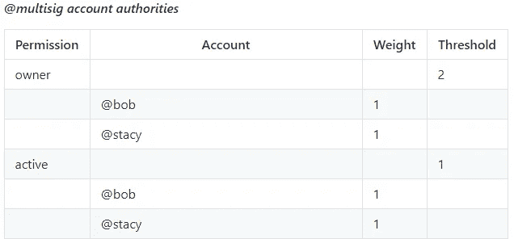

# EOS 权限管理

> 原文：<https://medium.com/coinmonks/eos-permission-management-2c0c1634fe39?source=collection_archive---------5----------------------->


> EOS 与其他区块链的主要区别之一是帐户系统。在你和你的基金之间，有一个账户。12 个字符的名称。而当你想花那些资金的时候，你需要为账户签一个交易，而不是直接签一个关联的密钥。在账户后面，你可以有一把或多把钥匙，它们在链子上，你可以改变它们。你可以改变他们，有不同的权限级别。那真是太棒了。这也意味着你可以对你的账户进行权限管理。亚历山大·布尔歇

# 默认权限设置

如上所述，EOS 有一个独特的帐户系统，允许用户管理其帐户的权限。每个许可都要求将一个或多个有效交易转移到区块链。默认情况下，一个 EOS 账户有两个权限，*活动*和*所有者*。

*活动*权限用于转账、制作人投票等高级账户变更。

*所有者*权限象征着账户的所有权。只有少数事务需要此权限，但最值得注意的是对所有者权限进行任何类型的更改的操作。一般建议业主冷藏保存，不与任何人共用。*所有者*权限可用于恢复另一个可能已被破坏的权限。


默认情况下，*活动*和*所有者*的键的权重都是 1，而*活动*和*所有者*权限的默认阈值都是 1。这意味着执行任何需要*所有者*许可的动作只需要*所有者*密钥的一个签名。这同样适用于*活动*许可。执行任何需要*激活*许可的动作只需要一个来自*激活*键的签名。

这就是默认 EOS 帐户的设置方式。

> [发现并回顾最佳加密软件](https://coincodecap.com)

# 更改和添加权限

幸运的是，您可以添加和更改权限，允许您创建一个多签名帐户，创建新的权限等等。为了向您展示更改和添加权限的可能性，我们将解释一个示例。

## 多重签名账户

在这个例子中，我们将解释多重签名钱包是如何工作的，以及如何自己设置一个。



Taken from the [EOSIO Wiki](https://github.com/EOSIO/eos/wiki/Accounts%20%26%20Permissions)

在上图中，你可以看到一个多签名账户的可能设置。在本例中，*所有者*权限的阈值为 2，有 2 个密钥，权重均为 1。这意味着执行任何需要*所有者*许可的操作都需要两个密钥的签名。

*活动*权限的阈值为 1，有 2 个键，权重都为 1。这意味着执行任何需要*激活*许可的动作只需要 2 个键中任何一个的 1 个签名。

## 如何在您自己的帐户上进行设置(工具包)

假设以上是有意义的，我们现在将解释如何使用 Genereos 的 [EOSToolkit 自己建立一个多签名账户。我们将像上面解释的多签名帐户一样设置帐户。](https://eostoolkit.io/account/advanced)

首先，你必须下载一个浏览器扩展。这里可以得到分散[。按照说明设置您的分散帐户并登录您的分散扩展。之后，进入工具包，连接您现有的 EOS 帐户。](https://get-scatter.com/)


*Don’t forget to add ‘@permission’ behind the public keys, change the permission to the actual permission (active, owner, etc)

连接您的 Scatter 帐户后，您可以访问[“高级权限”选项卡](https://eostoolkit.io/account/advanced)。我们将从更改帐户的*所有者*权限开始。使用正确的信息和密钥填写空白，然后单击更新。如果需要，还可以添加更多的关键点，并更改关键点的阈值和权重。


*Don’t forget to add ‘@permission’ behind the public keys, change the permission to the actual permission (active, owner, etc)

更新*所有者*权限后，您可以更新*活动*权限。使用正确的信息和密钥填写空白，然后单击更新。就像拥有*所有者*权限一样，如果你愿意，你也可以添加更多的键并改变阈值和键的权重。

现在，您有了一个多签名帐户，就像第一个示例中的多签名帐户一样。

# 自定义权限

多重签名帐户只是 EOS 权限的众多可能性之一。不过，创建多签名帐户只需要更改默认权限。要创建更高级的权限结构，您可以创建新权限，或者管理和设置现有权限。我们将向您展示如何使用 Genereos 的[工具包和 cleos 创建新的权限。](https://eostoolkit.io/)

## 如何创建新权限(工具包)

由于有了工具包，管理、设置和创建新权限现在变得非常容易和容易。假设您有一个 EOS 帐户，但不想使用您的活动密钥来为该帐户投票，因为密钥泄露可能会造成灾难性后果。您可以授予另一个帐户在该帐户上投票的权限。(您可以使用代理做类似的事情，这只是为了解释事情)


在上面的图片中，你可以看到如何填写空白，让第二个帐户能够在主帐户上使用 *vote* 权限。只需要访问第二个帐户上的*活动*权限。


确认上述交易后，您需要将新的*投票*权限链接到 eosio 操作。因为我们希望拥有该权限的第二个帐户能够在主帐户上投票，所以我们使用[“链接授权”工具](https://eostoolkit.io/account/linkauth)将*投票*权限链接到“voteproducer”操作。

现在，第二个帐户将能够在主帐户上使用*投票*权限。

## 如何创建新权限(cleos)

您还可以使用 cleos 创建一个新的自定义权限。下面我们将向您展示一个加拿大 EOS 的例子，关于如何创建一个新的使用 cleos 申请奖励的许可。

EOS 块生产者每天都得到报酬，所以他们必须每天领取这些报酬。如果他们不认领奖励，奖励就没了，所以每个(付费)区块制作人每天都想认领他们的奖励。默认情况下，领取奖励需要主动密钥，但是将主动密钥放在每天收集奖励的服务器上是非常危险的。这就是为什么需要为此设置一个新的权限，并为此使用一个新的、不太重要的密钥。

为此，您需要使用 cleos 运行以下命令:

```
cleos set account permission PRODUCERACCT claimer '{"threshold":1,"keys":[{"key":"YOUR_PUB_KEY","weight":1}]}' "active" -p PRODUCERACCT@active 
```

`PRODUCERACCT`是将收集奖励的 12 个字符的帐户名，`claimer`是新权限的名称，`"key":"YOUR_PUB_KEY","weight":1`是新的公钥，权重为 1，具有新权限，`"active" -p PRODUCERACCT@active`意味着新权限的父权限是*活动的*权限。

运行上面的命令后，您需要将权限链接到某个操作。为此，您需要运行以下命令。

```
cleos set action permission PRODUCERACCT eosio claimrewards claimer 
```

运行这个命令将`claimrewards`动作链接到`claimer`权限，`eosio`是智能合约。

现在使用`claimrewards`只需要一个新的密钥，这个密钥泄露不会是一个很大的问题，因为你可以用这个密钥做的唯一一件事就是在制作人账户上申请奖励。

*使用本指南和这些工具的风险由您自行承担，错误使用这些工具可能会导致您的帐户无法访问*

*请记住，遵循这些教程可能会导致您的帐户更难使用。支持自定义权限的工具还不多*

特别感谢 Genereos 的 Nathan Rempel 帮助编写本指南。

## 我们的社交

[网站](http://blockgenic.io)
[推特](https://twitter.com/blockgenic)
[Youtube](https://www.youtube.com/channel/UCXTaehuAs3UWKnMVnT71MMQ)
[Meetup](https://www.meetup.com/nl-NL/Seattle-EOS/)
[Steem](https://steemit.com/@block21)

*由* [*写成*](https://www.linkedin.com/in/yannick-slenter/)为 [*为*](https://blockgenic.website/)

> [直接在您的收件箱中获得最佳软件交易](https://coincodecap.com/?utm_source=coinmonks)

[](https://coincodecap.com/?utm_source=coinmonks)