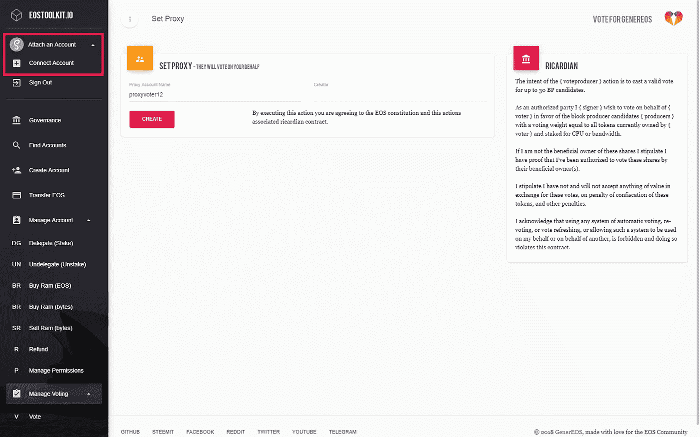
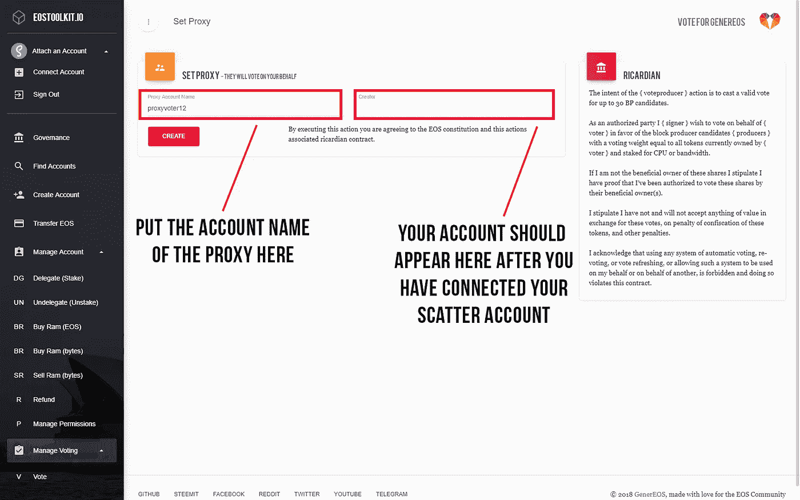
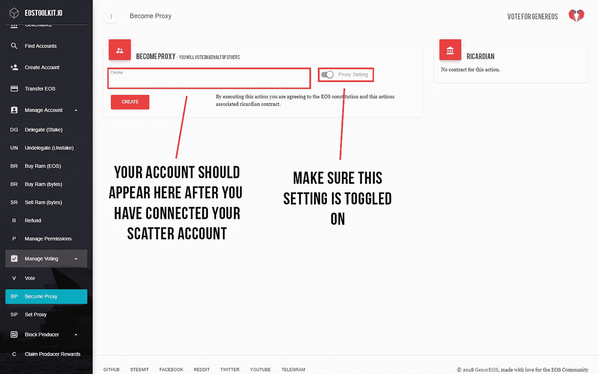

# EOS 代理投票:你需要知道的一切

> 原文：<https://medium.com/coinmonks/eos-proxy-voting-everything-you-need-to-know-e4c9783249e3?source=collection_archive---------9----------------------->


(Credits: GBK Design, [http://gbk.photos/](http://gbk.photos/))

# 什么是 EOS 上的代理投票？

没有时间自己去调研所有的街区制作人，但是还想投票？那么代理投票可能是你正在寻找的。

将某人设为您的代理人意味着您授权他们代表您投票。代理人可以是你认识的人，也可以是你信任的代表你投票的人。

# 如何将某人设置为您的代理人？

有各种各样的方法来设置某人为你的代理，下面我们将描述如何使用 cleos 或使用工具包和散点来设置某人为你的代理。

## 如何使用 cleos 将某人设置为您的代理人？

要使用 cleos 将某人设置为您的代理，您必须运行以下命令:

```
$ cleos system voteproducer proxy accountnum12 proxyvoter12
```

这里，accountnum12 将他们的投票代理给了 proxyvoter12。

## 如何使用工具包将某人设置为您的代理？

要使用工具包将某人设置为您的代理，您首先需要安装分散浏览器扩展，您可以在这里获得。在您安装了 Scatter 并导入了您的钱包或使用 Scatter 创建了一个新的钱包后，您可以前往 https://eostoolkit.io/vote/setproxy 的[，或任何其他工具包，如](https://eostoolkit.io/vote/setproxy)[https://www.myeoskit.com/#/tools/proxy](https://www.myeoskit.com/#/tools/proxy)或[https://EOS voter . EO sphere . io](https://eosvoter.eosphere.io/)，并附上您的 Scatter 帐户。



连接您的分散钱包后，您可以进入“管理投票”并选择“设置代理”。下面的屏幕应该出现，你可以设置你的代理。



# 如何注册成为代理人？

有多种方法可以注册成为代理人，我们将描述如何使用 cleos 或使用工具包和散点注册成为代理人。

## 如何使用 cleos 注册成为代理人？

要注册为代理，您必须运行以下命令:

```
$ cleos system regproxy proxyvoter12
```

这里，proxyvoter12 已注册为代理。

## 如何使用工具包注册为代理？

要使用工具包注册为代理，请转到[https://eostoolkit.io/vote/beproxy](https://eostoolkit.io/vote/beproxy)，或任何其他工具包，如[https://www.myeoskit.com/#/tools/proxy](https://www.myeoskit.com/#/tools/proxy)或[https://EOS voter . EO sphere . io](https://eosvoter.eosphere.io/)，并连接您的分散帐户(有关说明，请向上滚动)。连接您的分散帐户后，您可以注册为代理。



# 当前代理列表

您可以在这里查看当前所有的代理:[https://www.alohaeos.com/vote/proxy](https://www.alohaeos.com/vote/proxy)

## 我们的社交

[网站](https://blockgenic.website/)
[推特](https://twitter.com/blockgenic)
[Youtube](https://www.youtube.com/channel/UCXTaehuAs3UWKnMVnT71MMQ)
[Meetup](https://www.meetup.com/nl-NL/Seattle-EOS/)
[Steem](https://steemit.com/@block21)

*由* [写成*由*](https://www.linkedin.com/in/yannick-slenter/) *为* [*为*](https://blockgenic.website/)