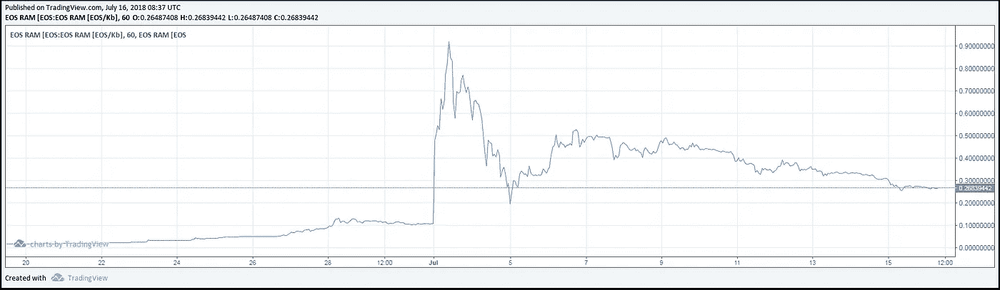
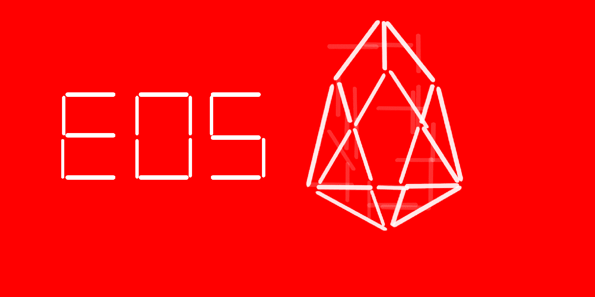

# EOS RAM 101:面向初学者的非技术性指南

> 原文：<https://medium.com/coinmonks/eos-ram-101-non-technical-guidebook-for-beginners-6f971322042e?source=collection_archive---------3----------------------->

EOS RAM 的高价成为这几天 EOS 社区关注的焦点。正如您在下图中看到的，EOS RAM 价格自 7 月初以来一直在快速上涨，从 0.11 EOS/kb 到 0.91 EOS/kb，并在撰写本文时逐渐下降到 0.2684 EOS/kb。

为了更好地了解所发生的事情，你有必要了解一些关于 EOS RAM 的基本知识。本文为初学者提供了 EOS RAM 的全貌。

> [发现并回顾最佳区块链软件](https://coincodecap.com)

# **什么是公羊？**

在计算机科学中， [RAM(随机存取存储器)](https://en.wikipedia.org/wiki/Random-access_memory)是计算机数据存储的一种形式，存储当前正在使用的数据和机器代码。运行应用程序时，RAM 用于短时间保存活动数据，因为 RAM 的读写速度非常快。这些数据包括密钥、余额和合同状态。

然而，EOS RAM 是一个更复杂的概念。它并不完全符合计算机科学中的 RAM 概念。简单来说就是 EOS 中除了 CPU 和带宽之外的所有使用的资源，大致对应计算机科学意义上的 RAM 和数据库。

# 谁需要 EOS 上的 RAM？

DApp 开发商有。RAM 是他们开发 dApps 的宝贵资源。应用程序状态的存储将需要 dApp 开发人员确保有足够的 RAM，直到该状态被删除。当内存不足以支持 dApp 时，一些操作无法执行，智能合约也无法部署。

# **EOS 令牌和 EOS RAM 是什么关系？**

EOSIO 是 dApp 开发的强大基础设施。它的设计方式是，RAM 的分配机制以及 EOSIO 用户的其他重要资源都嵌入到其令牌生态系统中。

对于 EOSIO 上的 dApp 开发者来说，主要需要三种资源:

1.  带宽，
2.  中央处理器
3.  拉姆。

EOS 代币持有者可以用 EOS 代币的流动性来换取系统内的资源，或者简单的说，可以将 EOS 代币入股，承担潜在的价格波动风险来换取 EOS 上的资源。但是，RAM 分配的分配与其他两种资源有很大不同。

对于带宽和 CPU，令牌持有者可以下注他们的令牌，以获得与其下注令牌成比例的资源量。每当一些资源空闲时，令牌持有者想要释放被下注的令牌，他们可以取消下注以取回他们下注的令牌的确切数量。也就是说，汇率是固定的，代币持有者不需要承担汇率风险。

RAM 的情况并非如此。代币持有者承担 RAM 和 EOS 之间的汇率风险。当他们释放手中的 RAM 资源时，他们得到的 EOS 令牌通常不等于他们下注的数量。所谓的 RAM“交易”实际上是这种股权和非股权活动(但是，EOS 和 RAM 之间存在交换风险)。RAM 没有点对点的交易和转让，所有玩家的交易对手都是系统做市商(即系统合约)。

# **EOS RAM 分配模型是如何工作的？**

EOS RAM 分配模型的大变化是在 EOSIO Dawn 4.0 中。根据 Dawn 3.0 系统合同，令牌持有者只能按照他们支付的价格出售 RAM，就像其他资源一样。你可以在[丹尼尔·拉里默的文章](/eosio/introducing-eosio-dawn-4-0-f738c552879)中查看更多细节。EOS 从 Dawn 4.0 开始改用基于市场的分配方法，使用 Bancor 算法。

## **市场驱动的 RAM 分配模式背后的基本原理**

这个 RAM 子市场的存在是合理的。

对于汇率固定的旧版本，好处是抑制囤积和投机，因为仅仅买卖 RAM 不会获得额外的 EOS:你总是得到你所付出的。

然而，市场机制的缺失导致了一些配置效率问题。想想一个 dApp 开发者，Peter 说，他买了 1，000 个 EOS，用 500 个 EOS 作为 RAM 资源，在 EOS 上开发一个约会 dApp。然而，当一个更好的约会 dApp 出现并且用户寥寥无几时，他的 dApp 被证明是不称职的。两个月后，Peter 停止了他的 dApp，但是，看到 EOS 代币的价格上涨，他没有卖掉代币，也没有动力让他取消对 RAM 的投资。因此，这些 RAM 资源将由于低效分配而被浪费。在市场驱动的模式下，Peter 可以从解冻 RAM 中获得资本收益，因此愿意释放资源。

## **Bancor 算法的简单说明**

EOS RAM 分配模型中使用的 Bancor 中继算法可以用一个简单的例子来解释:

Peter 的钱包中有 1000 张 ABC 代币，他想将其兑换成 XYZ 代币。他用 Bancor 中继算法做的是:

> 1.用他所拥有的，也就是 1000 个 ABC 代币，购买名为 ABCXYZ 的中继代币(一种子市场内浮动收益率的 IOU)。他要为这种转换支付一笔费用，比如说 1,000 ABC 的 0.1%，也就是 1 ABC 的代币。因此，现在他有 999 个 ABCXYZ 代币
> 
> 2.在这个 ABCXYZ 子市场中有许多交易者。一些人向美国广播公司购买火炬接力标志，而另一些人则向 XYZ 购买。中继令牌始终包含其两个连接器中每个连接器的 50%值。简单来说，当农行代币的供应量小于 XYZ 代币时，这个子市场的农行代币价格就会上涨，反之亦然。
> 
> 3.根据经济学 101，当 ABC 和 XYZ 在这个子市场的汇率与外部市场(交易所)的汇率不同时。将会有套利机会，最终推动汇率达到同样的水平。
> 
> 4.当彼得想取出 XYZ 时，他必须支付一笔费用，比如 0.1%，并根据当前汇率获得 XYZ 的数量。

EOS RAM 使用非常相似的算法；因此，这种算法确保了自由市场在设定价格。系统做市商纯粹是根据算法做出反应。EOS 令牌持有者可以将 EOS 押入系统(并为此支付 0.5%的费用)，承担潜在的价格波动风险，作为交换，他们可以访问与其押入令牌成比例的系统 RAM 资源。当内存超出需求时，令牌持有者可以从系统中取消其持有的 EOS(并为此支付 0.5%的费用)，从而释放内存资源，供将来分配给更需要的开发人员。

## **EOS RAM 分配算法的挑战和解决方案**

## **挑战一:**

随着越来越多的 dApp 开发者加入，需要长期存储的数据越来越多，使用的 RAM 越来越多，退出了市场，使得 RAM 越来越贵。

## 候选人**解决方案:**

丹尼尔拉里默(BM)写了一篇关于 b1 计划降低 EOS 账户创建费的文章。下面是[篇](/@bytemaster/a-three-step-plan-for-lowering-eos-account-creation-costs-c3bf1ec736b7)。

b1 有 3 个步骤来解决这个问题。

> 1.**增加 RAM 供应:**EOS 区块链已经配置了总共 64GB 的 RAM。B1 发布了 EOSIO 系统合同的更新，使 BP 能够指定 RAM 的增长率
> 
> 2.**降低账户内存使用:** B1 将提供系统合同更新，将账户创建 RAM 的最低要求降低近 50%
> 
> 3.**block . one 的 iOS 钱包免费账户:** B1 正在使用苹果的 Secure Enclave 建立免费的 iOS 硬件钱包，以提供免费的 EOS 账户。

供给的持续增加可以满足未来对地球观测系统资源需求的增加。

## 挑战 2:

投机者在 RAM 上的非理性行为会将 RAM 推高，使 dApp 开发者购买所需资源的成本变得昂贵，从而恶化生态系统。有大量的 RAM，由于投机或其他原因，被闲置，造成了 RAM 资源的浪费。

## 候选解决方案 A:

如上所述，Bancor 中继算法具有一些参数，这些参数会影响价格响应买入和卖出 RAM 的请求的移动速度。它决定了子市场的价格对供求关系动态的敏感度，以及某人在大量买入或卖出时会看到的订单的形状和滑点的程度。

Daniel Larimer 在他的[文章](/@bytemaster/eosio-ram-market-bancor-algorithm-b8e8d4e20c73)中提到，由于 EOS 区块链上 Bancor 继电器重量的无意配置，该参数被设置为 0.05%而不是 50%，他建议将该参数更新为预期值 50%。这种调整将允许市场参与者与做市商互动，以更有效的方式推动其回归市场价值。它将为 RAM 投机者和 RAM 用户提供一个更加可预测和稳定的市场。

## 候选解决方案 B:

Bancor 联合创始人兼产品架构师 Eyal Hertzog 在他的[文章](https://steemit.com/eos/@bancor-network/a-proposed-solution-to-eos-ram-allocation)中建议，一个解决方案是从 RAM 合同中不断地烧录 EOS 令牌。EOS 供应量的下降使其相对于 RAM 的价值更高，从而降低了在 EOS 中占主导地位的 RAM 的价格。

这种解决方案代表了正在使用的 RAM 的一种形式的“租赁”成本。通过改变 RAM 合同，以恒定的速率消耗 EOS，投机变得更加危险。投机者必须预测 dApps(或额外的投机者)会以一定的速度购买 RAM，而不是简单地在未来的任何时间购买。这与持续向合同中添加 RAM 具有相似的效果；然而，添加 RAM 是劳动密集型的，可能需要一些时间进行测试和社区准备。

# 总结

EOS 内存分配系统的设计是 EOS 生态系统的重要组成部分。EOS RAM 的高价可能暗示了人们对 EOS 未来的上行预期，也可能只是预示了投机的无序，阻碍了 EOS 的发展。无论在什么情况下，在一个去中心化的世界里，我们应该做的是不断优化机制，使一切工作更有效率。

# **一些帮助你追踪 EOS RAM 数据的网站**

[FeeXplorer(内存价格跟踪器)](https://eos.feexplorer.io/)

[EOS 资源计算器](https://www.eosrp.io/index.html#calc)

[RAM 计算器](https://www.marketstackd.io/ramcalculator.html#)

[EOS RAM 价格电报](http://t.me/eosramprice)

# 查找有关 EOSREAL 的更多信息:

EOSREAL 从一开始就致力于 EOS 治理。我们的团队是多元文化的，在合规、心理学、金融/经济学和国际事务等不同领域都很专业。

# 请为 EOSREAL 投票:eosrealbpcsg

[推特](https://twitter.com/EOSREAL_IO) : [电报](https://t.me/eosreal) : [媒体](/@EOSREAL_IO) : [Steemit](https://steemit.com/@eosreal-io) :微信:EOSREAL : [YouTube](https://www.youtube.com/channel/UCDa2gIsEQway1DPNjMYar8g?view_as=subscriber) : [优酷](http://i.youku.com/i/UNTkxNjQzMTIyOA==)

[网址](http://eosreal.com/):邮件:EOS【at】EOS real . com