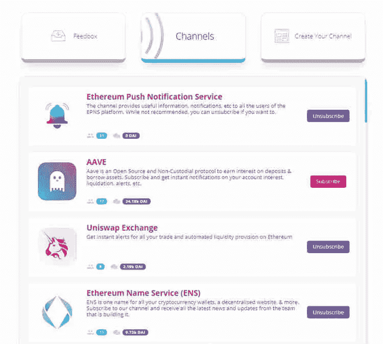

# EPNS:Web 3.0 的推送通知

> 原文：<https://medium.com/coinmonks/epns-push-notifications-for-web-3-0-24cee418ecd1?source=collection_archive---------14----------------------->

Web 2.0 以一种现在无处不在的方式将注意力货币化。观众参与每年为科技公司带来数千亿美元的收入。然而，公司现在努力争取注意力优势。2021 年，几乎你注册的每个网站和下载的每个应用程序都会请求允许向你发送通知。这是因为通知被证明可以极大地增加客户的注意力。2003 年，黑莓推出了电子邮件推送通知服务，这帮助他们迅速获得了人气。在此次发布之前，客户必须定期检查他们的电子邮件，以确认他们是否收到了任何通信。现在看来这很可笑。今天，很明显，当需要我们采取行动时，应用程序或网络服务应该并将会伸出援手，但我们很快忘记了网络通知，因为我们知道它们直到 2015 年初才出现。类似地，Web 3.0 中仍然完全没有通知，尽管可以有把握地认为 Web 3.0 最终会有通知。Web 3.0 的分散化使得项目很难接触到他们的用户，而这种接触的重要性增加了十倍。在 Web 3.0 的当前状态下，用户只能自生自灭。交易者经常在没有收到通知的情况下在分散的交易所被清算，DeFi 项目在没有通知申报者的情况下发放可申报的奖励。服务和用户之间存在脱节。在区块链治理方面，这种脱节甚至更加严重。Dao 和协议在不通知潜在投票者或参与者的情况下对提案进行投票并改变关键结构。他们实际上无法通知用户。这不是一个理想的系统，也是以太坊推送通知服务(EPNS)项目试图解决的问题。EPNS 是一个致力于将通知引入 Web 3.0 的项目，并且已经被流行的项目大量采用。

## 【EPNS 背后是什么？

以太坊推送通知服务是一个简单的中间件，它促进了 Web 3.0 上的推送通知。EPNS 创建了基础设施，以弥合分散和集中服务之间的差距。这一基础设施得到了健全的象征经济学和激励结构的支持，旨在促进出口计划网络的快速增长。EPN 类似于预搜索，因为它们要求 stake 参与向用户发送通知。他们这样做是为了执行反垃圾邮件规则。在 EPNS 生态系统中有用户和渠道，用户接收通知，渠道发送通知。通知是严格选择加入的，用户可以随时停用通知。有一个由渠道创建的令牌激励池，通过向用户发送他们收到的每个通知的$PUSH 来激励他们注册。用户收到的$PUSH 数量是总令牌激励池和该渠道注册用户数量的函数。发送给用户的$PUSH 和代币奖励池中的$PUSH 都通过在 EPNS 网络上收费来获得赌注奖励。链上治理上周刚刚推出，许多提议正在酝酿中。$PUSH 背后的 tokenomics 现在掌握在用户手中，我在上面段落中所写的一切都可能发生变化。EPNS 计划在 2022 年 1 月下旬推出他们的 mainnet。

## 谁是 EPNS 的幕后黑手？

Harsh Rajat 和 Richa Joshi 是以太坊推送通知服务的创始成员。Harsh Rajat 和 Richa Joshi 目前分别担任项目主管和营销主管。Rajat 自 2006 年以来一直是一名软件工程师，2009 年他创办了自己的软件公司，名为 Digital Poke。Richa Joshi 自 2008 年开始在花旗银行工作以来一直是一名软件工程师。Rajat 和 Joshi 都是在经历了由 Gitcoin 项目运营的孵化器 Kernel 之后，于 2020 年创办了 EPNS。正是在这个孵化过程中，维维克·辛格和桑德普·奈瓦尔对 EPNS 产生了兴趣。辛格是 Gitcoin 的联合创始人，内尔瓦尔是 Polygon 的联合创始人兼首席执行官。他们都是早期投资者，现在是 EPNS 顾问委员会的成员。EPNS 也得到了币安实验室、True Ventures、Fourth Revolution Capital 以及一些知名个人投资者的支持。

## **为什么是 EPNS？**

EPNS 有潜力成为 Web 3.0 的默认通知中间件。随着 EPN 的发展和成为区块链不可知论者，我们将继续看到 DeFi 项目、分散交换、Dao 和其他协议使用 EPN 向其用户和贡献者推送通知。EPNS 已经被 UniSwap、AAVE、KuCoin、Gate.io、MakerDAO、Polygon、Gitcoin、TracerDAO、Pool Together、ENS、Gnosis 和其他加密社区的基石所采用。这一切都发生在 EPNS 的 testnet 阶段。目前$PUSH 的市值为 2300 万美元。如果 EPNS 成功推出他们的 mainnet，我预计会有更多的协议采用该协议，价格也会大幅上涨。EPNS 计划成为 50 强项目。这个项目从 smart money 获得的支持金额不同于我们以前投资的任何项目，我们相信这种支持将加速这个项目进入加密项目的前 50 名。

由 Istari Capital LP 的加密专家和分析师 David Coryat 撰写。

https://www.istari.io/

*此内容仅供参考，您不应理解任何此类内容*

*信息或其他材料，如法律、税务、投资、财务或其他建议。本报告中的任何内容均不构成 Istari 或任何第三方服务提供商在该司法管辖区或任何其他司法管辖区购买或出售任何证券或其他金融工具的邀约、建议、认可或要约，根据该司法管辖区的证券法，此类邀约或要约是非法的。请注意，Istari Capital LP 投资于本文讨论的项目或与本文相关的项目。*

> 加入 Coinmonks [电报频道](https://t.me/coincodecap)和 [Youtube 频道](https://www.youtube.com/c/coinmonks/videos)了解加密交易和投资

## 也阅读

 [## 杠杆代币[多头代币]终极指南

### 杠杆化令牌是具有杠杆化风险敞口的 ERC20 令牌，不考虑保证金、要求、管理…

medium.com](/coinmonks/leveraged-token-3f5257808b22)  [## 最佳加密交易所| 2021 年十大加密货币交易所

### 编辑描述

blog.coincodecap.com](https://blog.coincodecap.com/crypto-exchange)  [## 2021 年最佳加密交换平台| CoinCodeCap

### 编辑描述

blog.coincodecap.com](https://blog.coincodecap.com/best-swap-platforms)  [## 2021 年最佳加密借贷平台| 6 大比特币借贷平台

### 获得比特币和其他加密货币的最佳贷款利率

medium.com](/coinmonks/top-5-crypto-lending-platforms-in-2020-that-you-need-to-know-a1b675cec3fa)  [## 2021 年 6 大最佳硬件钱包|顶级加密硬件钱包[更新]

### 最好的加密货币硬件钱包是绝对必要的。我们将在 NGRAVE、Ledger Nano X 和…

medium.com](/coinmonks/the-best-cryptocurrency-hardware-wallets-of-2020-e28b1c124069)  [## 2021 年最佳免费加密交易机器人

### 2021 年币安、比特币基地、库币和其他密码交易所的最佳密码交易机器人。四进制，位间隙…

medium.com](/coinmonks/crypto-trading-bot-c2ffce8acb2a)