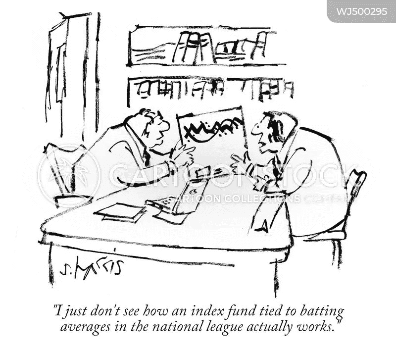
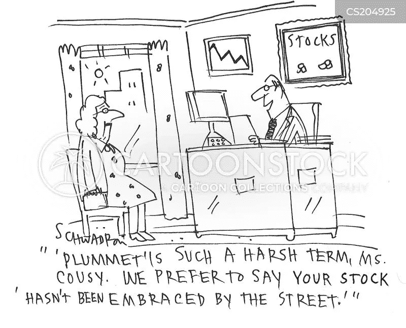

# 公平-债务-混合-(其他)-解决方案-共同基金揭秘

> 原文：<https://medium.com/coinmonks/equitable-debt-hybrid-other-solution-mutual-funds-demystified-4a8848e9f081?source=collection_archive---------4----------------------->

嘿，伙计们，像往常一样，很高兴回到志同道合的人中间，他们想摆脱经济奴役，追求我们的生活梦想。从上一篇文章开始，我们讨论的新话题是共同基金，这可能是最常见的投资方式，但很少有人了解。因此，我们大多数人都会犯这样的错误，要么依赖朋友的建议，要么被精美的小册子所吸引。这就像选择你的火车，不考虑你的目的地或时间的便利，而是因为你的朋友喜欢一些模糊的火车上提供的食物和服务。如果你也一直以这种方式投资，现在是时候把控制权拿在手中了。不幸的是**在做一些有趣的分析之前，我们需要做一个市场扫描**，看看有多少种产品。

在上一篇文章中，我们了解到，在目睹了市场中的混乱和不道德行为后， **SEBI** (印度证券交易委员会)将金融机构分为 36 类，并根据投资工具的类型将它们分成五个明显不同的组。这些是**权益类、**、**混合型、**解决型、**和**其他基金。在这五个类别中，**股票基金**及其 10 个子类别在上一篇文章中讨论过。让我把它们列在下面，作为快速复习。如果你想了解更多，请回到之前的帖子。****

**股票基金—** 投资股票的所有 MF 都包括在该组中，如大型基金、大型&中型基金、中型基金、小型基金、多仓基金、股息收益基金、价值基金、对冲基金、集中基金、部门/主题基金和 ELSS。

让我们继续学习**债务基金**。但是首先什么是**投资的债务工具？**简单来说，所有向企业或政府提供贷款的投资工具**都是债务工具**。这些**可能包括政府或公司债券、证券和货币市场工具**。这些**通常被归类为固定收益工具**，因为利率或收益率是预先固定的。正如你所猜测的，参考投资高风险的黄金法则——高收益；低风险——低收益，通常政府债券和证券提供的风险最小，因此回报也最少，而公司债券提供的安全性相对较低，但回报肯定更高。然而，我们不必猜测这一部分，因为有许多知名的机构，如 **S & P** 、**穆迪**和**惠誉**，它们覆盖了大约 95%的债券市场。印度也有很多公司，比如 CRISIL、ICRA、T21、布里克、斯梅拉和斯梅拉，他们通常会对印度政府债券和公司进行评级。评级通常是字母和字母的组合，三巨头 **S & P** 、**穆迪**和**惠誉**最常用的评级依次为 AAA、AA、A、BBB、BB、B、CCC、CC、C、D 和 NR。一个简单的评级和发行公司的谷歌搜索将指定金融工具在其财务可行性方面的质量，并可以帮助决定风险与收益规模。

请记住，债务型金融机构大多投资于低风险工具，但有时激进型基金可能会选择投资于风险更高但回报更高的工具，它们也有可能遭受损失。因此，在与你的贪婪和恐惧矩阵匹配后，明智地选择你的 MF。

**债务基金的类型** —好的……在上一篇帖子中，我们已经了解到债务基金有 16 个子类别。为了便于理解和记忆，我将它们进一步分为 4 个小组，如下所述

**持续时间**—

1.**隔夜基金** —投资于到期日为一天的隔夜证券。

2.U **ltra-short** 久期基金— 3 至 6 个月(加权平均期限)

3.L **ow** 久期基金— 6 至 12 个月(加权平均期限)

4.s**short**duration fund—1 至 3 年(加权平均期限)

5.M **edium** 久期基金— 3 至 4 年(加权平均期限)

6.M **中长期**基金——4 至 7 年(加权平均期限)

7.L **长久期基金**—7 年以上(加权平均期限)

**类型** -

1.**流动性**基金——投资期限最长为 91 天的债务和货币市场工具。

2.**货币市场**基金——投资期限不超过一年的货币市场工具。

3.**信用风险**基金——至少 65%投资于公司债券。

4.F **loater** 基金——至少 65%投资于浮动利率债券。这些债券支付的利息根据市场情况而变化。

**债券**—

1.**动态债券**基金——这些基金对其投资的证券的期限或到期日没有限制。该基金的投资期限取决于利率。这些基金比短期和中期债券基金更不稳定，但同时回报也更高。

2.c**or corporate**B**and**Fund——它将至少 80%的资金投资于高质量的公司债券，而信用风险基金必须将至少 65%的资金投资于低评级债券。

3.PSU 基金——它将至少 80%的资金投资于银行、公共事业单位和政府金融机构的债务工具。

政府证券

1.**金边证券基金** —它将总资产的至少 80%投资于国家和中央政府发行的政府债券。

2.**持续期为 10 年的金边证券基金** —该基金将至少 80%的总资产投资于政府证券，投资组合的加权平均期限至少为 10 年。

我确信，所有读到这里的人都会同意，只要我们静下心来仔细阅读至少一遍，这些沉重的单词和意义模糊的句子就开始变得有意义了。我真的不喜欢长期投资的债券基金，但我们都有不同的目标和恐惧商数，肯定会有很多人相信这一点。因此，人们会根据你的风险偏好来选择，但即使是像我这样不太热衷于投资债务基金的人，某些类别的短期基金，如隔夜**隔夜**或**超短**是在你的账户上闲置资金时赚取一些利润的惊人工具。此外，它可能对寻求稳定收入减去风险的投资者有吸引力，因为这些收入波动性较小。

**专家提示:——永远要将债务基金的预期回报与类似锁定期的定期存款进行比较。此外，随着投资期限超过一个季度，查看投资工具的信用评级以及基金公司过去的表现变得越来越重要。**

这就是这篇文章的全部内容……希望你喜欢投资的多样性。即使你对任何特定类型的选择不感兴趣，也不要现在就放弃它。也许有一天会派上用场。到下周再见，那时我们将讨论 MFs 的铰孔类型。请将这篇文章分享给你联系人列表中的每个人。……谁知道呢，你可能会成为像我这样的人的变革推动者，开始他/她的财务自由之旅。请**点击左下角的**拍手按钮**喜欢帖子**，点击页面右上角的**跟随**按钮订阅。

> 加入 Coinmonks [电报频道](https://t.me/coincodecap)和 [Youtube 频道](https://www.youtube.com/c/coinmonks/videos)了解加密交易和投资

## 也阅读

 [## 最佳加密交易所| 2021 年十大加密货币交易所

### 编辑描述

blog.coincodecap.com](https://blog.coincodecap.com/crypto-exchange)  [## 2021 年 10 大最佳加密贷款平台| CoinCodeCap

### 编辑描述

blog.coincodecap.com](https://blog.coincodecap.com/crypto-lending)  [## 2021 年最佳免费加密交易机器人

### 2021 年币安、比特币基地、库币和其他密码交易所的最佳密码交易机器人。四进制，位间隙…

medium.com](/coinmonks/crypto-trading-bot-c2ffce8acb2a)  [## 最佳 4 个加密交易信号电报通道

### 这是乏味的找到正确的加密交易信号提供商。因此，在本文中，我们将讨论最好的…

medium.com](/coinmonks/best-crypto-signals-telegram-5785cdbc4b2b)  [## 5 个最佳社交交易平台[2021] | CoinCodeCap

### 编辑描述

blog.coincodecap.com](https://blog.coincodecap.com/best-social-trading-platforms)  [## BlockFi 评论 2021:利弊和利率| CoinCodeCap

### 编辑描述

blog.coincodecap.com](https://blog.coincodecap.com/blockfi-review)  [## 如何在印度购买比特币？2021 年购买比特币的 7 款最佳应用[手机版]

### 如何使用移动应用程序购买比特币印度

medium.com](/coinmonks/buy-bitcoin-in-india-feb50ddfef94)  [## 加密税务软件——五大最佳比特币税务计算器[2021]

### 不管你是刚接触加密还是已经在这个领域呆了一段时间，你都需要交税。

medium.com](/coinmonks/best-crypto-tax-tool-for-my-money-72d4b430816b)  [## 存储比特币的最佳加密硬件钱包[2021] | CoinCodeCap

### 编辑描述

blog.coincodecap.com](https://blog.coincodecap.com/best-hardware-wallet-bitcoin)  [## Pionex 评论 2021 |免费加密交易机器人和交换

### Pionex 是为交易自动化提供工具的后起之秀。Pionex 上提供了 9 个加密交易机器人…

medium.com](/coinmonks/pionex-review-exchange-with-crypto-trading-bot-1e459d0191ea)