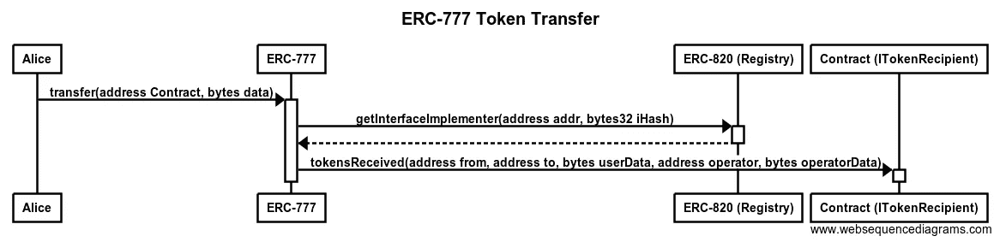
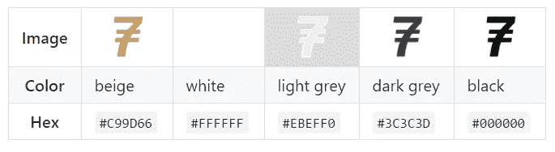

# ERC-777 一种新的高级令牌标准

> 原文：<https://medium.com/coinmonks/erc-777-a-new-advanced-token-standard-c841788ab3cb?source=collection_archive---------1----------------------->

ERC(以太坊征求意见)-777

引入了一个新的高级令牌标准来建立一个演进的令牌标准，该标准吸取了 approve()和前面提到的 send-Token-to-contract-issue 等错误概念。

此外，ERC-777 使用新标准 ERC-820:使用注册契约的伪自检，该注册契约允许注册契约的元数据，以提供简单类型的自检。这允许向后兼容和其他功能扩展，具体取决于对 to 地址的 EIP-820 查找所返回的 ITokenRecipient，以及目标契约所实现的功能。

ERC-777 从使用 ERC-20 令牌中吸取了很多经验，例如白名单运营商，提供符合以太网的 send(…)接口，使用 ERC-820 覆盖和调整功能以实现向后兼容。



ERC-777 Token Transfer Messaging Calls

该标准试图改进广泛使用的 [ERC-20](https://github.com/ethereum/EIPs/issues/20) 令牌标准。该标准的主要优点是:

1.  使用与以太相同的原理，即令牌通过`send(dest, value, data)`发送。
2.  可以在任何契约和任何常规地址中定义一个`tokensReceived`,当收到令牌时触发该代码。这避免了 ERC-20 标准中需要的双重呼叫。
3.  契约和常规地址都可以通过注册一个阻止发送的`tokensToSend`函数来控制和拒绝它们发送的令牌。
4.  契约和常规地址都可以通过注册一个抛出拒绝接收令牌的`tokensReceived`函数来控制和拒绝接收哪些令牌。
5.  令牌持有者可以“授权”和“撤销”能够管理其令牌的操作员。这些操作者通常是经过验证的合同，如交易所、支票处理器或自动收费系统。
6.  每个令牌交易包含一个`userData`字节字段和一个类似的`operatorData`——在运营商交易的情况下——分别由用户(发送者)和运营商自由使用，以将数据传递给接收者。
7.  它可以以向后兼容的方式用于不包含`tokensReceived`功能的钱包。

## 规格

ERC-777 代币(代币合同)

```
interface ERC777Token {function name() public constant returns (string);function symbol() public constant returns (string);function totalSupply() public constant returns (uint256);function granularity() public constant returns (uint256);function balanceOf(address owner) public constant returns (uint256); // transfer is modified to send in ERC-777function send(address to, uint256 amount) public;function send(address to, uint256 amount, bytes userData) public; function authorizeOperator(address operator) public;function revokeOperator(address operator) public;function isOperatorFor(address operator, address tokenHolder) public constant returns (bool);function operatorSend(address from, address to, uint256 amount, bytes userData, bytes operatorData) public; event Sent(address indexed operator,address indexed from,address indexed to,uint256 amount,bytes userData,bytes operatorData);event Minted(address indexed operator, address indexed to, uint256 amount, bytes operatorData);event Burned(address indexed operator, address indexed from, uint256 amount, bytes userData, bytes operatorData);event AuthorizedOperator(address indexed operator, address indexed tokenHolder);event RevokedOperator(address indexed operator, address indexed tokenHolder);}
```

令牌合同必须通过 ERC-820 注册`ERC777Token`接口。

基本单位令牌必须是 10 ⁸

## 标志；徽标



ERC-777 Token Standard Logo

该徽标根据[知识共享署名-共享 4.0 国际许可协议](http://creativecommons.org/licenses/by-sa/4.0/)进行许可，附加限制是该徽标不得用于广告、宣传或以任何方式与不符合 ERC-777 标准的技术(如令牌)相关联。

## 基本原理

该标准解决了 [EIP-223](https://github.com/ethereum/EIPs/issues/223) 的一些问题，并通过允许运营商(通常是合同)以与允许无限`approve`的 ERC-20 相同的方式管理令牌而更进一步。

此外，ERC-820 的使用允许向后兼容钱包和代理合同，而不必重新部署。

## 向后兼容性(ERC-20 令牌)

这个 EIP 没有引入向后不兼容性，并且与旧的 ERC-20 令牌标准兼容。

这个 EIP 没有使用`transfer`和`transferFrom`，而是使用`send`和`operatorSend`来避免错误地知道你正在使用哪个接口。

该标准允许实现 ERC-20 功能`transfer`、`transferFrom`、`approve`和`allowance`，以使令牌与 ERC-20 兼容。

令牌可以实现`decimals()`以实现向后兼容性。如果实现，它必须总是返回 18。

因此，一个令牌合同可以同时实现 ERC-20 和 ERC-777。只读功能(如`name`、`symbol`、`balanceOf`、`totalSupply`)和内部数据(如余额映射)重叠没有问题。但是请注意，以下功能在 ERC-777 中是强制性的，必须执行:`name`、`symbol`。(`decimal`不是 ERC-777 标准的一部分。)

两种标准的写入方法是分离的，可以彼此独立操作。请注意，ERC-20 函数应该仅限于从旧的契约中调用。

如果令牌合同实现了 ERC-20，则必须通过 ERC-820 注册`ERC20Token`接口。如果契约具有启用或禁用 ERC-20 方法的开关，则每次触发该开关时，令牌契约必须通过 ERC-820 相应地注册或注销`ERC20Token`接口。

执行 ERC-20 的新合同的唯一区别是通过 ERC-820 登记`ERC777TokensSender`和`ERC777TokensRecipient`优先于 ERC-20。这意味着，即使在 ERC-20 `transfer`调用中，令牌合约也必须通过 ERC-820 检查`from` / `to`地址是否实现了`tokensToSend` / `tokensReceived`，并在可用时调用它。注意，当调用合同上的 ERC-20 `transfer`时，如果合同没有实现`tokensReceived`，那么`transfer`调用仍然应该被接受，即使这意味着令牌可能会被锁定。

下表总结了通过 ERC-777 和 ERC-20 发送、铸造和转移令牌时，令牌合同必须采取的不同措施:

如果`tokensToSend`未执行，则无需采取特殊措施。转让必须继续进行，只有在另一个条件未被满足时，如缺乏资金或`tokensReceived`中的一个障碍，转让才被取消。

**优点:**

深思熟虑、不断发展的令牌接口，从 ERC 协议 20 的使用中汲取经验

使用新的标准请求 ERC-820 进行自检，允许增加功能

白名单操作符非常有用，比批准/允许更有必要，因为批准/允许通常是无限的

**CONS:**

才刚刚开始，复杂的构造需要依赖契约调用

依赖性增加了安全问题的可能性:首先，安全问题不是在 ERC-777 飞机上发现的(并得到解决)，而是在更新的 ERC-820 飞机上发现的

**ERC 20 令牌的问题:**

如何将代币转换为合约？

-我们可以将代币发送到任何以太坊地址，这意味着我们也可以将代币发送到不支持代币的合同，永久锁定代币。

-更糟糕的是:即使令牌可以手动移动，也很难区分哪些令牌来自谁，并尝试将它们发送回去。

解决方案:ERC20 曾经有一个“批准”功能，允许您批准转移到一个合同，然后创建第二个事务，让合同知道它已经被批准。

ERC777 允许在不需要以太网的情况下进行链外签名传输，或使用 zksnarks 或 ring 签名为令牌添加隐私的私有传输。

**ERC 777 的特点:**

1)向后兼容

-使其与 ERC20 更重要的功能兼容

2)更安全、更简单地发送至合同

-引入了一个新的传输函数，该函数添加了一个名为 bytes 的字段，您可以在该字段中向传输添加任何标识信息，它会自动让接收合同知道发生了传输。

3)将十进制设置为默认值 18

4)添加批准的操作员

## **参考文献**

*Github EIP 问题 777:*[https://github.com/ethereum/EIPs/issues/777](https://github.com/ethereum/EIPs/issues/777)

*Github 本标准的官方资源库:*[*jacquesd/EIP 777*](https://github.com/jacquesd/eip777)*。*