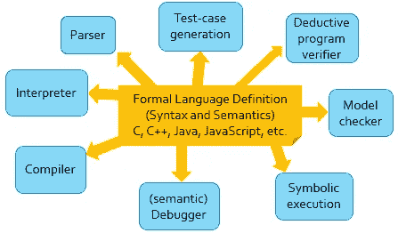

# ERC 20-K:ERC 20 的正式可执行规范

> 原文：<https://medium.com/coinmonks/erc20-k-formal-executable-specification-of-erc20-442b9030a29e?source=collection_archive---------1----------------------->

## 作者格里戈雷·罗苏

运行时验证公司提供[正式的智能合同验证](https://runtimeverification.com/smartcontract)服务。

[ERC20 标准](https://github.com/ethereum/EIPs/blob/master/EIPS/eip-20-token-standard.md)是在[以太坊](https://ethereum.org/)智能合约中实现令牌的最重要标准之一。ERC20 提供了转移代币并获得批准的基本功能，以便其他链上第三方可以使用代币。不幸的是，ERC20 留下了几个未指定的极限情况，这使得它在令牌实现的正式验证中使用起来不够理想。事实上，我们 RV，Inc .已经被要求验证智能合同是否符合*ERC 20*。然而，我们发现 ERC20 合规性的含义并不清楚，因为现有的 ERC20 演示远远不能作为标准令牌的数学模型。因此，我们决定创建 ERC20-K，这是 ERC20 的一种数学上严格的形式化，确保所有的极限情况都经过深思熟虑、明确涵盖和彻底测试。从这里开始，当我们声称我们证明了 ERC20 令牌的实现是正确的时，我们的意思是它们可以证明满足 ERC20-K 的 13 条规则。

# 为什么是 K

出于几个原因，我们选择了 K 作为我们形式化工作的语义框架。

首先， *K 是可执行的*。因此，可以对定义的语义模型进行测试，以发现其设计中的早期错误，并积累对其充分性的信心。

其次， *K 提供了一套形式分析工具*，可以与任何语义结合使用:

因此，我们可以证明关于 ERC20 规范本身的属性，例如一方面“总供应量不会因 ERC20 操作的应用而改变”，并且还可以证明关于 ERC20 令牌的智能合约实现的属性。

第三， *K 是模块化的*。这允许我们在 ERC20-K 上为执行环境或编程语言组合定义语义，给人一种“即插即用 ERC20 成为您最喜欢的语言”的感觉。此外，一旦完成，我们就可以用生成的语言来验证复杂的程序。

第四， *K 正在积极开发*，我们对其设计和实现有控制权，因此它可以快速响应 ERC20-K 的未来需求。例如，我们计划将 ERC20-K 并入 [IELE](https://github.com/runtimeverification/iele-semantics) VM，并为 K 实现一个[快速 LLVM 后端；如果成功，这将消除对虚拟机及其之上的 ERC20 令牌的即席实施的需求。通过其](https://runtimeverification.com/blog/?p=459) [KEVM](https://github.com/kframework/evm-semantics) 语义，EVM 也可以做到这一点，只要充分定义了 ERC20-K 配置(基于语义单元)到 EVM 配置(基于部分映射)的注入态射。

# ERC20-K 的亮点

ERC20-K 在地址、值和最大值方面是*参数。这样可以很容易地实例化到除 EVM 之外的各种目标执行环境，如 [eWASM](https://github.com/ewasm/) 或 [IELE](https://github.com/runtimeverification/iele-semantics) ，以及除 [Solidity](https://solidity.readthedocs.io/) 之外的各种编程语言，如 [Viper](https://github.com/ethereum/viper) 或[普路托斯](https://cardanodocs.com/technical/plutus/introduction/)。*

ERC20-K 在执行环境中是*参数化的。它可以在任何具有正式语义的执行环境中即插即用，例如虚拟机或编程语言。ERC20 函数简单地添加到目标 VM/语言的语法中，ERC20 语义平滑地与 VM/语言的语义组合，产生了具有 ERC20 支持的 VM/语言的变体。我们已经用一个简单的命令式语言 IMP 完成了。下面的视频显示了 IMP 中调用 ERC20 函数的交互程序。这可以很容易地适应语言实现，其中 ERC20 可以被视为一个库。*

ERC20-K 覆盖了所有的极限情况,包括抛出异常的情况。例如，`transfer(To,Value)`函数需要 4 种情况，这取决于调用者是否与`To`不同，还取决于传输是成功还是抛出。

ERC20-K 是*可执行的*。这不仅允许我们优雅地将它与编程语言集成(上面的第 2 项)，还允许我们*测试*它。事实上，像代码一样，一个正式的规范也会有错误，尤其是当没有其他正式的规范可以比较的时候。与代码不同，代码可以根据规范进行验证，我们无法证明一个正式的规范是正确的:因为它是一个定义，所以根据定义它是正确的。我们能做的最好的事情就是通过各种方式来积累对其正确性的信心。最切实的方法之一就是测试它。为此，我们为我们的 ERC20 语义提供了 60 多个单元测试；这些可以很容易地转化为 ERC20 实现的测试。还可以翻译和运行已经为 ERC20-K 上的以太坊令牌部署的测试套件，建立我们的语义准确反映流行的部署令牌的信心。

# 技术详情和下载

ERC20-K 在 Github 的 UIUC 许可证(与 MIT 许可证一样许可)下被彻底注释并免费提供:

非常感谢您的评论和贡献。

# 介入

本着开源、社区驱动开发的精神，我们将在我们的渠道上举行所有的 ERC20-K 正式规范讨论

*   [#erc20-k:matrix.org](https://riot.im/app/#/room/#erc20-k:matrix.org) 于[暴动](https://riot.im/)
*   [runtime verification/ERC 20-语义](https://gitter.im/runtimeverification/erc20-semantics) [Gitter](https://gitter.im/) 上的

所有软件都是在 UIUC 许可下发布的，社区可以完全免费使用。我们欢迎[对 Git](https://github.com/runtimeverification/erc20-semantics) 的贡献。

我们鼓励任何感兴趣的团体加入我们，提出问题，贡献代码，或者用我们的工具积累经验。我们也一直在寻找能够在文档，新开发人员的有效安装/快速启动过程，以及更多的例子和测试工作的贡献者。我们正在招聘，并将确保关注有帮助的贡献者！

我们还将在我们全新的 Twitter 页面 [@rv_inc](https://twitter.com/rv_inc) 上发布更新，我们希望任何感兴趣的开发者都会关注并与之互动。

让我们一起为每个人构建更安全的智能合约！

# 承认

我们感谢 K 团队定义了 [KEVM](https://github.com/kframework/evm-semantics) 语义(也参见[技术报告](https://www.ideals.illinois.edu/handle/2142/97207))并验证了智能合同对 ERC20 的遵从性。正是他们的努力不可避免地导致了对 ERC20 正式规范的探索。特别是，我们要感谢[菲利普·黛安](http://pdaian.com/)的集思广益，帮助我们理解 ERC20 的关键案例。

我们也非常感谢 IOHK 不仅为 KEVM 和 IELE 提供了慷慨的资金支持，也感谢我们与他们的研究团队进行了激动人心的技术讨论。关于 IELE 以及卡尔达诺定居点和计算层之间的计划分离的讨论，特别导致了一个问题，即 ERC20 规范是否可以以更抽象的方式定义，使其可以与不同于 EVM 的计算层结合使用。

> [直接在您的收件箱中获得最佳软件交易](https://coincodecap.com/?utm_source=coinmonks)

# 接触

从[Runtime Verification Inc .](https://runtimeverification.com/smartcontract/)了解更多信息请访问我们的 [GitHub 页面](https://github.com/runtimeverification/verified-smart-contracts)。请将您的问题发送给我们。

# 相关故事

 [## ERC-20 合同的正式核查

### 运行时验证公司提供正式的智能合同验证服务。

runtimeverification.com](http://runtimeverification.com/blog/erc-20-verification/)  [## ERC 777-K:ERC 777 的正式可执行规范

### 运行时验证公司提供正式的智能合同验证服务。

runtimeverification.com](https://runtimeverification.com/blog/erc777-k-formal-executable-specification-of-erc777/)  [## 智能合同的正式验证是如何工作的

### 运行时验证公司提供正式的智能合同验证服务。

runtimeverification.com](http://runtimeverification.com/blog/how-formal-verification-of-smart-contracts-works/)  [## 正式智能合同验证

### 运行时验证公司提供正式的智能合同验证服务。

medium.com](/@rv_inc/formal-smart-contract-verification-4b19cf848ff9) 

*原载于 2017 年 12 月 6 日 runtimeverification.com**的* [*。*](https://runtimeverification.com/blog/erc20-k-formal-executable-specification-of-erc20/)