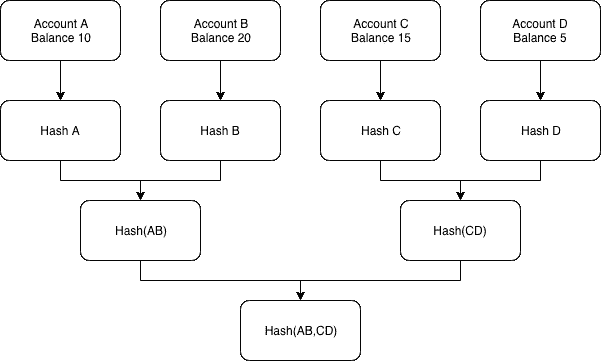
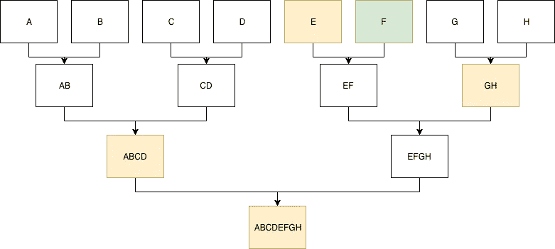

# 使用 Merkle 树的 ERC20 快照

> 原文：<https://medium.com/coinmonks/erc20-snapshot-using-merkle-trees-aeeac48ce925?source=collection_archive---------1----------------------->

实现更多功能而不仅仅是实现令牌逻辑的令牌契约必然存在漏洞。如果暴露了一个，就必须重新部署合同。这立即引发了一个问题:如果我们想要重新部署一个令牌契约，该怎么办？我们如何把用户的令牌还给他们？我在这里提出的解决方案是，所有在快照中拥有令牌的用户现在都可以自己检索令牌，从而支付自己的汽油费用。证明他们有他们的令牌不需要一个集中的可信设置，他们只需要连接到一个存档以太坊节点。

## 上传整个存储

创建快照令牌的一个合理方法是建立一个新的契约，并简单地将令牌还给用户，给定某个数据块的快照(在利用发生之前)。然而，这意味着这份合同的主人要支付大量的汽油费。这也提出了一个问题，即是否有必要向用户退还大量代币。他们可能打算把所有的代币都从钱包里拿出来，但是只留下了一些。不向这些用户返还令牌符合道德吗？

对于每次存储写入，使用 20k 气体，这大约与您将 ETH 发送到另一个地址所使用的气体量相同(花费 21k 气体)。因此，如果 1000 个地址需要获得令牌退款，则至少需要使用 2000 万个 gas，这相当于 2.5 个完整的块，我们完全忽略了正在执行的其他逻辑上使用的 gas，例如支付呼叫数据和内存管理，这将产生更多的 gas 成本！

## 服务器解决方案

解决这个问题的另一种方法是建立一个中央服务器，给用户一个签名的消息，表明服务器允许他们将旧令牌“铸造”回自己。用户现在可以将交易上传到他们也提供签名的链。这意味着用户必须支付汽油费，也意味着只有希望取回令牌的用户才能上网，从而降低网络负载。

然而，这有两个突出的问题。首先，服务器本身有能力铸造任意数量的令牌，这立即意味着令牌的价值与信任服务器从不铸造大量令牌联系在一起。第二，服务器必须在线，这样用户才能向服务器请求新的签名。如果服务器在一年后关闭，而用户仍想申领他们的令牌，他们会发现这是不可能的，因为申领时间已过。

## Merkle 树解决方案

如上所述，这两种解决方案都有一个问题:第一种给网络带来很大压力，第二种集中了令牌供应。Merkle Tree 解决方案允许用户在任何时候要求他们的令牌:他们唯一需要的是连接到一个存档以太坊节点。

Merkle 树是显示数据子集是更大数据集的一部分的有效方式。这正是我们在这里所需要的:我们想展示地址和余额的组合是更大的数据集(即快照)的一部分。让我们看看这是如何工作的。

Figure 1

在图 1 中，显示了一个由 4 个帐户组成的简单 Merkle 树。首先要做的是散列数据，在本例中是一个帐户的地址及其余额。例如，这导致帐户 A 在散列 A 中。现在，要进一步向下移动树，我们还需要知道散列 B 和散列(A，B ),其中两个散列(每个 32 字节长)被连接，然后被散列。这导致哈希(AB)。为了得到 Merkle 根，我们还需要知道 Hash(CD ),然后一起 Hash(AB，CD )(因此连接 AB 的 Hash 和 CD 的 Hash，然后散列结果)来得到 Merkle 根。

因此，为了得到 Merkle 根，你首先需要知道整个数据集(所有账户及其余额),然后遵循这个协议，这样每次你都可以“更深入”地进入 Merkle 树。最后，您只有一个散列，即 Merkle 根，我们现在可以用它来证明某些帐户和余额是这个快照的一部分。Merkle 根因此被上传到新的 ERC20 合同链上。

这样做的好处是，如果你需要证明一些数据是 Merkle 根的一部分，你只需要非常少量的数据:你只需要知道其他的散列，这样最后你就得到 Merkle 根。

请注意，伪造这些数据是不可能的，因为这意味着您可以创建一个新的散列，然后散列到已知的东西。这会立即破坏哈希函数，因为这意味着您可以反转哈希函数。改变输入数据的一小部分将导致完全不同的 Merkle 根，这是哈希函数的一个属性，称为雪崩属性。

Figure 2

让我们来看看如何证明某个有一定余额的账户是这个快照的一部分。在图 2 中，我们试图证明块 F(账户 F 和快照余额的散列)是数据集的一部分。我们只能证明我们是否知道在 Merkle 根处结束的散列(如图 2 中橙色部分所示)。可以从任何存档以太坊节点检索必要的数据。我们只需在此时查询合同的所有余额，创建我们自己的 Merkle 树，然后从那里获取必要的数据。当然，给用户整个数据库文件更容易，这样他们可以计算他们自己的证明，或者设置一个服务器，只给用户他们必须上传的证明。然而，关键是，很明显，如果用户与归档节点有连接，则总是可以检索到证据，这实质上分散了对快照的支持。

为了得到 Merkle 根，我们需要知道 F 到 EF 的散列，因此我们需要知道 hash E，要去 EFGH，我们需要知道 hash GH，并且知道如何从 GH 到 Merkle 根，我们需要 ABCD。因此这四个散列证明 F 是快照的一部分！

## 在合同中验证

为了让用户认领他们的令牌，他们调用“认领”函数，该函数接受任何帐户(其他帐户也可以免费认领其他地址的令牌)、他们的余额、散列列表以及他们的顺序。注意，有必要知道我们散列的顺序:如果我们散列(EF ),这不同于散列(FE)。

开始时，合同对账户和余额进行哈希处理。这应该产生散列 f。现在列表上提供的散列被遍历，并且按照用户提供的顺序被散列。如果只剩下一项，这应该是 Merkle 根。然后，用户在其余额上获得这些代币，并且其账户被标记为“已认领”，因此用户不能转移代币和重新认领代币。

## 讨论

这个解决方案展示了 Merkle 树的力量。然而，这是否是一个优雅的解决方案是有争议的。最后，如果您将 gas 的使用与所有者立即将所有数据存储在合同中的“简单”解决方案进行比较，那么如果所有地址都要求其令牌，则 gas 的使用会更高。这是因为在逻辑上有一个开销，另外还要写一个额外的存储槽来存储用户已经要求的令牌。

然而，如果令牌有很多“灰尘”地址，这可能会导致更少的气体使用，因为几乎没有令牌的用户没有理由要求它们。因此，这会过滤掉此时不必要的存储写入。

我希望这已经向你展示了 Merkle 树的力量，并可能给你一些灵感来用它们创造一些很酷的东西！

概念验证可在[https://github.com/jochem-brouwer/ERC20Snapshot](https://github.com/jochem-brouwer/ERC20Snapshot)获得

> [在您的收件箱中直接获得最佳软件交易](https://coincodecap.com/?utm_source=coinmonks)

