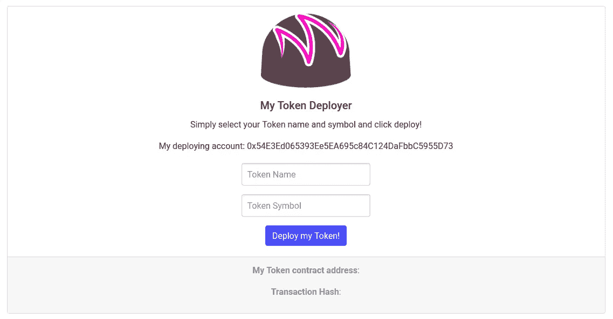
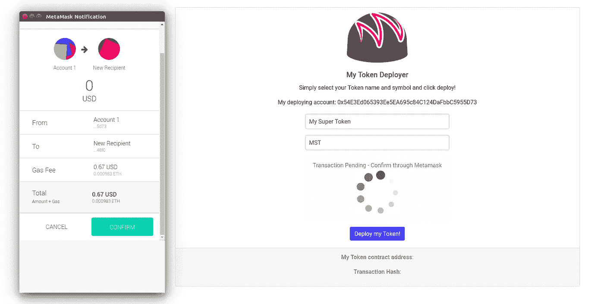
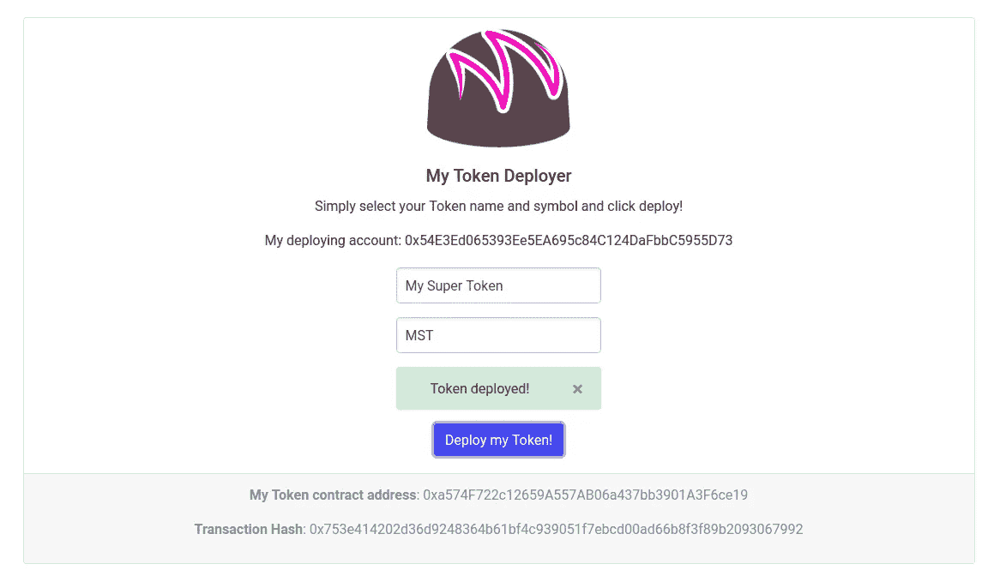
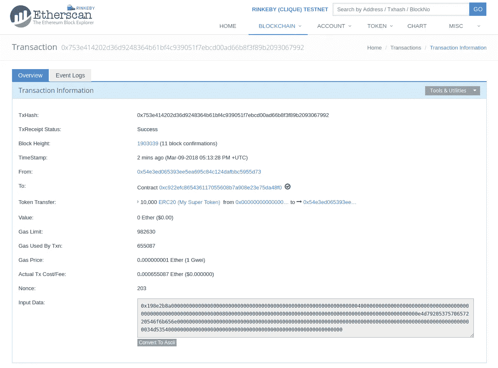
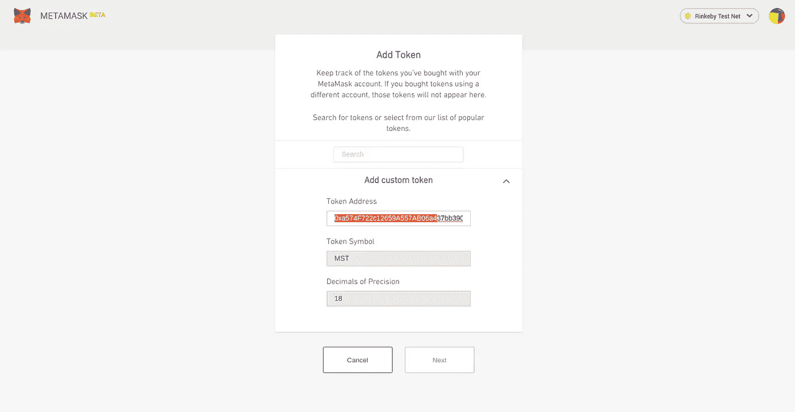

# 部署 ERC20 令牌

> 原文：<https://medium.com/coinmonks/erc20-token-deployer-fd4b544598ab?source=collection_archive---------0----------------------->

在本帖中，我们将讨论一个 erc20 令牌工厂合同，该合同只需点击一下鼠标即可部署令牌。dapp 是用[反应](https://reactjs.org/)、[松露](http://truffleframework.com/docs/)、[毛毛雨](http://truffleframework.com/docs/drizzle/getting-started)、[超面具](https://metamask.io/#how-it-works)和[齐柏林飞船-坚固](https://github.com/OpenZeppelin/zeppelin-solidity)建造的。回购可用[此处](https://github.com/NFhbar/Token-Deployer)。

# **Rinkeby 工厂实例**

部署到 Rinkeby 测试网络的工厂实例在这里[可用](https://one-click-token.herokuapp.com/) —您需要安装元掩码，并且需要连接到 Rinkeby 网络。

用户界面非常简单:



Token Deployer UI.

为了使 dapp 正常工作，你需要:
-确保你已经安装了元掩码
-选择 Rinkeby 测试网络
-确保你的帐户中有一些[测试 ETH](https://faucet.rinkeby.io/)

Metamask 注入 [Web3](https://web3js.readthedocs.io/en/1.0/) 并显示您正在使用的帐户。该表单接受两个参数:您的*令牌名称*和您的*令牌符号*。为简单起见，总电源被硬编码为:

```
uint8 public constant decimals = 18;INITIAL_SUPPLY = 10000 * (10 ** uint256(decimals));
```

输入您的令牌名称和符号后，点击按钮，元掩码将要求确认:



Metamask waiting for confirmation.

在您确认您的事务后，它将被提交、挖掘，然后 UI 将更新:



Token successfully deployed.

dapp 显示一条消息，表明交易已成功提交，并使用您的令牌合同地址和交易哈希更新页脚，您可以使用 [Etherscan](https://rinkeby.etherscan.io/) 验证这一点:



Transaction success in Etherscan.

现在，只需使用您的令牌合同地址将您的令牌添加到元掩码中:



Add your new token to Metamask.

就是这样！您现在可以将新令牌发送给任何人！

# 代币厂

令牌合同是对 Zeppelin-Solidity 的 erc20 标准令牌的简单修改:

为了简单起见，`INITIAL_SUPPLY`被设置为一个固定值，但是如果您愿意，您可以简单地将它作为一个额外的构造函数参数传递。构造器获取`_name`和`_symbol`变量并对它们进行分配，最后总供给被发送到`_owner`。

令牌工厂合同由以下方提供:

构造函数创建一个新的`MyToken`实例并设置适当的参数。`MyTokenFactory`像`register`一样继承了`[Factory.sol](https://gist.github.com/NFhbar/ce4b22d5fc3a65559f694ab3bf9ab418)`的方法。

就是这样！如果你想在这个 dapp 上工作或提出建议[，这里有 repo](https://github.com/NFhbar/Token-Deployer) 和 Heroku dapp 。

非常感谢你阅读这篇文章！如果你觉得这篇文章很有用**，请点击这篇文章，并确保关注我的更多常规内容**，也请查看我的 [Github](https://github.com/NFhbar) ，因为我定期发布示例代码和项目。如果你有任何问题，欢迎在下面回复或者给我发邮件。

编码快乐！

> [直接在您的收件箱中获得最佳软件交易](https://coincodecap.com/?utm_source=coinmonks)

[](https://coincodecap.com/?utm_source=coinmonks)