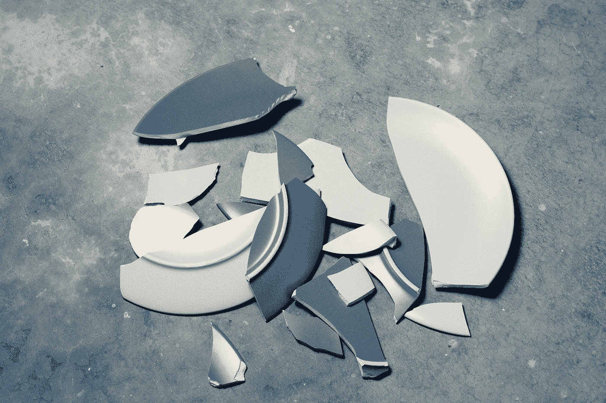

# ERC721 —让我们打破东西

> 原文：<https://medium.com/coinmonks/erc721-lets-break-things-ecaee0badee3?source=collection_archive---------0----------------------->

这是一个关于我如何在短短几个小时内登上 Etherscan NFT 排名榜第五名的故事。

本周早些时候，我启动了[以太病毒](/coinmonks/2020-nethv-the-ethervirus-2788fa140de4)，这是一个试图将病毒机制引入连锁游戏的密码艺术项目。这只是我上周产生的一个想法，我给了自己一周的时间来构建和部署它。

这个截止日期意味着我走了一些捷径——我想这并不重要，因为这个项目只是为了好玩，没有任何经济价值。我还发现，由于我 90%的合同代码来自一个老的、经过充分测试的项目，我不能真的把它搞砸…这显然是一个错误。

公平地说，智能合约的功能没有任何缺陷。在内部，它没有任何问题，所有的外部功能都做了它们应该做的事情。但是关于**事件**和 **ERC165 接口**检查的一些疏忽导致了像 [EtherScan](http://etherscan.io/) 这样的网站如何解释合同的一些问题。有趣的是，它暴露了这些网站是如何准确地跟踪令牌的，这让我想知道破坏东西会有多难。



Photo by [chuttersnap](https://unsplash.com/@chuttersnap?utm_source=medium&utm_medium=referral) on [Unsplash](https://unsplash.com?utm_source=medium&utm_medium=referral)

# 事件就是一切

首先我来解释一下我是怎么搞砸以太病毒合约的。这一切都归结于一个事件，即`Transfer`事件。ERC721 EIP 将此事件描述为

```
**event** Transfer(**address** **indexed** _from, **address indexed** _to, **uint256 indexed** _tokenId);
```

问题是，我开发我的 721 令牌时，EIP 仍然是一个草案建议，我猜当时，**事件**的最终参数没有**索引**。我以为我已经抓住了所有的变化，但这一个我错过了。但这意味着我的 ERC721 令牌在以太网扫描中显示为 ERC20 令牌——完全不同的东西。

我还不知道**索引**的事情，所以我和 Etherscan 的助手在 twitter 上聊了聊，他向我展示了他们用于 NFT 的验证工具，以及为什么我的合同没有通过。除了以上所述，我还为 ERC165 接口检查硬编码了错误的值，这意味着我的合同甚至没有声称是有效的 ERC721 令牌。我不知道这是否也是因为一个旧版本，或者只是一些其他随机的错误。如果我费心对合同进行单元测试，这两个问题都会被发现。咩。

无论如何，有了这些明显的失误，事情进展不完美也就不足为奇了。真正令人惊讶的是，事情仍然*非常*工作。我仍然可以在 [OpenSea、](http://opensea.io/)和 Etherscan 上列出代币，仍然*像对待 NFT 一样对待我的人。*

# 寻找极限

我决定尝试找出这些网站在 NFT 中寻找的极限。在制作以太病毒时，我曾希望它能在以太扫描上进入 [NFT 排行榜，但当它没有获得任何关注时，我也没有感到困扰。我的新目标是看看通过发送垃圾邮件登上 NFT 排行榜榜首有多容易，或许还能在 OpenSea 上引起一点关注。](https://etherscan.io/tokens-nft)

我创造了一个名为隐撒旦的令牌，符号是撒旦。灵感来自于看到某个疯狂的人发垃圾信息，说共济会如何控制一切。我想，如果有这样的人，以太坊的部分用户可能会反对在他们的钱包里放撒旦品牌的东西。于是我把代币图像做成中世纪的魔鬼画，并做了代币描述*“撒旦在你的钱包里。你的密码的不朽灵魂已经暴露了。邪恶围绕着你。”—* 希望这会增加一些交通流量。

## 版本 1

第一版 CryptoSatan 自动给每个以太坊地址分配 666 个撒旦令牌。您可以发送和接收它们，您的余额会上升或下降，当进行转账时，它会发出一个事件，但一些 ERC721 可枚举的函数被捏造了。

所以我空投了一些代币……以太扫描上的“总供应量”只显示为我转移的数字。这很奇怪，因为我的合同上的`totalSupply` 函数总是返回`666 * 0xFFFF…`，或者说是以太坊可能地址的 666 倍。

熟悉 721 标准和*可枚举*扩展的人会知道，有各种函数可以跟踪谁拥有什么以及存在什么令牌。事实证明，像 Etherscan 和 OpenSea 这样的网站并没有太多的关注这些——他们大多只是关注事件并跟踪它们。有意思…

## 版本 2

所以我抛弃了那些乱七八糟的东西，决定开始玩事件游戏。这个问题的关键是在发布新令牌时调用的 Transfer 事件，其中`from`地址是零地址。这就是以太扫描知道令牌存在的方式。去年我在制作一个[连锁文本冒险游戏](/coinmonks/adventures-with-dumb-contracts-18f8ce8414c9)时了解了所有事件。该项目的经验之一是，事件中发出的数据比存储在链上的数据便宜。

所以我想为什么不做一个看起来有 10 个代币的代币。基本上，当用一个`tokenId`调用一个函数时，将它除以 10，使它成为一个`innerId`，并在此基础上保持一切正常工作。基本上，就这些第三方网站而言，你只是将你的表面代币量乘以 10，在交易层面上基本上没有任何成本。如果一个人转让其中任何一个代币，它将转让所有十个代币。

在这一点上，我变得有点厚颜无耻，所以我想我应该从我的 NFT 中完全删除所有的 *ERC721-enumerable* 代码，因为它看起来是不必要的，但是仍然保留接口检查，所以它声称是可枚举兼容的。后者没有理由，我就是想搞乱以太扫描。

我还决定我需要添加一些垃圾邮件机制。我需要把这些代币交到那些会注意到它们的人手中，并设法处理掉它们。以太扫描的 NFT 排名是基于流量的，所以就我的目标而言，没有什么交易是坏的。我一直在窥探其他几个 NFT 顶级项目，看看我在处理什么。有趣的是，大多数顶级的 NFT 项目*并没有*实现 ERC721-enumerable。也许这是一个显而易见的选择，因为它确实为用户节省了相当多的汽油，但对我来说，我以前从未想过不做一个完全兼容的令牌。

有一个*高流量的 NFT 做到了: [MyCryptoHeroes](https://etherscan.io/address/0x273f7F8E6489682Df756151F5525576E322d51A3) 。这很重要的原因是这个*可枚举的*函数:*

```
**function** tokenByIndex(**uint256** _index) **external view returns**(**uint256**);
```

您向它传递 0 到令牌总数之间的任意数字，并得到一个`tokenId`。你把那个`tokenId`传给`ownerOf`，你就得到拥有它的人的地址。基本上，MyCryptoHeroes 有一个所有用户的索引列表，供任何人使用。他们必须这样做，否则他们就不符合 ERC 721-enumerate-compliant。我认为持有我的 CryptoHeroes 令牌的人可能是活跃的 NFT 用户，所以这可能是一个很好的空投对象列表。

所以我为这两个功能定义了一个与 MCH 交互的小接口:

```
**interface** Chump {
    **function** tokenByIndex(**uint256** _index) **external view returns**(**uint256**);
    **function** ownerOf(**uint256** _tokenId) **external view returns**(**address**);
}
```

我在构造函数中存储了对`Chump`契约的引用，所以我可以在代码中调用这些函数。抱歉 *MyCryptoHeroes* ，这不是针对你个人的，你只是一个拥有有效的 721 可枚举合同的最大的鱼。

无论如何，无论何时*任何人*进行撒旦令牌转移，该合同也从 MCH 的用户群中铸造 10 个令牌到一个地址。它从一开始就开始了，对于每一次转移，它只是查看下一个地址。对于额外的垃圾邮件，它还为该事务的`msg.sender`铸造 10。

我部署了这个事务，仅仅几个事务之后，Etherscan 上的令牌事务数量已经达到了 60 个。是的……这看起来不错。但是总供应量似乎有些问题。我想如果我不是的话，我就不应该声称自己是可枚举兼容的。此外，`totalSupply`函数非常简单，所以可以保留它。

> 旁注:根据以太扫描的 NFT 检查，我的合同仍然不符合 721。但绝对是。我和他们的帮助人员谈过，发现他们的支票坏了，感谢我指出来，并说他们会在更新中修复它。所以在尝试破解以太扫描的过程中，我修复了以太扫描...耶。

## 版本 3

不管怎样，我们就要到了，但我真的希望我的人能正常出现，所以我把它拆了，重新部署了一次。

这一次，我保留了`totalSupply`函数，但也没有声称它符合 721-enumerate-compliant。正如我所怀疑的，总供应量保持最新，其他一切都很好。我可以在 OpenSea 上列出我的代币，并进行交易，每次我都会爬上 Etherscan 的排名。我和 OpenSea 的一个不错的家伙发了消息，他从他们的数据库中删除了旧的合同，所以唯一会出现的令牌是新的、好的。

# 撒旦恐慌

下一个任务是开始空投这些代币，列出它们，并出售它们。我从 Etherscan 上随便抓了几个地址，一次空投 10 个给随机的人。我也开始铸造自己的，并把它们放在 OpenSea 上。我想，如果我列出一些以各种价格出售的，还有一些免费的，那么人们会看到免费的，会想"*哇，多么划算啊！"把他们抢走。*

事实的确如此。

几个小时内，我在以太扫描的 NFT 排名中稳步攀升。因为 10 倍令牌的事情，我个人必须做的空投次数比一对一的时候要少得多。我可能至少可以得到 20 英镑，而不会花更多的汽油费，但是因为 66 英镑似乎太多了，6 英镑似乎太少了，10 英镑似乎足够了。

我很快就在 Etherscan 上排名第 10，并且肯定开始把它算作胜利了。看起来我甚至可以超过 CryptoKitties，成为第一名。在没有我的参与下，人们开始在 OpenSea 上交易和上市。我很高兴看到人们列出了他们的价格，如 **66** 、 **0.666** 和 **6.66 ETH** 。开始看起来我可以坐下来，让这件事做它的事情。

但是后来，我收到了一条来自 OpenSea 的消息…

# 审查

之前和我说过话的人给我发消息，说他们的帮助频道里有人对令牌有问题。这是个坏消息。OpenSea 基本上是我唯一的传播途径，一旦我进入他们的雷达，我知道我会被影子封禁或完全移除。

这是聊天中的对话:

> **用户:**仅供参考，我在 OpenSea 搜索中按最低价格排序时，错误地获得了两个这种加密撒旦令牌(声称为 0 ETH ),现在这份合同不断向我发送重复令牌。
> 
> 我试图将它们“赠送”回发送帐户，但很难跟上。可能没什么可做的，但我想通知每个人。
> 
> **我:**@用户你有几个？
> 
> ***用户:*** 我把它们都送还给了最初的发送者，他给我买的两个定价为 0 ETH…虽然 OpenSea 没有更新，但我现在似乎没有任何东西…但合同已经执行了几轮发送，所以我可能会有更多。总共，我想有 12 或 15 封是寄给我的？
> 
> 奇怪的是，我只给了 8 个回复…其他的都自动回复了。
> 
> 非常奇怪
> 
> 拿着电话，我还有更多…
> 
> *🔥😖*

我想也许我可以摆脱热量，所以我建议:

> **我:**你能为 0 ETH 列出他们吗？
> 
> 用户:我为什么要这么做？这份合同只会传染给任何人，就像我传染给我一样。
> 
> 此外，我注意到合同似乎已经诞生了相同的数字到我的钱包里，刚才我"赠送"回寄信地址。所以看起来简单的转移行为可能是触发契约生育更多的原因。
> 
> 这是你的合同**@ anallergytonalogy**？
> 
> 我:这是我参与的一个项目

好吧，在这一点上，我知道夹具了。我们过分热情的 NFT 用户不会安静地进入那个美好的夜晚，如果我没有这样做，我将被 OpenSea 禁止使用影子(或 deplatformed 或任何正确的词)。

但是，嘿，在写这篇文章的时候，CryptoSatan 在 Etherscan 的 NFT 排行榜上排名第五。完全偶然的总供应量目前是 **660 撒旦**，这是一个很好的地方结束。如果能成为第一名就好了，但是既然不会再有有机增长，是时候退出了。

# NFT 的教训-垃圾邮件

我可能会后悔贴了这个，就像发明弹出广告的[，](https://www.forbes.com/sites/jaymcgregor/2014/08/15/the-man-who-invented-pop-up-ads-says-im-sorry/#477af1a64ebe)一样，但是有一些调整，我认为真的可以让这个变得更大。

首先，我不应该为`**msg.sender**s`制造代币。这是众所周知的垃圾邮件行为，对任何人来说都是一个危险信号。我想我把它放在那里是因为我认为大多数人会通过 OpenSea 获得他们的令牌，所以令牌发送者不会是`**msg.sender**`。但实际上，这就是我被抓的原因。我坚信，如果我没有那样做，黑魔王隐撒旦现在还在以太坊网络上传播。如果我想让更多的人拥有代币，我完全可以双击 MCH 用户列表…咄！

但更重要的是，造币厂事件！我完全错过了一些技巧。

首先，在对令牌进行排名时，以太网扫描只查看传输令牌流量，它实际上并不关心其中的数据。因此，我实际上不需要将 10 个令牌批处理在一起，我可以保持一对一，只需将一堆事件链接起来。

也就是说，每当 **A** 向 **B** 传递一个令牌时，契约就会发出这样的事件

```
**A** transfers to C
C transfers to D
...
J transfers to **B** 
```

它仍然会有 10 倍的流量，但用户的钱包里不会有奇怪的大量硬币，增加了稀缺性。

最重要的是，由于我们有从 MCH 窃取的真实地址列表，看起来就像真实的人在来回传递令牌。事实上，如果我们在铸造过程中随机插入几个地址，那么对于被铸造者来说，它将看起来像是一个随机的(但真实的)人给你发送了一个令牌，而不仅仅是铸造到你的地址。这似乎是你不太可能忽视的事情。

我认为在实际需要的交易之间插入这种虚拟交易是一种很好的方式，可以在看起来合法的同时伪造数字。

它甚至不符合 721 标准。EIP 对你的令牌如何操作是相当开放的，所以这甚至不会违反任何规则。你要小心在一个 tx 中读取太多的地址，因为它可能会变得有点昂贵，但除此之外，你可以轻松地将你的表面令牌流量增加 20 倍，而不会违反标准或让你的用户甚至不知道。

# 那一章到此结束

无论如何，这是有趣的一天，但仅此而已。在 24 小时内，隐撒旦将会像其他狗屎硬币一样被遗忘。我有点失望，它没有走得更远，但我们学到了一些东西，我们在 Discord 上惹恼了一些人，我们可能在 OpenSea 上迷惑了一些人，所以都起来了，不算太寒酸。

> [在您的收件箱中直接获得最佳软件交易](https://coincodecap.com/?utm_source=coinmonks)

[](https://coincodecap.com/?utm_source=coinmonks)[](https://coincodecap.com)