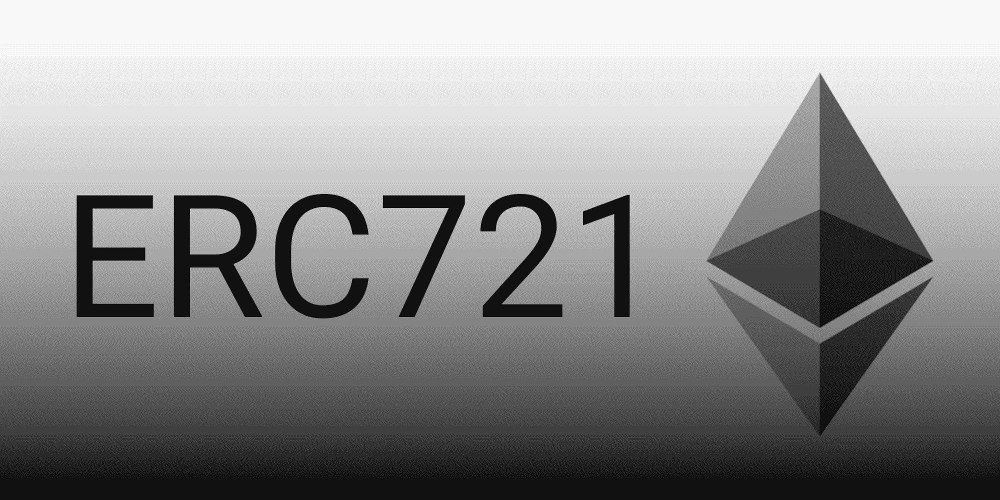

# ERC721SmartToken —带 ERC20 适配器的 ERC721 令牌

> 原文：<https://medium.com/coinmonks/erc721smarttoken-erc721-token-with-erc20-adapter-8f3776f2fef0?source=collection_archive---------1----------------------->



[source](/blockchannel/the-anatomy-of-erc721-2576e40bfc5b)

`[ERC721SmartToken](https://github.com/REGA-RS/ERC721SmartToken)`契约基于 [ERC721](https://github.com/ethereum/eips/issues/721) 标准实现不可替换的令牌，该标准也支持 [ERC20](https://github.com/ethereum/eips/issues/20) 接口。主要思想是创建一个既不可替代又具有可转移价值的代币。

在 ERC721 契约中，每个不可替换的令牌都表示为一个 NFT 结构，其中有一个名为`value`的成员元素。

```
struct NFT {
        uint256 value;          // NFT value 
        string  metadata;       // ... metadata: IPFS path
        uint256 kind;           // ... type
        uint256 level;          // ... activities level
        uint256 state;          // ... state
    }
```

此元素在 ERC721 令牌中包含 ERC20 令牌。

要将 ERC721 令牌作为普通的 ERC20 令牌使用，我们需要创建一个实现标准 ERC20 方法的`ERC20Adapter`，例如`balanceOf`方法。

```
function balanceOf(address _owner) public view returns (uint256)
```

但是在我们的例子中，由于每个`_owner`的 ERC721 结构，可能有许多不可替换的令牌属于这个特定的地址。要为 ERC20 兼容操作选择特定的令牌，如将令牌值转移到另一个地址，我们需要实现新的方法，该方法将接受地址和令牌 ID 作为参数。

```
function approveFrom(uint256 _fromId, address _spender, uint256 _toId, uint256 _value) public returns (bool success)
```

该方法调用由`ERC721SmartToken`契约实现的`ERC20Controller`方法，该方法将使用以下映射来存储关于 NFT 令牌的信息:

```
mapping (address => mapping (address => uint256)) public allowanceIds; // transfer allowance
mapping (address => mapping (address => uint256)) public allowanceAmt; // transfer allowance
```

现在我们可以使用 ERC20 标准方法`transfer`和`transferFrom`在两个 NFT 令牌之间传递值。

`ERC20Controller`实现了为`_owner`地址提供默认 NFT id 的`defaultId`方法。

```
function defaultId(address _owner) internal returns (uint256 id);
```

因此，我们可以使用 ERC20 标准方法`approve`来批准`msg.sender`和`_spender`的两个 NFT 默认令牌之间的转移。

[REGA 风险分担 GitHub](https://github.com/REGA-RS/ERC721SmartToken)

> [在您的收件箱中直接获得最佳软件交易](https://coincodecap.com/?utm_source=coinmonks)

[](https://coincodecap.com/?utm_source=coinmonks)