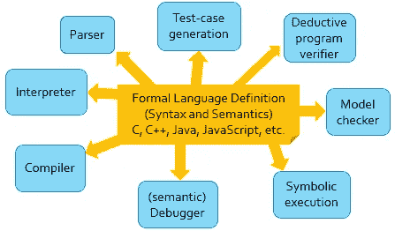

# ERC 777-K:ERC 777 的正式可执行规范

> 原文：<https://medium.com/coinmonks/erc777-k-formal-executable-specification-of-erc777-dff46602358c?source=collection_archive---------4----------------------->

## 丹尼斯·波格丹纳斯和大君公园

运行时验证公司提供[正式的智能合同验证](https://runtimeverification.com/smartcontract)服务。

[ERC777 标准](https://github.com/ethereum/EIPs/blob/master/EIPS/eip-777.md)是一种新的令牌标准，旨在成为 [ERC20 标准](https://eips.ethereum.org/EIPS/eip-20)的替代标准，通过给予账户持有人对令牌交易的更多控制来提高可用性，同时保持与 ERC20 的向后兼容性。它定义了一个“操作者”,该“操作者”可以被认为是一个(受信任的)第三方，代表令牌所有者向该第三方支付*无限量的*配额。它还引入了“挂钩”的概念，这是一个在操作员执行令牌传输时触发的回调函数。钩子可以接受或拒绝令牌转移，允许令牌持有者更细粒度地控制将令牌转移委托给操作者。这个钩子也可以用来通知令牌持有者他们已经收到了令牌，这是 ERC20 中缺少的一个重要特性。

预见到社区在不久的将来会大量采用这种新的令牌标准，我们在运行时验证中指定了 ERC777-K，这是 ERC777 的一种数学上严格的形式化，以促进对潜在的 ERC777 令牌实现的正式验证。具体来说，它是 ERC777 的一种正式的可执行语义，由依赖于实现的行为参数化，以接纳所有符合标准的实现。在形式化的过程中，我们确保所有的极限情况都经过了深思熟虑，明确覆盖，并且经过了彻底的测试。我们还发现了标准中的许多含糊不清的地方，我们记录并提交给了 ERC777 的作者。从这里开始，当我们声称我们证明了 ERC777 令牌的实现是正确的时，我们的意思是它们可证明地满足 ERC777-K 的规则。

# 为什么是 K

出于几个原因，我们选择了 K 作为我们形式化工作的语义框架。

首先， *K 是可执行的*。因此，可以对定义的语义模型进行测试，以发现其设计中的早期错误，并积累对其充分性的信心。

其次， *K 提供了一套形式分析工具*，可以与任何语义结合使用:

因此，我们可以使用 K 来验证令牌契约满足 ERC777 规范，并且还可以验证关于 ERC777 规范本身的属性(例如，“总供应量不会因应用 ERC777 发送操作而改变”)。

第三， *K 是模块化的*。这允许我们在 ERC777-K 之上为执行环境或编程语言组合定义语义，给人一种“即插即用 ERC777 成为您最喜欢的语言”的感觉。此外，一旦完成，我们就可以用生成的语言来验证复杂的程序。

第四， *K 正在积极开发中*，我们已经控制了它的设计和实现，因此它可以快速响应 ERC777-K 的未来需求

# ERC777-K 的亮点

ERC777-K 的地址、值和最大值都是*参数。这样它可以很容易地被实例化到除 EVM 之外的各种目标执行环境，如 [eWASM](https://github.com/ewasm/) 或 [IELE](https://github.com/runtimeverification/iele-semantics) ，以及除 [Solidity](https://solidity.readthedocs.io/) 之外的各种编程语言，如 [Vyper](https://github.com/ethereum/vyper) 或[普路托斯](https://cardanodocs.com/technical/plutus/introduction/)。*

ERC777-K 在依赖于实现的行为中也是参数化的*。它可以很容易地被实例化，以接受除参考实现之外的任何符合标准的实现。这意味着 ERC777-K 可以快速用于验证任何潜在的 ERC777 实施。例如，根据 ERC777 标准，如果某人向另一个没有注册接收器挂钩(即回调函数)的人发送令牌，令牌合约可以自由选择接受或回复发送操作。我们设计的 ERC777-K 可以通过调整配置参数轻松配置为具有任一行为。事实上，在测试 ERC777-K 时，我们考虑了所有可能的参数组合。(我们将在下面讨论。)*

此外，ERC777-K 在执行环境中是*参数化的。它可以在任何具有正式语义的执行环境中即插即用，例如虚拟机或编程语言。ERC777 函数被简单地添加到目标 VM/语言的语法中，并且 ERC777 语义平滑地与 VM/语言的语义组合，产生了具有 ERC777 支持的 VM/语言的变体。我们已经用一个简单的命令式语言 IMP 完成了。下面的视频显示了 IMP 中调用 ERC777 功能的交互程序。这可以很容易地适应语言实现，其中 ERC777 可以被视为一个库。*

ERC777-K 是*可执行*。这不仅允许我们优雅地将其与编程语言集成(如上所述)，还允许我们*测试*它。事实上，像代码一样，一个正式的规范也会有错误，尤其是当没有其他正式的规范可以比较的时候。与代码不同，代码可以根据规范进行验证，我们无法证明一个正式的规范是正确的:因为它是一个定义，所以根据定义它是正确的。我们能做的最好的事情就是通过各种方式来积累对其正确性的信心。最切实的方法之一就是测试它。为此，我们为我们的 ERC777 语义提供了 200 多个单元测试；这些可以很容易地转化为针对 ERC777 实施的测试。这些测试可以作为一致性测试套件来检查不同的 ERC777 实现是否符合标准。一致性测试对于防止不同实现之间的不同行为是至关重要的，这些不同行为对于任何假定 ERC777 实现之间行为一致的令牌客户端来说都是潜在的安全漏洞，我们相信这将有助于建立一个更具原则性的令牌合同开发实践。

# 技术详情和下载

ERC777-K 在 Github 上的 UIUC 许可证(与 MIT 许可证一样许可)下被彻底注释并免费提供: [ERC777-K 在 Github 上](https://github.com/runtimeverification/erc777-semantics)

非常感谢您的评论和贡献。

# 介入

所有软件都是在 UIUC 许可下发布的，社区可以完全免费使用。我们欢迎在 Git 上投稿。

我们鼓励任何感兴趣的团体加入我们，提出问题，贡献代码，或者用我们的工具积累经验。我们也一直在寻找能够在文档，新开发人员的有效安装/快速启动过程，以及更多的例子和测试工作的贡献者。我们正在招聘，并将确保关注有帮助的贡献者！

让我们一起为每个人构建更安全的智能合约！

# 感谢

我们感谢 Fabian Vogelsteller、Jordi Baylina 和 Jacques Dafflon 对理解该标准的支持和帮助。

# 接触

从 [Runtime Verification Inc.](https://runtimeverification.com/smartcontract/) 了解更多信息，请访问我们的 [GitHub 页面](https://github.com/runtimeverification/verified-smart-contracts)。[将您的问题发送给](mailto:smartcontract@runtimeverification.com)我们。

# 相关故事

 [## ERC-20 合同的正式核查

### 运行时验证公司提供正式的智能合同验证服务。

runtimeverification.com](http://runtimeverification.com/blog/erc-20-verification/)  [## ERC 20-K:ERC 20 的正式可执行规范

### ERC20 标准是以太坊智能内实现令牌的最重要标准之一。

runtimeverification.com](https://runtimeverification.com/blog/erc20-k-formal-executable-specification-of-erc20/) 

*原载于 2018 年 9 月 21 日*[*runtimeverification.com*](https://runtimeverification.com/blog/erc777-k-formal-executable-specification-of-erc777/)*。*

> [直接在您的收件箱中获得最佳软件交易](https://coincodecap.com/?utm_source=coinmonks)

