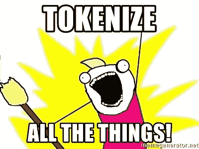
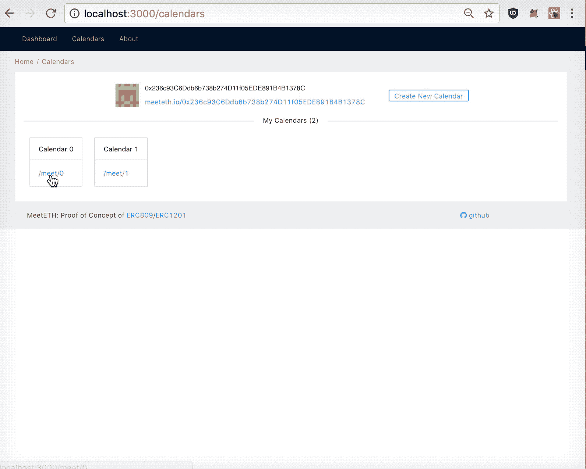
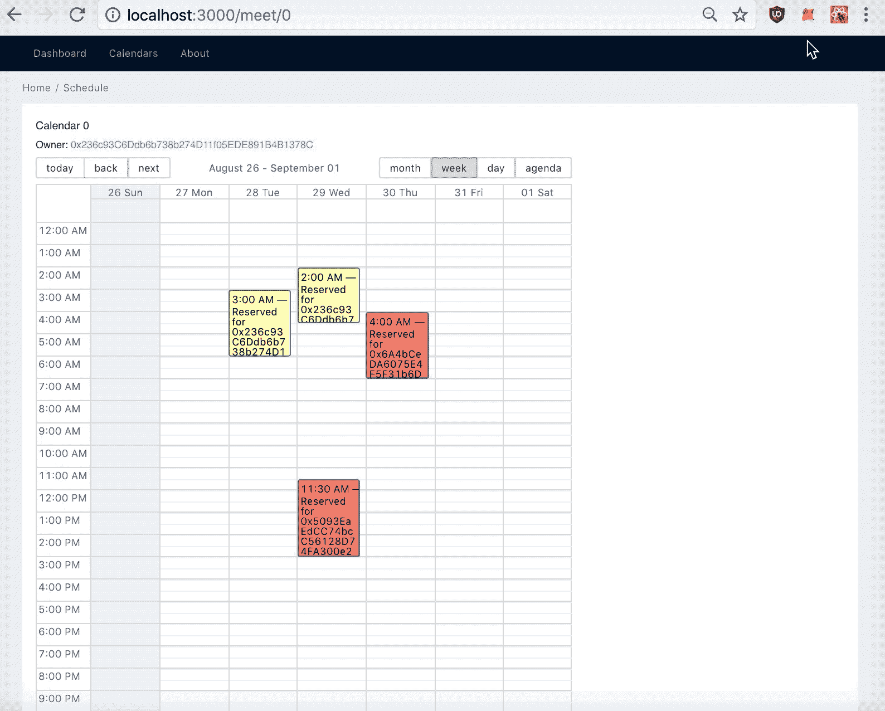
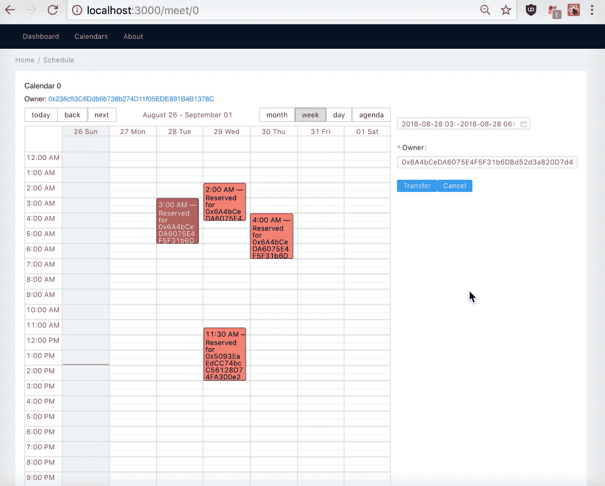
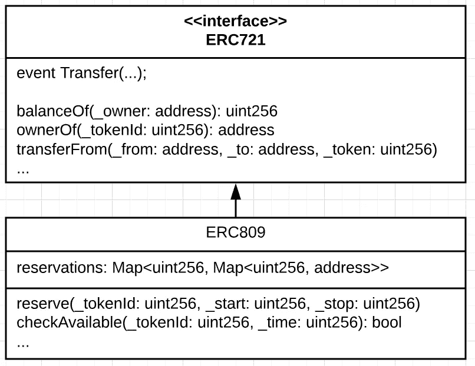
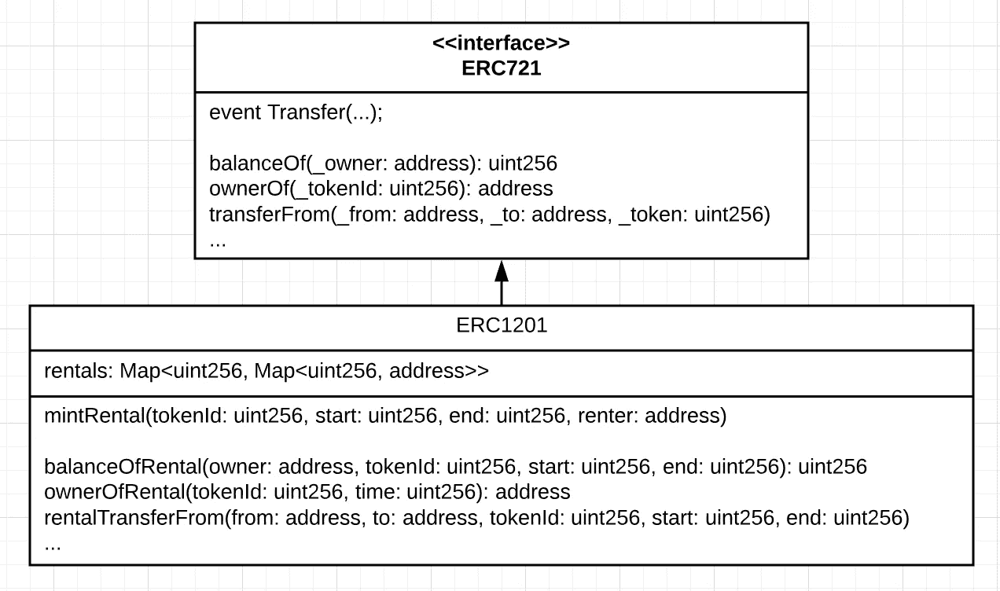
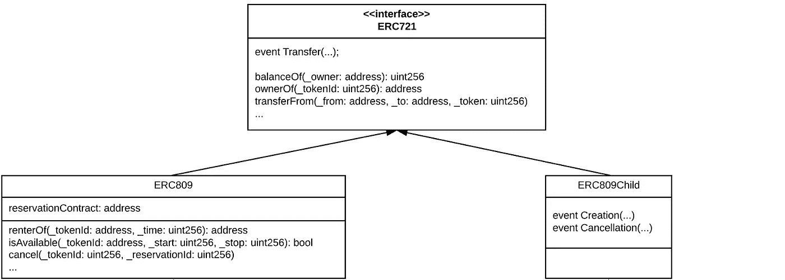
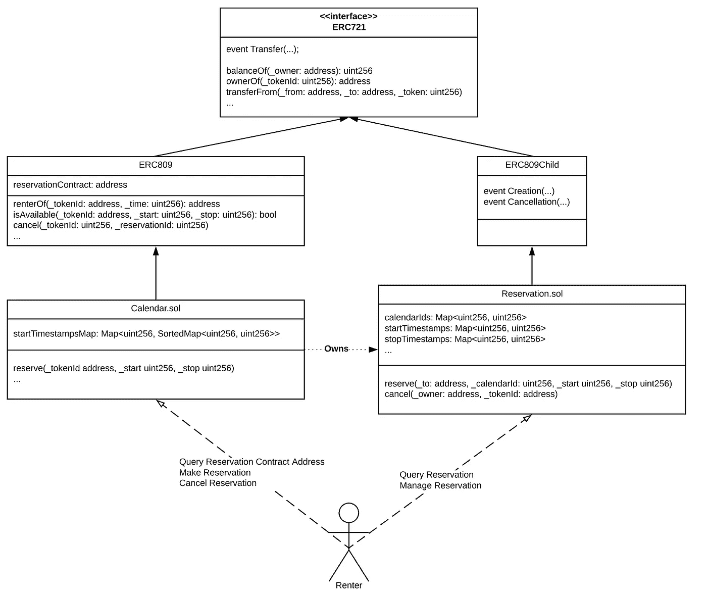
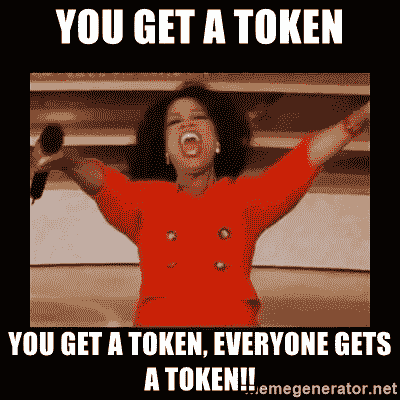

# ERC809/1201:标记不可替换的访问

> 原文：<https://medium.com/coinmonks/erc809-1201-tokenizing-non-fungible-access-abdc5018c49?source=collection_archive---------1----------------------->

NFT 是以太坊生态系统中最激动人心的发展之一。特别是, [ERC721](http://erc721.org/) 标准给出了一种通用语言来创建代表不可替代资产的链上令牌。一些最受欢迎的例子包括 [CryptoKitties](https://www.cryptokitties.co/) 、[分散地](https://decentraland.org/)和 [CryptoPunks](https://www.larvalabs.com/cryptopunks) 。

虽然不可替代令牌和 ERC721 的典型用例是数字或数字化收藏品，但我们可以使用相同的框架来标记其他种类的所有权，如不可替代资产的租赁权。

例如， [BookLocal](/@booklocal/hotel-booking-and-guest-management-on-the-ethereum-blockchain-beddcfa2040) 提议将 [ERC809](https://github.com/ethereum/EIPs/issues/809) 作为相对于竞争对手不可替代代币的租赁权的标准。 [ERC1201](https://github.com/ethereum/EIPs/issues/1201) 用一种改进的方法探讨了同一主题。在这篇文章中，我很兴奋地提出 [**MeetETH**](http://meeteth.io/) **，一个上述令牌标准提案**的概念实现**的证明，以令牌化对不可替代令牌**的短暂访问权限。我将讨论与数字可收集的 ERC721 令牌相比的技术挑战，以及为什么 ERC809/1201 可以成为自动驾驶汽车交通规划等重要用例的基础构建模块。

Tokenize ALL THE THINGS!

# 介绍 MeetETH

MeetETH 是一个日程安排 Dapp，允许用户创建绑定到以太坊帐户的令牌化日历，并邀请其他用户在这些日历上创建令牌化预订。

Schedule Tokenized Event on a Tokenized Calendar

Dapp 及其智能合约管理两组令牌:[日历](https://github.com/saurfang/meeteth/blob/master/contracts/Calendar.sol)和[预订](https://github.com/saurfang/meeteth/blob/master/contracts/Reservation.sol)。让我们将**短期租赁物业作为一个具体的例子**，因为这是 ERC809 和 ERC1201 的设计目的。

想要在线列出住宿空间的业主或经理可以为她的每个列表创建一个**日历令牌**，作为如下所示的一行日历日期。然后，游客可以通过制作与具有开始和结束日期时间的特定日历令牌相关联的**预约令牌，为特定日历预约一段时间。也就是说，每个预订令牌代表相应日历上的一个块。**

A Hypothetical MultiCalendar View for Rental Property Management

在 MeetETH 中，**日历和预约令牌都是 ERC721 令牌**。这意味着我们可以免费获得钱包、转账和交易支持。

Transfer a Reservation — No Different from Transferring a CryptoKitty

这也打开了出租权二级市场的大门，可以重复利用我们今天已经在建设的大量 NFT 基础设施。有人可能会问，如果我想要某种形式的客户验证，或者干脆完全禁止二级交易，那该怎么办？这确实是可行的**，因为我们首先符合 ERC721 令牌标准**。0x 等交换协议已经在探索符合[的点对点交易](https://blog.0xproject.com/compliant-peer-to-peer-trading-4dab8e5c3162)。我们可以**部署一个许可的日历令牌**，这样每个日历所有者都可以设置他们想要的次级交易/转让限制。制定令牌标准并获得免费互操作基础设施的能力是智能合约的必杀应用之一。

Cancel a Reservation = Burn the Token = Transfer to 0x000..0

# 为什么它很重要

虽然 MeetETH 中的交互看起来很简单，但它可以推广到许多令人兴奋的用例中。本质上，这是关于**保留对** [**非竞争商品**](https://en.wikipedia.org/wiki/Rivalry_(economics)) **的短暂访问。**

**人类对人类的保留**

在美国，医生的预约通常要提前几周，人们经常不得不在昂贵的急救护理和长达一周的预约等待之间做出选择。医生办公室经常花费大量的时间和资源给病人打电话，根据病人的时间表和喜好来调整预约。

令牌化预约将允许患者轻松交换预约时间，并且可以在智能合同中设置护栏，以防止蹲守和倒票。此外，由于 ERC809 继承了 ERC721，令牌可以使用通用协议如 [0x](https://blog.0xproject.com/introducing-0x-protocol-v2-9f5bda04d38d) 或通用交易所如 [OpenSea](https://opensea.io/) 和 [RareBits](https://rarebits.io/) 进行交易，这极大地**减少了工程工作量，增加了流动性，降低了成本**。

最后，有共同实践领域的医生可以参加一个**TCR，在这里**医疗服务可以在有相似经验、声誉和专业知识的医生之间有效地汇集**。**

****人机预约****

**不难看出，这样的日历也可以属于其他智能合约。例如，一个人可以预订一辆自动驾驶汽车进行多日旅行。人们也可以以类似于 AWS 保留实例的预先商定的价格来保留云计算资源。**

****机器对机器**预约**预约****

**这自然也延伸到机器对机器。自动驾驶的自动驾驶车辆可以管理自己的钱包，并对乘坐进行投标。当提供乘车时，它与[交通管理智能合同](https://startupboy.com/2014/04/01/the-fifth-protocol/)通信，以投标和保留交叉路口的路权。当它进行路线规划时，它可以精确地计算它进入和离开每个交叉口的时间，并可以根据交通状况的变化进一步交易路权。这种公共产品市场的存在使价格发现成为可能，并创造了一种激励结构，以优先考虑传统上难以公平估价或分配的共享资源。**这提供了一个代表路权的框架，支持分散规划和实时校准。****

# **双层令牌方法**

**最后但同样重要的是，我想介绍 MeetETH 的智能合约架构以及我对改进 ERC809/1201 令牌标准设计的建议。**

****

**ERC809 Proposal (Simplified)**

**[ERC809](https://github.com/ethereum/EIPs/issues/809) 提议在 ERC721 的基础上增加额外的功能，以“允许所有者使用一组标准的命令来租赁对其竞争对手 NFT 的访问，从而允许用户从单个钱包界面查看所有过去和当前的租赁协议。”**

**缺点之一源于“出租权”本身不是一种象征。因此，没有简单的方法来查询租赁者或转移预订。**

**值得注意的是，对于租赁物业管理平台 BookLocal 来说，这是一个合理的选择。我认为将每个产权房抽象为 NFT 的一个单元是明智的，但后来意识到租一个 NFT 通常与在一段时间内拥有 NFT 不同。拥有一个允许我进入度假租赁房产的令牌并不等于拥有一个代表房产所有权的令牌:无论我的预订期有多短或多长，我都不能像拥有者一样修改、出售或破坏这个地方。也就是说一个 NFT 代表出租物业的管理与另一个 NFT 代表物业的契约是不同的。换句话说，**一个物理对象可以有不同目的的不同数字 NFT。****

**@ [hyperfekt](https://github.com/hyperfekt) 给出了一个绝妙的建议，即个人预订也应被视为 NFT。这就是 [ERC1201](https://github.com/ethereum/EIPs/issues/1201) 要完成的任务。**

****

**ERC1201**

**每个 ERC1201 所有权令牌根据自己的库存管理预订。此外，每个预留以预留时间(例如，天)为单位生成一个或多个预留令牌。)换句话说， **ERC1201 预留令牌是二维的:NFT 资产(行)乘以时隙(列。)**以上面的租赁物业为例，每个预订令牌映射到多日历中的一个日历方格。预订两晚旅行的旅客将收到两张代表每晚的 ERC1201 代币。**

**这是从 ERC809 向前迈出的一大步，但租赁令牌大多以`rental`前缀复制 ERC721 功能。这极大地阻碍了该契约的互操作性。**显示、转移和交易访问权限的能力(预约令牌)比执行这些操作的管理人员(日历令牌)更受欢迎。**在这种方法下，我们需要重建 wallet 和 exchange 来支持 ERC1201。幸运的是，我们可以做得更好。**

****

**Proposed ERC809/1201 Two Tier Token Architecture**

**由于很明显所有权和预订令牌都是有效的 NFT，MeetETH 提出了一个**配对智能合约架构** : **ERC809 和 ERC809Child，两者都继承了 ERC721** 。此外，ERC809 有一个指向 ERC809Child 的契约不可变变量，因此可以共享和同步信息。**

**注意，ERC809 和 ERC809Child 相当简单，并且缺少`reserve`函数。这是故意的。就像 ERC721 没有作为标准一部分的`mint`功能一样，`reserve`操作有很多我们无法解释的变量:用户是现在付款还是以后付款，预订时需要哪些辅助数据，预订是立即接受还是需要进一步批准等等。有这么多的差异，很难设计一个跨实现有用的`reserve`接口。**

**在实践中，这是 MeetETH 实现 [Calendar.sol](https://github.com/saurfang/meeteth/blob/master/contracts/Calendar.sol) 和 [Reservation.sol](https://github.com/saurfang/meeteth/blob/master/contracts/Reservation.sol) 分别实现 ERC809 和 ERC809Child 的方式:**

****

**Proposed ERC809/1201 Two Tier Token Architecture**

**在某种程度上，这两个智能合同是耦合在一起的:要进行预订，用户需要与 Calendar 智能合同进行交互，因为 Calendar 的所有者设置可用性并跟踪已售出的库存。同时，日历智能契约需要通过调用预订契约来创建预订令牌。这同样适用于取消。繁重的检查可用性的工作已经在日历合同中实现，因为我们认为复杂性属于所有者，他们可以设置复杂的日历规则，甚至使用 Oracles 来强制可用性。**

****

**Everybody wins!**

**这种方法有很大的好处。我们消除了偏向所有者和租赁者之间的权衡。**

****由于所有权和预订令牌都是 ERC721，我们可以利用现有基础设施来支持钱包、转账和交换。****

**当我们设计令牌标准时，不仅要考虑智能契约如何支持分散式解决方案，还要考虑我们如何在他人的想法和工作的基础上进行构建。**

****每当我们可以通过组合想法和标准(例如** [**令牌组件**](/coinmonks/introducing-crypto-composables-ee5701fde217) **)来解决问题时，我们就会获得可互操作的协议和基础设施**。软件工程很早就认识到代码重用和开源的重要性。构建令牌标准不仅让我们可以重用智能合约实现，同时也增强了底层的经济性和协议性。**

# **后续步骤和确认**

**ERC809 和 ERC1201 都没有接近成熟状态，这篇文章只是对这一具有巨大潜力的标准的又一次可能的改进。我欢迎想法和建议，并期待有人在我的想法基础上提出更好的东西。我列出了一些我还没有探索过的想法，它们可能与通用标准相关。最后但同样重要的是，这对我来说更像是一次智力探索，感谢 [Consensys Academy](https://github.com/saurfang/consensys-academy-2018-final-project) ，我很乐意看到有人采用这一标准并构建真实世界的应用程序。**

**最后，我要感谢 [BookLocal](https://medium.com/u/b8117209847f?source=post_page-----abdc5018c49--------------------------------) 团队提出 ERC809 标准并赞助@ [ETHMemphis](https://twitter.com/ethmemphis?lang=en) ， [Zeming Yu](https://medium.com/u/68a3489944ac?source=post_page-----abdc5018c49--------------------------------) 与我分享他的想法并讨论 ERC809，研究并提出 ERC1201 作为增强版本，以及 [Matt Condon](https://medium.com/u/3199e60ae2b1?source=post_page-----abdc5018c49--------------------------------) 在 [ERC1155](https://github.com/ethereum/eips/issues/1155) 中发表的[发人深省的评论](https://github.com/ethereum/eips/issues/1155#issuecomment-400044803)，该评论对我提出了挑战并帮助我达成了这个解决方案“大声喊出来”还要感谢布莱恩·弗林，他精彩的 NFTY 时事通讯让我对 NFT 有了更多的了解。**

****