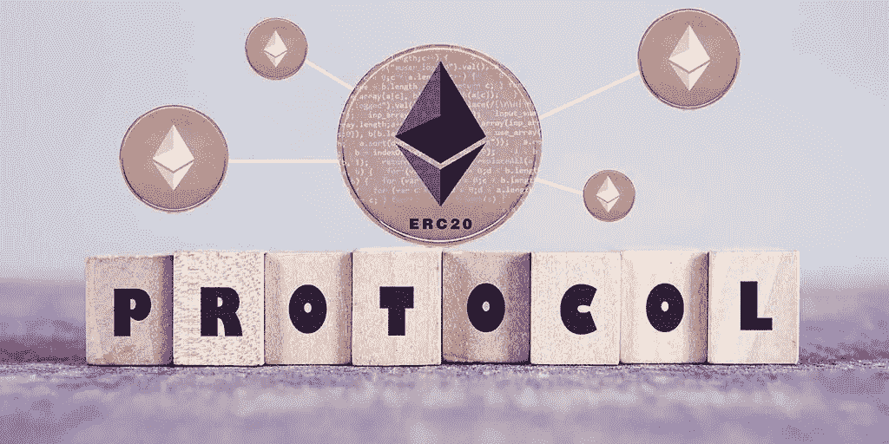

# ERC865:更加用户友好的令牌

> 原文：<https://medium.com/coinmonks/erc865-a-case-for-more-user-friendly-tokens-eb68e62a986?source=collection_archive---------3----------------------->

*该标准提出了一种提取 gas 的系统，并为令牌持有者提供了在单次交易中以令牌而非 gas 支付*令牌转移*交易费用的能力。*

## 以太坊费用:

要在区块链以太坊进行任何交易，你必须付费。这笔费用是支付给矿工的采矿交易，把他们分成区块，并确保区块链。
该费用以气(气限*气价)计算，以乙醚支付。

*这就给新用户造成了一些摩擦:* **1。新用户必须了解以太坊是如何工作的，以便了解燃气价格和燃气成本
2。他们必须获得必要的乙醚来支付汽油费用**

这两个问题为采用内置令牌的 DAPPS 设置了不必要的障碍。为了简单起见，这个过程应该被抽象出来，这样用户就可以使用 DAPP，而不用担心底层以太网

ERC865 是朝着这个方向迈出的新一步，旨在解决这些问题，并为 ERC20 令牌传输提供更好的 UX。w

> **ERC865:
> 该标准提出了一种提取 gas 的系统，并为令牌持有者提供了在单次交易中以令牌而非 gas 支付*令牌转移*交易费用的能力。**

引入一个中间第三方，该第三方愿意接受代币形式的转账费用，并以以太形式将带有必要费用的转账交易转发给区块链。这个过程使用加密签名来保护。

规格:

*   答:付款的发送方
*   b:收款人
*   d:委托，为 A 做交易，付油钱
*   x:从 A 发送到 B 的令牌 T 的数量
*   y:用令牌 T 支付的费用，从 A 到 D 进行交易
*   要发送的令牌
*   现在
*   来自发送方的签名消息，包含交易的所有细节

**流程:**

1.  用户 A 选择来自代表 D 的报价，该报价是 1 次交易的费用 Y 的值(取决于气价 ETH 中的令牌值)。
2.  使用他们的私钥，用户通过获取有效负载`P{T, B,X, Y, N}`的 sha3 并使用私钥对其签名来生成 S。
3.  用户向委托人发送 P(未哈希、未签名)和 S
4.  委托验证 Y 和 D 未被更改
5.  委托人继续从他的账户 D
    提交交易
6.  delegatedTransfer 方法重建有效负载 P 的 sha3 H
7.  然后，我们可以调用 ecrecover(S ),确保结果与 A 匹配，如果是这样，就安全地将 X 标记从 A 移动到 B，将 Y 标记从 A 移动到 d。

技术人员:
`function delegatedTransfer(
bytes _signature,
address _to,
uint256 _value,
uint256 _fee,
uint256 _nonce
) public returns (bool)`
由代理调用，执行转接。

delegatedTransfer 的参考实现:
`function delegatedTransfer(
bytes _signature,
address _to,
uint256 _value,
uint256 _fee,
uint256 _nonce
) public returns (bool) {
require(_to != address(0));
require(signatures[_signature] == false);
bytes32 hashedTx = transferPreSignedHashing(address(this), _to, _value, _fee, _nonce);
address from = ecrecover(hashedTx, _signature);
require(from != address(0));
balances[from] = balances[from].sub(_value).sub(_fee);
balances[_to] = balances[_to].add(_value);
balances[msg.sender] = balances[msg.sender].add(_fee);
signatures[_signature] = true;
Transfer(from, _to, _value);
Transfer(from, msg.sender, _fee);
TransferPreSigned(from, _to, msg.sender, _value, _fee);
return true;
}`

`function transferPreSignedHashing(
address _token,
address _to,
uint256 _value,
uint256 _fee,
uint256 _nonce
) public pure returns (bytes32)
{
/* “48664c16”: transferPreSignedHashing(address,address,address,uint256,uint256,uint256) */
return keccak256(bytes4(0x48664c16), _token, _to, _value, _fee, _nonce);
}`

建议:
1。应该有一种使交易无效的机制。
2。在交易中应该有一个时间限制的可选条件，以便在指定的时间点之后交易变得无效。这使得在超时之后撤销事务是自动的，并且提供了一种取消机制，而无需发送显式的无效事务

该标准是一个持续的 WIP，可在此处找到:
1。[https://github.com/ethereum/EIPs/issues/865](https://github.com/ethereum/EIPs/issues/865)2。[参考实现](https://github.com/PROPSProject/props-token-distribution/blob/master/contracts/token/ERC865Token.solhttps://github.com/PROPSProject/props-token-distribution/blob/master/contracts/token/ERC865Token.sol)