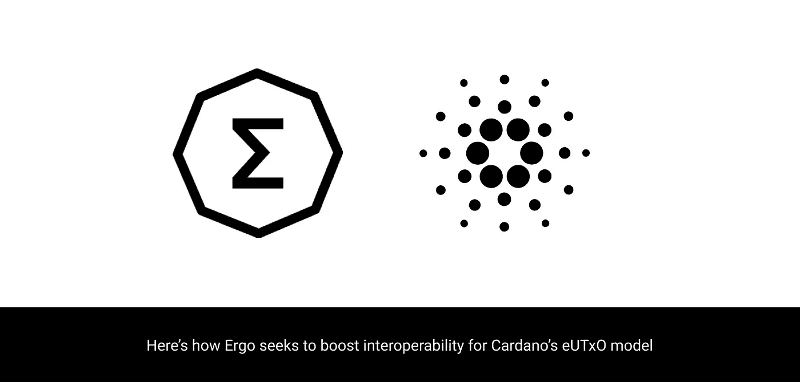

# Ergo 和 Cardano 联手打造终极区块链平台

> 原文：<https://medium.com/coinmonks/ergo-and-cardano-combine-to-create-the-ultimate-blockchain-platform-e26a01d99bfa?source=collection_archive---------0----------------------->

T

## 看看 Ergo 的 blockhain，它独特的 PoW 算法，以及即将到来的生态系统。

当大多数人想到加密货币时，他们会想到它如何用于金融目的。因此，基于这一理念，我们将打造一个高效、安全的金融平台。它是由 Alexander Chepurnoy 创建的，他是 IOHK 的研究员，也是 smartcontract.com(现在的 Chainlink)的创始人。

因此，就其本身而言，它可以提供很多东西，但它与卡尔达诺的密切关系显示出更多的希望。在这篇特别的文章中，我不会深究其中的联系。然而，另一个有更多信息的帖子正在制作中！

## **Autolykos &采矿**

最近，股权证明已经接管了加密货币项目。卡尔达诺、波尔卡多特、阿尔格兰德都是这一领域的重量级人物。甚至以太坊也将在未来加入这个行列。但是 Ergo 已经远离了那一步。这是一款经过检验的区块链，它采用了 Autolykos 新算法。

Autolykos 是由 Ergo 公司创造的，设计用于抗 ASIC。这使得大多数消费级硬件能够参与网络，并获得一点 ERG。这主要是因为每个矿工有更高的内存需求，这阻碍了最可行的 ASIC 使用。

然而，在最初发布时，该算法不支持池挖掘。这一决定背后的论点是试图保持权力下放。毕竟，当矿工们聚集在一起时，随着聚集率的增长，它会失去一些分散性。该算法要求矿工访问钱包私钥来采矿，如果在游泳池中使用，会产生安全风险。

截至块 417，792，Ergo 收到了一个将 Autolykos 更新到 2.0 的硬分叉。从现在开始，我们通过网络来支持矿池。这进一步提高了消费者的参与能力，而不必专门为采矿购买钻机。

## **改进比特币的 UTXO 模型**

UTXO 不是你在加密货币之外听到的东西，最初是在比特币中发现的。它表示每笔交易的未用交易金额(UTXO)。当你有一张 20 美元的钞票，并用它以 10 美元的价格购买一件商品时，你失去了全部的 20 美元，并得到一张新的 10 美元作为你的找零。新法案可以被视为你的 UTXO。

当一笔比特币交易完成后，它会使用钱包中的全部金额，并将差额返还给你的钱包。这叫做改变 UTXO。在再次使用之前，这些钱和进入新钱包的钱都被认为是 UTXOs。

以太坊完全摒弃了这种模式，转而采用账户平衡模式。这种模式基本上就像信用卡一样。发送的以太币从账户中“借记”并在“贷记”中接收。

关于比特币 UTXO 模型的更多信息，请查看这篇[文章](/bitbees/what-the-heck-is-utxo-ca68f2651819)。

卡尔达诺创建了一个扩展的 UTXO (eUTxO)模型，这是比特币和以太坊模型的混合体。eUTxO 存在于结算层，基于帐户的模型存在于计算层。该解决方案支持 dApps 所需的附加功能。它提供了在整个事务序列中维护契约状态和执行相同契约的能力。

这样做的一个好处是，验证交易所需的费用可以在交易完成之前准确显示出来，这在当前的模型上是不可能的。

因此，Ergo 在这里所做的是，它成为第一个真正采用相同 eUTxO 模型的公司。这很重要，因为它带来了与 Cardano 的完全互操作性。这意味着 PoW 网络与 Cardano 完全兼容，并且可以引入许多安全功能，这将使生态系统中的一些大型 dApps 受益。

因此，在 T2 的网站上有一篇关于这个问题的很棒的文章，里面有更多的信息。

## **Ergo 生态系统**

谈到生态系统，有很多不同的东西需要考虑。因此，从稳定的收入到资产令牌化，一切都有了，并且准备进一步增长。但是现在它到底有什么优势呢？

SigUSD 是 Ergo 的原生稳定币。它基于 AgeUSD 协议。它不同于一些更常见的稳定货币，如 USDT，因为它没有法定货币作为抵押。这使它比更接近戴。但它必须以某种方式与 1 美元挂钩。它巧妙地利用 ERG 来保持这种盯住。人们可以使用 ERG 来铸造 SigRSV 并提供流动性。或者，如果有足够的储备，直接 SigUSD。

**ErgoDEX** 顾名思义就是即将上市的 DEX。在这里，事情变得更加令人兴奋，因为它将为 Ergo 和 Cardano 生态系统推出。开发人员将利用 Cardano 的普路托斯智能合同语言，在 Ergo 平台上进行额外的开发。

这个指数将会有一些使用 CEXs 或传统投资者熟悉的特征。限价单、部分填充和回购支持是一些关键特性。因此，也允许多阶段合同，允许定时释放付款。这意味着，如果项目没有兑现承诺，投资者就有机会取消订单。

这只是 Ergo 的两个最相关的产品，但你可以在这里阅读更多。

## **最终想法**

就其本身而言，Ergo 是一个伟大的区块链平台。与 Cardano 的集成只是让它更上一层楼。随着阿隆佐即将到来，我认为我们将看到智能合约的一些重大变化。PoW 和 PoS 的结合允许平台作为一个整体获得两者的好处并相互补充。

到目前为止，DEX 看起来很棒，路线图也在稳步前进。我很高兴看到 Ergo 和 Cardano 一起活了过来。接下来的几个月，我们将在这里见证一些伟大的事情发生！

> 加入 [Coinmonks 电报频道](https://t.me/coincodecap)，了解加密交易和投资

## 另外，阅读

*   [尤霍德勒 vs 科恩洛安 vs 霍德诺特](/coinmonks/youhodler-vs-coinloan-vs-hodlnaut-b1050acde55a) | [Cryptohopper vs 哈斯博特](https://blog.coincodecap.com/cryptohopper-vs-haasbot)
*   [比特币基地赌注](https://blog.coincodecap.com/coinbase-staking) | [热点评论](/coinmonks/hotbit-review-cd5bec41dafb) | [库币评论](https://blog.coincodecap.com/kucoin-review)
*   [最佳加密交易信号电报](/coinmonks/best-crypto-signals-telegram-5785cdbc4b2b) | [MoonXBT 评论](/coinmonks/moonxbt-review-6e4ab26d037)
*   [Coinswitch 俱吠罗评论](/coinmonks/coinswitch-kuber-review-1a8dc5c7a739) | [电网交易机器人](https://blog.coincodecap.com/grid-trading) | [比特币基地收费](/coinmonks/coinbase-fees-831e77d4f2c5)
*   [Bitget 回顾](https://blog.coincodecap.com/bitget-review)|[Gemini vs block fi](https://blog.coincodecap.com/gemini-vs-blockfi)|[OKEx 期货交易](https://blog.coincodecap.com/okex-futures-trading)
*   [OKEx vs KuCoin](https://blog.coincodecap.com/okex-kucoin) | [摄氏替代品](https://blog.coincodecap.com/celsius-alternatives) | [如何购买 VeChain](https://blog.coincodecap.com/buy-vechain)
*   [币安期货交易](https://blog.coincodecap.com/binance-futures-trading)|[3 commas vs Mudrex vs eToro](https://blog.coincodecap.com/mudrex-3commas-etoro)
*   [如何购买 Monero](https://blog.coincodecap.com/buy-monero) | [IDEX 评论](https://blog.coincodecap.com/idex-review) | [BitKan 交易机器人](https://blog.coincodecap.com/bitkan-trading-bot)
*   [币安 vs Bitstamp](https://blog.coincodecap.com/binance-vs-bitstamp) | [比特熊猫 vs 比特币基地 vs Coinsbit](https://blog.coincodecap.com/bitpanda-coinbase-coinsbit)
*   [如何购买 Ripple (XRP)](https://blog.coincodecap.com/buy-ripple-india) | [非洲最好的加密交易所](https://blog.coincodecap.com/crypto-exchange-africa)
*   [非洲最佳加密交易所](https://blog.coincodecap.com/crypto-exchange-africa) | [胡交易所评论](https://blog.coincodecap.com/hoo-exchange-review)
*   [eToro vs robin hood](https://blog.coincodecap.com/etoro-robinhood)|[MoonXBT vs by bit vs Bityard](https://blog.coincodecap.com/bybit-bityard-moonxbt)
*   [Stormgain 回顾](https://blog.coincodecap.com/stormgain-review) | [Bexplus 回顾](https://blog.coincodecap.com/bexplus-review) | [币安 vs Bittrex](https://blog.coincodecap.com/binance-vs-bittrex)