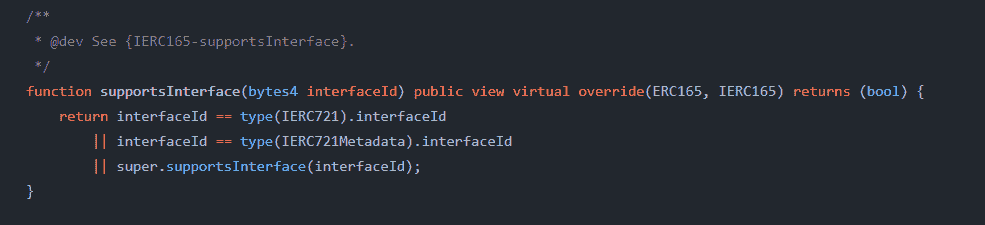

# 使用 Truffle 和 solc-js 编译智能合约时出错

> 原文：<https://medium.com/coinmonks/errors-when-compiling-smart-contracts-with-truffle-and-solc-js-8e3ed3d43208?source=collection_archive---------4----------------------->

这篇文章是关于使用 npm 解决 Truffle 和 solc-js 错误的。

1.  我遇到的第一个问题是关于 ERC721 函数的一个错误。错误大致如下:

我使用 openzeppelin 来导入 ERC721 令牌的代码。当我试图编译我的智能合同时，我一直得到一个关于这个函数的错误:

该功能在 ERC721 令牌码本身中，与启用合同间的交叉通信有关。

原来，我对我的松露版本有意见。当您安装 Truffle 并在控制台中运行 truffle version 时，您应该会看到类似于以下内容的内容:

如果你没有得到 truffle、Solidity、Node 和 Web3 的版本，你可能需要卸载 Truffle 并重新安装。我进入我的电脑文件，手动卸载松露。您可以通过在控制台中键入松露来找到您的松露路径:

您也可以尝试以下命令:

要全局安装 truffle，您可以运行:

再次检查在你的控制台中键入 truffle version 是否给出了 truffle、Solidity、Node 和 Web3 版本。如果这仍然不能解决问题，尝试将 truffle 安装到您的本地项目文件夹中。确保您在项目的根目录中，然后运行:

(记得将 node_modules 添加到一个. gitignore 文件中，以便可以跟踪您的 package_lock.json)。再次，检查是否给了你四个版本。

如果你是，尝试重新编译你的合同，希望原来的错误消失！在你编译之前，不要忘记进入你的松露控制台，输入:

2.我遇到的另一个问题是我的项目中没有合适的 solc-js 编译器。这个编译器能够正确地读取 solidity。解决办法？在编写合同时，您可以声明 solc-js 版本的范围:

(PS，SPDX 代表软件包数据交换，它是根据为分发指定的许可证的文件格式。许可证不一定是 MIT，它可以是您选择的任何许可证，但是该规范现在是在 solidity 中编写智能合同的一部分，并且与为了导入目的而验证其他合同的合同有关。

如果这不能解决您的问题，您可以检查您的本地项目中有哪个 truffle 版本。在你的控制台中输入 truffle version，你会得到如上所示的 truffle、Solidity、Node 和 Web3 版本。如果没有，请按照上述步骤根据您的需要对安装 Truffle 进行故障排除。

如果您已经设置了这四个版本和 solidity 编译器范围，但是仍然得到一个关于编译器版本的错误，那么您可以在 truffle-config.js 文件中的一个编译器对象的 networks 下指定编译器版本。确保版本被指定为字符串。对于我所拥有的 Solidity 版本，我的文件应该是这样的:

祝你好运！