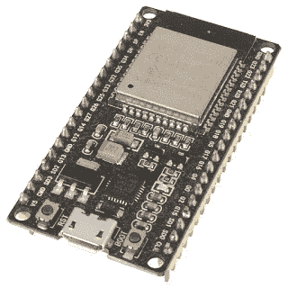

# Espressif ESP32 教程—第 1 部分

> 原文：<https://medium.com/coinmonks/espressif-esp32-tutorial-getting-started-3d1916362738?source=collection_archive---------8----------------------->

开始使用。

我刚刚开始在我的物联网项目中使用 ESP32，我想记录下这种体验。所以我们来了！ESP32 是一款出色的低功耗物联网传感器集线器，是 Arduino 的更好替代品。需要注意的是，要让它发挥作用，还需要更多的努力。让一个双核微控制器与一个实时的……