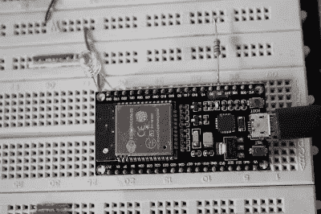
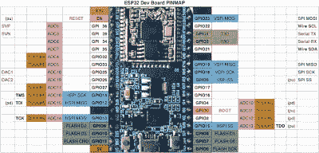
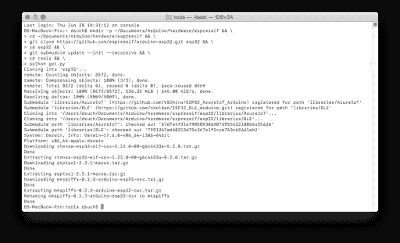
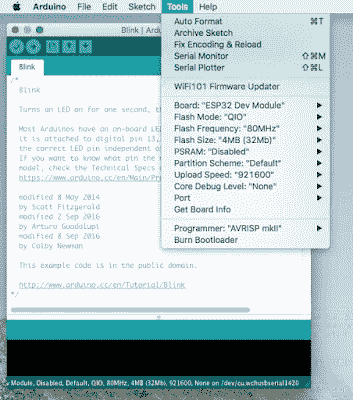
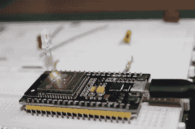
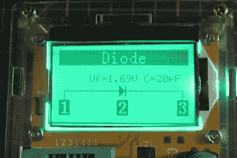
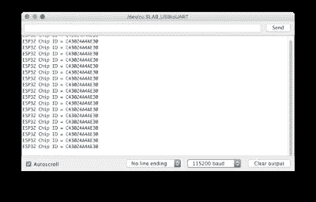

# Espressif ESP32 教程—第 2 部分

> 原文：<https://medium.com/coinmonks/espressif-esp32-tutorial-programming-arduino-ide-caaf585f1d80?source=collection_archive---------7----------------------->

## 使用 Arduino IDE 编程



Duinotech ESP32 Dev Board

正如前一篇文章中所承诺的，让我们看看我们可以用不同的方式来编程我们的 ESP32。我将从 Arduino IDE 开始，因为我认为这将是最常见的选择。在这篇文章中，我将只关注物联网的“hello world ”,即闪烁的 LED。



ESP32 Pin Map

一旦我选择了一个 IDE，我们将使用 ESP32 做一些有用的事情(敬请关注)。



Install ESP32 Tool Chain via Terminal

目前还不能通过 Boards Manager 安装对 ESP32 IC 的支持，因此

[应该使用 GitHub 页面](https://github.com/espressif/arduino-esp32/blob/master/README.md#installation-instructions)上的说明。对于 Mac OS 来说，这非常简单。

1.  安装最新版本的 Arduino IDE。
2.  打开终端并执行以下命令(复制->粘贴并按回车键):

```
mkdir -p ~/Documents/Arduino/hardware/espressif && \ 
cd ~/Documents/Arduino/hardware/espressif && \ 
git clone https://github.com/espressif/arduino-esp32.git esp32 && \ 
cd esp32 && \ 
git submodule update --init --recursive && \ 
cd tools && \ 
python get.py
```

3.重新启动 Arduino IDE。

对用于 Arduino 的 ESP32 的支持正在不断开发中，但是一旦所有东西都安装好了，草图的编写和上传过程与其他板类似。如果您使用的是 Jaycar 板，请选择 ESP32 Dev Module 作为板类型，并确保选择了正确的串行端口。



通过 USB 电缆将您的 ESP32 开发板连接到您的 PC，您应该准备好编译和上传您的第一个程序。首先检查您是否可以看到连接到 ESP32 的端口。在我运行 High Sierra 的 MacBook Pro(2015 年初)上，Duinotech ESP32 开发板上的端口无法识别。如果发生这种情况，您可能需要为该主板安装 USB 串行转换器的驱动程序。它使用 CP2102 IC，驱动程序可在 Silicon Labs CP2102 网站上找到:

[https://www . sil ABS . com/products/development-tools/software/USB 转 uart-bridge-vcp-drivers](https://www.silabs.com/products/development-tools/software/usb-to-uart-bridge-vcp-drivers) 。

为您的操作系统下载正确的驱动程序版本后。您将需要安装它。在 Mac 上，这涉及到解压缩档案，安装 DMG 磁盘映像，然后运行硅实验室 VCP 驱动程序。你需要在安全和隐私偏好设置中提供运行该驱动程序的权限(这将弹出)。现在，您应该能够在 Arduino IDE 中看到该端口(无需重新启动或重启 IDE)。

打开闪烁草图(`File -> Examples -> 01\. Basics -> Blink`)，编译并下载到您的 ESP32。您可能会得到以下错误:

> “LED_BUILTIN”未在此范围内声明

这里有几个新玩家的陷阱。

标准 Arduino 板在变量文件中定义了 LED_BUILTIN 宏，但显然 ESP32 Dev 板没有。对于 Arduino，内置 LED 通常连接到引脚 13，在 ESP32 上，它可以是任何东西。通常怀疑是 2 号、5 号或 16 号针脚。您可以通过在草图顶部 setup()函数上方添加以下行来修复此错误。例如，如果您的 LED 连接到引脚 2:

```
int LED_BUILTIN = 2;
```

不幸的是，Duinotech ESP32 开发板似乎没有连接到用户可控引脚的 LED。当通过串行端口通信时，它有一个闪烁的蓝色 LED。很难 100%确定这个 LED 是不可控的，因为我找不到这个电路板的原理图。大多数开发板都有一个红色电源 LED 和一个蓝色内置 LED 供用户控制。无论如何，我求助于连接一个带限流电阻的外部 LED 到 GPIO 2。



请注意，当 EP32 开发板放置在标准尺寸的面包板上时，将只有一排备用引脚，请确保这是在您想要连接的一侧。限流电阻的计算公式如下:

电阻值= (Vs — VF)/ IF = 160 欧姆(我用了 150 欧姆，因为那是我的值)

其中:

Vs =输入电源 DC 电压= 3.3V
VF = LED 正向电压= 1.7V
IF = LED 电流= 10 mA



我使用 LCR 计测量 LED 正向压降(VF ),但您可以从数据手册中获得。

我不需要这样做，但如果你上传有问题，请尝试按住“启动”按钮，同时按下并释放“RST”按钮。这将使主板进入引导加载模式，以允许上传。

当你在这里的时候，你可能想尝试一些提供的其他 ESP32 示例草图。例如，ChipID ( `File -> Examples -> ESP32 -> ChipID`)将在串行监视器中显示您的芯片 MAC 地址。



所有这些都不太痛苦。我认为 Arduino IDE 将是一个很好的选择，如果你已经熟悉它，只要你需要的功能是可用的。并非所有的库都与 ESP32 兼容(例如，`analogWrite`还不可用，尽管还有一些工作要做)。

[](/coinmonks/espressif-esp32-tutorial-programming-esp-idf-29f297837d76) [## Espressif ESP32 教程—编程(ESP-IDF)

### ESP-32 的本地软件开发框架被称为 Espressif 物联网开发框架(ESP-IDF)…

medium.com](/coinmonks/espressif-esp32-tutorial-programming-esp-idf-29f297837d76) 

*如果你喜欢这篇文章，并愿意帮助支持我的写作，那么请* [*订阅成为一个中等会员*](https://reefwing.medium.com/membership) *。我会得到你的订阅费的一部分，你可以访问媒体上的每个故事。或者，你可以* [*给我买杯咖啡*](https://ko-fi.com/davidsuch) *！*

[](https://reefwing.medium.com/membership) [## 用我的推荐链接加入媒体-大卫这样

### 阅读大卫·瑟奇(以及媒体上成千上万的其他作家)的每一个故事。您的会员费直接支持…

reefwing.medium.com](https://reefwing.medium.com/membership)