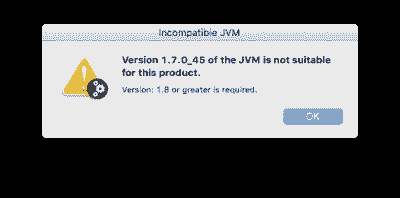
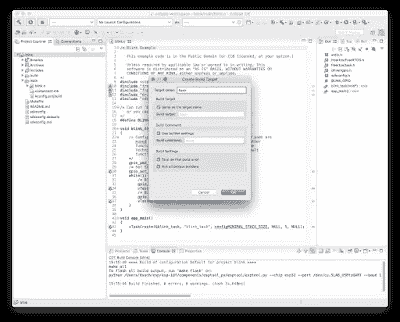

# Espressif ESP32 教程—第 4 部分

> 原文：<https://medium.com/coinmonks/espressif-esp32-tutorial-programming-eclipse-daad7b220af0?source=collection_archive---------6----------------------->

## 使用 Eclipse IDE 编程


Eclipse IDE 是最流行的桌面开发环境之一。免费和开源有所帮助！

它还通过基于语言服务器的插件支持大多数通用编程语言。目前释放的称为光子。

C/C++开发工具包(CDT)是一个基于 Eclipse 的特性集合，它提供了创建、编辑、导航、构建和调试使用 C 和/或 c++作为编程语言的项目的能力。

CDT 不包括必要的编译器和调试器来将 C/C++代码转换成可执行程序并调试这些程序，但它确实提供了允许这些工具以一致的方式集成的框架。我们将使用 Eclipse 的 CDT 版本对 ESP-32 进行编程。

## 安装 Eclipse IDE


Eclipse IDE

Eclipse IDE 为您提供了一个图形化的集成开发环境(IDE ),用于编写、编译和调试 ESP-IDF 项目。它比 Espressif 提供的命令行 ESP-IDF 更容易使用。它也比 Arduino IDE 更复杂，更适合大型项目。

由于 Eclipse 不提供 ESP-32 编译器或刷新 DevKit 的能力，您需要已经为您的操作系统安装了 ESP-IDF 工具链。如果您还没有这样做，请参考我们之前关于 ESP-IDF 的教程。

在 Windows 上结合 Eclipse 使用 ESP-IDF 需要不同的配置步骤。如果您使用的是 Windows，请参见 Windows 上的 Eclipse IDE 指南。以下是 Mac 用户使用步骤的概述。此内容基于来自 [Espressif ESP-IDF 编程指南](https://esp-idf.readthedocs.io/en/v3.1-beta1/get-started/eclipse-setup.html?highlight=eclipse)的材料，但我已经指出了我遇到困难的地方，并附上了截图，以使一些解释更加清晰。

1.从[eclipse.org](http://eclipse.org/)下载适用于您平台的 Eclipse 安装程序。

2.创建一个工作目录，解压缩下载并运行安装程序。

```
mkdir -p ~/eclipse 
cd ~/eclipse 
tar -xzf ~/Downloads/eclipse-inst-mac64.tar.gz
open -a 'Eclipse Installer.app'
```

3.当运行 Eclipse 安装程序时，选择“Eclipse for C/C++ Development”(在文档中你会看到这被称为 CDT。)

4.运行安装程序时，可能会出现以下错误。



请注意，这里的**不是**指的是 Java 运行时环境，您可以通过系统首选项对其进行更新。


如果得到 JVM 错误，需要更新 [Java 开发包](http://www.oracle.com/technetwork/java/javase/downloads/jdk10-downloads-4416644.html)。

之后，当您运行提供的安装应用程序时，您应该会看到以下安装屏幕。


## 设置 Eclipse


在新的 Eclipse 安装启动后，遵循以下步骤:

**1 .导入新项目**

Eclipse 使用 ESP-IDF 中的 Makefile 功能。这意味着您需要从创建一个 ESP-IDF 项目开始。您可以使用 github 中的框架项目或 esp-idf examples 子目录中的一个示例项目。我们将再次使用我们的老伙伴眨眼。如果您不知道如何复制示例项目，请参考我们之前的 ESP-IDF 教程。

一旦 Eclipse 运行，在弹出的对话框中选择`File -> Import…`

，选择`“C/C++” -> “Existing Code as Makefile Project”`，点击`Next`。


在下一页的“`Existing Code Location`”字段中，使用您的 IDF 项目的目录。不要指定 ESP-IDF 目录本身的路径(我们将在项目属性中这样做)。您指定的目录应该包含一个名为“`Makefile`”(项目 Makefile)的文件。


在同一页面上，在`Toolchain for Indexer Settings`下选择`Cross GCC`。然后点击`Finish`。

**2。项目属性**


新项目将出现在左侧的项目浏览器列中。右键单击项目，然后从上下文菜单中选择“属性”。

点击`Environment`属性页下的`C/C++ Build`。点击`Add…`，输入名称`BATCH_BUILD`和值`1`。

再次点击`Add…`，输入姓名`IDF_PATH`。该值应该是安装 ESP-IDF 的完整路径。如果您已经完成了我们之前的 ESP-IDF 教程，则不必执行此步骤，因为路径已经从`.profile`首选项文件中更新。


编辑 PATH 环境变量。保留当前值，并将路径附加到作为 IDF 安装的一部分安装的 Xtensa 工具链(如果该路径尚未列出)。

工具链的典型路径看起来像`/home/user-name/esp/xtensa-esp32-elf/bin`。请注意，您需要在附加的路径前添加一个冒号:。

在 macOS 上，添加一个`PYTHONPATH`环境变量，设置为:

`/Library/Frameworks/Python.framework/Versions/2.7/lib/python2.7/site-packages`。这是为了让作为安装步骤的一部分安装了 pyserial 的系统 Python 覆盖任何内置的 Eclipse Python。我不需要在我的 Mac 上这么做。

导航到`C/C++ General`->-`Preprocessor Include Paths`属性页:
-
点击提供者列表中的`Providers`-
-
标签，点击`CDT Cross GCC Built-in Compiler Settings`-`CDT Cross GCC Built-in Compiler Settings`-。在`Command to get compiler specs`下，将该行开头的文本`${COMMAND}`替换为`xtensa-esp32-elf-gcc`。这意味着完整的“`Command to get compiler specs`”应该是`xtensa-esp32-elf-gcc ${FLAGS} -E -P -v -dD “${INPUTS}`。


在提供者列表中，单击“`CDT GCC Build Output Parser`”并在编译器命令模式的开头键入`xtensa-esp32-elf-`。这意味着完整的编译器命令模式应该是`xtensa-esp32-elf-(g?cc)|([gc]\+\+)|(clang)`


导航到`C/C++ General`->-`Indexer`属性页:
-
取消勾选`Allow heuristic resolution of includes`。启用该选项时，Eclipse 有时会找不到正确的头文件目录。


**3。在首次构建项目之前，Eclipse 可能会显示许多关于未定义值的错误和警告。这是因为有些源文件是在 esp-idf 构建过程中自动生成的。这些错误和警告将在您构建项目后消失。

单击 OK 关闭 Eclipse 中的属性对话框。

在 Eclipse 之外，打开命令行提示。导航到项目目录，运行 make menuconfig 来配置项目的 esp-idf 设置。这个步骤目前必须在 Eclipse 之外运行。

*如果您试图在没有运行配置步骤的情况下进行构建，esp-idf 将在命令行上提示进行配置——但是 Eclipse 无法处理这种情况，因此构建将会挂起或失败。*

回到 Eclipse 中，选择`Project -> Build All`来构建您的项目。

**提示:**如果您的项目已经在 Eclipse 之外构建好了，您可能需要在选择`Project -> Build`之前做一个`Project -> Clean`。这是为了让 Eclipse 可以看到所有源文件的编译器参数。它使用这些来确定头包含路径。

**4。从 Eclipse 中 flash**

您可以将"`make flash`"目标集成到您的 Eclipse 项目中，以便从 Eclipse UI 中使用 esptool.py 进行 flash:

在项目浏览器中右键单击您的项目(重要的是确保您选择的是项目，而不是项目中的目录，否则 Eclipse 可能会找到错误的 Makefile。)

从上下文菜单中选择`Build Targets -> Create…`。
输入“flash”作为目标名称。将其他选项保留为默认值。**



确保 ESP-32 已连接，并且使用 menuconfig 选择了正确的串行端口，然后使用`Project -> Build Target -> Build` (Shift+F9)构建自定义闪存目标，该目标将编译并闪存项目。


您的程序将被编译并刷新到 ESP-32，结果显示在 CDT 构建控制台中。

注意，您需要使用`make menuconfig`来设置串口和其他配置选项，以进行刷新。“`make menuconfig`”仍然需要命令行终端(参见 Espressif 网站上针对您的平台的说明，或者参考我们的 ESP-IDF 教程。)


如有必要，按照相同的步骤添加 bootloader 和 partition_table 目标。

[](https://reefwing.medium.com/espressif-esp32-tutorial-ir-remote-control-using-microsoft-azure-ed768a5cea4d) [## Espressif ESP32 教程—使用 Microsoft Azure 进行红外遥控

### 本教程将概述如何使用 ESP32 创建一个红外遥控器，然后从微软的物联网中心控制它…

reefwing.medium.com](https://reefwing.medium.com/espressif-esp32-tutorial-ir-remote-control-using-microsoft-azure-ed768a5cea4d) 

*如果你喜欢这篇文章，并且愿意帮助支持我的写作，那么请* [*订阅成为媒介会员*](https://reefwing.medium.com/membership) *。我会得到你的订阅费的一部分，你可以访问媒体上的每个故事。或者，你可以* [*给我买杯咖啡*](https://ko-fi.com/davidsuch) *！*

[](https://reefwing.medium.com/membership) [## 用我的推荐链接加入媒体-大卫这样

### 阅读大卫·瑟奇(以及媒体上成千上万的其他作家)的每一个故事。您的会员费直接支持…

reefwing.medium.com](https://reefwing.medium.com/membership)