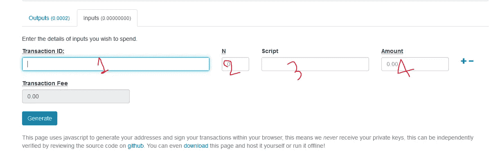
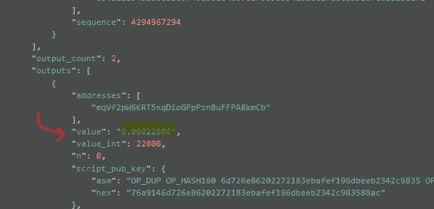

# 逐步在 Testnet 上创建和广播比特币交易

> 原文：<https://medium.com/coinmonks/estep-by-step-create-and-broadcast-a-bitcoin-transaction-on-testnet-588daacc2b7a?source=collection_archive---------0----------------------->

作为一名开发人员，我想测试我自己的高清钱包，我需要在测试网上测试比特币交易。

如果你想知道什么是高清钱包，可以从这里看:[https://github . com/bit coin/bips/blob/master/bip-0032 . mediawiki](https://github.com/bitcoin/bips/blob/master/bip-0032.mediawiki)

无论如何，如果你需要为测试网创建一个钱包，你可以从这里得到:
[https://bitcoinpaperwallet . com/bitcoinpaperwallet/generate-wallet . html？设计=alt-testnet](https://bitcoinpaperwallet.com/bitcoinpaperwallet/generate-wallet.html?design=alt-testnet)

然后你会看到你的钱包是这样的:

现在，我们有一个地址，每个人都不一样。我有一个钱包，地址:**mqvf 2 pw 6 krt 5 xqdiogpppznbuffpa 8 kmcb**

我们需要在钱包里放些比特币。使用这个网站:[https://bitcoinfaucet.uo1.net/](https://bitcoinfaucet.uo1.net/)

或者任何其他提供比特币的网站，你可以这样搜索:

 [## 测试网龙头比特币-谷歌搜索

### 比特币 Testnet 水龙头快！比特币测试网龙头已经为现代客户做好了准备！没有广告！没有 BS！不…

www.google.com](https://www.google.com/search?client=firefox-b-d&sxsrf=ALeKk01WVVTMM7gg_iQUl5Zsgh02wcRpGg%3A1588990780252&ei=PBO2XsieDvKymwXynbO4CA&q=testnet+faucet+bitcoin&oq=test+net+fucet+bitcoin+&gs_lcp=CgZwc3ktYWIQARgAMgYIABANEB4yCAgAEAgQDRAeMggIABAIEA0QHjIICAAQCBANEB4yCAgAEAgQDRAeMggIABAIEA0QHjIICAAQCBANEB4yCAgAEAgQDRAeMggIABAIEA0QHjIICAAQCBANEB46BwgjELACECc6BAgAEA1QvS5Yk0FgoUloAHAAeACAAboCiAHXBpIBBTItMi4xmAEAoAEBoAECqgEHZ3dzLXdpeg&sclient=psy-ab) 

在这里写下你的地址和你想要的比特币数量(最多 0.0022 BTC)，然后点击发送测试网比特币。

搞定了。

我们可以检查交易。

这是我们的交易 id。我们可以用身份证或我们的地址来核对以获得平衡。

这是我的:

 [## Blockchain.com 探险家| BTC |联邦理工学院| BCH

### Testnet 是开发人员用于测试的替代比特币区块链。测试网硬币没有任何价值…

www.blockchain.com](https://www.blockchain.com/btctest/tx/fb3f0883c280dbca388f91f253f2f6fce9af2b7c910eb26379d71b44b778edbe) 

您可以用您的更改交易 id:

你至少要等到 1 次确认。

现在，去这个地址:

[https://testnet.smartbit.com.au/api](https://testnet.smartbit.com.au/api)

并找到交易。

单击它并转到参数选项卡:

将您的交易 id 粘贴到此处，然后单击获取。

在回复中，您会看到类似这样的一系列不同之处。在输出部分找到你的地址，我们需要它。

现在，我们想花掉我们的比特币(确认后)。

转到这里:[https://nubits.com/cointoolkit/#newTransaction](https://nubits.com/cointoolkit/#newTransaction)

点击高级选项

设置:

改成考网然后保存！

从这里回到新交易页面。

我想把我所有的余额汇给 2 ngzrvvzg 92 qgyqztljcaewvpz 7 je 8 S8 vxe

或者任何其他地址。

现在更改选项卡，转到输入选项卡

我们需要这些物品

1:

2:

找到你的地址，你有比特币在里面，我们需要它的 n。我在这个交易中是 0。

3:

4:

这是最终视图:

我们有 0.00022000，我们想发送 0.00021000 和 0.00001000 将是这笔交易的费用。

单击生成按钮，您将看到:

点击继续签名按钮:

将您钱包中的私钥粘贴到此处:

点击标志:

这是您的原始交易。本站无法播出，只好到这里:

[https://testnet.smartbit.com.au/txs/pushtx](https://testnet.smartbit.com.au/txs/pushtx)

粘贴到这里，然后点击推送交易。

完成^_^你可以检查它的链接

> 还念:[最佳比特币硬件钱包](/coinmonks/the-best-cryptocurrency-hardware-wallets-of-2020-e28b1c124069)