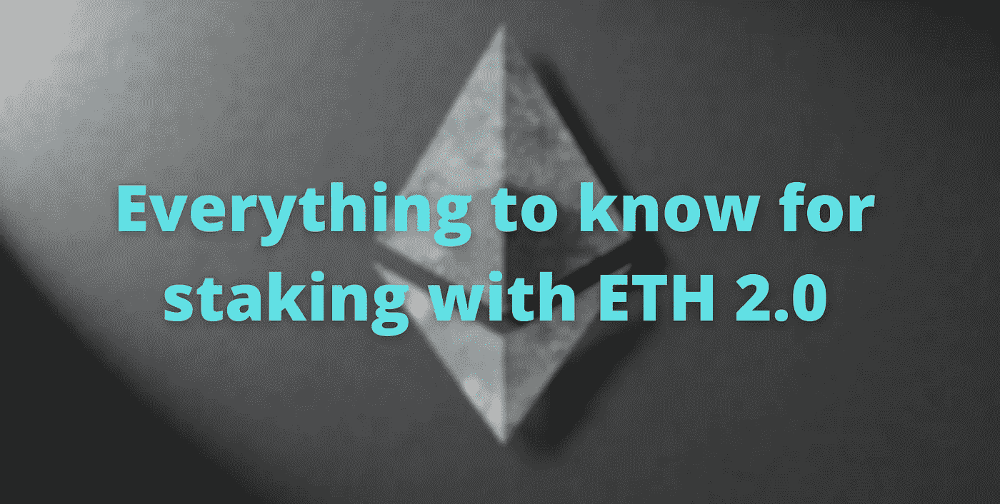

# ETH 2.0 赌注—如何为所有级别下注

> 原文：<https://medium.com/coinmonks/eth-2-0-staking-how-to-stake-for-all-levels-77e6440cd39a?source=collection_archive---------0----------------------->

## 如何从所有技能范围开始下注以太坊？以及从完全初学者到高级 DevOps 工程师需要知道的一切。我们还将探讨人们使用的一种流行方法以及如何设置它。

Staking with ETH 2.0\. Original Image from Yaroslav Danylchenko.

# 介绍