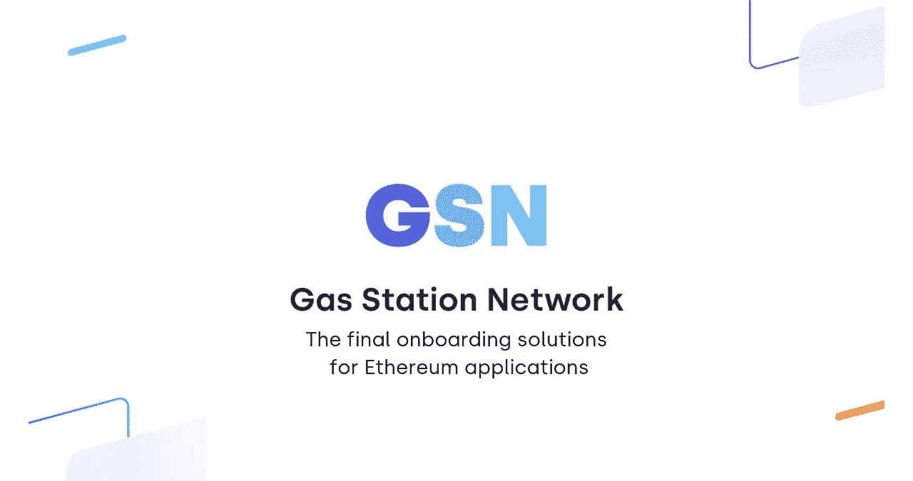
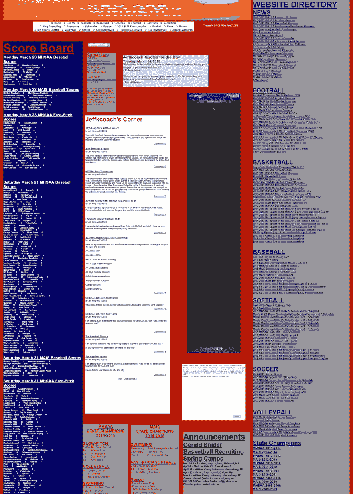
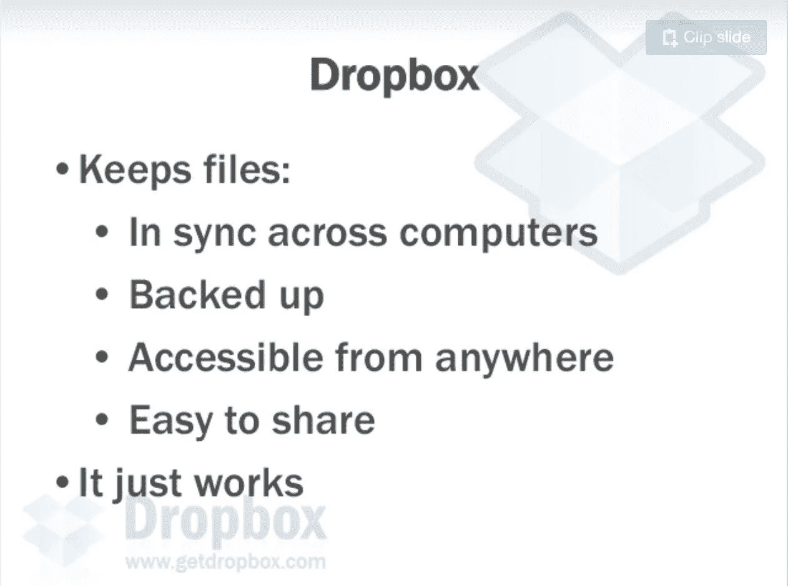
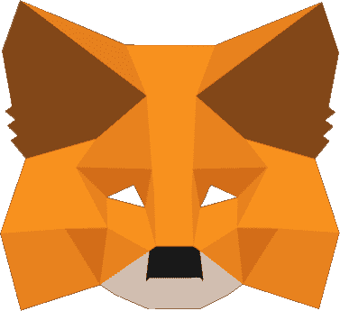
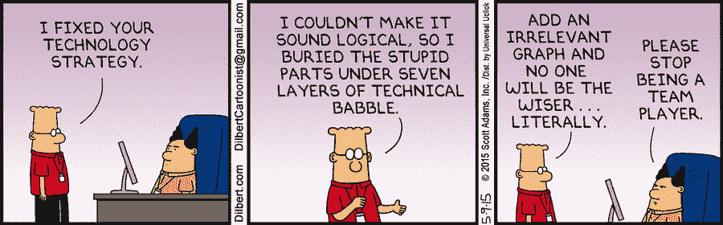
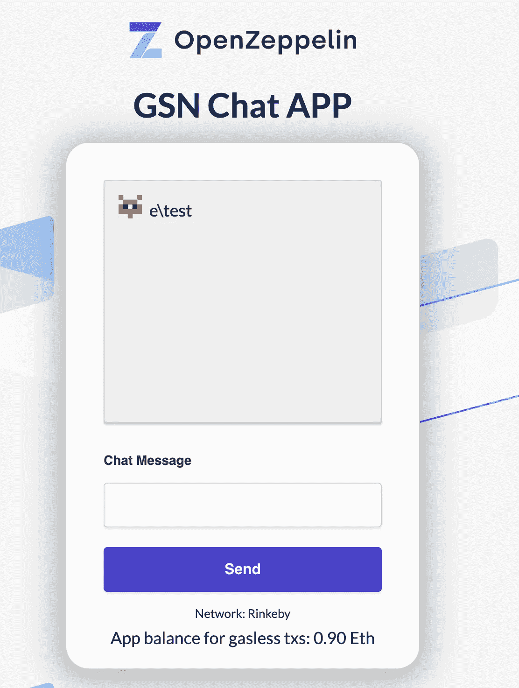

# GSN:终极以太坊入门解决方案

> 原文：<https://medium.com/coinmonks/eth-onboarding-solution-90607fb81380?source=collection_archive---------0----------------------->

[*加油站网络*](http://gsn.openzeppelin.com/) *是一项开源服务，允许开发者创建独特的去中心化应用，与你喜欢的 Web 2.0 应用没有区别。应用程序现在可以将用户的交易成本作为客户获取成本的一部分。GSN 不仅是入职的必备条件，也是开启区块链范式下新的颠覆性商业模式的钥匙。*

# 这一次没有不同

技术是循环发展的。在过去的 40 年里，我们已经看到了重大的技术周期出现，巩固和蚕食了以前的周期。微软引领了软件时代，在这个时代，以前的范式——微处理器——的技术被商品化了。网络巨头革新了软件，开启了一个建立在开源之上的新时代。专有软件变得不那么重要，被数据所取代。

现在，加密网络正在开始一个新的范式转变，数据商品化，网络和资源的开放访问成为新的规范。

# 产前阵痛

在每一次转型中，致力于新范式的开发人员都在与现有企业竞争的压力中挣扎，同时保持技术和访问成本低廉。

More Links Anyone?? Ahhh, the joys of 1990s websites.

在最初的几年里，**新的技术挑战导致了巨大的摩擦**。这些挑战使得证明新技术的附加值变得异常困难。例如，请记住从桌面应用到网络的转变。在 20 世纪 90 年代创建一个网站并不是一个明显的进步。投资回报率并不明确，因为你不能在网上收费，也没有多少人上网。

*“到 2005 年左右，人们将会清楚地看到，互联网对经济的影响并不比传真机大。*”—诺贝尔奖获得者，保罗·克鲁格曼

在这种情况下，要创建一个网站，你需要购买一个域名，购买一些服务器，对你的网站进行编码，然后每月支付一笔费用来维护服务器。现在，所有这些摩擦点和成本都被隐藏起来，你可以使用 Wix 或 Squarespace 拖放到一个简单的网站。

**缺乏可行的颠覆性商业模式**加剧了这一问题。新进入者无法找到将技术货币化的方法，他们没有时间打磨，被迫将挑战和成本硬塞给消费者。

云存储就是一个很好的例子。像亚马逊这样的云提供商以合理的费用提供存储(S3)。你需要为你存储的每兆字节的文件付费，这取决于你访问这些文件的频率。终端用户看不到的难以置信的创新。基于技术的定价模式，以及模糊的附加值—云上的备份—阻止了主流消费者的采用。

How obvious was in retrospective? It just works. [Extracted from Dropbox Seed Deck](https://www.slideshare.net/AlexanderJarvis/dropbox-seed-stage-pitch-deck)

Dropbox 彻底改变了这种局面。他们向消费者隐藏了复杂性，并给他们提供了他们能够理解的附加值。把你的文件放在这里，你将永远不会丢失它们。嘿，你也可以从任何设备访问它们。你可以免费放很多文件，但是如果你有更多的文件，你需要按月付费。

# 去看牙医

欢迎来到区块链应用。Dapps 是新范式带来痛苦的典型例子。区块链应用程序可以自豪地说，它们每分钟都会引发最多的挫败感。他们吓跑潜在客户的速度比牙医吓跑第一次就诊的孩子还快。

Dapp Builder or Dentist?

现在让我们关注另一面。检查一个典型用户(让我们称他为 Pete)的流程，他正在与他的第一个 dapp(一个独角兽游戏)进行交互:

皮特降落在网站上。隐独角兽欢迎他。

> *“看起来很棒”*

皮特点击“新游戏”按钮。Pete 被要求安装 Metamask。

> “嗯，为什么我需要装一只狐狸才能得到我的独角兽？?"

Pete 被要求创建一个钱包并保存他的私有种子备份。

> “搞什么鬼？什么是钱包？什么是种子？”

皮特现在可以进入游戏了。太好了！皮特现在点击繁殖他的第一只独角兽。别着急皮特。他没有 ETH。你把他送到一个密码交易所。

> “真的吗？我就是想玩独角兽:(”

皮特需要买一些 ETH。

> “嗯，只要 5 美元”

皮特需要把 ETH 发到他的 Metamask 账户。

> “我又把钱寄到哪里了？这个神秘的狐狸是不是在偷我的钱？”

皮特用户再次点击品种按钮，最终可以创建他的第一个独角兽。他能吗？

> “哦不！狐狸又来了。”

Pete 需要签署一份看起来像胡言乱语的交易，即 214g5j23y5gg452yi145。

> “这应该是我的独角兽吧？?"

皮特需要等一分钟才能确认。

“就是它了。我讨厌独角兽。”

皮特永远不会回来了。

我们正在迫使最终用户处理使用区块链技术的技术负担和资金成本。 [@rohamg](https://twitter.com/rohamg) 引用 CryptoKitties 看到 **99%的下降在他们的漏斗**。

这并不令人惊讶。

首先，用户每次需要与区块链交互时都需要支付交易费用。其次，因为你是在强迫用户付费，你也是在让他们去处理所有的技术细节。其中包括:

*   安装浏览器扩展以便能够使用甚至查看网站
*   在需要连接您的银行账户的交易所注册账户
*   把他们的血汗钱花在神奇的网络信用上，仅仅是为了使用一个应用程序！
*   理解私钥和公钥。

看这个美女 0 xc2d 7 cf 95645d 33006175 b 78989035 c 7 c 9061d 3 f 9

这就相当于优步(Alibaba)或 Airbnb 在你每次搜索房屋或要求搭车时都强迫你付费。

*抱歉，您的搜索导致了 323 次读取操作，花费了 7 秒的 CPU 时间。是 23 个百分点。*

Dilbert by Scott Adams

这是胡说八道。**消费者不关心也不需要知道你的系统是如何工作的**。

最重要的是，很少有分散的应用程序适合产品市场。大部分都可以算是有趣的实验。[看起来像玩具的实验](http://cdixon.org/2010/01/03/the-next-big-thing-will-start-out-looking-like-a-toy/)。它们在技术上很有趣，但对于主流消费者来说，其附加值并不确定。

记住，*“如果没用，分散了，还是没用。”*

我们需要隐藏技术上的复杂性，向用户收取他们真正想要的费用。

# 见见你的老朋友 CAC

如果你在使用区块链，你需要找到一种方法为你的用户提供独特的价值。你需要**隐藏所有区块链技术的复杂性和与之相关的成本**。交易成本和汽油费现在是你的客户获取成本(CAC)的一部分。处理好它。你的用户不会。

显然，你的商业模式需要能够支持这种客户获取成本，否则你将没有一个可行的业务。你需要认真思考你为什么使用区块链，你为用户提供的独特价值是什么。然后找出一种能够承受相关成本的商业模式。

区块链给了我们可编程的金钱、无权限的协作和可组合性。区块链独有的颠覆性商业模式将主导这个时代。我们仍然没有找到它们，但我们看到了一些有趣的实验，如计价单位、MakerDAO 或 Instadapp。

随着技术的成熟，成本将会降低，从而允许围绕商业模式进行越来越多的实验。

# 认识 GSN

今天，我们激动地宣布**加油站网****(GSN)的发布。GSN 是一种去中心化的服务，以太坊开发者现在就可以开始使用它来保护用户免受技术复杂性的困扰。**

**一个应用胜过千言万语，所以试试我们的[示例应用](https://gsn-chat-app.openzeppelin.com/)吧，它由 GSN 提供支持，由 [Dennison Bertram](https://medium.com/u/ce7746cc56ef?source=post_page-----90607fb81380--------------------------------) 创建:**

****

**No Metamask required. No ETH required. Don’t you feel lighter?**

**首先，我们想强调的是，GSN 是一个开源项目。这是一个由以太坊生态系统和 [Metacartel](https://www.metacartel.org/) 团队合作完成的项目。 [TabooKey](https://www.tabookey.com/) 设想了其背后的概念，并创造了最初的原型，在 [ETHDenver](https://www.youtube.com/watch?v=d8KB-MaWiMw) 期间展示。然后，OpenZeppelin 审计了该系统，并与 TabooKey 一起推动该项目，直到今天。来自 [Portis](https://www.portis.io/) 、[土拨鼠](https://groundhog.network/)、 [BurnerWallet](https://burnerwallet.co/) 和 [Pillar](https://pillarproject.io/) 的支持也对这个项目的发布起到了重要作用。**

****GSN 是一个服务器网络，称为中继站，等待执行交易**。每个中继站从区块链上的每笔交易中获得报酬。继电器被激励行为正确，不作弊。**

**最棒的是，GSN **不需要任何中央服务器**或实体来组织它。您的应用程序得到一个包含所有可用中继器的响应。这些继电器存储在继电器智能合约内的以太坊上。您的应用程序可以根据信誉选择将要执行交易的中继器。一旦你选择了继电器，它会立即回复你确认请求。如果没有，你可以马上换另一个继电器。**

**服务是公开透明的。任何人都可以跑接力赛。我们欢迎每个人加入我们，并为生态系统添加新的继电器。你可以设定自己的费用，你提交给区块链的每一笔交易都会得到奖励。**

**但是，如果只是想用 GSN，就不需要跑一个了。你可以修改你的 dapp，通过 OpenZeppelin 契约与 GSN 集成，并通过一个新的 Web3 提供者与之交互。你只需要指定在什么条件下你的 dapp 支付交易，就是这样。**

# **开启创新**

**加油站网络可以在以太坊和整个区块链空间释放出新的创新浪潮。从技术上讲，它可以为您解决所有这些问题:**

*   **10 倍于你的入职漏斗。不需要安装 Metamask，让他们去买 ETH 或者让他们在使用你的应用程序之前把钱花在上面。**
*   ****隐藏私有&公钥**。您的用户甚至不需要担心这一点，但他们仍然可以从拥有自己的数据和资产中获益。**
*   ****更快更可靠的交易时间**。您的应用程序选择哪个中继来执行事务，然后您就可以立即获得签名的事务。**

**此外，它在您的应用程序中支持独特的业务模型:**

**1) **通过认购补贴交易**。你不会向你的用户收取交易费用。你向他们收取使用你服务的费用。你的用户通过他们已经熟悉的方法和流程付费，比如 Stripe。交易成本被认为是你的 CAC 的一部分。对他们来说，该应用程序的感觉和外观与任何其他云应用程序一样。用户获得了其他地方无法获得的独特优势。**

**2) **虚拟货币**。您可以创建一个虚拟货币系统(祖母绿、钻石)，用户可以通过 Stripe 充值。用户需要这个虚拟货币来和你的 dapp 互动。一旦用户的信用额度越来越少，他们就会被提示购买更多的虚拟货币。再一次，技术上的复杂性对用户来说是隐藏的，但是他们仍然获得了独特的好处，比如真正拥有他们游戏中的数字资产。**

**3) **赞助基金**。你可以创造一个有资金池的刀。某些用户被 DAO 列入白名单，其事务由 DAO 资助。DAO 可以基于它的治理添加和删除权限。**

# **未来从今天开始**

**[加油站网络](https://gifted-mayer-c163b8.netlify.com/)今天在 Rinkeby 上可用，测试版将于下周部署到主网络。**

**我们需要您的反馈。请加入我们的测试，并通过以下方式帮助我们:**

*   ****运行自己的继电器**。用开源代码启动一台服务器，并从你放在区块链上的每一笔交易中获得回报。参见[回购](https://github.com/tabookey/tabookey-gasless)中的说明。**
*   ****将 GSN 集成到您的 dapp 中**。保护您的用户免受我们上面讨论的棘手问题的影响，并将您的入职漏斗扩大 10 倍。[参见我们的文档](https://docs.openzeppelin.com/openzeppelin/index.html)。**
*   **合作并贡献开源代码。代码是完全开源的。您可以在这里投稿和发送拉请求[。](https://github.com/tabookey/tabookey-gasless)**

****GSN 将高要求的技术项目转化为可大规模采用的消费者应用**。实现这一突破性技术承诺的应用程序，同时从最终用户那里抽象出技术复杂性。**

**正如我们所看到的，将所有技术成本捆绑在 CAC 内部，可以让您自由地测试、发现和解锁只有区块链技术才能支持的新的颠覆性模式。**

**一个新时代正在崛起！加入我们吧。**

**[GSN 网站](http://gsn.openzeppelin.com/)**

**[Github 回购](https://github.com/tabookey/tabookey-gasless)**

**[打开齐柏林文件](https://docs.openzeppelin.com/openzeppelin/index.html)**

**[加入我们论坛的对话](https://forum.openzeppelin.com/)**

****

> **[直接在您的收件箱中获得最佳软件交易](https://coincodecap.com/?utm_source=coinmonks)**

****