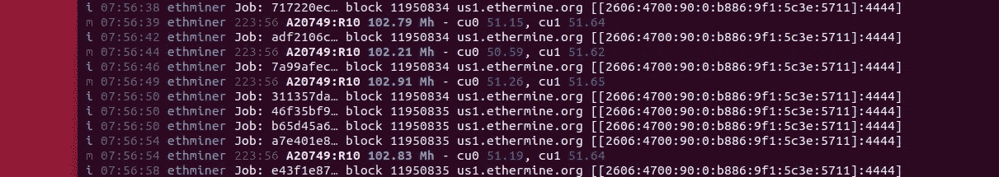
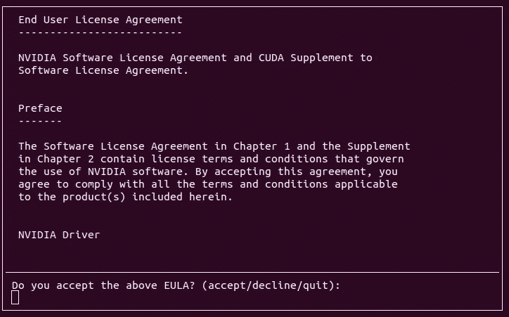
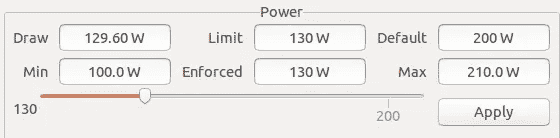
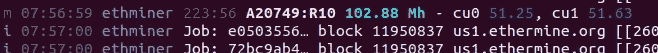

# ETH x Nvidia x Ubuntu

> 原文：<https://medium.com/coinmonks/eth-x-nvidia-x-ubuntu-1980393a36f8?source=collection_archive---------0----------------------->



Actual logs of Ethminer on Ubuntu

我们将展示如何使用 Nvidia GPU 在 Ubuntu 上快速设置 ETH 采矿设备。

# Ubuntu 预设

这整个设置已经在 Ubuntu 18 和 20 上测试过了，但是我个人建议为了稳定性坚持使用 18。

# 安装驱动程序和 CUDA 工具包

为了使用你的 GPU 卡来采矿，你需要能够在上面运行代码。Nvidia 为此提供了驱动程序和工具包(CUDA)。好消息是，您可以在一个简单的安装过程中同时安装这两个组件。

经过几次尝试(截至 2020 年 12 月)，我建议不要使用工具包的最新版本(11.2)，而是使用以前的版本(11.1.1)。
这里是直接链接[https://developer.nvidia.com/cuda-11.1.1-download-archive](https://developer.nvidia.com/cuda-11.1.1-download-archive)。只需按照选择器来匹配您的系统，您应该会看到:

```
wget [https://developer.download.nvidia.com/compute/cuda/11.1.1/local_installers/cuda_11.1.1_455.32.00_linux.run](https://developer.download.nvidia.com/compute/cuda/11.1.1/local_installers/cuda_11.1.1_455.32.00_linux.run)
sudo sh cuda_11.1.1_455.32.00_linux.run
```

安装程序需要首先检查系统，一旦通过验证，您应该会看到许可协议菜单。



Nvidia End User Licence Agreement

你可以写“接受”,让它自己安装。
你会看到一个菜单，在这里你可以选择要在你的电脑上安装什么。确保安装驱动程序和 CUDA 工具包。如果您想测试设置，CUDA 示例很酷。
安装最多需要几分钟。一旦安装，你应该得到一个已经安装和没有安装什么的摘要，以及 2 条重要的信息:日志的位置和卸载 Nvidia 驱动程序和工具包的命令。不过，在需要调试之前，您不必关心它们！

此外，不要忘记在设置好驱动程序后重启机器。检测驱动程序设置是否正确的好方法是:在启动时，GPU 风扇不会启动。为什么？因为现在卡是用它的最优配置来管理的，大部分卡在不处理任何事情的时候都可以优化风扇的使用。如果驱动程序设置不正确，当卡打开时，风扇将自动启动。

# Ethminer 设置

现在您已经准备好了 CUDA 驱动程序和工具包，您需要构建以太坊挖掘器，这是挖掘过程的软件部分。

我给你一个快速通道，你会在这里找到所有的细节:[https://github . com/ether eum-mining/eth miner/blob/master/docs/build . MD](https://github.com/ethereum-mining/ethminer/blob/master/docs/BUILD.md)还有这里:[https://linuxhint.com/mine-etherium-ethminer-ubuntu/](https://linuxhint.com/mine-etherium-ethminer-ubuntu/)

首先，安装必要的工具。CMake 将用于构建，mesa 是一个 3D 图形库:

```
apt-get install git mesa-common-dev cmake
```

在专用文件夹中克隆 ethminer repo 并更新子模块:

```
git submodule update — init — recursive
```

设置完成后，配置安装:

```
mkdir build && cd build
cmake .. -DETHASHCUDA=ON -DETHASHCL=OFF
cmake — build .
```

标志**-DETHASHCUDA = ON-DETHASHCL = OFF**只是告诉程序准备 CUDA 的设置，而不是 OpenCL。

最终，您可以安装:

```
sudo make install
```

让我们快速检查一下:

```
ethminer -U -M
```

通过运行这个，你将知道:
-如果 ethminer 设置正确
-如果 ethminer 看到并可以使用你的 NVidia GPU
-你可以从你的 GPU 得到的 hashrate
这个 beanchmark 应该给你一个你应该从你的 GPU 得到的 hashrate 的概念:。

如果你已经完成了这些步骤，恭喜你已经安装了带有 NVidia GPU 的 ethminer！

# 奔跑

网上大量的文章和文档可以向你解释什么是“挖掘”。简单来说，让我们假设你做了很多很多的计算，你得到了珍贵的矿石。为了做到这一点，你必须连接到一个采矿平台，它将注册你的工作，并作为回报补偿你。这转化成了那个命令:

```
ethminer -P -U stratum1+tcp://[WALLET].[RIG]@[SERVER]:[PORT]
```

其中 wallet 是您的钱包地址，server 是您选择用来挖掘的服务器。端口将由服务器配置决定，rig 是可选的，直到你有了几个 rig。

例如，对于小型钻机，我会推荐 Ethermine.org，这将是你如何得到配置:[https://ethermine.org/start](https://ethermine.org/start)。

正式成为矿工前的最后一个清单:
-确保你的 PSU 对你的 GPU 足够强大和稳定，尤其是如果你有几个 GPU 的话。
-确保气流没有被任何东西阻挡，并且你的设备不要太靠近另一个热源。
-确保足够隔离。风扇 100%的时间都在运转，那会很吵。

我建议您在 **tmux** 内运行 miner，然后在您采矿的服务上跟踪您的钻机。在问题的情况下，硬件或软件，你会看到一个减少，你也可以通过电子邮件通知，如果你的矿工下降。
最可能的原因:PSU 不稳定、过热(导致 GPU 关闭，直到它变冷)、连接不稳定…

# 锁定不足

你可能已经习惯或者知道超频。在这两种情况下，我们都在优化 GPU。那样的话，我只给你介绍精明的一面，基本就是降低功耗，为了优化用电。
你已经在 Windows 中安装了几个超频软件，比如 MSI Afterburner、CPU-Z、GPU-Z……这些软件在 linux 发行版中是不可用的，除非最近有所改变。

Windows 上的一些挖掘软件会建议超频内存时钟，同时降低 GPU 的电压，以优化矩阵计算，不烧时钟。据我所知，我们不能在 Linux 中进行完全相同的编辑。

# 甘油水灌肠（glycerin and water enema ）

GreenWithEnvy(羡慕的绿色-dia？)就是你要找的工具。我不会介绍它的设置，但这将使我们能够减少电力使用。
最近的 GPU 卡都是优化渲染，3D，着色器……基本上你挖矿的时候都不需要。GWE 会让你降低卡的功率限制。

以一个**增益 3060TI OC** :
-基极 has rate(功率限制 200 w):*51–54mh/s*
-超频(时钟和电压): *60 MH/s* (根据 Nicehash)
-降低功率限制与 GWE(在 130W 下测试):*50–51mh/s*
换句话说，您可以简单地节省 35%如果你想做更多的实验，我建议你设置 Windows 和 MSI 加力。
一个警告，GWE 还不支持多 gpu。你仍然可以用它来调整第一个 GPU。



Test by limiting the power of the first card. From 200W to 130W



cu0 is limited to 130W here, and stays close to the perf of cu1, which is not limited

希望您喜欢它，如果您已经安装并运行了您的设备，请随时为**0 xa 86 bec 61 bdbe 257 CBF 13442 ef 4 fa f 849 E6 ce 971**贡献您的一份力量。如果您有任何问题或困难，我很乐意协助您进行调试！

> 加入 [Coinmonks 电报频道](https://t.me/coincodecap)，了解加密交易和投资

## 也阅读

[](https://blog.coincodecap.com/crypto-exchange) [## 最佳加密交易所| 2021 年十大加密货币交易所

### 加密货币交易所的加密交易需要了解市场，这可以帮助你获得利润…

blog.coincodecap.com](https://blog.coincodecap.com/crypto-exchange) [](https://blog.coincodecap.com/crypto-lending) [## 2021 年 9 大最佳加密借贷平台

### 当谈到加密货币贷款时，大量因素等同于良好的收入状况。此外，借款的一部分…

blog.coincodecap.com](https://blog.coincodecap.com/crypto-lending) [](/coinmonks/crypto-trading-bot-c2ffce8acb2a) [## 加密交易机器人——最佳免费加密交易机器人

### 2021 年币安、比特币基地、库币和其他密码交易所的最佳密码交易机器人。四进制，位间隙…

medium.com](/coinmonks/crypto-trading-bot-c2ffce8acb2a) [](/coinmonks/best-crypto-signals-telegram-5785cdbc4b2b) [## 最佳 6 个加密交易信号电报通道

### 这是乏味的找到正确的加密交易信号提供商。因此，在本文中，我们将讨论最好的…

medium.com](/coinmonks/best-crypto-signals-telegram-5785cdbc4b2b) [](https://blog.coincodecap.com/blockfi-review) [## BlockFi 评论 2021:利弊和利率

### 今天，我们提出了一个全面的 BlockFi 评论，这是一个成立于 2017 年的加密贷款平台，拥有其…

blog.coincodecap.com](https://blog.coincodecap.com/blockfi-review) [](/coinmonks/best-crypto-tax-tool-for-my-money-72d4b430816b) [## 加密税务软件——五大最佳比特币税务计算器[2021]

### 不管你是刚接触加密还是已经在这个领域呆了一段时间，你都需要交税。

medium.com](/coinmonks/best-crypto-tax-tool-for-my-money-72d4b430816b) [](/coinmonks/pionex-review-exchange-with-crypto-trading-bot-1e459d0191ea) [## Pionex 评论 2021 |免费加密交易机器人和交换

### Pionex 是为交易自动化提供工具的后起之秀。Pionex 上提供了 9 个加密交易机器人…

medium.com](/coinmonks/pionex-review-exchange-with-crypto-trading-bot-1e459d0191ea) [](https://blog.coincodecap.com/best-hardware-wallet-bitcoin) [## 存储比特币的最佳加密硬件钱包[2021]

### 保管您的数字资产很容易，但找到正确的存储方式却是一项繁琐的任务。在线钱包有一个风险…

blog.coincodecap.com](https://blog.coincodecap.com/best-hardware-wallet-bitcoin)