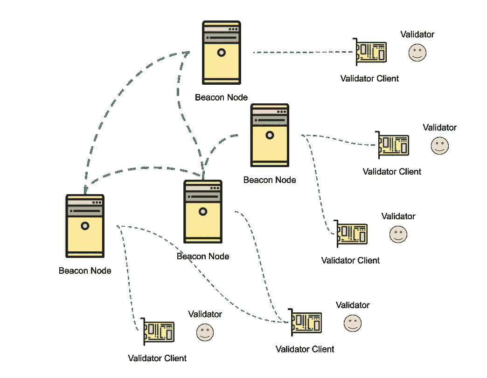

# ETH2.0 阶段 0:新贡献者基础

> 原文：<https://medium.com/coinmonks/eth2-0-phase-0-basics-for-new-contributors-8a0a22bc38c7?source=collection_archive---------0----------------------->

Translations: [中文](https://ethfans.org/posts/eth2-0-phase-0-basics-for-new-contributors)

*   *区块链大背景:* [*区块链 300 字送给大家*](/@james.zaki/blockchain-for-everyone-in-300-words-b117c48d47cd)

# 介绍

这种简化旨在帮助那些第一次接触 ETH2.0 并希望加入实现工作的人(在撰写本文时为阶段 0)。

本文旨在快速地将高级组件放入上下文中，并介绍关键术语，而不深入实现细节。最后提供了更多资源的链接。

如果读者已经熟悉当前以太坊区块链(工作证明)的一些术语，这将很有帮助。

## 阶段

[Justin Drake](https://twitter.com/drakefjustin) 对 Eth2.0 阶段做了很好的总结:

*   存款:Eth1 上引入验证器的智能合约
*   **阶段 0** -系统:信标链。这正是本文想要阐述的
*   **阶段 1** -数据:在“碎片”中并行处理事务
*   **第二阶段** -州:EVM 2.0，智能合同

# 高层

## 目标:有序交易

主以太坊区块链(或 Eth1 **主链**)创建由运行以太坊挖掘软件或“挖掘节点”的独立连接计算机同意的有效交易的有序列表。尽管这一目标没有改变，但在 ETH2.0 中，与交易订单达成一致的方法是通过利益证明而不是工作证明。

## 并行处理

与 PoW 一样，最近的事务集将被分组到块中。与 PoS 的区别在于节点如何确定块的顺序，即最近的块如何链接在一起。

此外，Eth1 主链只是一个块链，而 Eth2.0 将有许多**碎片**并行创建块链(**碎片数据链**)，但这将是在第 1 阶段。为了让这些碎片一起工作，另一个区块链将合并碎片之间的有效块。这个行政区块链被称为**灯塔链**。

阶段 0 的 Eth2.0 规范主要关注这个信标链，其他资源描述了完整的解决方案。

## 信标节点建立信标链

运行 Eth2.0 客户端的信标节点软件的连接到互联网的计算机是 Eth2.0 网络上的节点。与 Eth1 一样，连接的节点共享消息以创建/共享要构建的新块。在所有节点就链的最新块达成一致之前存在一些滞后。

> *信标节点之间如何达成一致，在信标链上创建有序的块，是 Eth2.0 阶段 0 的核心。*

# 随机块创建

不去探究集中的金融交易是如何变坏的，去中心化系统的设计需要很多仔细的考虑。

其中一部分是确保分布式网络上的大量人员有机会为创建/验证数据做出贡献。为了避免集权/腐败:

*   块必须由网络上的随机节点提出
*   奖励有效块和/或惩罚无效块

***验证工作*** 使用计算劳动来实现这一点:

*   块建议者之间周期性的随机块产生(15s)
*   创建有效区块的财务成本(有机会获得区块奖励)

**证明- *赌注*** 利用押出的 ETH(货币)来达到同样的目的:

*   跨时隙随机分配赌注参与者(6s)
*   对无效提议区块的经济处罚，对参与的奖励

虽然我们已经提到信标节点正在创建块，但它们实际上并不是那些参与网络(并因此因成功参与而获得奖励)的信标节点。这就是**验证器**的作用。

## 验证器

验证者是一个人的地址，他(通过 Eth1 主链智能合约)参与了 Eth2.0。他们的任务是频繁地、随机地对他们认为有效的新创建的块进行签名(以及其他事情)。

运行 Eth2.0 客户端的**验证器客户端**软件的联网计算机必须连接到一个(或多个)信标节点。它信任信标节点以适当的数据进行响应，并且只有在有效的情况下，才由验证器客户机管理的相应验证器对数据进行签名。更多细节在下一节。

当 Eth2.0 处于拥有一个验证器池的阶段时，它们在被分组到**委员会**之前被伪随机地洗牌。按照**时段**，一个或多个委员会被分配到一个**时段**参与。

Validators, committees, slots, and epochs

每个时期，验证者的任务是签署:一个新创建的块，或者一个对先前创建的块的**证明**/投票。在纪元结束时，验证器被重新洗牌，并且重复该过程。

## 信标节点

除了管理已经标记了 32 个 ETH 的验证器列表之外，信标节点还负责:

*   保持时隙的定时(6s)
*   随机性的产生
*   每个时间段分配委员会(验证人)
*   响应连接的验证程序客户端

# 硬件/软件

## 连接的计算机

为了具有高可用性和足够的块验证随机性，需要一个大的验证器池(最少 10，000 个)。理想情况下，这些**验证器**分布在许多**验证器客户端**中，这些客户端连接到一个或多个**信标节点**，构成了 Eth2.0 网络。

BN-BN: internet, VC-BN: internet or local. — (icons made by [catkuro](https://www.flaticon.com/authors/catkuro))

运行信标节点的硬件与其他连接的信标节点实例通信，并共享签名块和签名证明。验证器客户端连接到受信任的信标节点，以了解其验证器被分配到了哪些槽。此外，验证器客户端请求数据(块/证明)供其受管客户端签名。

> 主题:运行信标节点的激励，在同一台机器上运行信标节点和验证器客户端，以及信任信标节点；超出了本文的范围。在撰写本报告时，正在进行讨论。

最简单的配置是一个信标节点，一个连接的验证器客户机管理一个验证器。但是假设信标节点有更高的要求，而验证者客户机的要求要低得多，那么验证者客户机的数量可能会比信标节点多得多。由于验证器客户机可能是一台高度可用的家用个人计算机，甚至是一台 RaspberryPi，所以它很可能只有非常少量的验证器。

因此，一个信标节点可以有多个验证器客户机与之连接，但是一个验证器客户机也可以选择连接到多个信标节点。这样，如果其中一个信标节点出现故障，或者更糟糕的是，在错误的时隙提供数据进行签名，它就有了一个备用方案。可用性的损失会对验证者造成轻微的惩罚，而错误地签名会导致更高的惩罚。在规范中，针对验证方股份的惩罚被称为**斜线**。

## 软件到数据

作为 Eth2.0 客户端的潜在实现者，理解不同软件的实例如何在实现中相互连接和通信是很有帮助的。对于阶段 0 规范来说，这超出了范围，它仍然集中在作为数据的信标链上，在更高的级别上称为“节点”。

有一个所有信标节点应该达成共识的**信标状态**。信标节点状态的改变是通过将最新的块应用于旧状态以获得新状态来完成的。这就是阶段 0 规范所关注的。

# 后续步骤…

希望您现在能够更好地深入了解规范和要处理的实现。

从这里，我们可以了解下一步的一些领域:

*   验证者利益如何存放到 Eth1 智能契约中，并由信标节点检测([诚实验证者](https://github.com/ethereum/eth2.0-specs/blob/dev/specs/validator/0_beacon-chain-validator.md#introduction))
*   Eth2.0 中的账户是如何建立的，例如灯塔中的[账户经理](https://github.com/sigp/lighthouse/tree/master/account_manager#lighthouse-account-manager)
*   强烈推荐这个[视频](https://www.youtube.com/watch?v=83DGZPJoyPQ)(2019 年 3 月)。请注意，音频有所改善。

# 更多资源

## 规范

*   eth 2.0:[https://github . com/ether eum/eth 2.0-specs # ether eum-20-规格](https://github.com/ethereum/eth2.0-specs#ethereum-20-specifications)
*   灯塔实现:[https://github.com/sigp/lighthouse/#lighthouse-ethereum-20](https://github.com/sigp/lighthouse/#lighthouse-ethereum-20)
*   图形摘要:[https://github . com/proto lambda/eth 2-docs # justification-and-finalization](https://github.com/protolambda/eth2-docs#justification-and-finalization)

## 说明

*   **0 期规范+对象:贾斯汀·德雷克(2019 年 3 月):** [**视频**](https://www.youtube.com/watch?v=83DGZPJoyPQ)
*   研究和分片:贾斯汀·德雷克(2018 年 9 月):[视频](https://youtu.be/J6xO7DH20Js)

## 更新

*   实施者调用注意:[https://github . com/ether eum/eth 2.0-pm/tree/master/eth 2.0-实施者-调用](https://github.com/ethereum/eth2.0-pm/tree/master/eth2.0-implementers-calls)
*   灯塔更新:[https://lighthouse.sigmaprime.io/](https://lighthouse.sigmaprime.io/)

## 旧参考

*   信标链:维塔利克·布特林和贾斯汀·德雷克(2018 年 7 月):[视频](https://www.youtube.com/watch?v=GAywmwGToUI)

> [直接在您的收件箱中获得最佳软件交易](https://coincodecap.com/?utm_source=coinmonks)

