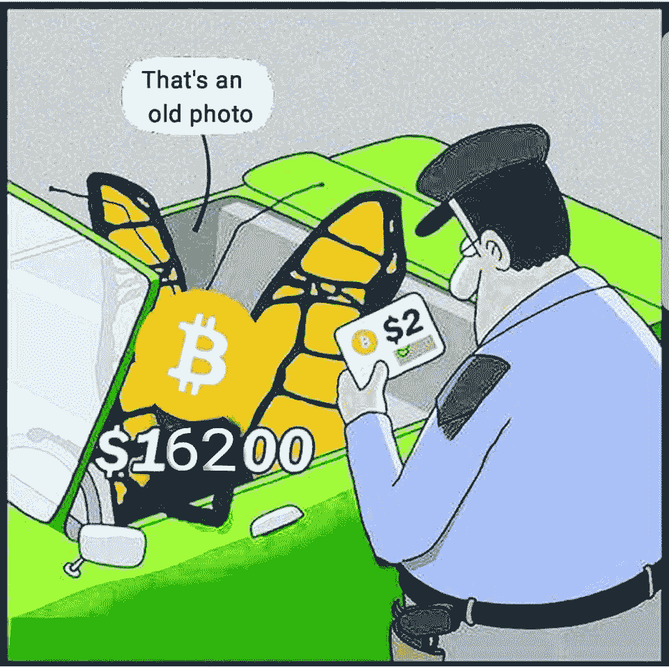
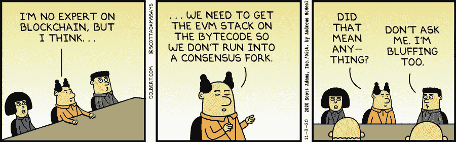
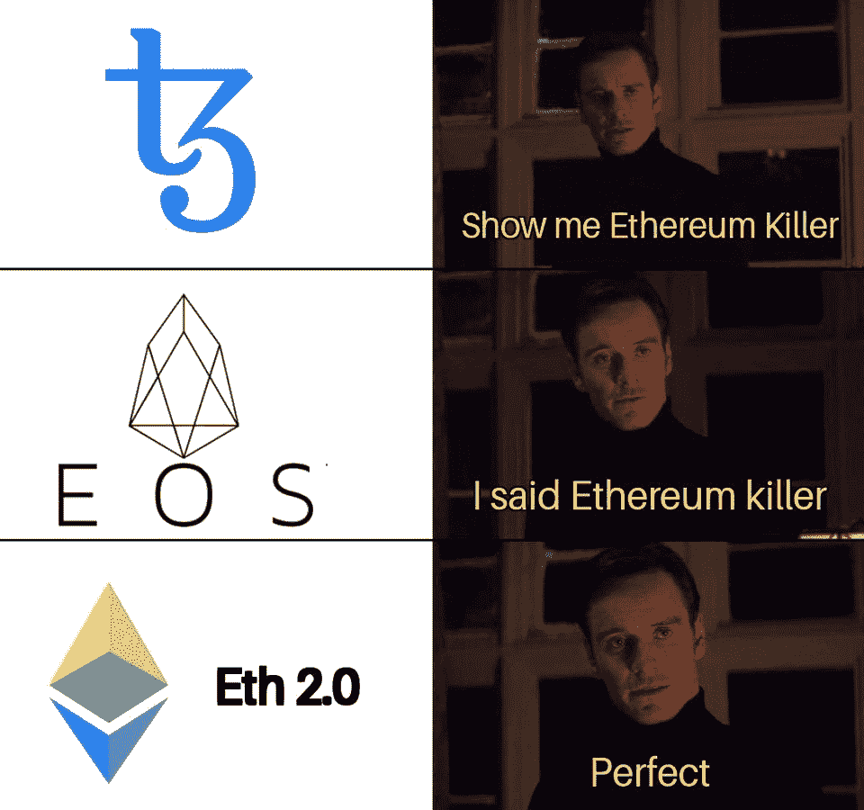
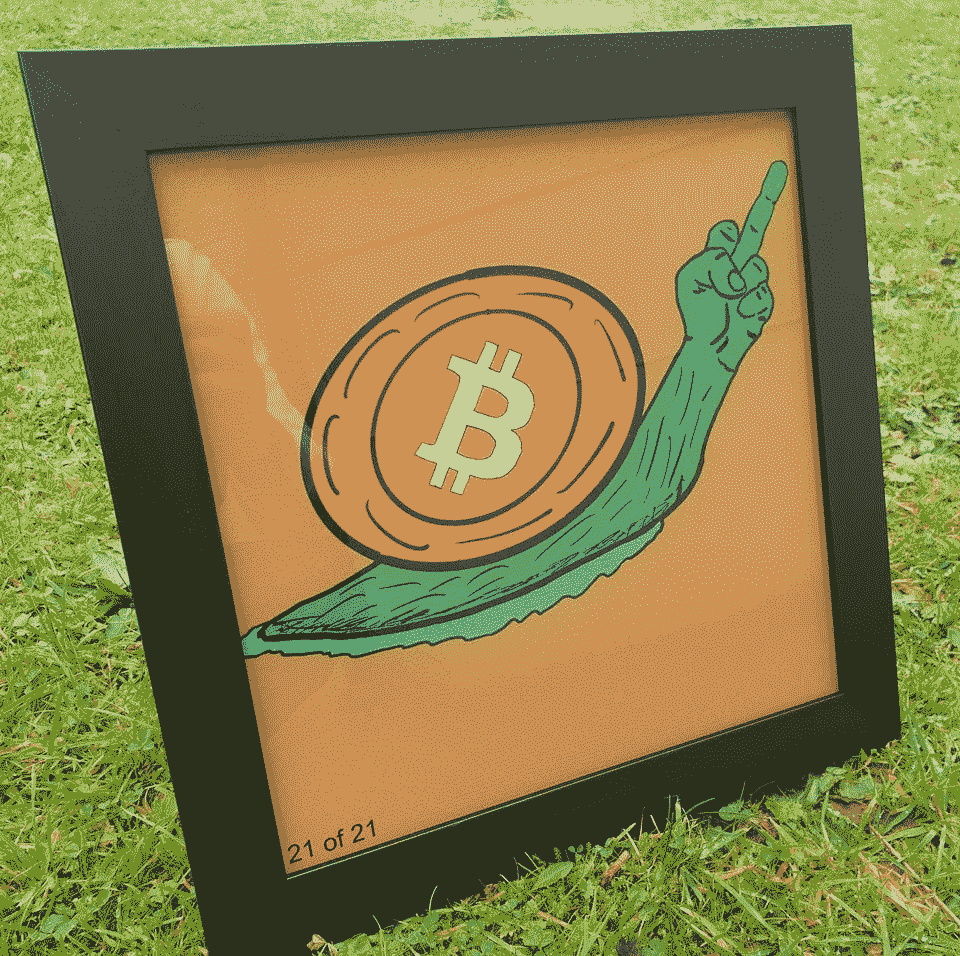
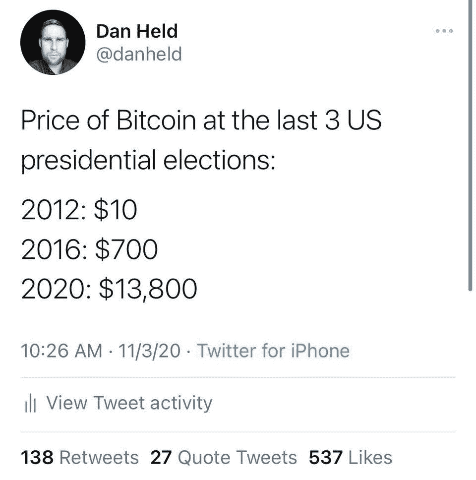

# 推出 ETH2 存款合约/机构放弃黄金 ETF 转而使用比特币/币安已经开始阻止美国用户

> 原文：<https://medium.com/coinmonks/eth2-deposit-contract-launched-institutions-ditching-gold-etfs-for-bitcoin-binance-has-begun-d75901f11e92?source=collection_archive---------5----------------------->

## Cred 破产文件/ Circle 宣布对数字美元商业账户征收 8.5%的利息

[Source](https://www.reddit.com/r/CryptoCurrency/comments/jpr8a4/next_stop_for_bitcoin/)

*   美国司法部已经扣押并正在寻求没收与现已关闭的丝绸之路暗网市场相关的数千枚比特币，这些比特币的价值超过 10 亿美元。
*   币安加密交易所已经开始阻止美国用户访问其交易平台。
*   Cred 在提交的文件中列出的资产估计在 5，000 万至 1 亿美元之间，负债在 1 亿至 5 亿美元之间。
*   最近的 PayPal 2020 PH 消费者调查显示，在疫情期间，87%的菲律宾人增加了对数字支付平台的使用。

## [四元制](https://quadency.com/?r=ea20aa360c45d1f5ad47a19a)

试试 [Quadency](https://quadency.com?r=ea20aa360c45d1f5ad47a19a) ，这是一个为交易者建造的交易终端，让他们的加密交易自动化。阅读我们的[季度回顾](/coinmonks/quadency-review-a-crypto-trading-automation-platform-3068eaa374e1)。

> 立即在虚拟研讨会中探索币安智能链的优势(世界协调时 11 月 10 日下午 3:30)[**立即加入**](https://www.binance.com/en/activity/events/summit-blockchainapplied?utm_campaign=Bitquery%27s%20Newsletter&utm_medium=email&utm_source=bitquery_newsletter) 。

## 最新消息📰

*   ETH2.0 [存款](https://blog.ethereum.org/2020/11/04/eth2-quick-update-no-19/)合约推出
*   贝宝:疫情让 87%的菲律宾人增加了数字支付的使用
*   币安已经开始阻止美国用户访问其交易平台
*   美国官员查获从丝绸之路黑市盗取的价值超过 10 亿美元的比特币
*   亿万富翁斯坦利·德鲁肯米勒说他已经在比特币上下了赌注
*   800 万美元的开源软件资助告破
*   在欺诈中损失资金后，加密贷款人申请破产
*   摩根大通[称机构](https://u.today/jpmorgan-says-institutions-ditching-gold-etfs-for-bitcoin)抛弃黄金交易所交易基金转而投资比特币
*   圆[宣布](https://www.circle.com/en/features/yield) 8.5%的数字美元商业账户，然而，[不是银行账户](https://twitter.com/odtorson/status/1325372220563222528)
*   gray 的以太坊信托基金管理的资产达到 10 亿美元
*   威瑞森的“全透明”为新闻发布启动区块链验证

> *买一个* [***硬件钱包***](/coinmonks/the-best-cryptocurrency-hardware-wallets-of-2020-e28b1c124069)*[*保护你的加密货币*](/coinmonks/how-to-prevent-cryptocurrency-hacking-and-theft-from-your-wallet-65c8ff767766) *。**

**

*[Source](https://dilbert.com/strip/2020-11-03)*

## *好的读物📑*

*   *所以你想[用一个价格神谕](https://samczsun.com/so-you-want-to-use-a-price-oracle/)*
*   *图形 vs [位查询](https://bitquery.io/blog/thegraph-and-bitquery)*
*   *为什么[证明](https://vitalik.ca/general/2020/11/06/pos2020.html)的利害关系*
*   *[两种定价方案的故事](/@MicahZoltu/a-tale-of-two-pricing-schemes-dc9c8717906)*
*   *[加速尼日利亚的比特币交易](https://www.stearsng.com/article/accelerating-bitcoin-trading-in-nigeria)*
*   *凸凹[配置](https://vitalik.ca/general/2020/11/08/concave.html)*
*   *[以太坊 2.0 指南](/coinmonks/guide-to-ethereum-2-0-36caea41f471)*
*   *DeFi [基金经理](https://doseofdefi.substack.com/p/defi-money-managers-emerge)崭露头角*
*   *ETH:互联网债券*
*   *如何[成为 Eth2 上的验证者](https://bankless.substack.com/p/-guide-how-to-become-a-validator)和[成为验证者的风险和回报](https://thedefiant.io/risks-and-rewards-of-becoming-an-eth2-validator/)*
*   *强劲的基本面支撑着 T4 的反弹*
*   *一个守护者的[指南](/keeperdao/a-keepers-guide-to-arbitrage-mining-rook-d9a56373bd14)套利采矿$ROOK*
*   *保龄球为[菲亚特](/coinmonks/bowling-for-fiat-a0afc4153dea)*
*   *以太坊 2.0 存款合同的[发生了什么？](https://www.thecoinbuzz.com/post/what-s-happening-with-ethereum-2-0-deposit-contract)*
*   *以太坊 2.0 如何[重新定义](http://globalhalo.com/ethereum-2-0s-security-model-is-the-future/)区块链安全*
*   *中国数字货币— [极权主义](/coinmonks/chinese-digital-currency-totalitarianism-or-a-new-monetary-theory-f01ceaa2f4ae)还是新货币理论？*

> *[关于区块链和比特币生活的漫画书](https://www.wishiknewcomics.com/)*

**

*[Source](https://www.reddit.com/r/CryptoCurrency/comments/jpn1x8/its_a_real_deal/)*

## *开发商*

*   *闪电池:一次技术性的深潜*
*   *[终结](/@ralexstokes/the-finality-gadget-2bf608529e50)小工具*
*   *UMA [宣布](/uma-project/uma-announces-developer-mining-6f6fe15d5604)开发商开矿*
*   *如何[设置 Filecoin Lotus node](/coinmonks/how-to-set-up-a-filecoin-lotus-node-and-connect-remotely-to-it-208c2f810060) 并远程连接到它*
*   *或者说我是如何学会停止担忧，爱上油价飙升的*
*   *如何[在 NFT (ERC721)中获得随机数](https://blog.chain.link/random-numbers-nft-erc721/)*
*   *现在是运行数字的[时间](/coinmonks/its-time-to-run-the-numbers-e741f2a8a3fb)*
*   *介绍'[solt](https://blog.jubb.xyz/post/solt-release/)'—Solidity 工具*
*   *[Airnode](/api3/airnode-the-api-gateway-for-blockchains-8b07ff136840) :区块链的 API 网关*
*   *作为获奖者从 ETHOnline 2020 黑客马拉松中学到的六点经验*

**

*[Source](https://www.reddit.com/r/Bitcoin/comments/jpxgxq/my_latest_work/)*

## *多方面的*

*   *以太坊[气价](https://gaspriceextension.com/)延期*
*   *[ETH2](https://cryptoquant.com/overview/eth2) 仪表盘*
*   *[定义](https://defillama.com/home)仪表板*
*   *[利用重复性发票实现业务自动化](https://request.network/en/2020/11/04/automate-your-business-with-recurring-invoices/)*

## *播客和视频💽*

*   *针对初学者的 [Eth2 &赌注](https://www.youtube.com/watch?v=tpkpW031RCI)介绍*
*   *[DeFi 块空间](http://podcast.banklesshq.com/36-the-defi-blockspace-cycle-nic-carter)循环| Nic Carter*
*   *我不是超级看好 DeFi。我们用这项技术来丰富一小部分人的生活*

## *黑客马拉松、活动和峰会*

*   *[你好世界！](https://polkadot.network/hello-world-by-polkadot-take-the-challenge/)由波尔卡多特*
*   *[投资](https://events.bizzabo.com/invest-ethereum-economy)以太坊*
*   *黑客原子*

## *加密交易和折扣🔖*

*   *当你加入[***mud rex***](https://mudrex.com/signup?referral_code=COIN3566)时，你可以获得 25 美元的信用点数来支付费用*
*   **在*[***Botsfolio***](/coinmonks/botsfolio.com/?coupon=gaure27)*使用此* [*链接*](/coinmonks/botsfolio.com/?coupon=gaure27) *享受七五折优惠。**
*   **试用*[***Altrady***](https://app.altrady.com/?a=COINMONKS)*并使用优惠券代码****coin monks***获得 40%的折扣*

## *产品评论和其他加密软件📙*

*   *[block fi vs Celsius](/coinmonks/blockfi-vs-celsius-vs-hodlnaut-8a1cc8c26630)vs Hodlnaut*
*   *2020 年排名前五的[密码借贷平台](https://blog.coincodecap.com/top-5-crypto-lending-platforms)*
*   *最好的[密码交易机器人](/coinmonks/crypto-trading-bot-c2ffce8acb2a)*
*   *[莱杰 vs 特雷佐](/coinmonks/ledger-nano-s-vs-x-battery-hardware-price-storage-59a6663fe3b0)*
*   *[n 零审核](/coinmonks/ngrave-zero-review-c465cf8307fc)*
*   *[莱杰 Nano S vs X](/coinmonks/ledger-nano-s-vs-x-battery-hardware-price-storage-59a6663fe3b0)*
*   *[十大密码本交易平台](/coinmonks/top-10-crypto-copy-trading-platforms-for-beginners-d0c37c7d698c)*
*   *[莱杰纳米 S vs 特雷佐 one vs 特雷佐 T vs 莱杰纳米 X](https://blog.coincodecap.com/ledger-nano-s-vs-trezor-one-ledger-nano-x-trezor-t)*
*   *最好的[加密税务软件](/coinmonks/best-crypto-tax-tool-for-my-money-72d4b430816b)*
*   *[最佳加密交易平台](/coinmonks/the-best-crypto-trading-platforms-in-2020-the-definitive-guide-updated-c72f8b874555)*
*   *Bitmex 保证金交易的白痴指南*
*   *[Bitmex 高级保证金交易指南](/coinmonks/bitmex-advanced-margin-trading-guide-2270c195ce25?source=friends_link&sk=1d986cca731f5084b9a2db4a4bc4a7ad)*

*想让我们展示你的产品吗？请通过 [Twitter @coinmonks](https://twitter.com/coinmonks) 联系我们*

## *照片说明了一切📷*

**

*[Source](https://www.reddit.com/r/Bitcoin/comments/jngdjt/vote_for_bitcoin/)*

## *乔布斯👷*

*   *[mStable](https://twitter.com/mstable_) 寻找有经验的[智能合约/协议开发](https://cryptocurrencyjobs.co/engineering/mstable-protocol-developer-defi/)*
*   *Bitquery 正在招聘 [Ruby 开发者](https://angel.co/company/bitquery/jobs)*
*   *Celer 雇佣可靠性和 Go devs。电子邮件:hiring@celer.network*
*   *高级前端工程师*
*   *[MyCrypto](https://cryptocurrencyjobs.co/engineering/mycrypto-senior-front-end-engineer/) —高级前端工程师*
*   *Celo 正在[雇佣](https://jobs.lever.co/celo/bb6fc40f-4d3d-4abb-a6d3-a5b8ba152b6a)一名数据领导者*
*   *a16z 正在[招聘](https://a16z.com/about/jobs/?gh_jid=4167628003)一名数据科学家*
*   *Livepeer 正在招聘[区块链社区营销+运营负责人](https://angel.co/company/livepeer/jobs/874811-blockchain-public-network-community-marketing-associate)*
*   *作为营销总监[与 Chainlink 令人难以置信的生态系统合作](https://chainlinklabs.com/careers#job-492239)*
*   *小道消息招聘精英[区块链安全工程师](https://jobs.lever.co/trailofbits/4f459855-3299-462f-9e73-299a840d5baf) & [app 安全](https://jobs.lever.co/trailofbits/8b7f7fc1-efb0-4e89-b406-784c3a2d77e4)*
*   *DeFi devs！Yield 正在招聘可靠的前端人员—联系@yield.is*
*   *0x 正在招聘开发人员！[全堆栈、后端、前端或可靠性](https://0x.org/about/jobs)*
*   *Nexus Mutual: [经历过 Solidity dev](https://angel.co/company/nexus-mutual-1/jobs/967538-smart-contract-engineer)；首选欧洲时区*
*   *[Devops 或 SRE](https://authenticjobs.com/job/3006/textile-devops-or-sre/) :纺织品，遥控。*
*   *[分布式系统工程师](https://jobs.lever.co/3box):3 框*
*   *[前端开发者](https://twitter.com/ceramicnetwork/status/1305886402886995968):陶瓷*
*   *[远程高级软件工程师](https://jobs.lever.co/audius):奥迪斯，远程*
*   *[UI 工程师](https://textile.breezy.hr/p/2efb847aca79-ui-engineer):纺织，远程*

## *在 Coinmonks 上发布*

*如果你喜欢在 crypto/区块链空间上写教育文章，并且想在 Coinmonks 出版物上发表。只需在**发邮件给我或者 DM 我**[***推特***](https://twitter.com/coinmonks)***

> ***[*直接在您的收件箱中获得最佳软件交易*](https://coincodecap.com/?utm_source=coinmonks)***

******